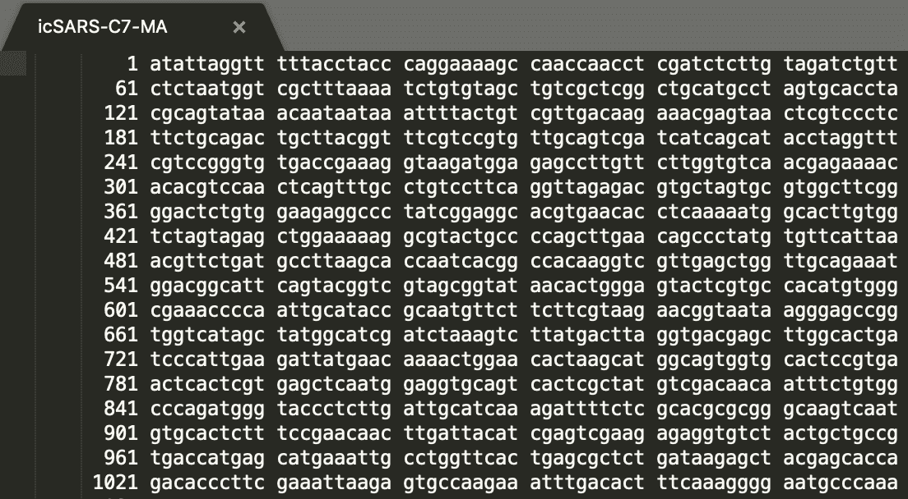
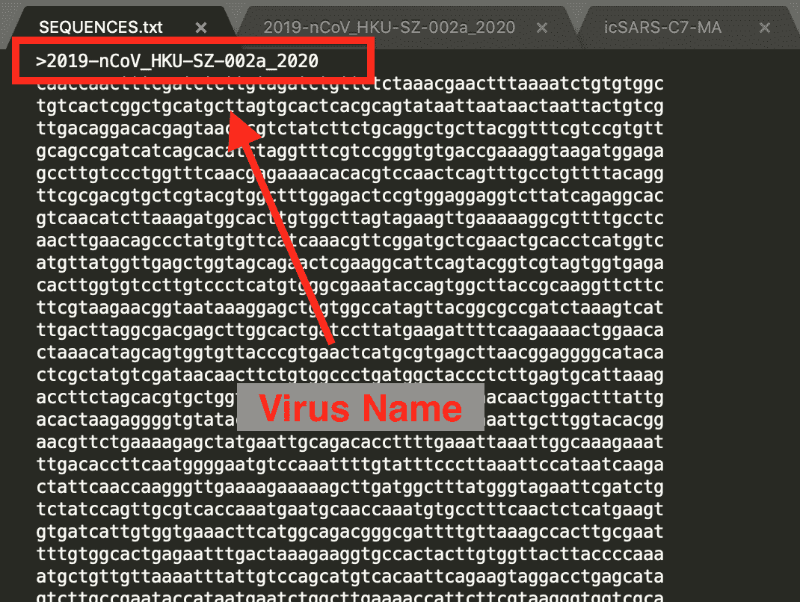
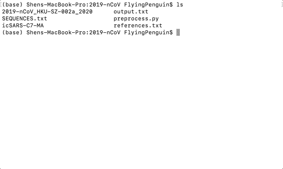
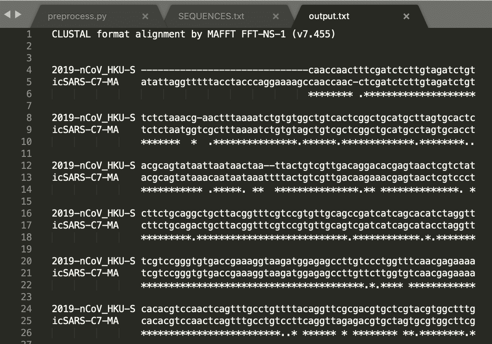

# 新型冠状病毒在中国的流行:如何帮助研究人员利用 MAFFT 对 2019-nCoV 进行序列比对

> 原文：<https://www.freecodecamp.org/news/china-novel-coronavirus-epidemic-sequence-alignment-2019-ncov-mafft/>

新型冠状病毒(2019-nCoV)是一种致命的病毒，似乎起源于中国武汉。截至 1 月 26 日，该病毒已经造成 76 人死亡。

作为一种针对人类呼吸系统的冠状病毒，2019-nCoV 具有很强的传染性——尤其是在潮湿和寒冷的季节。

当人打喷嚏时，可以高速射出呼吸系统相关的病原体。这些病毒可以通过多种方式感染人类——最常见的是通过口、鼻和眼接触。

为了避免感染，你应该避免户外活动——尤其是在拥挤的地方。经常消毒双手，不要用手揉眼睛也很重要。

我在中国，我的农历新年计划现在泡汤了。所以我决定呆在家里，创建这个教程，介绍如何获得 2019-nCoV 的基因序列数据，并用 MAFFT 对其进行序列比对。

我希望这篇文章提高你对生物信息学研究的兴趣，这样你就可以帮助科学家对抗这些病毒爆发。

## 什么是序列比对？什么是 MAFFT？

**序列比对**是一种排列 DNA、RNA 或蛋白质以识别相似区域的方法，这些相似区域可能揭示序列之间的功能、结构或进化关系。最近[的一份出版物](https://onlinelibrary.wiley.com/doi/epdf/10.1002/jmv.25682)提出，借助于 MAFFT 的序列比对，蛇可以跨物种传播给人类。

MAFFT ( **M** 多重 **A** 比对使用**F**ast**F**ourier**T**变换)是 2002 年发表的一个多重序列比对程序。您可以使用它来执行 RNA 序列的序列比对。**冠状病毒**是例如具有单链 RNA 的病毒，该单链 RNA 被包裹在来源于宿主细胞膜的外壳中。

## 从哪里可以获得 RNA 序列数据？

2019-nCoV 的最新更新可以在 [NGDC](https://bigd.big.ac.cn/ncov#about) (中国国家基因组数据中心)上找到。在本教程中，我们将分析在 NCBI(国家生物技术信息中心)数据库内发现的 [2019-nCoV](https://www.ncbi.nlm.nih.gov/nuccore/MN938384) 病毒和 [SARS-CoV](https://www.ncbi.nlm.nih.gov/nuccore/MK062184) 病毒。

SARS-CoV，众所周知的 SARS(严重急性呼吸综合征),在 2020 年左右已经在 17 个报告的国家中导致 774 人死亡。



Example RNA Sequence Data from [NCBI](https://www.ncbi.nlm.nih.gov/)

我已经将数据复制并粘贴到一个以病毒名称命名的文件中。它应该类似于上面截图中的数据，一个索引号后面跟着一批 10 个代码，每行总共 60 个代码，用空格分隔。

## 如何使用 MAFFT 对 2019-nCoV 进行序列比对

首先，你需要安装 MAFFT。您可以使用以下命令通过 Anaconda 安装它。

不同操作系统的手动安装可以在[maftt 官网](https://mafft.cbrc.jp/alignment/software/)找到。

```
conda install mafft
```

MAFFT 很容易使用，但是它以一种特殊格式处理数据。您需要对获得的数据进行预处理，以便它可以通过 MAFFT 进行校准。

下面是实现这一点的 Python 脚本:

```
import sys
import re
output = ""
for filename in sys.argv[1:]:
	infile = open(filename)
	data = infile.read()
	data = " ".join(re.split("[^atcg\n]", data))
	data = data.replace(" ", "")
	output = output + ">" + filename + "\n" + data + "\n"
print(output)
outfile = open('SEQUENCES.txt', 'w+')
outfile.write(output)
```

可以将上面的 Python 代码保存到一个名为“preprocess.py”的文件中，与我的病毒 RNA 数据放在同一个文件夹中。然后我们可以在文件夹中运行下面的 bash 命令来预处理数据。

```
python3 preprocess.py 2019-nCoV_HKU-SZ-002a_2020 icSARS-C7-MA
```

名为“SEQUENCES.txt”的输出文件现在应该如下所示。病毒名称附加在文件的顶部。空白和索引号也被去掉。



现在，您可以通过以下步骤在终端中使用 MAFFT 执行序列比对:

1.  找到您的工作文件夹。
2.  在你的终端内呼叫“mafft”。
3.  对于输入文件，输入“SEQUENCES.txt”。
4.  对于输出文件，输入“output.txt”。
5.  为“Clustal 格式”选择“1”作为输出格式。
6.  选择“1”表示“自动”作为您的策略。
7.  将所有其他参数留空。

这是我在终端上运行这个程序的 gif 图:



在你按下 enter 键后，你只需要等待 MAFFT 来排列你的 RNA 代码。

成品应该如下所示:



注意，“-”用于改变代码，“*”用于突出序列之间的相似性。

恭喜你，你已经学会了如何使用 MAFFT 进行序列比对！现在你可以玩基因代码，并利用你喜欢的排列信息。

作为开发人员、数据科学家等，帮助武汉抗击致命疾病:

[https://github.com/wuhan2020/wuhan2020](https://github.com/wuhan2020/wuhan2020)

关于我的更多信息:我是一名开发人员，对各种事物都感兴趣。我还写过一些类似这样的有趣教程:

[如何制作漂亮的排列成文字的灯笼](https://www.freecodecamp.org/news/ghost/#/editor/post/5ceb787ee17b4228e0185dbf/)

[如何用计算机视觉将妖精帽放入你的网站](https://www.freecodecamp.org/news/ghost/#/editor/post/5ceb767ee17b4228e01833b7/)

想让我写个什么东西的教程？让我知道。快乐编码。