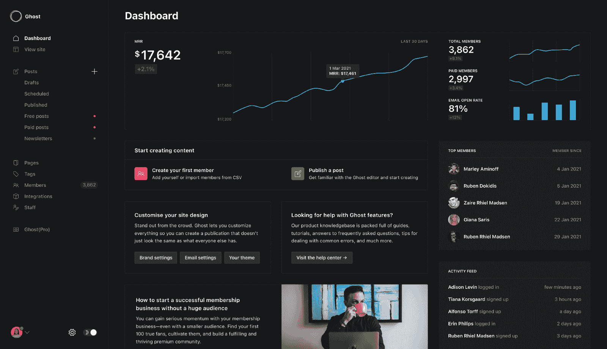
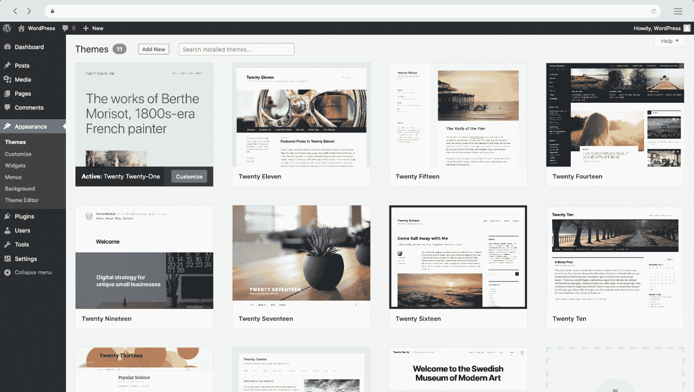
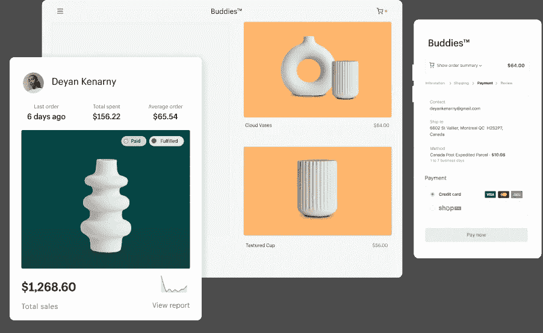

# 如何选择 CMS——WordPress vs Ghost vs Shopify

> 原文：<https://www.freecodecamp.org/news/chose-a-cms-wordpress-vs-shopify-vs-ghost/>

WordPress、Shopify 和 Ghost 是最强大和最受欢迎的 CMS 平台。

你可能想知道为什么这么多人使用它们。嗯，那是因为它们容易使用，性价比高，效率高。

有了 WordPress、Shopify 和 Ghost，你可以在几分钟内从头开始创建一个网站。

这些[强大的网站建设者](https://www.weblime.com/stories/top-website-builders)根据您的需求量身定制，可以帮助您实现从建立电子商务网站到开始自己的博客或展示您的投资组合的任何事情。

难怪那么多商家选择这些平台。但是你应该选择哪一个呢？

我们不能简单地说一个比另一个好，因为没有一个单一的解决方案在所有情况下都有效。

因此，在本文中，我们将介绍这三种平台，并研究它们的优缺点，以便您能够找出最适合您的特定情况的平台。

## 如果你想从头开始建一个博客，那就用 Ghost 吧

如果你是一个正在寻找开源平台的博客作者， [Ghost](https://ghost.org/) 可能是你的最佳选择。

事实上，它是开源的，使您能够修改平台的代码，定制它，使它更适合您的写作需要。

即使你不是一个程序员，你也可以从其他愿意为社区做贡献的用户那里得到帮助，他们可以修复 bug 或者添加新功能。

网上有关于如何在自己的 web 服务器上安装 Ghost 的教程。您也可以选择使用托管计划，它允许您使用其他用户创建的主题，而不是依赖默认主题。

Ghost 是一个基于 Node.js 的平台，它使用 Node.js 服务器运行。它带有一个丰富的插件系统，允许你定制你的博客，以适应你自己的需要。

Ghost 允许您使用 Markdown 而不是 HTML 进行编写。这使得您可以很容易地直接在浏览器窗口中书写。

如果你不了解 Markdown，它是一种轻量级的标记语言，允许你用更简单的代码编写富文本，而不是 HTML。

事实上，与其他平台相比，Ghost 的一个好处是你的文章是用 Markdown 而不是 HTML 或文本文件编写的，这使得代码更加简洁。

### 您可以将 Ghost 用作无头 CMS

Ghost 具有灵活的架构，这意味着它可以用作无头 CMS。事实上，它是 JAMStack 中最受欢迎的内容管理系统之一。

一个[无头 CMS](https://www.freecodecamp.org/news/what-is-headless-cms-explained/) 允许你建立一个前端网站或应用程序，比如一个移动应用程序，带有一个调用 CMS 获取数据的 API。您可以将 API 和您的网站或应用程序部署到不同的服务器或环境中，而无需更改内容中的任何内容。

因为 API 从 CMS 交付数据，所以您可以完全控制这些数据，包括权限、标签和类别。如果你需要修改你的内容，你只需要在一端而不是两端进行修改。

无头 CMS 通常用于使用 JavaScript 框架(如 AngularJS 和 React.js)构建网站和应用程序。然而，如果您需要使用单个 API 调用来呈现具有多个页面的动态站点，这种类型的 CMS 也是有益的。

要使用一个 headless CMS，你需要学习它是如何工作的，以及如何通过它的 API 来使用它。这可能需要额外的开发资源，具体取决于您的技能水平。

这种方法在初创公司和机构中越来越受欢迎，他们希望对内容的显示有更多的控制，同时仍然能够通过中央界面进行更新。

### 使用 Ghost 的优势

Ghost 是一款免费、易用的 CMS，不需要任何编码技能。

除了简单之外，Ghost CMS 还附带了许多开箱即用的功能，这使得它对博客作者和小型企业非常有吸引力。

您可以使用拖放功能添加多个作者、设置协作写作、跟踪分析、创建投票、客户支持论坛、管理模板等等。

当你开始在 Ghost 上使用第三方应用时，事情变得有趣起来。有许多集成可用于安装应用程序，如谷歌分析和 Disqus 评论。

其他一些优点包括:

*   它有一个干净、简约的设计。如果你想你的博客是美丽的，那么鬼 CMS 是伟大的。
*   **完成工具**。您获得了创建博客所需的所有工具，从安装到使用拖放功能设置主题。
*   **可定制主题**。可以使用内置的主题编辑器定制主题，这使得任何人都可以根据自己的需要轻松修改主题。
*   **幽灵社区**。如果你被困住了，你可以通过浏览其他 Ghost 用户的论坛和提问来寻求帮助。

## 如果你想让你的网站更上一层楼，使用 WordPress

你可以将 [WordPress](https://wordpress.org/) 作为一个简单的博客平台，但它也是一个功能齐全的内容管理系统(CMS)。如果你想让你的生意更上一层楼，它允许你建立定制的网站和博客。

因为它的流行，有一个活跃的支持社区和许多免费的培训材料。

基本功能和更多高级功能的教程在网上随处可见。

WordPress 是免费的，但是如果你需要帮助安装或者定制，你可以从一个有信誉的公司购买虚拟主机。托管费用因您选择的托管服务类型而异。

你可以自己安装 WordPress】或者花钱请人帮你安装。WordPress 网站提供了如何在不同的服务器平台上安装软件的说明。

一旦安装到你的服务器上，WordPress 将允许你创建自己的博客页面。通过使用主题，您可以完全控制站点的外观和感觉，主题是为页面布局预先构建的设计。

主题可以从 WordPress 网站购买或免费下载。如果你准备好迎接挑战，你还可以[设计自己的定制主题](https://www.freecodecamp.org/news/learn-how-to-create-your-own-wordpress-theme-from-scratch/)。

你可能想要一个比基本 WordPress 安装提供的更复杂的站点。在这种情况下，你可以雇佣一个设计师来为你建立一个定制的主题，或者使用一个现有的主题作为框架，并通过插件添加你自己的定制功能。插件用特殊的设计元素和编程功能扩展了主题的特性。

### 使用 WordPress 的优势

WordPress 是这个列表中最容易定制的选项。它拥有最全面的主题和插件库，允许你很容易地编辑源代码，甚至编写你自己的自定义功能。

你可以认为 WordPress 是介于 Ghost 和 Shopify 之间的 CMS，因为它允许你通过简单地安装一个兼容的主题同时运行一个电子商务商店和一个博客。

WordPress 可以让你的博客更上一层楼，并随着业务的增长扩大你的电子商务商店。

不利的一面是，迟早你会需要开发人员的帮助。这是因为你安装的插件越多，你的网站就会越慢，用户讨厌慢的网站(搜索引擎就更不用说了)。

其他一些优点包括:

*   **极其便宜入门**。你可以免费建立并运行一个 WordPress 网站，基本的主机方案最低每年 18.96 美元。
*   **分配用户角色的能力**。在业务增长周期的某个时候，你可能需要引入额外的人来帮助你创建、编辑和发布内容。WordPress 有内置的用户角色，这会让你的生活变得更加容易。
*   **市面上最好的营销插件**。你可以在插件目录中安装一个 SEO 插件。一些例子包括 Yoast 或 Rank Math。这些插件可以帮助你优化你的内容(比如文章、页面、甚至产品页面),增加你超越竞争对手的机会。
*   大量的集成。您可能会使用第三方 SaaS 产品，如 Mailchimp 或 ActiveCampaign。不管是哪种服务，你都会发现将它们与你的网站整合起来非常容易，因为几乎所有的网站都创建了 WordPress 插件。
*   **最大的在线资源库**。WordPress 社区是迄今为止最大的社区，可以很容易地找到关于你的安装的所有问题的答案。有成千上万的网站和论坛专门关注 WordPress 网站，提供大量的信息。

## 如果你想以最快的方式开始电子商务业务，那就使用 Shopify

Shopify 成立于 2006 年，是一家滑雪板设备网上商店。当时，CMS 生态系统缺乏一个强大且易于使用的解决方案，因此 Shopify 的创建者决定自己编码。

不用说，这是一次成功。在接下来的几年里，越来越多的商店开始使用 Shopify CMS。截至 2021 年 5 月，来自约 175 个国家的 170 多万家企业使用 Shopify 开展业务。

到目前为止，Shopify 是开展电子商务业务最简单、最快捷的方式，主要由希望将实体店搬到网上的非技术人员使用。在不超过几分钟的时间里，你就可以建立并运行自己的网站，并开始接受在线支付。

但是 Shopify 也被互联网上一些最大的在线商店使用，这使得如果你想将你的业务提升到一个新的水平，并且有资金这样做，它是一个很好的选择。

Shopify 的一些优势:

*   **极其容易上手**。CMS 在设计时就考虑到了易用性。任何人都可以很快开一家店。你不需要知道如何编码，甚至不需要知道如何将域名连接到你的网站，因为 Shopify 会为你做所有的事情。
*   **兼容大多数主流第三方服务**。Shopify 与最大的第三方服务连接，如电子邮件营销的 Klaviyo 或付费广告的脸书广告。
*   **app store 中的大量应用**。如果你觉得你的商店需要额外的功能，例如捆绑折扣，你会很高兴听到有很多应用程序可以帮助你实现这一点。只是要小心，看看他们的成本，因为他们可以很快上升。

Shopify 的一些缺点:

*   **会变得相当昂贵**。Shopify 非常容易上手，但这是有代价的。最便宜的计划(基本)每月 29 美元起，而最贵的计划(高级)每月 299 美元。主要区别在于 Shopify 对付款收取的佣金。
*   **支付费用高**。你必须考虑到，Shopify 对你的交易收取高达 2%的费用(基本计划)。该佣金随计划减少到最低 0.5%(根据预付计划)。相比之下，WooCommerce 不收取你销售额的百分比。
*   **Shopify 开发者贵**。如果你想在基本功能之外定制你的商店，你需要一个开发者的帮助，而且他们不便宜。然而，有许多应用程序可以帮助你实现你的目标。
*   大多数 Shopify 应用程序都有月费。你可以在 app store 中找到免费的应用程序，但大多数都有每月费用(相比之下，绝大多数 WordPress 插件都收取固定的一次性费用)。
*   **博客功能不是很好**。Shopify 是一个以电子商务为中心的平台，所以难怪他们没有花太多时间优化他们的博客功能。大型商店选择将博客放在 WordPress 上，同时将店面放在 Shopify 上。

总之，您可以使用 Ghost 几乎立即启动您的博客，或者使用 Shopify 配置一个快速安全的在线商店。而且，如果你想从两个世界中得到最好的，你可能想用 WordPress。

终极 WordPress 指南是一个免费的资源，它将帮助你理解基础知识，并帮助你立即启动你的新网站，所以在你做出选择特定平台的重大决定之前，一定要仔细阅读。