# Chrome 书签——如何删除或恢复书签

> 原文：<https://www.freecodecamp.org/news/chrome-bookmarks-location-guide-how-to-delete-or-recover-a-bookmark/>

能够保存您经常访问的网页非常有用。也许你每天都会查看你的博客文章的谷歌分析，或者访问一个烹饪灵感的食谱应用程序。

不管是什么原因，Chrome 中的书签都可以节省你的时间和麻烦。只需将该页面加入书签，您就可以随时轻松返回。

但是如果你想清理你的书签呢？毕竟，你可能不再需要几年前的那个演唱会门票网站了。嗯，这也很容易做到。

在本文中，您将学习如何在 Chrome 中找到书签，以及如何删除、恢复和管理书签。让我们开始吧。

## 我的书签在 Chrome 的什么地方？

首先，让我们看看在哪里可以找到你的书签。有几个地方你可以访问它们。

### 如何在 Chrome 的书签标签下找到书签页面

首先，Chrome 菜单栏中有“书签”标签:

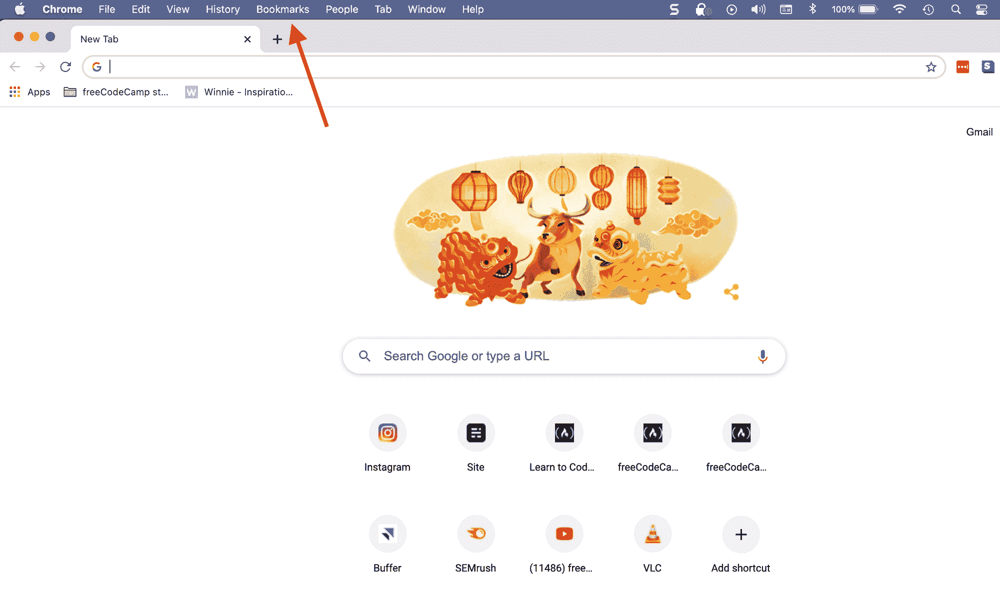

The bookmark tab in Chrome is in the top menu bar.

如果你点击那个标签，它会弹出一个下拉菜单，显示几个选项，像“书签管理器”和“给这个标签加书签”。它还会列出您当前拥有的所有书签或书签文件夹:

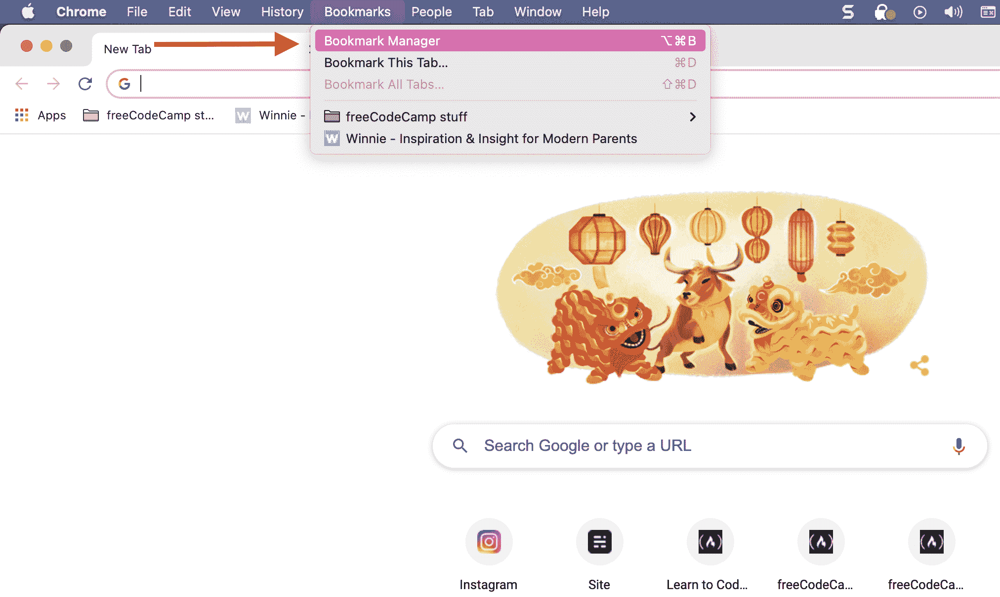

For example, I have a "freeCodeCamp stuff" bookmark folder that contains many of my bookmarked pages and tabs.

如果你点击一个书签文件夹，它会展开列表显示该文件夹中的所有书签，如下所示:

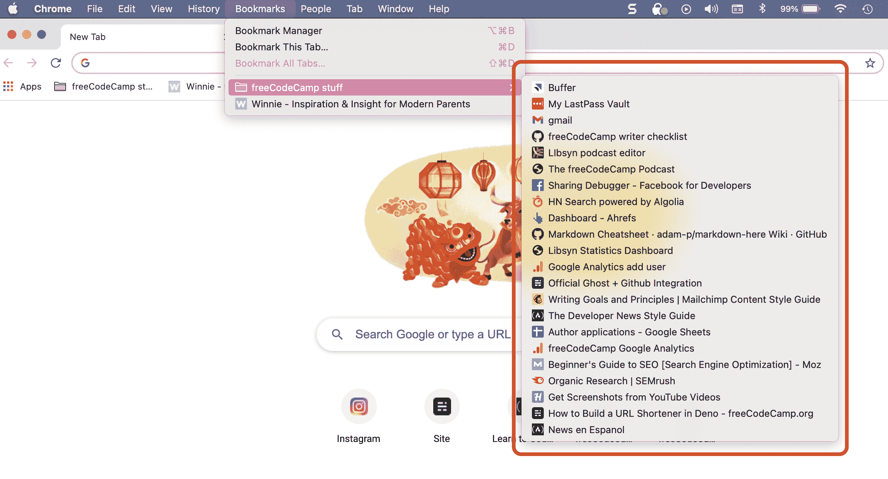

How to display your current bookmarks in a bookmark folder

任何你没有放在文件夹中的书签页面都会简单地列在 Chrome 的书签标签下。

### 如何在 Chrome 的设置下找到书签页面

您的书签也位于“设置”标签下，即浏览器右上角的三个垂直点:

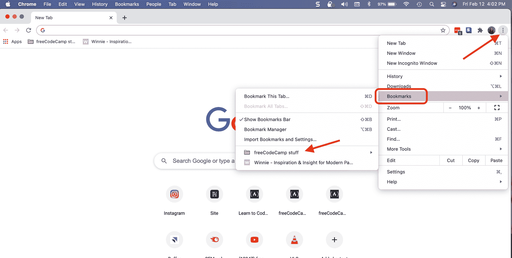

How to find your bookmarks in settings.

只要点击这三个点，你就会看到上面的下拉菜单。悬停在“书签”上/点击“书签”，左侧菜单将弹出。在那里你会看到一个类似的书签菜单，有“显示书签栏”、“书签管理器”等选项。

例如，如果您将鼠标悬停在一个书签文件夹(我们上面讨论过的同一个文件夹)上，您将会看到您所有的书签。然后你只需点击你想访问的网站。

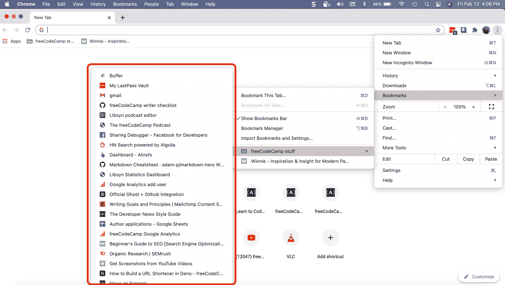

Voilà - all your bookmarks.

## 如何在 Chrome 中添加书签

在 Chrome 中添加书签有几种方法。

*   你可以访问 Chrome 菜单栏中的书签标签(我们在上面讨论过)并选择“给这个标签加书签”。将弹出一个单独的框，显示您要为书签命名的名称(您可以更改此名称——只需点击突出显示的框)。然后单击完成。

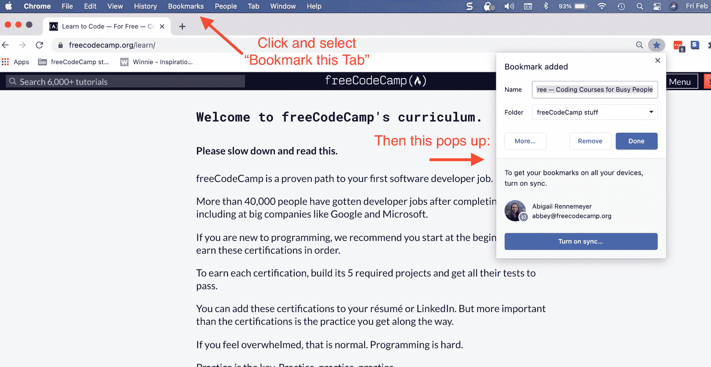

How to add a bookmark in Chrome.

*   您也可以访问设置(三个垂直点)，点击或悬停在“书签”选项卡上，然后选择“给该选项卡添加书签”。会弹出和上面一样的小框。
*   第三种选择是简单地点击地址栏中的小星星图标。这将为您当前所在的页面添加书签。

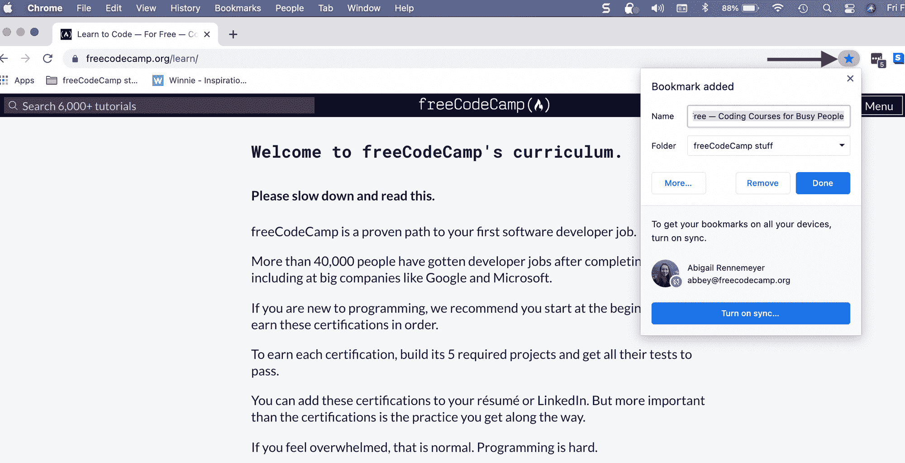

Click that star and it'll add a bookmark for you (after you click "Done").

但是如果你不想用鼠标点击那么多次，还有另一个选择。

### 如何使用键盘快捷键在 Chrome 中添加或管理书签

果然，你可以使用键盘快捷键来添加书签和管理你的书签。

要快速标记一个标签，只需输入 Command+D / Ctrl+D(见下)——它会弹出和上面一样书签窗口。然后，如果你不想更新书签的名称或任何其他设置，你可以按 enter 键，它会保存它。

而要管理你的书签，只需键入 Option+Command+B / Ctrl+Shift+O(同样，见下文)。

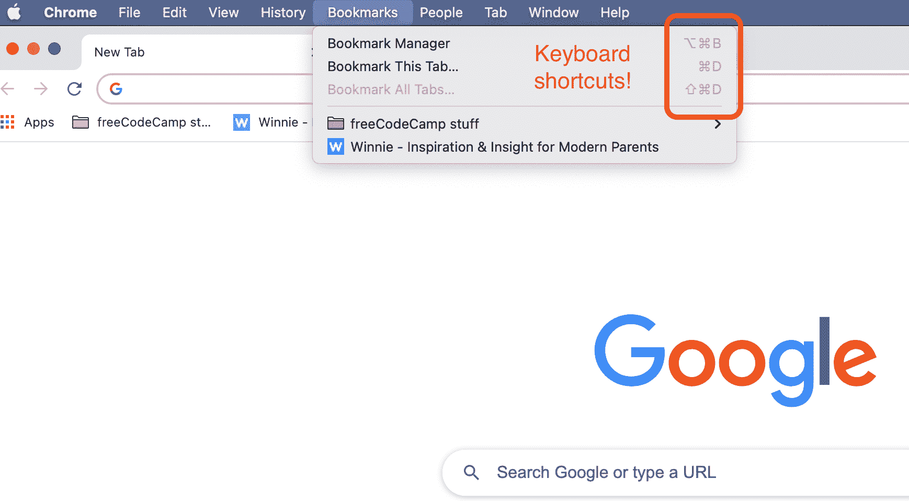

How to add or manage bookmarks with keyboard shortcuts.

但是我们有点超前了。现在让我们来学习如何管理你的书签，以及你为什么要这样做。

## 如何在 Chrome 中管理你的书签

假设你有一堆不再需要的旧书签。你可能想删除一些书签，这样你就不会没完没了地浏览一长串(部分不相关的)书签。

### 如何在 Chrome 中删除书签

移除你不再需要的书签很容易。只需导航到你的书签标签(通过 Chrome 菜单栏或设置-三个点-正如我们上面讨论的那样)并选择“管理书签”。

或者您可以使用方便的键盘快捷键(Option+Command+B / Ctrl+Shift+O)来打开书签管理器。这是您将看到的内容(当然，带有您自己的书签):

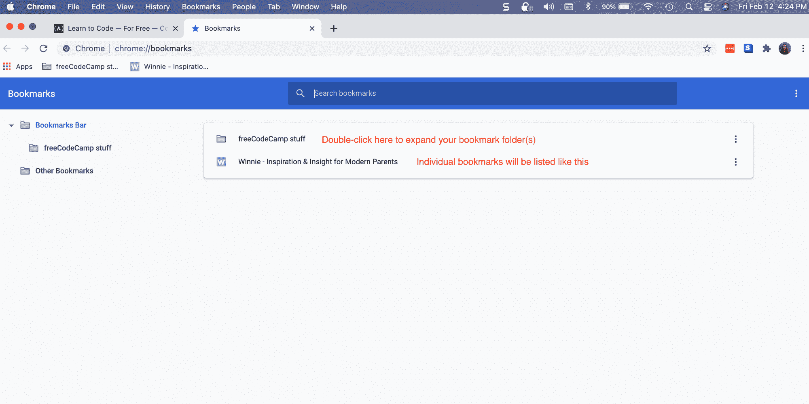

How to manage bookmarks in Chrome

如果你像我一样有一个书签文件夹，双击展开它就可以看到你所有的书签。然后它会像这样列出它们:

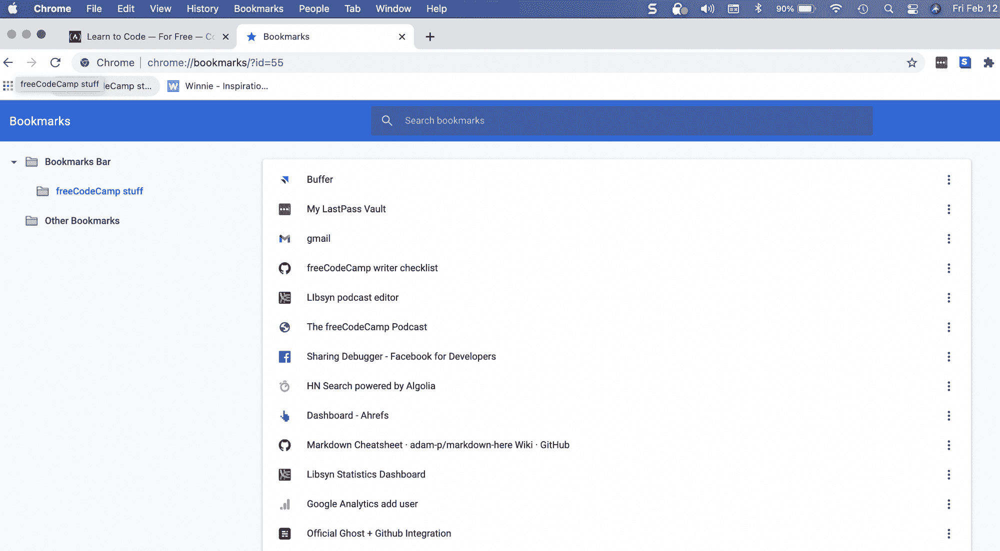

你会注意到每个书签的右边有三个垂直的点。如果你点击这些，它会显示管理书签的选项:

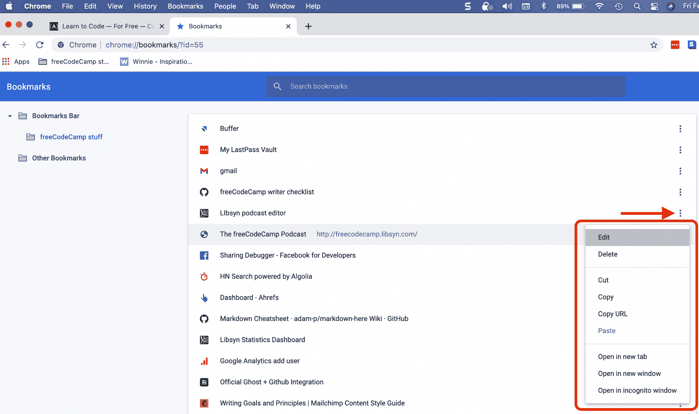

Options for managing your bookmarks in Chrome.

您可以编辑和删除书签，拷贝页面 URL，在新标签中打开书签，等等。

如果您选择“删除”，该书签将从您的列表中消失。小心-没有“你确定要删除这个吗？”消息。

但是等等...如果你不是故意删除刚刚删除的书签呢？

## 如何在 Chrome 中恢复被删除的书签

如果你刚刚在 Chrome 里删除了一个书签，不是故意的，那也没关系。只需点击 Command+Z / Ctrl+Z(“撤销”功能/键盘快捷键),它就会把它带回来。

但是如果你关闭了 Chrome 或者做了其他事情呢？Command+Z / Ctrl+Z 不起作用。幸运的是，还有另一种方法——只需要多走几步。

### 如何在 Chrome 中恢复你不久前在 macOS 上删除的书签

首先，转到 Finder。在弹出的窗口中，在左侧菜单栏中找到“Macintosh HD ”:

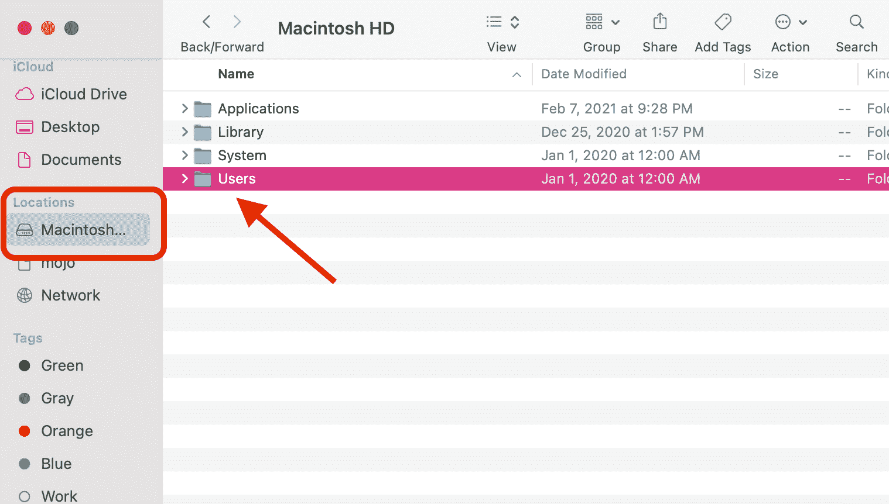

How to recover deleted bookmarks later or the next day.

双击“用户”文件夹(然后您可能需要选择您想要使用的用户)。然后按此顺序双击以下文件夹(每次双击都会弹出一个新窗口，按字母顺序排列列表):

*   库->应用支持->谷歌-> Chrome ->默认

在那里，你会发现两个文件，一个叫做“书签”，另一个叫做“书签. bak”。的。bak 文件包含您备份的书签，其中会有那些您不小心删除的书签。

您离找回已删除的书签只有几步之遥:

*   制作书签文件的副本，并将其保存在其他地方(电脑上的其他位置)。您还需要重命名它。
*   现在，回到默认状态，删除原始书签文件。你需要把它拿出来这样你就可以用。bak 文件作为新的书签文件。
*   然后您需要重命名。bak 文件修改为“书签”(去掉。bak 扩展名)，这样它现在就是你的书签文件了。这应该能找回你删除的所有书签。
*   现在你可以关闭 finder 和 Chrome 了。当你重新打开 Chrome 时，你的书签应该会回来！

### 如何在 Chrome 中恢复你不久前在 Windows 上删除的书签

打开文件浏览器，进入谷歌 Chrome 存储用户数据的目录。这个一般在`C:\Users\<username>\AppData\Local\Google\Chrome\User Data\Default`里。

或者，如果你使用多个 Chrome 用户/配置文件，你的数据可能在另一个目录中，如 Profile 1。我正在恢复我在 Chrome 的工作档案中删除的一个书签，所以我的“书签”和“Bookmarks.bak”文件在`C:\Users\<username>\AppData\Local\Google\Chrome\User Data\Profile 1`中。

此外，默认情况下，AppData 目录是隐藏的，您可能需要首先使隐藏的文件和文件夹可见。

为此，请打开 Windows 文件资源管理器，单击“查看”选项卡，然后单击“隐藏项目”框，并确保选中该框:

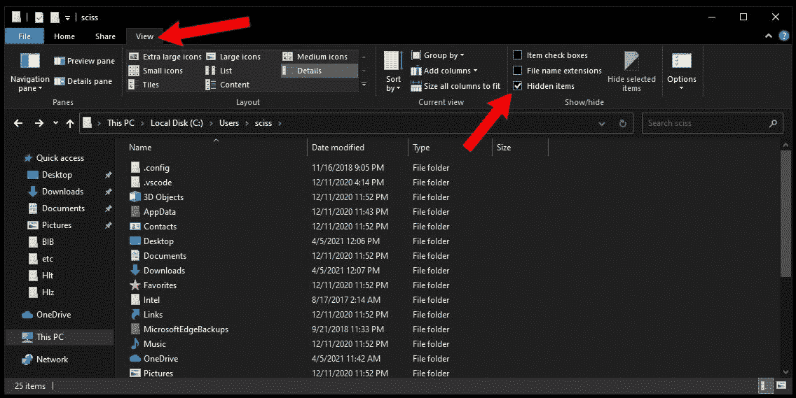

在 Default 或 Profile x 目录中，您会发现两个文件，一个名为“Bookmarks”，另一个名为“Bookmarks.bak”。的。bak 文件包含您备份的书签，其中会有那些您不小心删除的书签。

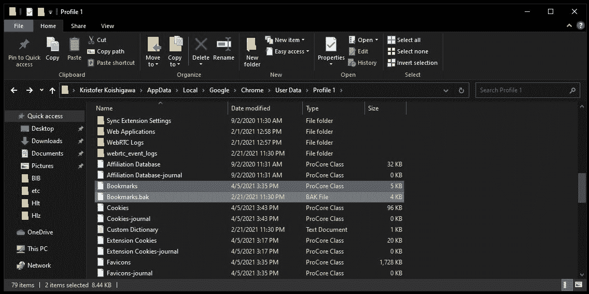

The "Bookmarks" and "Bookmarks.bak" files on Windows 10

您离找回已删除的书签只有几步之遥:

*   制作书签文件的副本，并将其保存在其他地方(电脑上的其他位置)。您还需要重命名它。
*   现在，回到默认或配置文件 x，删除原始书签文件。你需要把它拿出来这样你就可以用。bak 文件作为新的书签文件。
*   然后您需要重命名。bak 文件修改为“书签”(去掉。bak 扩展名)，这样它现在就是你的书签文件了。这应该能找回你删除的所有书签。
*   现在你可以关闭你的文件浏览器和 Chrome 了。当你重新打开 Chrome 时，你的书签应该会回来！

### 如何在 Chrome 中恢复你不久前在 Linux 上删除的书签

打开文件浏览器，进入谷歌 Chrome 存储用户数据的目录。这个一般在`/home/<username>/.config/google-chrome/Default/`里。

请注意。config 是一个隐藏目录，您可能需要首先使隐藏的文件和文件夹可见。此外，`google-chrome`目录可能在另一个位置，这取决于您的 Linux 风格和您安装浏览器的方式。

在默认目录中，您会发现两个文件，一个名为“Bookmarks”，另一个名为“Bookmarks.bak”。的。bak 文件包含您备份的书签，其中会有那些您不小心删除的书签。

The "Bookmarks" and "Bookmarks.bak" files on Linux Mint

您离找回已删除的书签只有几步之遥:

*   制作书签文件的副本，并将其保存在其他地方(电脑上的其他位置)。您还需要重命名它。
*   现在，回到默认状态，删除原始书签文件。你需要把它拿出来这样你就可以用。bak 文件作为新的书签文件。
*   然后您需要重命名。bak 文件修改为“书签”(去掉。bak 扩展名)，这样它现在就是你的书签文件了。这应该能找回你删除的所有书签。
*   现在你可以关闭你的文件浏览器和 Chrome 了。当你重新打开 Chrome 时，你的书签应该会回来！

就是这样！现在你知道如何在 macOS、Windows 和 Linux 上管理你的书签了。