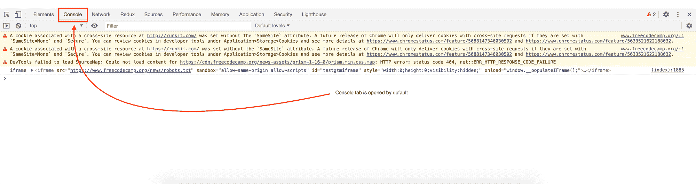
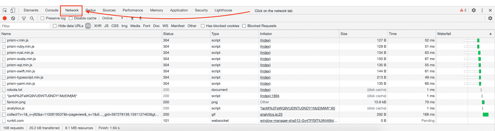
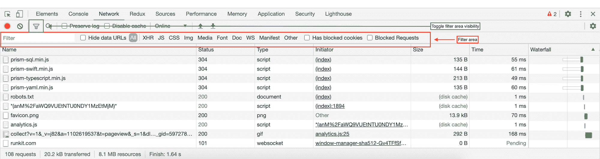
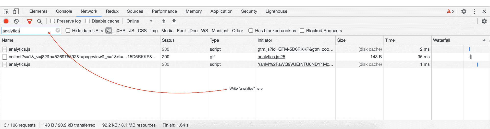
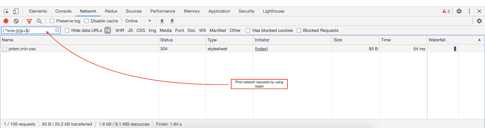
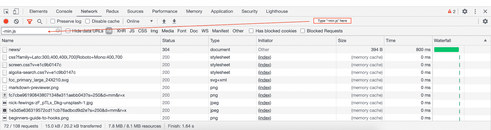
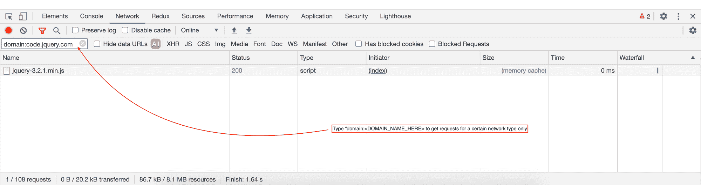
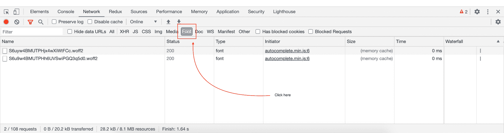
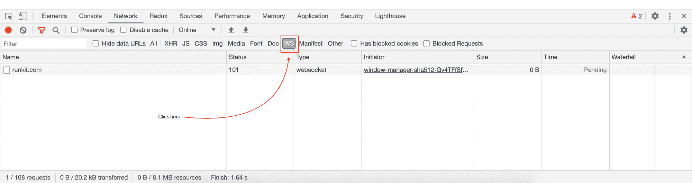
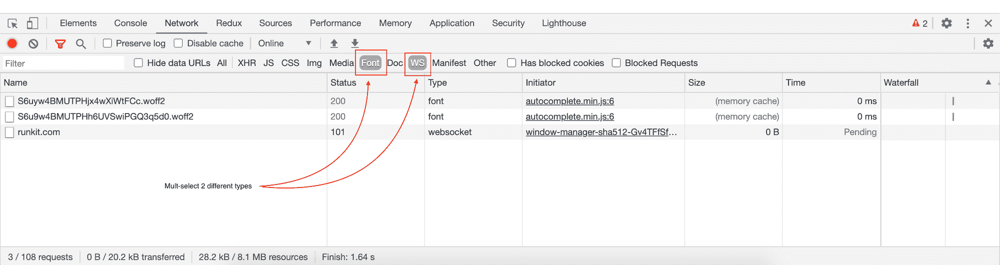

# Chrome DevTools:如何过滤网络请求

> 原文：<https://www.freecodecamp.org/news/chrome-devtools-network-tab-tricks/>

作为前端开发人员，我们的大部分时间都是在开着 DevTools 的浏览器中度过的(几乎总是，除非我们在看 YouTube...有时甚至是这样)。

DevTools 中的一个主要部分是`network`选项卡。您可以在`network`选项卡中做几件事，如下所示:

*   通过文本查找网络请求
*   通过正则表达式查找网络请求
*   过滤(排除)网络请求
*   使用属性筛选器查看特定域的网络请求
*   按资源类型查找网络请求

出于本教程的目的，我使用的是 [freeCodeCamp 的](https://www.freecodecamp.org/news/)主页、**freecodecamp.org/news**T4。只需转到页面并打开`network`选项卡。

你可以在 Mac 上点击`cmd + opt + j`或者在 Windows 上点击`ctrl + shift + j`来查看`network`标签。默认情况下，它会打开 DevTools 中的`console`选项卡。

Clicking "cmd + opt + j" opens up console panel in DevTools

一旦`console`选项卡打开，只需点击`network`选项卡即可看到。

Clicking on the "network" tab will show you all network requests being made for a certain page

一旦`network`选项卡打开，我们就可以开始我们的教程了。

## 我们开始吧

确保正确的页面已打开([freecodecamp.org/news](https://www.freecodecamp.org/news/))，并且“网络”选项卡面板已在 DevTools 中打开:

Illustration on where the filter bar is in network panel.

*   这里的绿框显示了可以隐藏/显示网络面板选项卡中的过滤器区域的图标。
*   这里的红框表示过滤区域框。使用这个框，我们可以过滤掉网络请求。

### 通过文本查找网络请求

在过滤器文本框中输入`analytics`。仅显示包含文本`analytics`的文件。

### 通过正则表达式查找网络请求

类型`/.*\min.[c]s+$/`。DevTools 过滤掉文件名以一个`min.c`结尾，后跟一个或多个`s`字符的任何资源。

### 过滤(排除)网络请求

类型`-min.js`。DevTools 过滤掉所有包含`min.js`的文件。如果任何其他文件匹配该模式，它们也将被过滤掉，不会在“网络”面板中显示。

### 使用属性过滤器查看特定域的网络请求

在过滤区输入`domain:code.jquery.com`。它将只显示属于 URL `code.jquery.com`的网络请求。

### 按资源类型查找网络请求

如果您只想查看特定页面上使用的字体文件，请点击`Font`:

Filtering network requests by "font" type files only

或者，如果您只想查看某个页面上正在加载的 web socket 文件，请单击`WS`:

Filtering network requests by "web socket" type files only

您还可以更进一步，一起查看两个`Font` & `WS`文件。只需先点击`Font`，然后`cmd`点击`WS`即可多选选项卡。(如果您在 Windows 机器上，您可以使用`ctrl`点击进行多选)。

Multi selecting multiple resource types by "cmd` click on types

* * *

这就是本教程的内容。如果你觉得有用，请与你的同事分享，并在****上告诉我你的想法。****