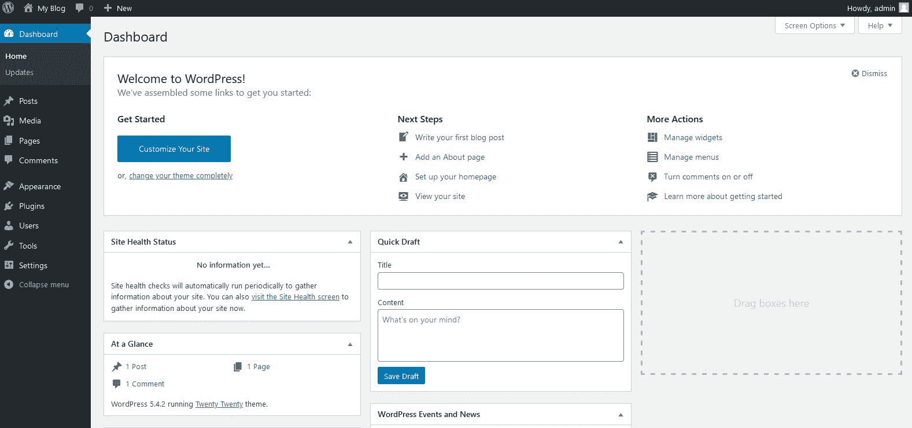
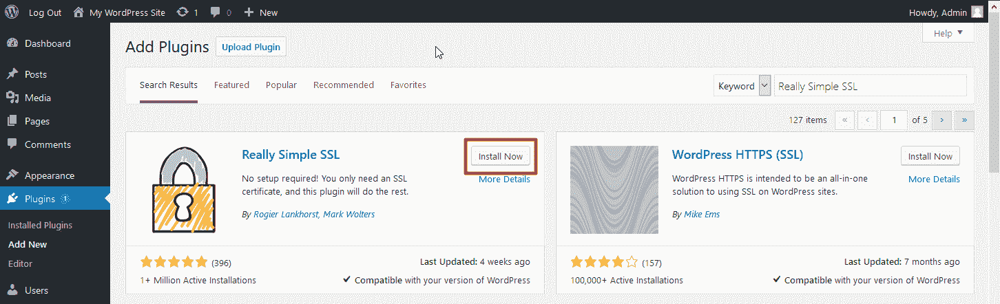
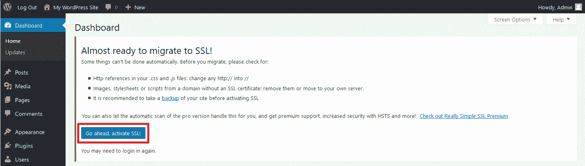

# 如何通过 5 个简单的步骤用 HTTPS 保护你的 WordPress 网站

> 原文：<https://www.freecodecamp.org/news/chrome-plans-to-implement-insecure-form-warnings-how-can-wordpress-plugins-help-fix-your-form/>

互联网是由全球不同的计算机组成的网络。每个网站在这个网络上都有一个地址，用语法表示，以 HTTP 或 HTTPS 开头。

你可能在浏览器的地址栏中看到过这些字母。但重要的一点是，Chrome 和 Firefox 等网络浏览器正在打击包含 HTTP 或混合协议的网站。

如果你使用 WordPress 来构建和托管你的网站，你可能已经注意到页面上的一些内容经常通过 HTTP 连接加载，导致一个警告标志出现。

那么你如何确保你的 WordPress 站点是安全的呢？

## HTTP 和网站安全有什么关系？

HTTP 代表超文本传输协议，简单地理解为站点访问者和主机之间共享数据的协议。

HTTP 被认为是不安全的，因为任何观看网络的人都很容易窃取你的数据。因此，您的 web 浏览器将在地址栏中显示警告图标，而不是绿色锁，这表明该网站不安全。

另一方面，HTTPS 对网络上的请求和响应进行加密，因此是一种更安全的选择。幸运的是，通过使用 WordPress 提供的插件转移到 HTTPS，你可以很容易地使你的 WordPress 站点安全并解决上述问题。

以下步骤将帮助 WordPress 用户为他们的网站建立一个安全的 HTTPS 连接。

## 步骤 1:备份应用程序

在对你的应用程序和页面做任何改变之前，你应该备份你的 WordPress 应用程序。

通过管理面板进行的任何更改都有可能对您的数据造成不可挽回的损害。备份数据可以帮助您以后安全地恢复数据。如果你想恢复旧版本的网站，你也可以这样做。

您可以从许多备份选项中进行选择。在你选择一个之前，一定要考虑离线和在线备份系统的利弊。

## 第二步:登录你的 WordPress 管理面板

要进行所需的更改，你必须登录到你的 WordPress 管理面板。

通过输入您网站的 URL(www.abc.com)并在地址栏的末尾添加(/wp-admin)来访问管理面板。这将打开一个 WordPress 管理面板。

[Source](https://www.inmotionhosting.com/support/edu/wordpress/logging-into-wordpress-dashboard/)

输入您的用户名和密码，以管理员身份访问您网站的仪表板。管理员登录允许您进行更改和建立您的网站。

## 步骤 3:下载非常简单的 SSL 插件

导航到仪表板的左侧后，您应该会看到多个选项，如主页、页面、更新等。

向下滚动找到插件选项卡。点击插件，然后选择新插件。这将打开一个有很多插件选项的页面。

去搜索栏输入“非常简单的 SSL”。你会发现一个与徽标同名的插件和一把锁。选择安装插件选项。

[Source](https://www.inmotionhosting.com/support/edu/wordpress/how-to-install-wp-really-simple-ssl-plugin/)

## 步骤 4:激活插件

安装插件后，你可以在一个新标签中打开你的网站，检查地址栏中是否出现不安全图标。

如果你发现这个问题仍然没有解决，回到插件页面。在那里，你会看到一个选项来强制激活插件。

[Source](https://www.inmotionhosting.com/support/edu/wordpress/how-to-install-wp-really-simple-ssl-plugin/)

您可以打开一个新标签并访问您的网站，看看问题现在是否已解决。如果没有，检查下载是否正常进行可能会有所帮助。您也可以卸载该插件，重新启动电脑，然后重试。

## 步骤 5:检查并确认你的网站是安全的

为了确保你的 WordPress 站点是安全的，你必须经常检查和反复检查。打开您的网站，并确保挂锁图标出现后，正确关闭您的电脑。

此外，你可以检查插件是否在其他设备上运行。尝试让朋友或同事从他们的电脑上打开网站。最后，检查是否所有的组件和页面都运行良好，网站上没有任何改动。

最重要的是，你应该时刻关注插件是否工作。系统更新、应用程序更新、添加新插件和其他小故障可以很容易地改变插件的功能。

## 结论

流量是任何网站增长的重要指标。随着对黑客攻击、恶意软件、大规模监控和在线欺诈的认识不断提高，观众对任何危险迹象都变得警惕起来。

网络浏览器为了更大的客户满意度，正在跟上无懈可击的安全趋势，并做出改变来安抚用户。作为浩瀚海洋中的一条相对较小的鱼，随波逐流总是更好。

同样，作为一个运营网站的人，你应该确保你的网站是安全的。它不仅保护了你的网站，也保护了你的客户/观众，为双方创造了良好的体验。