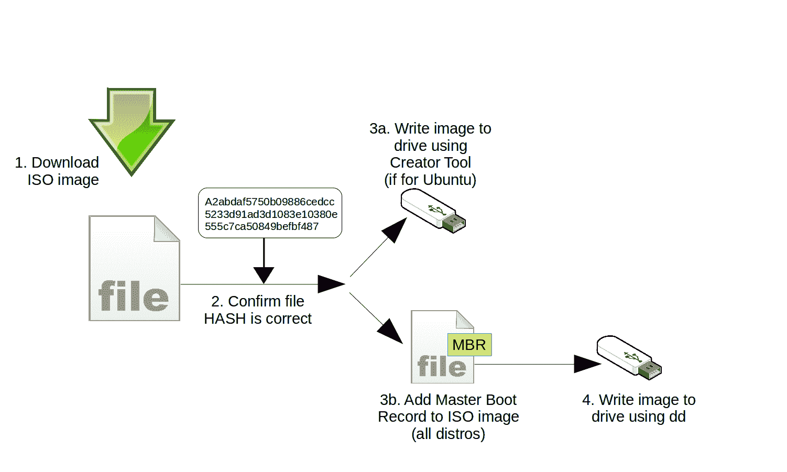

# Chroot:原始 Linux 虚拟化工具的神奇治愈能力

> 原文：<https://www.freecodecamp.org/news/chroot-magical-linux-virtualization-tool/>

您知道您所支持的人选择的密码可能不足以保护您的基础设施免受严重攻击。即使是少数例外，也可能在多个服务器和帐户上被重用。你乞求和唠叨，但这是一场失败的战斗。

但是一切并没有完全失去。使用 KeePass2 或 LastPass 之类的好的
密码库可以很大程度上解决跟踪
足够复杂的密码的问题。过度使用
密码的问题至少可以通过实现像 Kerberos 这样的单点登录
解决方案来缓解。好的。不是像 Kerberos 那样的*，而是 *Kerberos* 。*

然而，愚蠢的错误总是会发生。

那么，对于一两个非常在意为他们访问的每台服务器设计好的、强有力的密码的用户来说，会发生什么呢？当然，他们时不时会忘记密码。如果有另一个拥有 sudo power 的管理员可以登录到服务器并运行 passwd 为用户创建一个新密码，这就不是问题了。

```
sudo  passwd username
[sudo] password for yourname:
Enter new UNIX password:
Retype new UNIX password:
passwd: password updated successfully
```

但是如果你不幸而健忘的用户是那台机器上唯一拥有帐户的管理员，你就有麻烦了。除了你没有。所有 Linux 虚拟化的始祖 chroot 将拯救你的一天。

正如我在《Linux in Action》的第 6 章和第 9 章中所写的，这是一种可能的工作方式。使用实时启动驱动器来启动被锁定的服务器。



Steps for creating a Linux live boot USB

然后打开一个终端并运行 lsblk 来确定您的根分区在服务器硬盘上的位置，并将根分区挂载到一个临时目录。

```
mkdir /run/mountdir/
mount /dev/sdb1 /run/mountdir/
```

然后你低声说出咒语，你就进去了:

```
chroot /run/mountdir/
root@ubuntu:/#
```

这就够了。此时，您可以自由地运行命令，就好像您正在运行物理硬盘一样。使用 passwd 为您的管理员提供一个新密码来替换丢失的密码，并在键入 exit 关闭 chroot 会话后，重新启动机器(没有 live-boot USB)。现在一切都应该没问题了。

> *加密还是不加密*

> 使用 ecryptfs 或 dm-crypt 等工具对存储驱动器上的数据进行加密，可以大大降低数据被泄露的可能性。但另一方面，许多救援和恢复操作，如上面的 chroot 技巧，在加密卷上根本不起作用。

> *在安全性和可访问性之间取得平衡并不是一门精确的*
> *科学。例如，许多管理员会让本地服务器和桌面工作站不加密——因为它们至少受到上锁的办公室门的保护——但坚持移动设备要加密。*

## 恢复锁定的虚拟机

你可以使用 chroot 的魔法来清理各种各样的垃圾。被锁定在本地服务器(或 LXC 容器)之外？请随意打开 chroot shell 来禁用甚至重新配置您的防火墙。

现在，在物理机上完成这项工作应该很简单。但这是它在 LXC 容器上的工作方式。

首先，停止容器，然后对 LXC 容器(var/lib/lxc/
your-container-name/)使用的目录层次结构中的 rootfs 目录
运行 chroot。您将得到的命令提示符将允许您执行命令，就像容器实际上正在运行一样。现在禁用 ufw，或者，如果您愿意，运行必要的命令来修复问题，然后退出 chroot shell。当您再次启动容器备份时，您现在应该可以进行 SSH 访问了。

```
lxc-stop -n your-container-name
chroot /var/lib/lxc/your-container-name/rootfs/
ufw disable
exit
lxc-start -d -n your-container-name
```

*本文摘自我的* [*曼宁《Linux 在行动》一书*](https://www.manning.com/books/linux-in-action?a_aid=bootstrap-it&a_bid=4ca15fc9) *。还有更多有趣的东西* [*来自*](https://bootstrap-it.com/index.php/books/) *，包括一个名为*[*Linux in Motion*](https://www.manning.com/livevideo/linux-in-motion?a_aid=bootstrap-it&a_bid=0c56986f&chan=motion1)*的混合课程，它由两个多小时的视频和大约 40%的 Linux in Action 文本组成。谁知道呢……你可能也会喜欢我最近出版的* [*一个月的午餐*](https://www.manning.com/books/learn-amazon-web-services-in-a-month-of-lunches?a_aid=bootstrap-it&amp;a_bid=1c1b5e27) *学习亚马逊网络服务。*