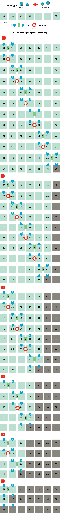

# 可视化冒泡排序

> 原文：<https://www.freecodecamp.org/news/cjn-bubble-sort-visualized/>

**你需要什么:**

1)未排序的数组

2)对于循环 **i** -循环的数量基于数组中元素的数量。 **i** 的每一个循环都会将 **j** 的循环重置为零。

3)对于循环 **j** -循环次数以 **j** 每循环一次 **i** 的循环次数减 1 为准。为什么？我们已经确定每个循环的最后一个元素已经排序，不需要在下一个循环中进行比较(因此为-1)。

4)一个变量要切换数。Python 中不需要这个。

**可视化:**



如果你想知道我是如何做到这一点的，我在我的 MacBook 中使用了 **Numbers** 应用。

### 实现冒泡排序的 Python 程序

```
def bubbleSort(arr):
  n = len(arr)

  # Traverse through all array elements 
  for i in range(n): 

	  # Last i elements are already in place 
	  for j in range(0, n-i-1): 

  		  # traverse the array from 0 to n-i-1 
		  # Swap if the element found is greater 
		  # than the next element 
		  if arr[j] > arr[j+1] : 
			  arr[j], arr[j+1] = arr[j+1], arr[j] 
```

### 上面要测试的驱动程序代码

```
arr = [64, 34, 25, 12, 22, 11, 90]

bubbleSort(arr)
print ("Sorted array is:")

for i in range(len(arr)):
    print ("%d" %arr[i]),
```

代码来源:[https://www.geeksforgeeks.org/bubble-sort/](https://www.geeksforgeeks.org/bubble-sort/)