# 我的团队如何震撼 AngelHack 西雅图黑客马拉松

> 原文：<https://www.freecodecamp.org/news/cjn-cashcycle-angelhack-seattle-hackathon-2018-d3f42a26ddcb/>

这是我第二次参加黑客马拉松，这是一次真正丰富的经历！我们能够调用 API，连接到后端数据库，并使用 JavaScript 构建应用程序的大部分前端逻辑和功能。

今年早些时候，我参加了 Capital One DevExchange Hackathon，几乎没有任何编码经验。它帮助我管理自己的期望，了解评委们的期望。

#### 评判标准

*   好主意
*   工作演示
*   对社会的影响
*   可量测性

#### 什么有帮助

*   参加[西雅图城市大学](https://www.cityu.edu/)的计算机科学硕士项目。
*   在线编码资源(如 [freeCodeCamp](https://www.freecodecamp.org/) 和 [Udemy](https://www.udemy.com/)
*   去参加聚会(看看 Meetup.com
*   [中等](https://medium.com/)
*   很多优秀的导师。
*   厉害了团队成员！

### 该应用程序

我们开发了一个解决方案来解决一个常见问题:共享单车被放在不合适的地方。这给环境带来了问题，自行车共享公司招致了额外的成本和罚款。我们的解决方案众包工人，以帮助移动共享自行车到适当的位置，这减少了混乱，有利于社区和自行车共享公司。

我们的应用程序包括一个网络平台，使自行车共享公司能够发布将由众包工人完成的自行车移动任务。该 web 应用程序包括一个基于地图的 UI，该 UI 显示运输路径并按距离为用户列出作业。它还为员工提供奖励，如现金、自行车共享信用和礼品卡。

### 用于构建应用程序的技术

*   HTML/CSS
*   Java Script 语言
*   节点. js
*   Heroku

### 接缝

#### 前端逻辑和功能——Google API 和后端连接

[**Clark Jason Ngo -志愿软件开发者-solutions resource Inc . | LinkedIn**](https://www.linkedin.com/in/clarkngo/)
[*查看 Clark Jason Ngo 在全球最大的职业社区 LinkedIn 上的简介。克拉克·杰森列出了 15 份工作……*www.linkedin.com](https://www.linkedin.com/in/clarkngo/)

#### 前端用户体验/用户界面—响应式 Web 设计

[**切尔西·加尔维斯- IT 实习生-埃斯特林·科里电子| LinkedIn**](https://www.linkedin.com/in/galvc/)
[*查看切尔西·加尔维斯在全球最大职业社区 LinkedIn 上的个人资料。切尔西在…*www.linkedin.com](https://www.linkedin.com/in/galvc/)列出了 6 个职位

#### 前端逻辑和功能——Google API 和自行车功能

[**迈克尔·艾扎吉雷| LinkedIn**](https://www.linkedin.com/in/michael-eizaguirre-02a1a3139/)
[*查看迈克尔·艾扎吉雷在全球最大职业社区 LinkedIn 上的个人资料。迈克尔的学历是……*www.linkedin.com](https://www.linkedin.com/in/michael-eizaguirre-02a1a3139/)

#### 前端用户界面—线框|间距

[**陈逸东(Jayson)大学台湾学生联谊会副会长……**](https://www.linkedin.com/in/yi-tung-jayson-chen-b14660141)
[*查看陈逸东(Jayson)在全球最大的职业社区 LinkedIn 上的个人资料。奕东(杰森)有两个…*www.linkedin.com](https://www.linkedin.com/in/yi-tung-jayson-chen-b14660141)

#### 后端|团队领导|导师

[**陈志云-软件开发工程师(Alexa 机器学习)-亚马逊| LinkedIn**](https://www.linkedin.com/in/stephenscchan/)
[*在全球最大的职业社区 LinkedIn 上查看陈志云的个人资料。斯蒂芬有 5 份工作列在他们的…*www.linkedin.com](https://www.linkedin.com/in/stephenscchan/)

### 典型的 2 天黑客马拉松时间表

**第一天**
上午 8:00:开门&早餐
上午 9:00:开幕式，赞助商欢迎，&团队建设
上午 10:00:编码启动
下午 1:00:午餐
下午 2:00:赞助商分组会议
下午 6:00:晚餐
**晚上 8:00:场馆关闭**

#### …我们编码到晚上 12 点，凌晨 3 点回到家…

**第二天**

上午 8:00:场馆开放
上午 8:00:早餐
下午 12:00:午餐
下午 1:00:代码冻结&hackathon . io 上的提交截止日期
下午 1:30:A/V 检查
下午 2:00:演示
下午 4:00:宣布获奖者/奖品！

### 挑战

全球城市自行车共享的快速增长导致数百万辆废弃自行车堵塞街道和人行道，扰乱了人们的日常生活，留下了成堆的碎片。我们的目标是帮助城市解决自行车共享供应过剩的问题。

所以…开始吧！

### 白板

在我们开始编码之前，我们花了几个小时思考问题到底是什么。我们从社会角度和自行车共享公司的角度来考虑这个问题。

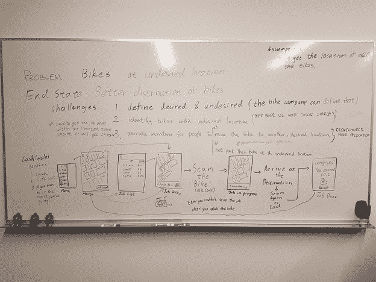

Problem and End State | Visual Page Layout

我们没有解决整个问题，而是想解决问题中的一个“特定”区域。这是我们经历的过程:

#### 简化问题陈述

> 自行车停在不理想的位置。

接下来，我们问自己，从长远来看，我们想要实现什么，而不是速战速决。

正如我在香港城市大学的变革管理课上学到的:需求导向与利益导向。

#### 制定最终状态

> 更好地分配自行车。

既然我们已经定义了我们的最终状态(自行车在期望的位置)，我们就头脑风暴一下要达到最终状态还有什么挑战。

#### 定义挑战

1.  定义想要的和不想要的
2.  识别所需位置内的自行车
3.  激励人们:

*   *将自行车移动到另一个所需位置*
*   *不要将自行车停在不合适的位置*

由于我们没有足够的时间来构建应用程序，这导致了选择一个并做出假设。

### 应对一个挑战

"*将自行车移动到另一个所需的位置，*"

假设:自行车共享公司提供“理想”和“不理想”位置的数据。

**创意:众包**

让自行车共享公司使用我们的服务，我们让人们把自行车从 A 点到 b 点。

#### 创建用户故事

我们使用 [Figma](http://www.figma.com) 从白板转向更好的视觉布局。

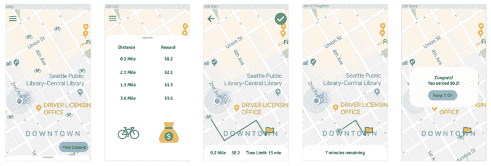

Wireframing

#### 选择最好的技术

我们专注于手头的问题，并使用我们认为最好的技术来解决它。

整合 AWS Lambda、Agora 或 Fit Bit 非常诱人，因为活动赞助商提供了很酷的奖品。

但是我们知道“强迫”一种技术作为解决方案可能不会有好结果。

#### [**谷歌云 API**](https://cloud.google.com/)

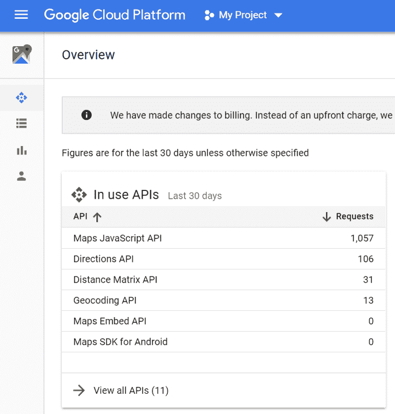

Google Platform APIs

### 后端服务器和端点

我们将数据存放在 Heroku 上，并生成了一个 JSON 文件。


JSON endpoint

我们的 JSON 端点假设自行车共享公司为我们提供了起始经纬度和目的地经纬度等。

### 测试谷歌地图 API

利用纬度和经度值，我们能够创建路线、A 点和 B 点以及自行车图标标记。

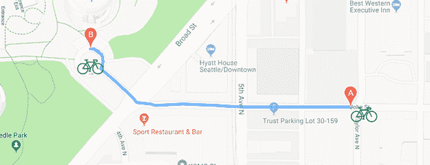

Bike Icon Marker | Route

单击自行车图标会生成一条蓝色路径和两个点 A 和 b。它还会将缩放级别更改为蓝色路径的中点。

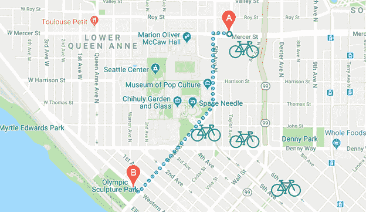

Changing “mode” to Walking

我们也有一个选项下拉菜单，将模式更改为“步行”，蓝色直线将更改为虚线，并重新路由到最佳“步行路径”。

此时，我们已经完成了逻辑和功能的编码。所以到了前端。

### 前端用户界面

我们做了一个响应式的网页设计，创造了简单而优雅的对话框。

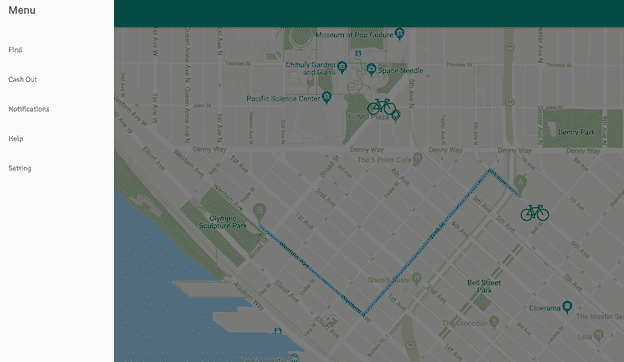

User Interface — Menu

在屏幕的左上方，我们创建了一个显示导航栏的切换按钮。导航栏包括“查找”、“兑现”、“通知”、“帮助”和“设置”。

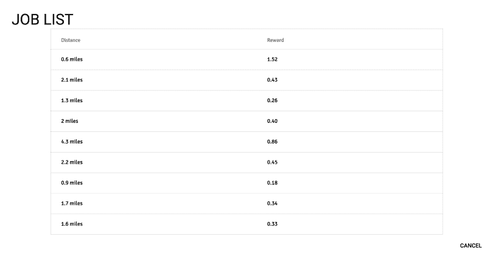

Menu — Find

点击“查找”将生成一个可用职位列表，这是点击自行车图标的替代方法。距离和奖励显示在列表中。

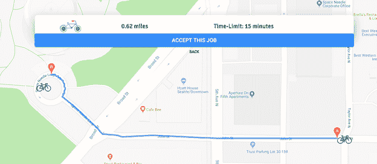

Dialog Box — Accept Job

从作业列表中选择一个作业或单击自行车图标将弹出一个对话框，要求用户接受该作业。该对话框还显示所选作业的距离和预计完成时间的摘要。

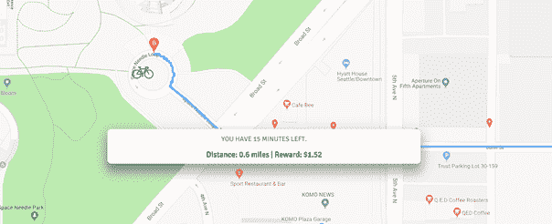

Dialog Box — Job Status

点击“接受这份工作”将开始旅行。地图将以自行车的 GPS 为中心。一个对话框将显示剩余的距离和完成工作的奖励。

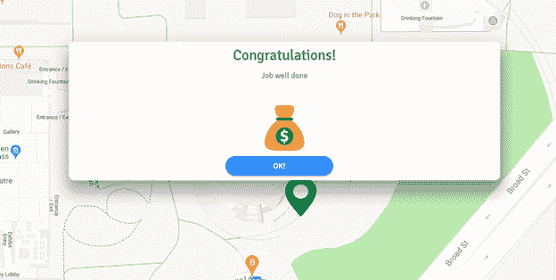

Dialog Box — Completed Job

当自行车到达期望的位置，即 B 点时，一个对话框将返回一个状态，表明任务已经完成！

### 代码片段

**变量**

```
var requestURL = 'https://whispering-stream-27392.herokuapp.com/job/';
      var request = new XMLHttpRequest();
      request.open('GET', requestURL);
      request.responseType = 'json';
      request.send();
var directionsDisplay = null;
var directionsService = null;
request.onload = function() {
var myJson = request.response;
  for (var i = 0; i < myJson.length; i++) {
    // hidden code: new array from json
    makeBike(xArrSta[i], yArrSta[i], arrId[i]);
  }
populateList(rewardList, distanceList);
populateFirstJob(unmodifiedJson[0]);
}
```

从 Heroku 获取 JSON 端点。

初始化 directionsDisplay 和 directionsService，这样当它生成一个新路径时，以前的路径将被删除。

### **Google API 函数 initMap()和 calculateAndDisplayRoute()**

```
function initMap() {
  map = new google.maps.Map(document.getElementById('map'), {
    zoom: 13,
    center: {lat: changingLat, lng: changingLon},
  });
}
function calculateAndDisplayRoute(directionsService, directionsDisplay) {
  var selectedMode = document.getElementById('mode').value;
  directionsService.route({
  origin: {lat: staLocLat, lng: staLocLong},
  destination: {lat: endLocLat, lng: endLocLong},
  travelMode: google.maps.TravelMode[selectedMode]}, function(response, status) {
    if (status == 'OK') {
      directionsDisplay.setDirections(response);
      distance = response['routes'][0]['legs'][0]['distance']['value'];
      duration = response['routes'][0]['legs'][0]['duration']['value'];
      document.getElementById('distance').innerHTML = distance;
      document.getElementById('duration').innerHTML = duration;
    } else {
        window.alert('Directions request failed due to ' + status);
    }
  });
}
```

initMap 是一个 Google API 函数，用于在加载时渲染地图。您可以设置地图的缩放和中心。

**calculateddisplayroute**是生成蓝色路径的函数。我们修改了函数，使其能够显示“距离”和“持续时间”。

### **函数 changeJobStatus()，chooseJob(id)，jobAvailable()**

```
function changeJobStatus(jobId, status, worker) {
// need to send id, status and workervar data = {};
var url = "https://whispering-stream-27392.herokuapp.com/job/" + jobId;
  data.id = jobId;
  data.status = status;
  data.worker = worker;
  var json = JSON.stringify(data);  
  var xhr = new XMLHttpRequest();
  xhr.open("PATCH", url, true);
  xhr.setRequestHeader('Content-type','application/json; charset=utf-8');
xhr.onload = function() {
    var users = JSON.parse(xhr.responseText);
    if (xhr.readyState == 4 && xhr.status == "201") {console.table(users);} else {console.error(users);}};
  xhr.send(json);
}
function chooseJob(id) {
    // hidden code: id, starting lat & long, ending lat & long   
    directionsDisplay.setMap(map);
    calculateAndDisplayRoute(directionsService, directionsDisplay);
}
function jobAvailable() {
        changeJobStatus(globalId, "AVAILABLE", "Johnny Cash");
}
```

### **函数 makeBike()**

```
function makeBike(latitude, longitude, id) {
  var image = 'bicycle.png';
  if (onBike) {image = 'rDot.png';}
  if (count > 10) {image = 'green-marker.png';}
  var size = new google.maps.Size(54, 54);
  if (count > 10) {size = new google.maps.Size(60, 75)}
  var icon = {url: image, scaledSize: size, origin: new google.maps.Point(0,0), anchor: new google.maps.Point(0, 0)};
var Bike = new google.maps.Marker({position: {lat: latitude, lng: longitude}, map: map, zoom: 200, icon: icon});
if (!directionsDisplay) {directionsDisplay = new google.maps.DirectionsRenderer;}
if (!directionsService) {directionsService = new google.maps.DirectionsService;}
Bike.addListener('click', function() {
    map.setZoom(18);
    flag = true;
    map.setCenter(Bike.getPosition());
    hideStartRide();
    bikeId(id);
    $("#dialog-jobOne").show();
    // code: id, starting lat & long, ending lat & long
    directionsDisplay.setMap(map);
    calculateAndDisplayRoute(directionsService, directionsDisplay);
    document.getElementById('mode').addEventListener('change', function() {
    calculateAndDisplayRoute(directionsService, directionsDisplay);
    });
  });
}
```

makeBike 是一个生成自行车图标标记并对其进行样式化的函数。它使用**calculated 和 DisplayRoute** 函数生成其蓝色路径。

编码完成后，就该投球了！

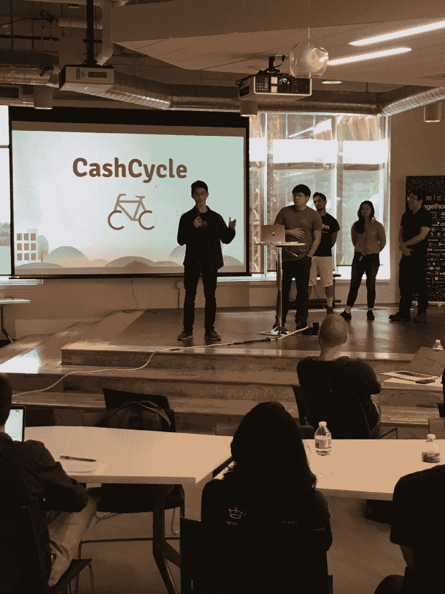

The Pitch

我们充满活力地完成了推介。我们确保它有一个流程，并将一个想法与其他想法联系起来。

演示流程:问题->数字问题->演示应用->将应用作为解决方案进行讨论->演示。

[https://www.youtube.com/embed/VFG1OJRB7Dc?feature=oembed](https://www.youtube.com/embed/VFG1OJRB7Dc?feature=oembed)

评委们询问了可扩展性。美国和其他国家有很多自行车共享公司，所以我们可以在国际上扩大规模。

23 支队伍参与了投票，评委们商议…

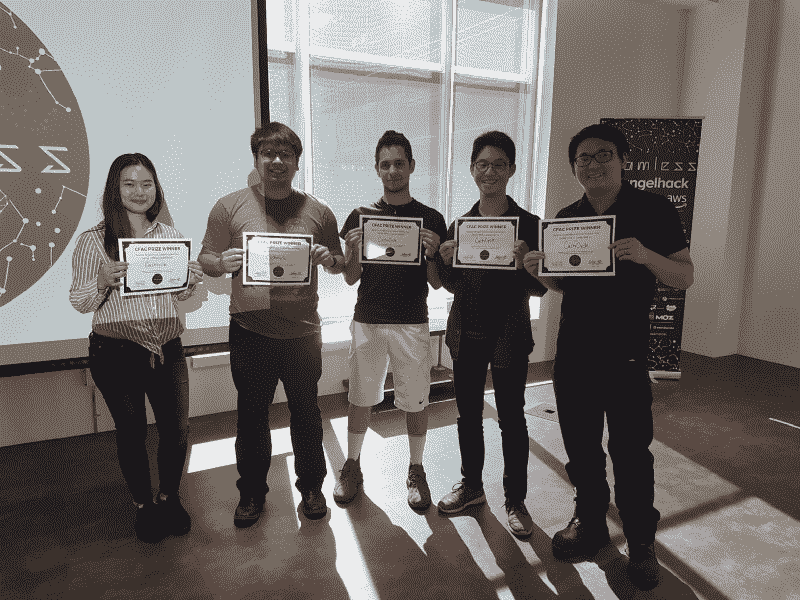

The runner-ups | team members L-R: Chelsea Galvez, Clark Jason Ngo, Michael Eizaguirre, Yi-Tung (Jayson) Chen, Stephen Chan

我们认为我们不会赢得任何东西，因为我们没有接受来自 AWS 和 Agora 的挑战。

但是我们赢了！

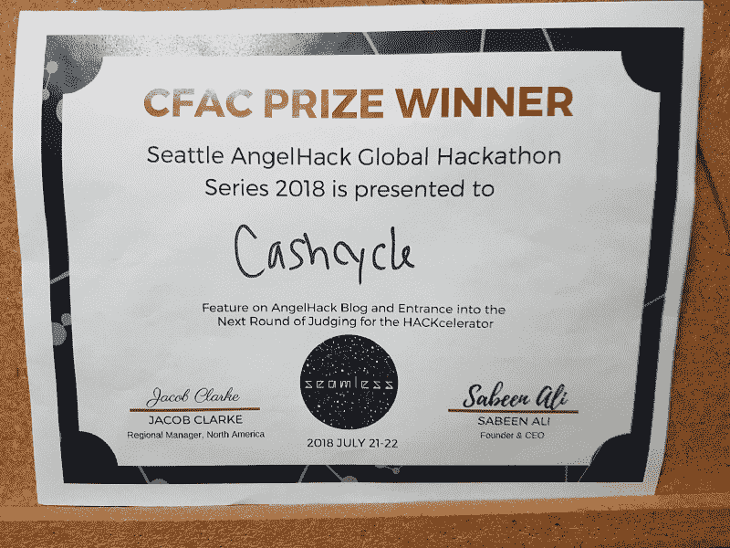

“Bragging rights”

亚军没有奖金或任何等价物。不过，这是一次很好的经历，至少我们有了吹牛的权利。:)

### 奖品


**Cause Impact Award Challenge 代码:**开发解决社会或环境问题并对当地社区产生积极影响的技术。

**原因影响奖奖励代码:**每次活动颁发一个影响奖。在全球黑客马拉松系列赛的最后，顶级影响力奖项目由包括 Chan Zuckerberg Initiative 等在内的专家评审团选出。前五名团队会收到官方邀请加入黑客组织。

### 与会者名单

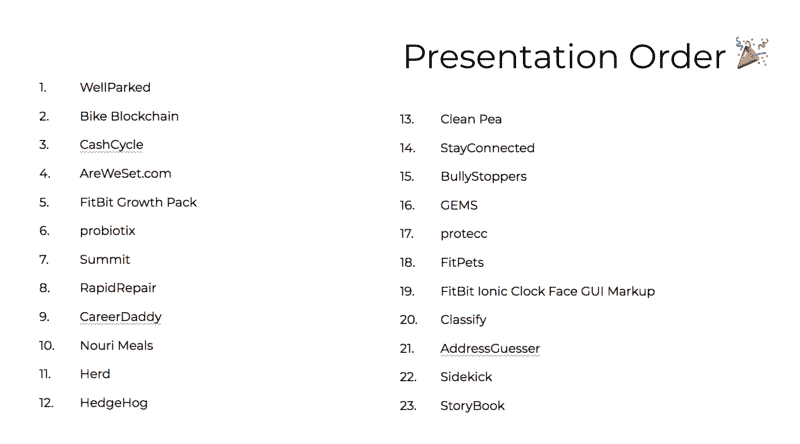

Teams with Great Ideas!

来自其他团队的著名创意应用有:

一个 FitBit 健身追踪器，上面有一朵花，在你达到每日目标时会绽放。

一个恶霸举报工具，允许目击者和其他当事人举报。

一个图像扫描应用程序，将检查自行车是否在一个理想的位置。

简历生成器，它还会根据你想要的技能推荐教程和课程。

我希望你喜欢读这篇文章。