# 如何使用 Google Sheets 作为 JSON 端点

> 原文：<https://www.freecodecamp.org/news/cjn-google-sheets-as-json-endpoint/>

更新:2020 年 5 月 13 日- [新建共享对话框](https://gsuiteupdates.googleblog.com/2020/04/new-file-sharing-dialog-google-drive.html)步骤如下。

> 谢谢艾丽卡. H。

您是否正在构建一个原型动态 web 应用程序，并且需要与非开发人员协作？

我以前参加过一次黑客马拉松，体验了如何开发应用程序的知识，但缺乏技能或时间在 3 天的冲刺中实现一个全栈 web 应用程序。那个时候，may skill 水平太低，甚至无法提供帮助，只能靠边站，观看教程，学习 HTML 和 CSS。

结果呢？我学到了很多，但我希望我能贡献更多。

在我最近参加的一次黑客马拉松中，我遇到了类似的问题。这一次，我不再是新手。我有一些非工程师，他们想帮助构建我们的原型 web 应用程序。幸运的是，我们偶然发现了一个 Google 电子表格，作为非工程师模拟我们的数据库的一种方式，并让后端开发人员连接到 Google Sheets JSON Endpoint 并解析它。

借助本指南，您将能够:

1.  在谷歌电子表格中创建一个电子表格。
2.  将电子表格发布到 web 上。
3.  生成一个 JSON 端点。
4.  打开电子表格进行公共协作。
5.  将 JSON 端点传递给后端开发人员。

在本教程之后，你将能够加入团队，并说，“我可以帮助后端！”。

### 第 1 部分:创建 Google 工作表

****第一步:****

转到[谷歌工作表](https://docs.google.com/spreadsheets/u/0/)

****第二步:****

创建新的电子表格

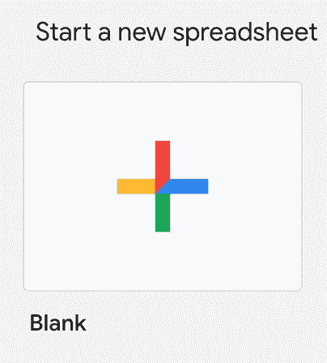

### 第 2 部分:将你的谷歌表单发布到网络上

*注意:新共享对话框更新于 2020 年 5 月 13 日，位于步骤 2 之后。*

****第一步:****

点击 *****文件******>******发布到网上…*****

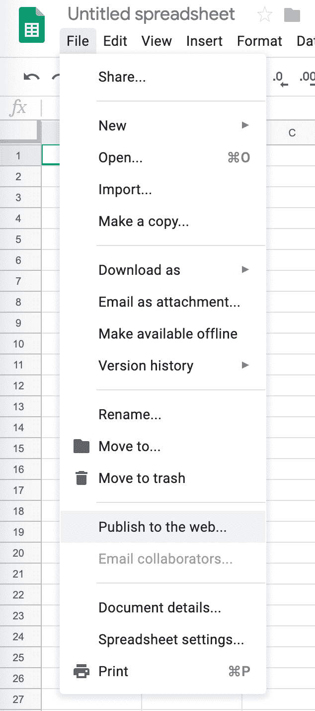

****第二步:****

点击 *****发布***** ，然后 *****确定*****

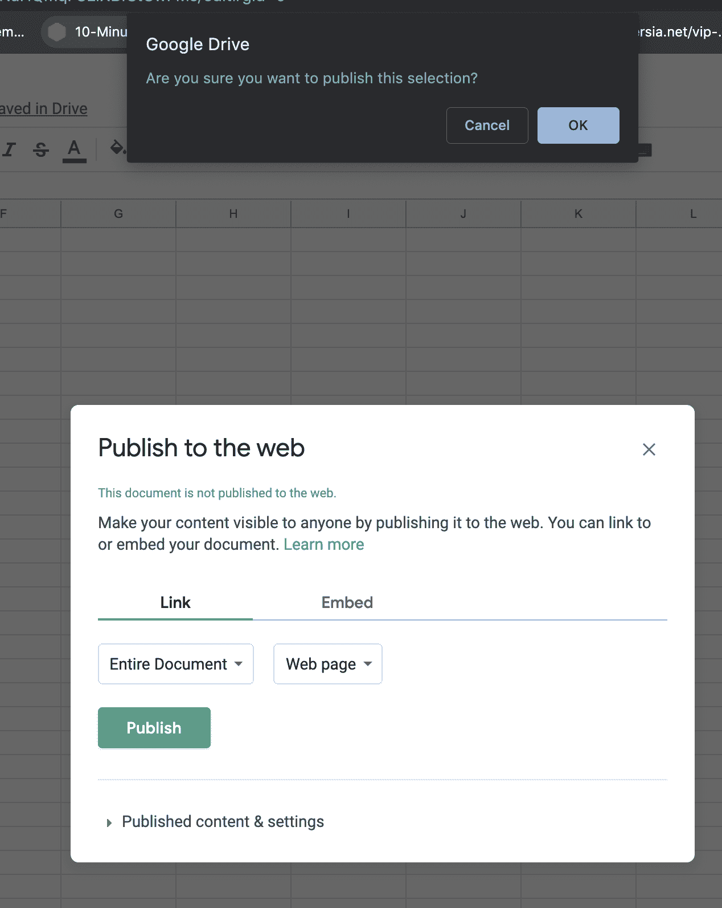

****第三步:****

这里什么都不用做

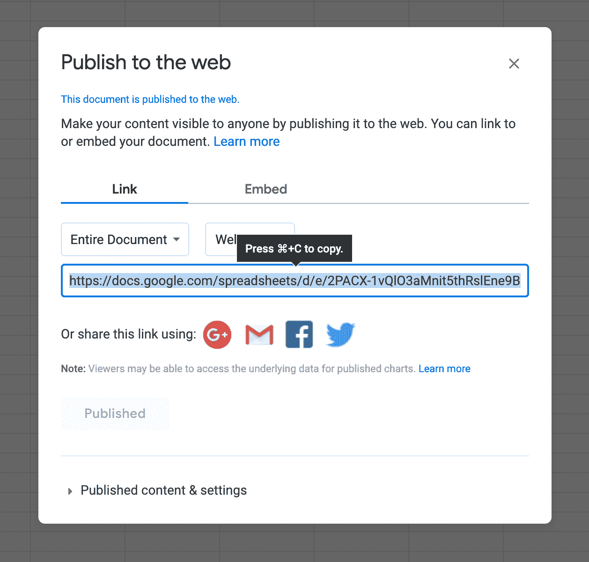

### 更新日期:2020 年 5 月 13 日-新建共享对话框

**第一步:**
点击分享

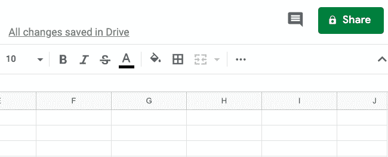

**第二步:**

点按“更改为带有链接的任何人”

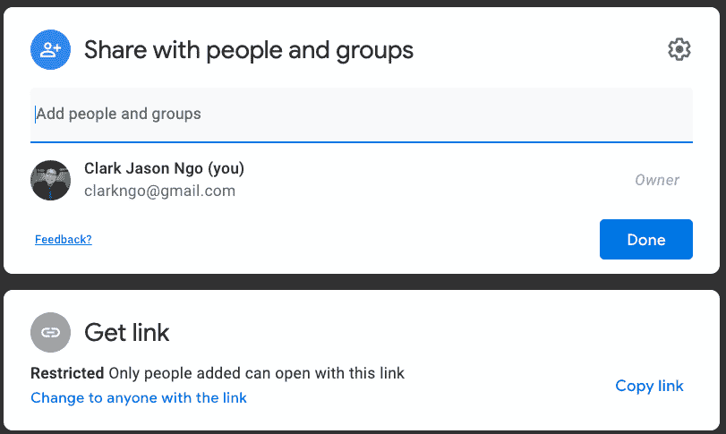

**第三步:**

点击“完成”

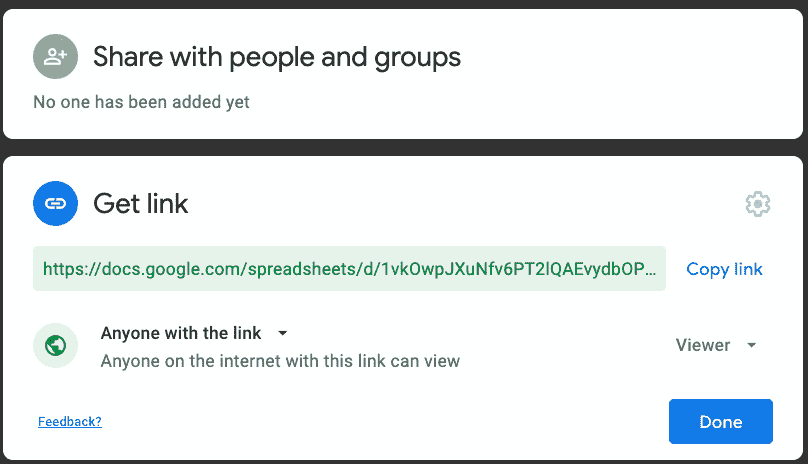

### 第 4 部分:使用 Google Sheets 作为 JSON 端点

****第一步:****

复制模板 URL 并粘贴到地址栏中:

[https://spreadsheets . Google . com/feeds/cells/your Google sheet code/sheet page number/public/full？alt=json](https://spreadsheets.google.com/feeds/cells/1g4FBktkm7al3ZkDI8LuFXuztTqK4nY-eUYMLep6BRuw/1/public/full?alt=json)

****第二步:****

转到你打开的谷歌工作表，检查地址栏

Google Sheets url

Google Sheets code

****第三步:****

转到模板 URL 并替换

*   *****yourggooglesheetcode***同*****1 ifbwzueslep 5-_ ysp 6 gg 7 o _ nahqmqf 8 llxbfstcwfms*******
*   *****sheet page number*****到 *****1*****

****第四步:****

检索 JSON URL

[https://spreadsheets . Google . com/feeds/cells/1 ifbwzueslep 5-_ ysp 6 gg 7 o _ nahqmqf 8 llxbfstcwfms/1/public/full？alt=json](https://spreadsheets.google.com/feeds/cells/1ifbWzueslEP5-_ysP6gg7o_NaHQmqF8LlXBfStCwFMs/1/public/full?alt=json)

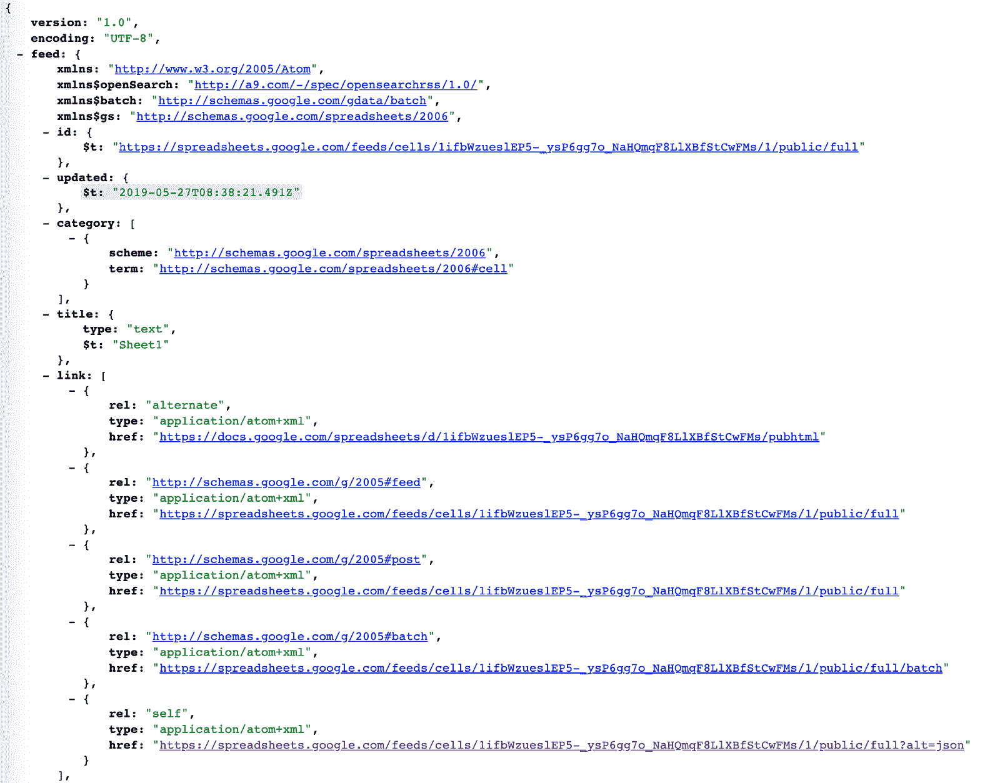

Result of JSON url

### 第 5 部分:公开你的 Google 表单(用于协作和数据输入)

#### 第一步:

在右上方，点击 *****分享*****

****第二步:****

添加姓名，点击 *****保存*****

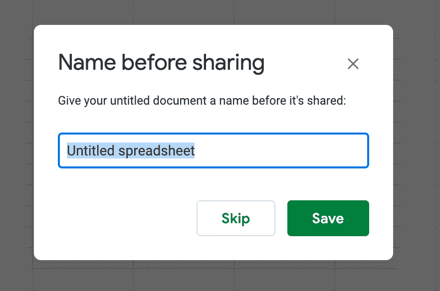

****第三步:****

点击 *****高级*****

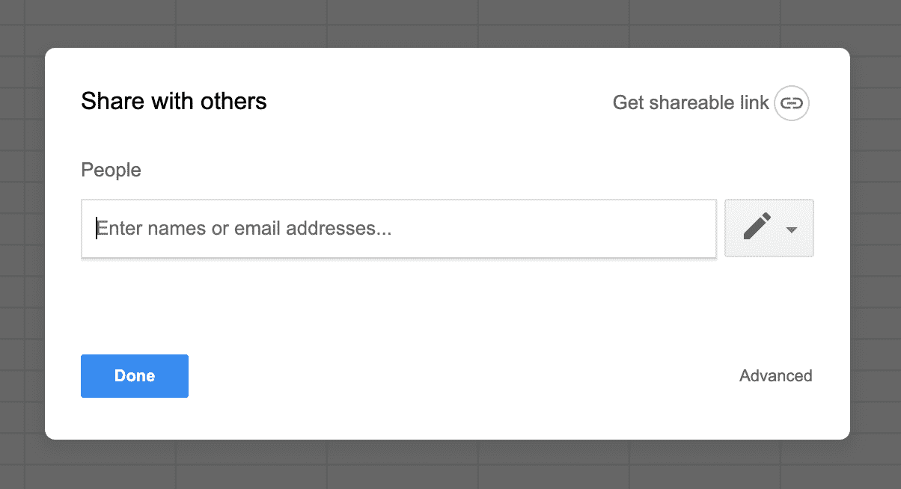

****第四步:****

点击 *****修改……*****

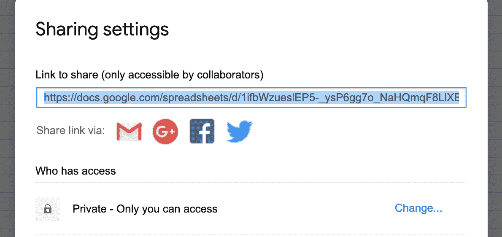

****第五步:****

点击 *****打开—在网上公开***** ，然后 *****保存*****

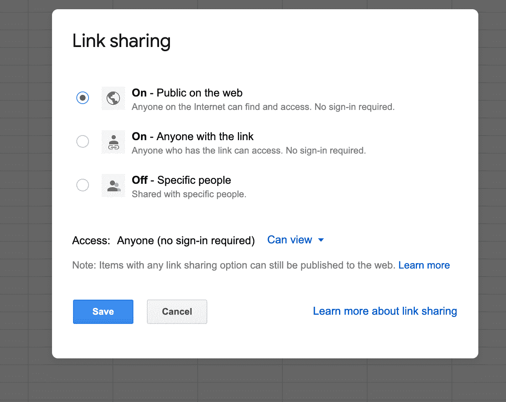

### **常见问题:**

如果您收到下面的回复，请检查您的 URL，并确保您在地址栏中使用了 Google Sheets 代码。

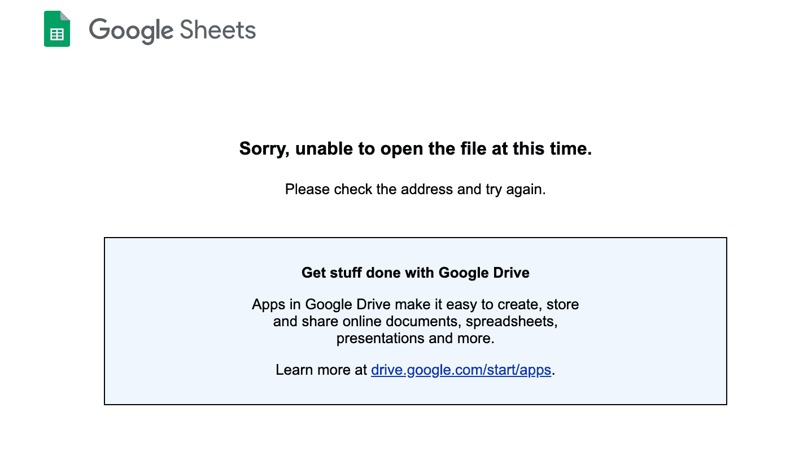

如果您收到下面的回复，请回到第 2 部分:将您的 Google 表单发布到 web。

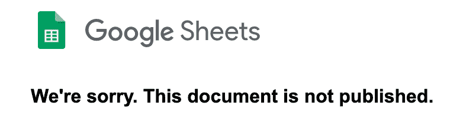

[**Clark Jason Ngo -研究生助教-技术学院-西雅图城市大学|……**](https://www.linkedin.com/in/clarkngo/)
[*加入 LinkedIn *热情培养新的软件开发人员。技术技能:Git、MVC、JavaScript、NodeJS、react js…*www.linkedin.com](https://www.linkedin.com/in/clarkngo/)