# 如何在 Tableau 中构建自定义地图可视化

> 原文：<https://www.freecodecamp.org/news/cjn-how-to-build-custom-map-visualization-in-tableau/>

去年的某个时候，当我看到一个数据可视化视频时，我对气泡图着迷，[韩的罗斯林的《200 个国家，200 年，4 分钟——来自 BBC 的统计的喜悦](https://www.youtube.com/watch?v=jbkSRLYSojo )。

Data Visualization used as an effective communication tool! Awesome!

### 什么是气泡图？

> 气泡图是一种显示三维数据的图表。每个实体及其三个相关联的数据被绘制为一个圆盘，通过圆盘的 xy 位置表示两个值，通过其大小表示第三个值。[维基百科](https://en.wikipedia.org/wiki/Bubble_chart)

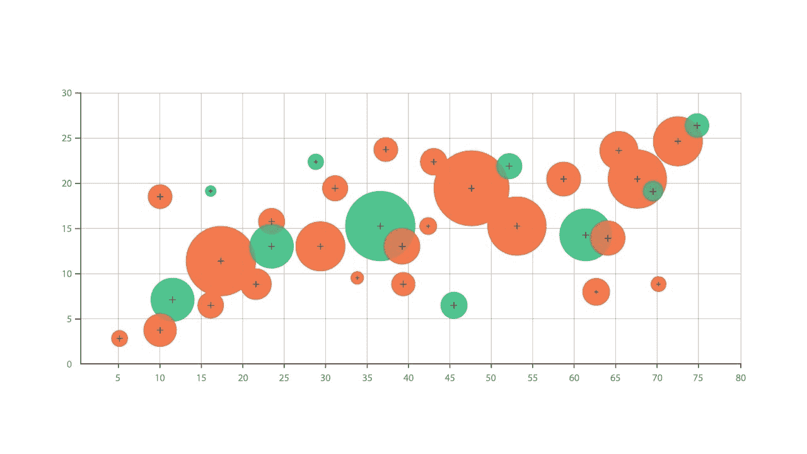

An example of Bubble Chart

去年 2019 年 1 月，我在查数据可视化软件 Tableau Desktop，他们的基础教程里有一张美国的热图。

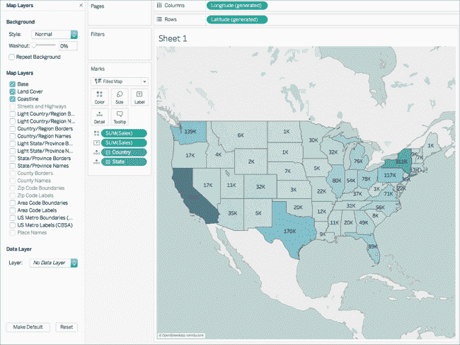

### 什么是热图？

> “热图是数据的图形表示，矩阵中包含的各个值用颜色表示。”“热图”是一个较新的术语，但是阴影矩阵已经存在一个多世纪了[维基百科](https://en.wikipedia.org/wiki/Heat_map)

在浏览 Tableau 教程时，我想起了泡泡图，并开始寻找灵感。我在谷歌上搜索图片轮廓，得到了下面的结果:

这导致了我简短的数据可视化实验。我找了一个数据集，在 [Kaggle](https://www.kaggle.com/ghopkins/nba-injuries-2010-2018) 上找到了 2010-2018 年的 NBA 伤病。我修改了数据集，使其易于使用。

我最终放弃了使用 Tableau，并在 Microsoft Powerpoint 中创建了自己的数据可视化。尽管如此，我的朋友们还是很惊讶，认为我使用了数据可视化工具。

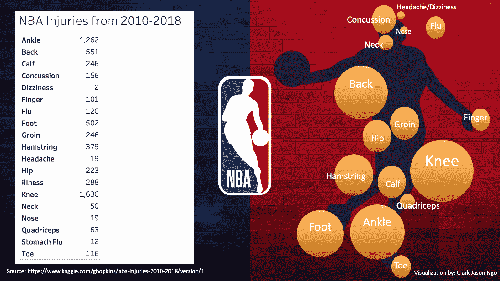

Created with Microsoft Powerpoint

时间快进到 2019 年 8 月，我重新开始学习 Tableu 教程。看看下面的结果就知道了！=)

Created with Tableau

## 我是怎么做到的？

我用了 Excel，Tableu，还有一点点创意。

随意跟随并创建相同的数据集和可视化。

**步骤**

1.  创建一个 Excel 文件。B 列和 C 列将作为 Tableau 中某个项目在 X 轴和 Y 轴上的位置。Count 代表从 2010 年到 2018 年有多少球员有特定的伤病。

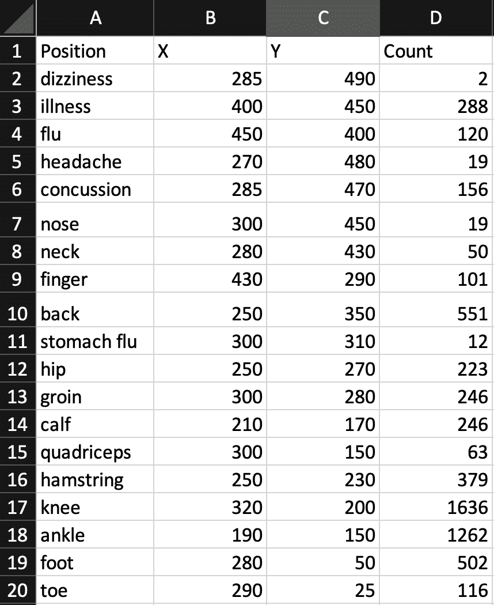

2.点击下载 Tableau 桌面[。](https://www.tableau.com/)

3.打开 Tableau 桌面应用程序

4.点击**连接文件** > **微软 Excel**

4.将工作表从左窗格拖到右窗格

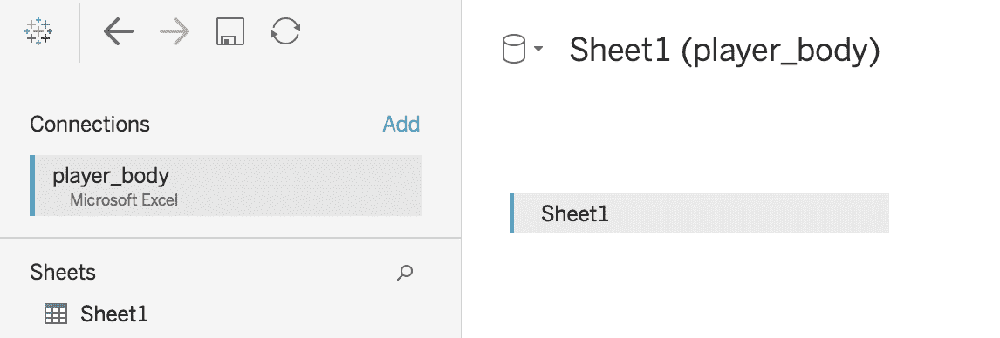

5.在底部，单击表单。

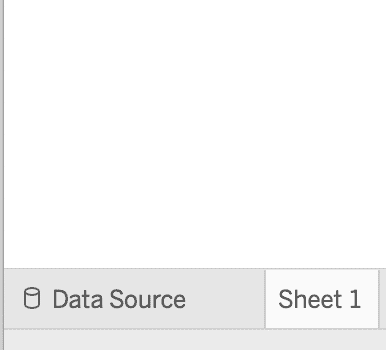

6.在菜单中，点击**背景图片** > **工作表**

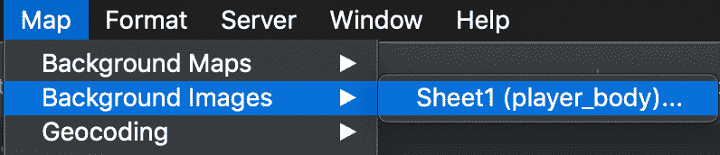

7 .点击**添加图像**

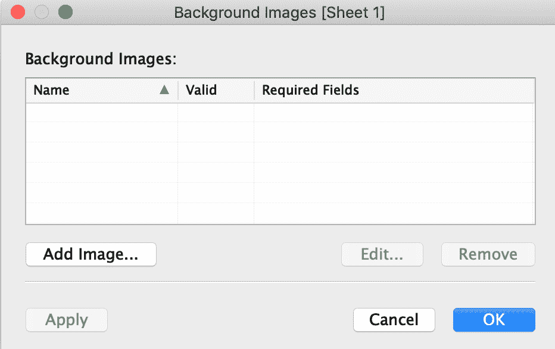

8.浏览图像，并将 X 字段:右侧设置为 500，Y 字段:顶部设置为 500。

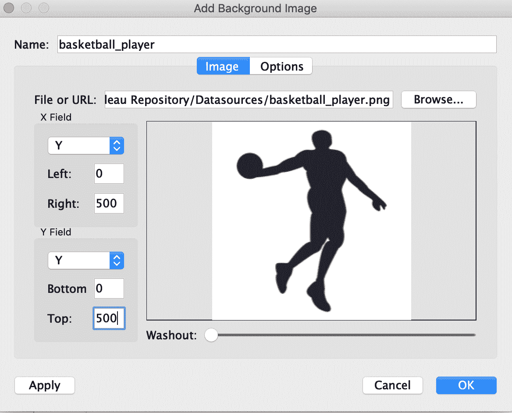

9.在列和行中，分别添加 **SUM(X)** 和 **SUM(Y)** 。

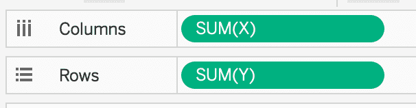

10.对于标记，在颜色上增加 **SUM(COUNT)** ，在尺寸上增加 **SUM(Count)** ，在标签上增加**位置**。

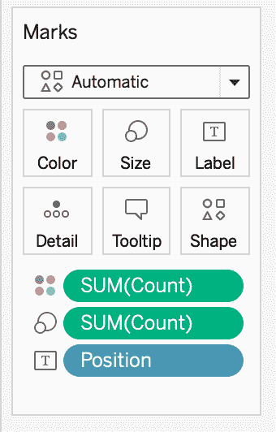

Tableau 将为您生成以下可视化效果:

数据可视化的强大功能之一是处理数据并通过查看图像来理解数据。有了这个可视化，我可以很清楚很容易的告诉你**脚踝**和**膝盖**伤是 NBA 球员最常见的运动损伤，而**头晕**和**鼻**伤最不常见。

瞧啊。希望你喜欢这个简单的实验=)