# 如何使用 Azure Data Studio 连接您的 AWS RDS Microsoft SQL Server

> 原文：<https://www.freecodecamp.org/news/cjn-how-to-connect-your-aws-rds-microsoft-sql-server-using-azure-data-studio/>

本指南的目标是试用云数据库，并将一个数据库连接到一个数据库工具。完成本指南后，您应该能够创建数据库和表，等等。

导入示例数据库是一件痛苦的事情，所以这里是我创建的另一个指南: [*如何使用 S3*](https://www.freecodecamp.org/news/cjn-how-to-import-a-sample-database-to-your-aws-rds-microsoft-sql-server-using-s3/) 将示例数据库导入到您的 AWS RDS Microsoft SQL Server。

幸运的是，由于我是新手，我还发现了如何使用 Docker to Azure Data Studio 连接到 MSSQL 服务器。查看本指南: *[如何使用 Azure Data Studio](https://www.freecodecamp.org/news/cjn-how-to-connect-your-microsoft-sql-server-docker-container-with-azure-data-studio/)* 连接您的 AWS RDS Microsoft SQL Server。

我们将涉及以下显示的技术:

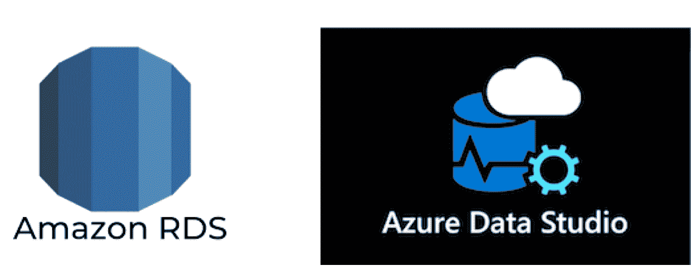

*   数据库:带有 MSSQL Server Express Edition 的 Amazon 关系型 RDS
*   数据库工具和 GUI: Azure Data Studio

## 创建和配置 AWS RDS MSSQL Server 实例

### 登录 AWS.com:

1.  前往[https://aws.amazon.com/console/](https://aws.amazon.com/console/)
2.  点击**登录您的 AWS 账户**

### 创建 Microsoft SQL Server 数据库实例:

1.  在创建数据库部分，选择**创建数据库**。

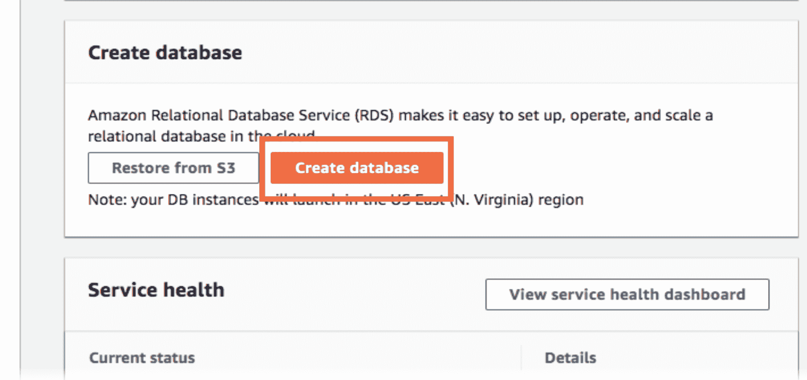

2.选择**简易创建**为数据库创建方法。

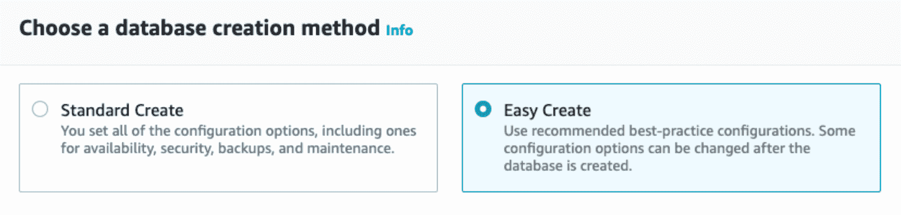

3.为引擎类型选择 **Microsoft SQL Server** 图标。

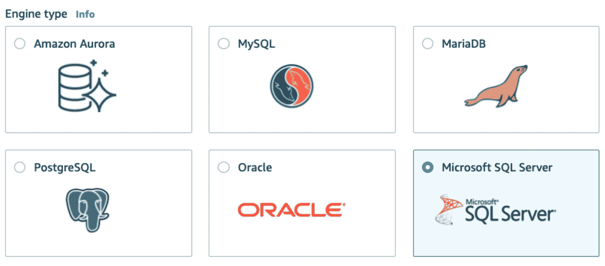

4.为数据库实例大小选择**空闲层**。

5.为数据库实例标识符填写以下详细信息:

*   **数据库实例标识符:**myrdtest。
*   **主用户名:**输入用户名
*   **主密码:**输入包含 8 到 41 个可打印字符的密码。

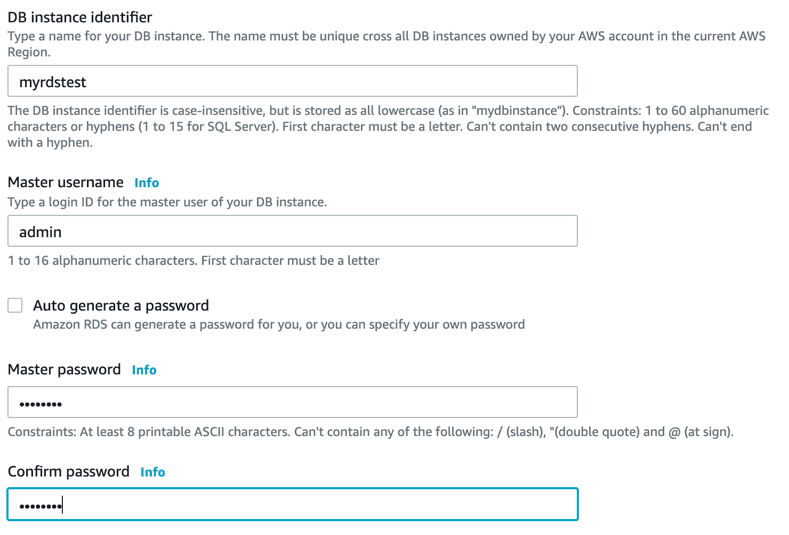

6.选择**创建数据库**。

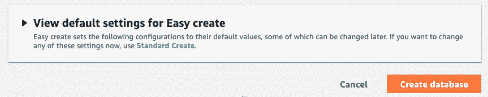

注意:配置可能需要几分钟时间

如果您意外退出该页面，您应该会在 **RDS** > **数据库**下看到您的数据库**myrdtest**。

要获得更详细的教程，请遵循 [AWS 文档](https://aws.amazon.com/getting-started/tutorials/create-microsoft-sql-db/)中的步骤。

### 允许公众访问您的 RDS 实例

1.  点击**修改**

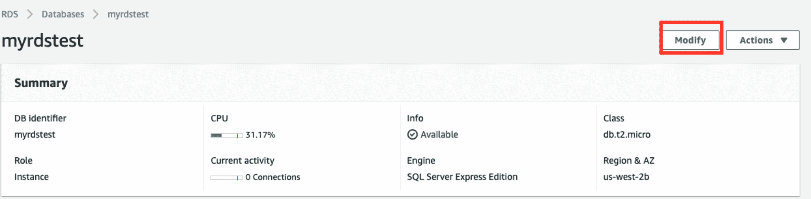

2.在网络&安全下的公共访问中选择**是**。

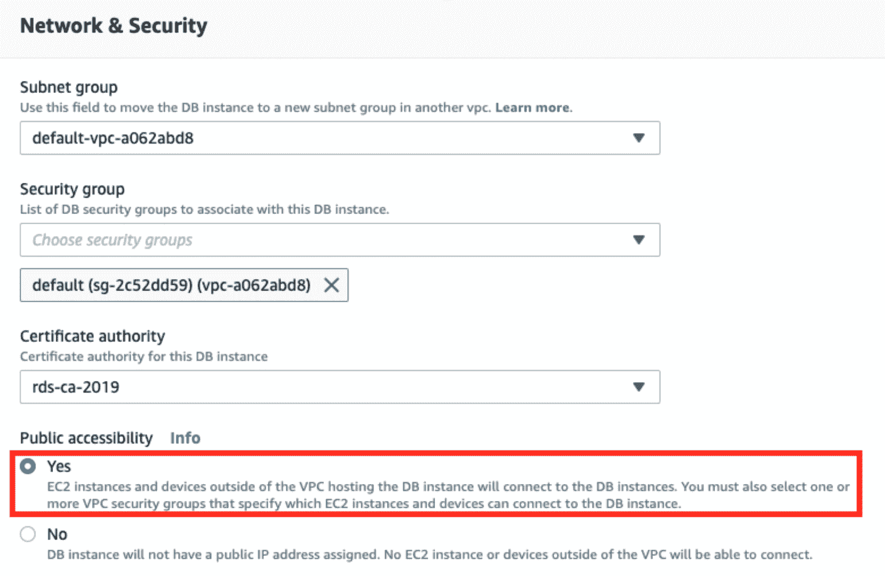

3.在修改调度下选择**立即应用**，然后点击**修改 DB 实例**。

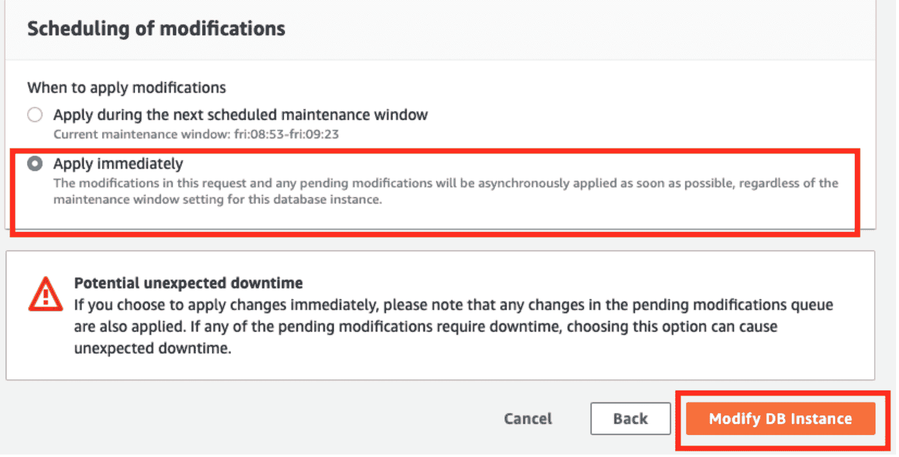

### 允许入站规则

1.  点击 VPC 安全组下的**默认(sg-0000d009)** 。

注意:在您自己的实例中，该数字是不同的。

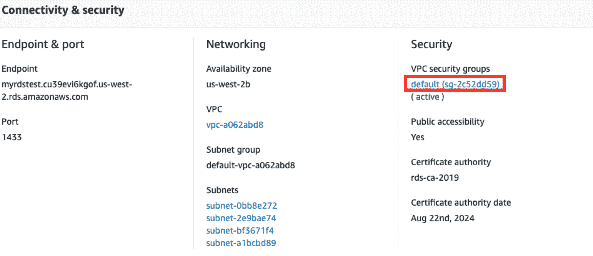

2.点击**入库**，然后点击**编辑入库规则**。

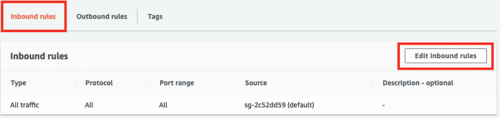

3.在源中选择**我的 IP** ，然后点击**保存规则**。

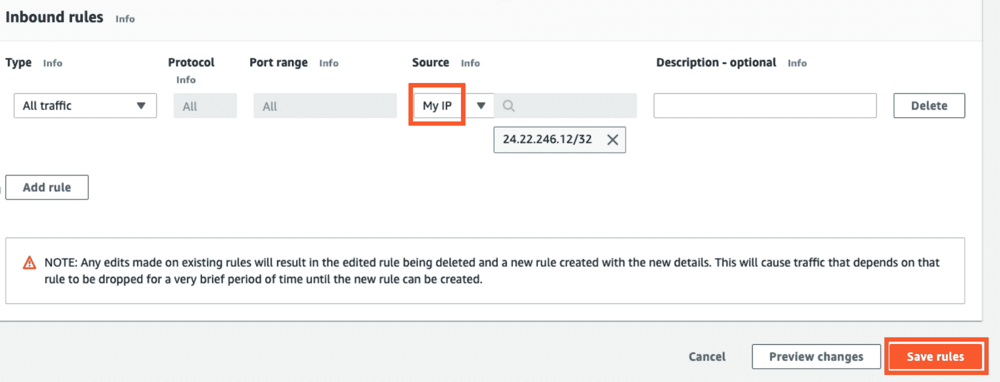

## 测试您与 AWS RDS 的连接

打开你的终端(MacOS)，输入如下:**NC-zv*AWS _ rds _ endpoint port _ number***

成功连接示例:

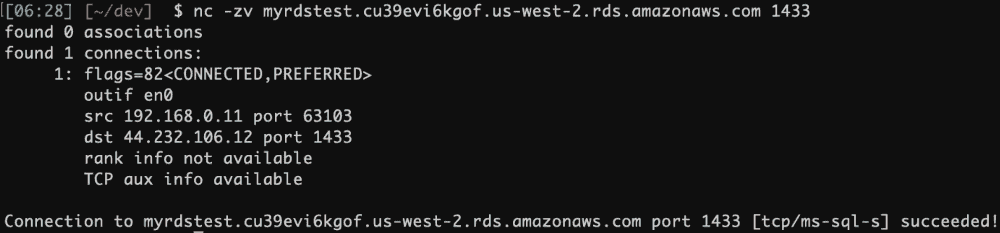

失败的连接示例:

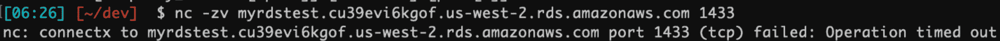

请确保 RDS 实例是公共的，并且入站规则允许您的 IP。

## 下载 SQL Server GUI - Azure Data Studio

Azure Data Studio (以前的 SQL Operations Studio)是一个免费的 GUI 管理工具，你可以用它来管理 SQL Server。您可以使用它来创建和管理数据库、编写查询、备份和恢复数据库，等等。

Azure Data Studio 可在 Windows、Mac 和 Linux 上使用。

### 安装 Azure Data Studio

要在 Mac 上安装 Azure Data Studio:

1.  访问 [Azure Data Studio 下载页面](https://docs.microsoft.com/en-us/sql/azure-data-studio/download)，点击。macOS 的 zip 文件
2.  一旦。zip 文件已经下载完毕，双击它可以展开它的内容
3.  拖动。应用程序文件添加到应用程序文件夹。

### 连接到 SQL Server

既然 Azure Data Studio 已经安装，您可以使用它来连接到 SQL Server:

1.  启动 Azure Data Studio。它位于您的应用程序文件夹中。
2.  输入您要连接的 SQL Server 实例的登录凭据和其他信息:

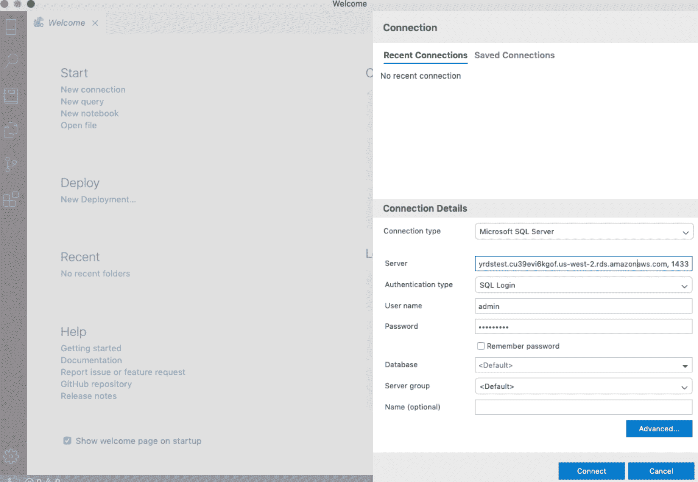

它应该看起来像这样:

*   **服务器名**:【AWS RDS 端点】，【端口号】
    **示例**:myrdstest . blahblah blah . us-west-2/ds . Amazon AWS . com，1433
*   **认证类型** : SQL 登录
*   **用户名**:【您的 AWS 用户名】
*   **密码**:【您的 AWS 密码】
*   **数据库名称** : <默认>
*   ****服务器组** : <默认>**

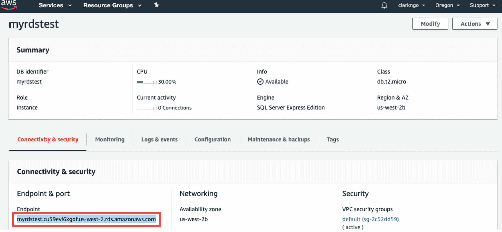

如果您使用的端口不是默认的 1433，请点击**高级**并将其输入端口字段。

或者，您可以将它附加到您的服务器名称后，中间用逗号隔开。例如，如果您使用端口 1400，请键入 localhost，1400。

如果出现错误:

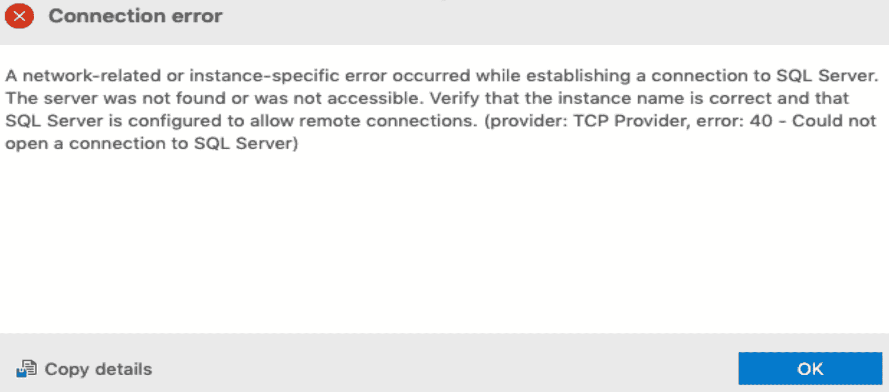

请确保 RDS 实例是公共的，并且入站规则允许您的 IP。

现在，您可以继续创建数据库、运行脚本以及执行其他 SQL Server 管理任务。

1.  点击**新建查询**

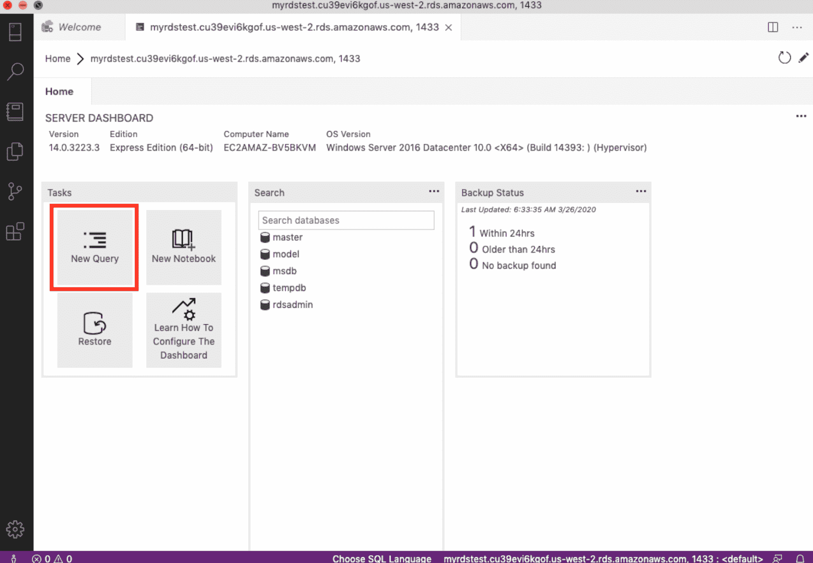

2.键入**选择@ @版本**，然后点击**运行查询**。

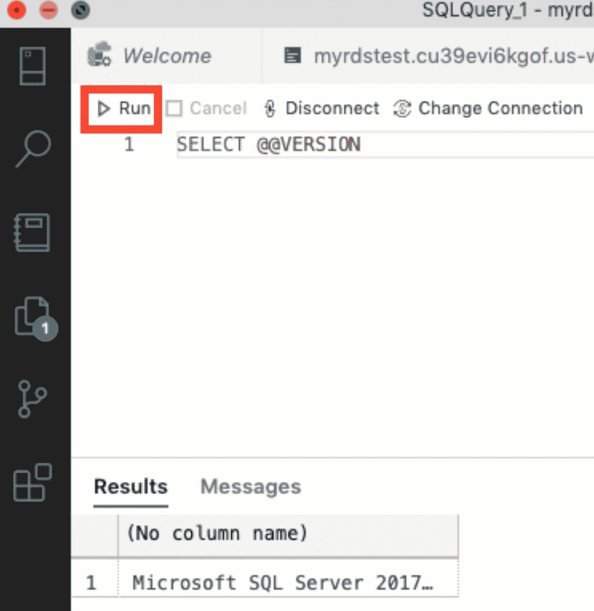

您应该能够在结果中看到: *Microsoft SQL Server*

恭喜你！？？？

## 资源:

*   [如何创建微软 SQL 数据库](https://aws.amazon.com/getting-started/tutorials/create-microsoft-sql-db/)

在 LinkedIn 上联系我[这里](https://www.linkedin.com/in/clarkngo/)

