# 如何将您的 Microsoft SQL Server Docker 容器与 Azure Data Studio 连接

> 原文：<https://www.freecodecamp.org/news/cjn-how-to-connect-your-microsoft-sql-server-docker-container-with-azure-data-studio/>

本指南向您展示了如何使用 Docker 提取并运行 MSSQL Server 映像。Azure Data Studio 是一个跨平台的数据库工具，将用于连接我们的 Docker 容器和 MSSQL 并执行 SQL 语句。

最后，我将向您展示如何将数据库导入 Docker 文件系统，以便您可以通过 Azure Data Studio 访问它。

点击此处查看其他相关指南:

*   *[如何使用 Azure Data Studio](https://www.freecodecamp.org/news/cjn-how-to-connect-your-aws-rds-microsoft-sql-server-using-azure-data-studio/)* 连接您的 AWS RDS Microsoft SQL Server
*   [*如何使用 S3*](https://www.freecodecamp.org/news/cjn-how-to-import-a-sample-database-to-your-aws-rds-microsoft-sql-server-using-s3/) 将样本数据库导入您的 AWS RDS Microsoft SQL Server

我们将涉及以下显示的技术:


*   数据库:Microsoft SQL Server
*   提取 mssql-server-demo 的容器:Docker
*   mssql-cli 的安装程序:Node.js(运行时环境)/节点程序包管理器(NPM)
*   数据库工具和 GUI: Azure Data Studio

## 用 Docker 构建我们的环境

### 安装 Docker

这部分的完整指南[此处](https://database.guide/how-to-install-sql-server-on-a-mac/):

1.  点击下载 Mac 版 Docker CE(社区版)[。](https://store.docker.com/editions/community/docker-ce-desktop-mac?tab=description)
2.  要安装，请双击。dmg 文件，然后将 Docker 应用程序图标拖到您的应用程序文件夹中。

#### Docker 是什么？

Docker 是一个平台，使软件能够在自己的隔离环境中运行。SQL Server(从 2017 年开始)可以运行在 Docker 上自己的隔离容器中。

一旦安装了 Docker，您只需将 Linux 上的 SQL Server Docker 映像下载到您的 Mac 上，然后将其作为 Docker 容器运行。该容器是一个独立的环境，包含 SQL Server 运行所需的一切。

### 启动码头工人

打开 Docker 应用程序，它应该位于应用程序文件夹中。

### 增加内存

默认情况下，Docker 会分配 2GB 的内存。SQL Server 至少需要 3.25GB。为了安全起见，如果可能，请将其增加到 4GB。既然这只是个游乐场，2GB 应该够了。

### 可选-如果您想增加内存大小:

1.  从顶部菜单的小图标中选择首选项
2.  将内存滑块向上滑动至至少 2GB
3.  单击应用并重启

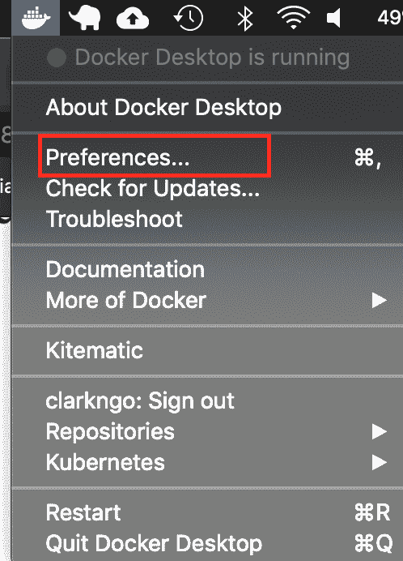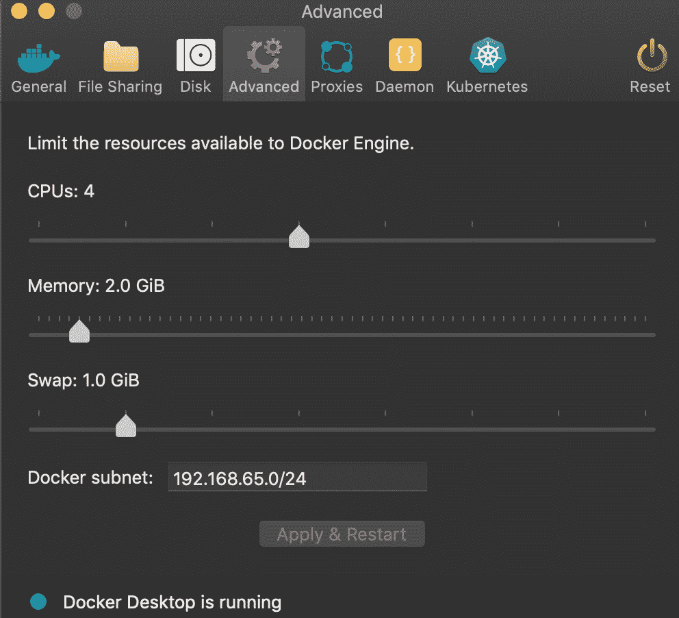

### 下载 SQL Server

打开终端窗口并运行以下命令。

```
sudo docker pull mcr.microsoft.com/mssql/server:2019-latest
```

这会将最新的 SQL Server 2019 for Linux Docker 映像下载到您的计算机上。

如果你愿意，你也可以在 Docker 网站上查看最新的容器版本。

### 启动 Docker 图像

运行以下命令启动您刚刚下载的 Docker 映像的实例:

```
docker run -d --name sql_server_demo -e 'ACCEPT_EULA=Y' -e 'SA_PASSWORD=really
```

示例输出:

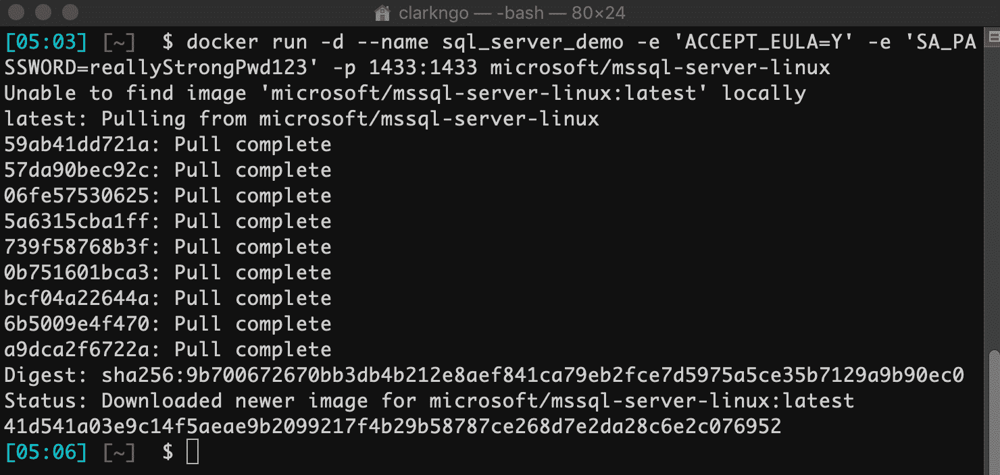

### 检查 Docker 容器(可选)

您可以键入以下命令来检查 Docker 容器是否正在运行。

```
docker ps
```

如果它已经启动并正在运行，它应该会返回如下内容:

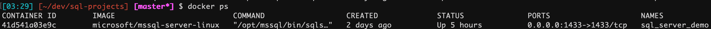

如果您不小心关闭了 Docker 应用程序，请打开您的终端并键入

```
docker start sql_server_demo
```

### 安装 Node.js 和 NPM

检查你是否有 Node.js 和 NPM。在您的终端中运行以下命令。

```
node -v
npm -v
```

如果您得到一个带有版本号的输出，请跳过本节的其余部分。

然后单击以下链接访问 Node.js 网站:

[https://nodejs.org/en/](https://nodejs.org/en/)

点击 LTS 版本(版本号可能各不相同)下载按钮，下载 Node.js 包:

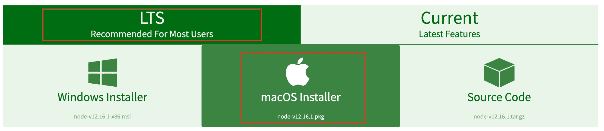

下一步点击并运行下载后的软件包。MacOS 和 Windows 会有不同的安装过程。请按照说明安装 Node.js。

然后，通过在终端中运行以下命令，再次测试 Node.js 和 NPM 是否安装成功:

```
node -v
npm -v
```

输出应该如下所示:

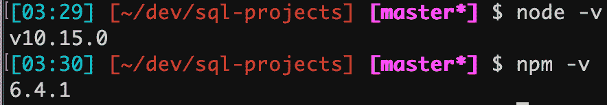

### 安装 sql-cli

运行以下命令安装 sql-cli 命令行工具。此工具允许您对 SQL Server 实例运行查询和其他命令。

```
npm install -g sql-cli
```

如果出现权限错误，使用`sudo`命令:

```
sudo npm install -g sql-cli
```

## 连接到 MSSQL Server

使用 mssql 命令，后跟用户名和密码参数，连接到您的 SQL Server。语法:-u <username>-p<password></password></username>

```
mssql -u sa -p reallyStrongPwd123
```

如果成功连接，您的输出应该如下所示:

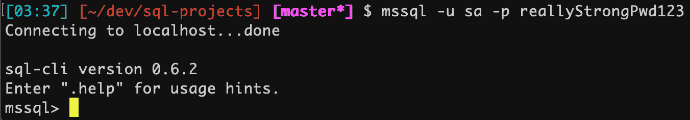

### 做一个快速测试

运行一个快速测试来检查您是否可以连接到您的 SQL Server。使用以下 SQL 语句检查您的 SQL Server 版本:

```
SELECT @@VERSION;
```

如果它正在运行，您应该会看到类似这样的内容:


## 下载 SQL Server GUI - Azure Data Studio

Azure Data Studio (之前的 SQL Operations Studio)是一款免费的 GUI 管理工具，你可以用它来管理你电脑上的 SQL Server。您可以使用它来创建和管理数据库、编写查询、备份和恢复数据库，等等。

Azure Data Studio 可在 Windows、Mac 和 Linux 上使用。

### 安装 Azure Data Studio

要在 Mac 上安装 Azure Data Studio:

1.  访问 [Azure Data Studio 下载页面](https://docs.microsoft.com/en-us/sql/azure-data-studio/download)，点击。macOS 的 zip 文件
2.  一旦。zip 文件已经下载完毕，双击它可以展开它的内容
3.  拖动。应用程序文件到应用程序文件夹(该文件可能会被称为 *Azure Data Studio.app* )

### 连接到 SQL Server

现在已经安装了 Azure Data Studio，您可以使用它来连接到 SQL Server。

1.  启动 Azure Data Studio。它位于您的应用程序文件夹中。
2.  输入您要连接的 SQL Server 实例的登录凭据和其他信息:

它应该看起来像这样:

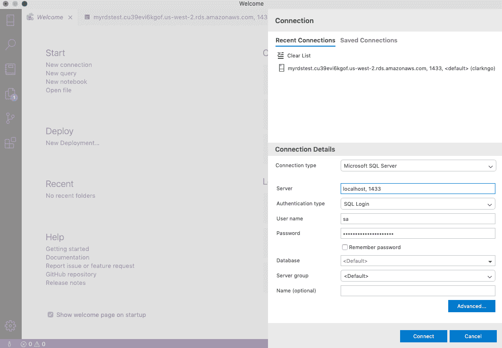

它应该看起来像这样:

*   **服务器名**:本地主机、【端口号】
    **示例**:本地主机，1433
*   **认证类型** : SQL 登录
*   **用户名**:【您的 SQL Server 用户名】或 sa
*   **密码**:【您的 SQL Server 密码】或 reallyStrongPwd123
*   **数据库名称** : <默认>
*   ****服务器组** : <默认>**

如果您使用的端口不是默认的 1433，请单击高级并在端口字段中输入它。

或者，您可以将它附加到您的服务器名称后，中间用逗号隔开。例如，如果您使用端口 1400，请键入 localhost，1400。

现在，您可以继续创建数据库、运行脚本以及执行其他 SQL Server 管理任务。

1.  点击**新建查询**

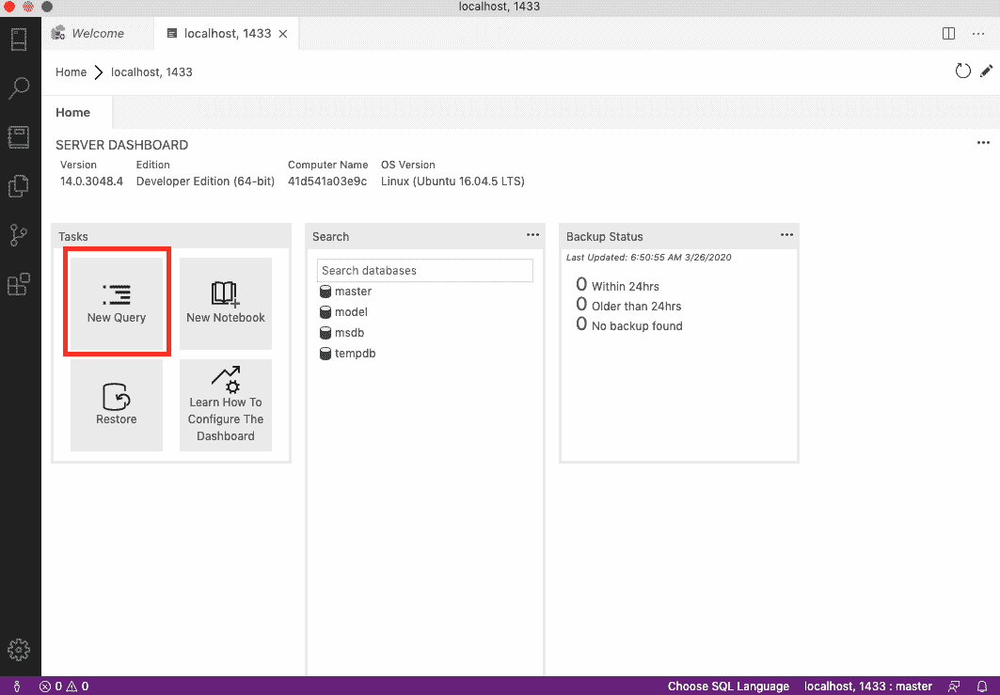

2.键入**选择@ @版本**，然后点击**运行查询**。

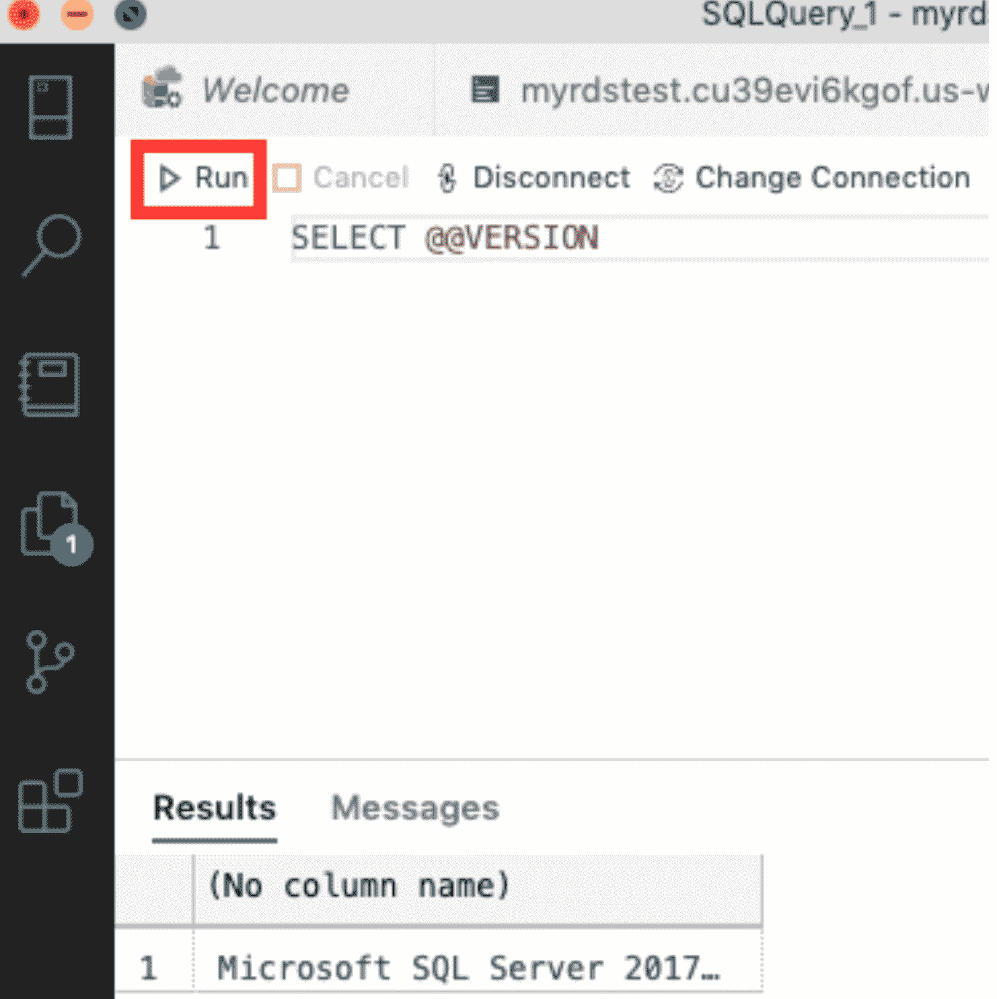

您应该能够在结果中看到: *Microsoft SQL Server* 。

## 使用 Azure Data Studio 将示例数据库导入 SQL Server

### 下载示例数据库文件 AdventureWorks

要获得 AdventureWorks 的 OLTP 下载，请转到这个[链接](https://docs.microsoft.com/en-us/sql/samples/adventureworks-install-configure?view=sql-server-ver15)并选择任意一个示例数据库。在我的例子中，我选择`AdventureWorks2017.bak`。我们会把这个上传到 S3 桶。

### 将文件复制到您的 docker

按照以下语法在终端中键入以下命令:

```
docker cp <location_of_file> <container_id>:/var/opt/mssql/data
```

它应该是这样的:


如果您忘记了您的容器 id，请使用`docker ps`命令。

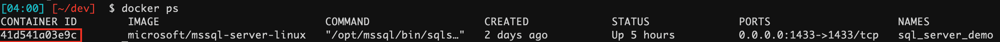

### 在 Docker 中导入示例数据库

进入 Azure Data Studio，点击 **localhost，1443** ，然后选择**恢复**。

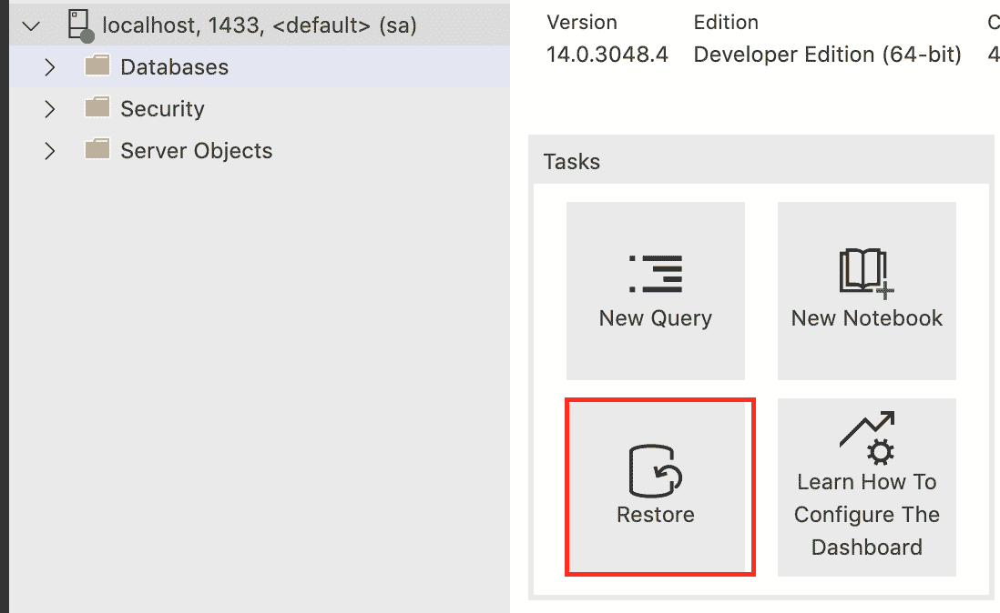

然后选择**备份文件**作为从恢复*的选择。接下来，点击*备份文件路径右边的蓝色按钮。**

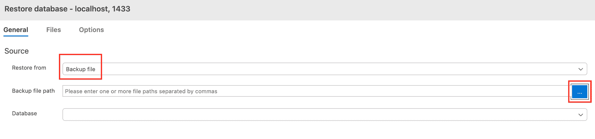

查找示例数据库文件。它应该位于

```
/var/opt/mssql/data/AdventureWorks2017.bak
```

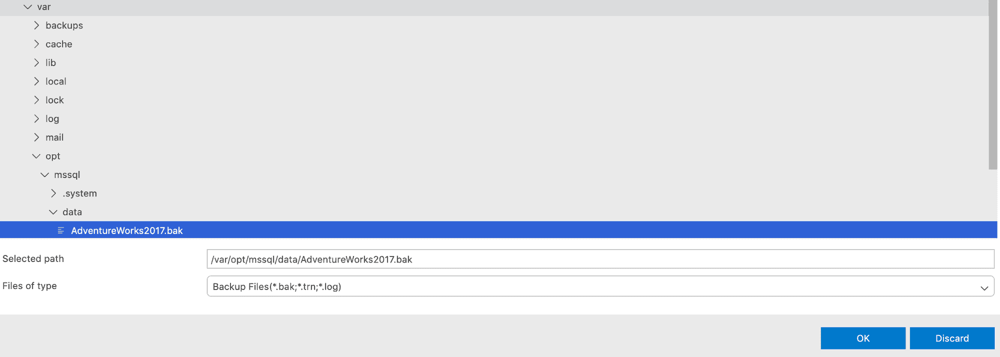

选择**恢复**。

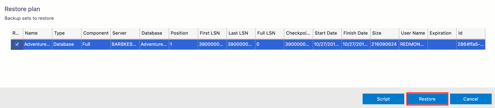

检查您的本地主机，1443。它应该生成一个名为 AdventureWorks2017 的数据库，并包含表和视图等内容。如果没有，右键单击 localhost，1443 并选择刷新。您也可以重新启动 Azure Data Studio 应用程序。

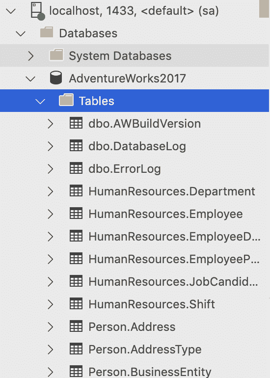

### 测试示例数据库

1.  从下拉菜单中选择 **AdventureWorks2017** 。
2.  编写一个 SQL 查询:

```
SELECT * FROM HumanResources.Department;
```

3.点击**运行**运行查询。

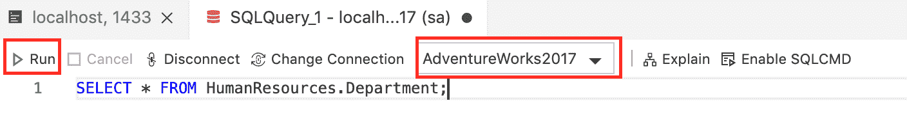

您应该得到如下输出:

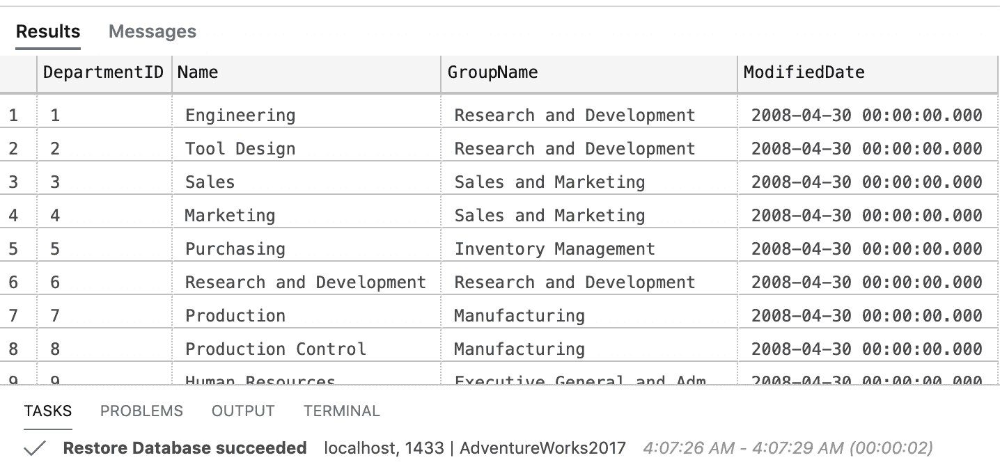

恭喜你！？？？

资源:

*   [如何在 Mac 上安装 SQL Server](https://database.guide/how-to-install-sql-server-on-a-mac/)

在 LinkedIn 上联系我[这里](https://www.linkedin.com/in/clarkngo/)

