# 如何使用 S3 将示例数据库导入 AWS RDS Microsoft SQL Server

> 原文：<https://www.freecodecamp.org/news/cjn-how-to-import-a-sample-database-to-your-aws-rds-microsoft-sql-server-using-s3/>

创建本指南是因为很难找到使用 AWS RDS MSSQL Server 试验示例数据库的方法。我希望这对你有所帮助。

如果您还没有设置您的 AWS RDS Microsoft SQL Server 和 Azure Data Studio，请先查看本指南: *[如何使用 Azure Data Studio](https://www.freecodecamp.org/news/cjn-how-to-connect-your-aws-rds-microsoft-sql-server-using-azure-data-studio/)* 连接您的 AWS RDS Microsoft SQL Server。

我们将接触以下显示的技术:

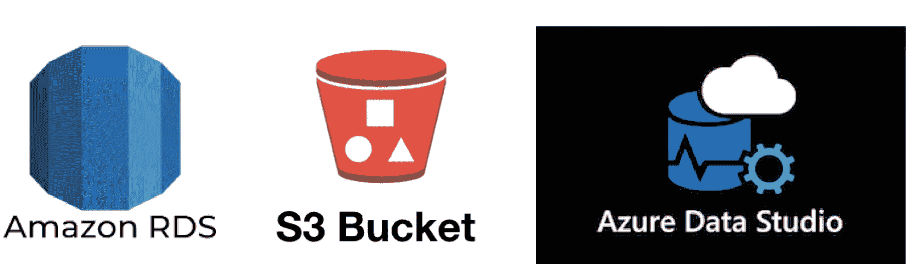

*   数据库:AWS RDS Microsoft SQL Server Express Edition
*   数据库工具和 GUI: Azure Data Studio
*   样本数据库备份副本:亚马逊 S3 桶

## AdventureWorks 示例数据库备份副本

要获得 AdventureWorks 的 OLTP 下载，请转到这个[链接](https://docs.microsoft.com/en-us/sql/samples/adventureworks-install-configure?view=sql-server-ver15)并选择任意一个示例数据库。在我的例子中，我选择`AdventureWorks2017.bak`。我们会把这个上传到 S3 桶。

## 亚马逊 S3 桶

### 创建 S3 桶

1.  创建一个桶。您可以选择任何存储桶名称(例如:yourname-sample-dbs)。

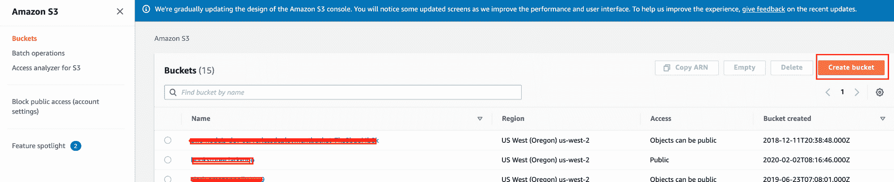

2.确保该区域与 AWS RDS 实例相同。

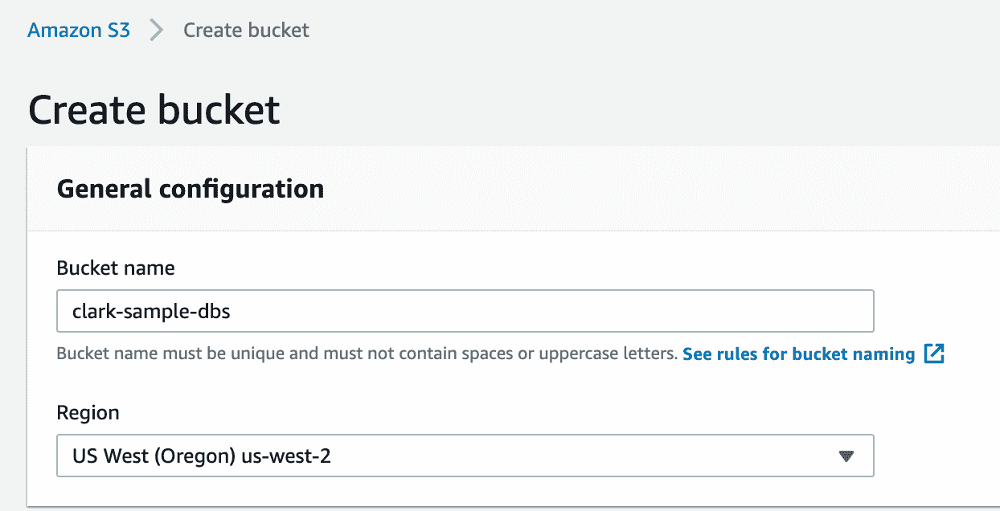

3.勾选以下复选框:

*   阻止通过*新的*访问控制列表(ACL)授予的对存储桶和对象的公共访问
*   阻止通过任何访问控制列表(ACL)授予的公共访问和对象

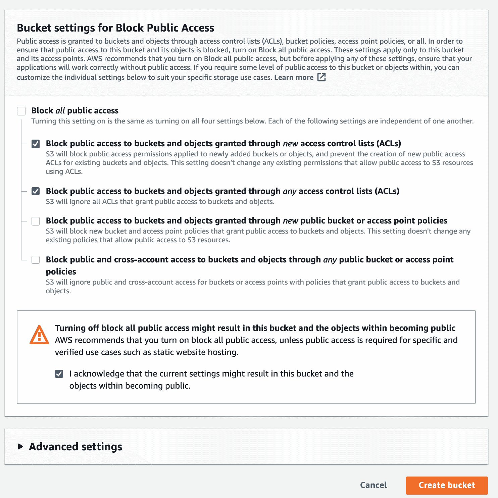

4.通过单击您创建的存储桶再次访问您的存储桶。

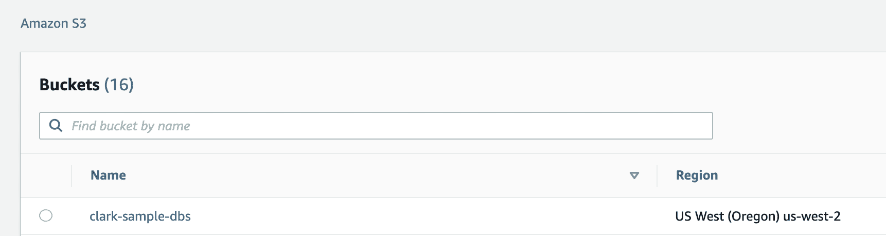

### 上传文件到 S3 桶

1.  点击**上传**。

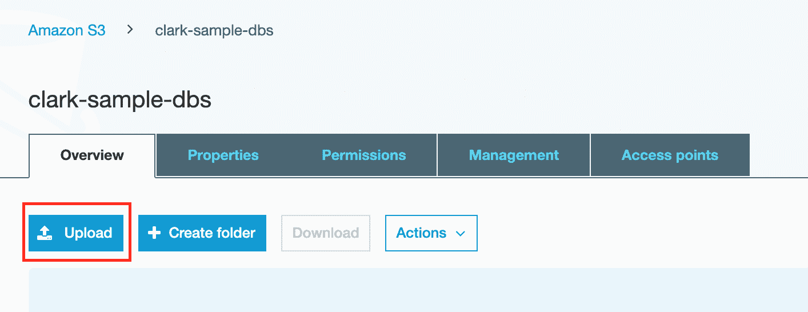

2.选择数据库备份文件。比如:`AdventureWorks2017.bak`。继续选择**下一个**并在查看部分选择**上传**。

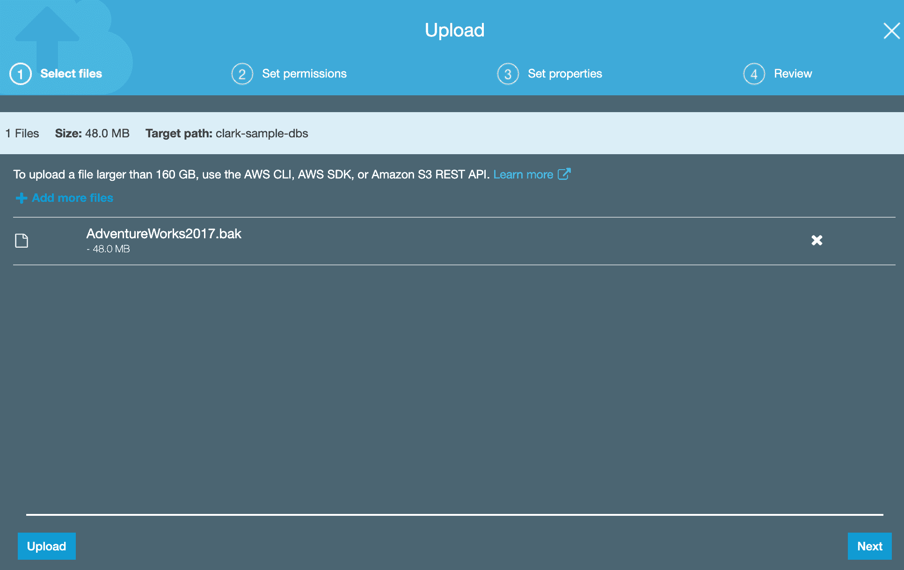

3.更新您的存储桶策略以允许访问您的 S3 存储桶。请注意，您的 ARN 将不同于我的。之后点击**保存**。

```
{
    "Version": "2012-10-17",
    "Id": "Policy1548223592786",
    "Statement": [
        {
            "Sid": "Stmt1548223591553",
            "Effect": "Allow",
            "Principal": "*",
            "Action": "s3:GetObject",
            "Resource": "arn:aws:s3:::changethis/*"
        }
    ]
}
```


## AWS RDS - MSSQL Server Express

### 为 RDS 实例创建选项组

1.  点击**选项组**，


2.创建一个选项组。选择任何名称和描述。对于引擎，它应该与您的 RDS 实例相匹配。在我的例子中，我使用了 SQL Server Express Edition，所以我选择了`sqlserver-ex`。

以下是引擎及其缩写:

*   SQL Server 企业版:`sqlserver-ee`
*   SQL Server 标准版:`sqlserver-se`
*   SQL Server 网络版:`sqlserver-web`
*   SQL Server Express 版:`sqlserver-ex`

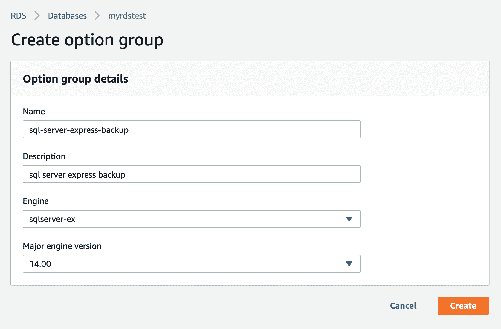

3.一旦你创建了选项组，你需要**添加选项**。

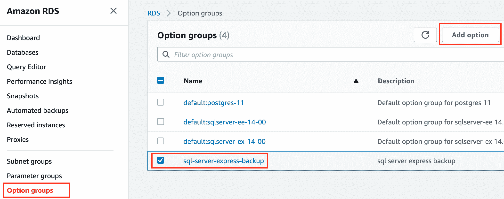

4.选择 **SQLSERVER_BACKUP_RESTORE** 作为您的选项名称。对于 IAM 角色，最好创建一个新角色。

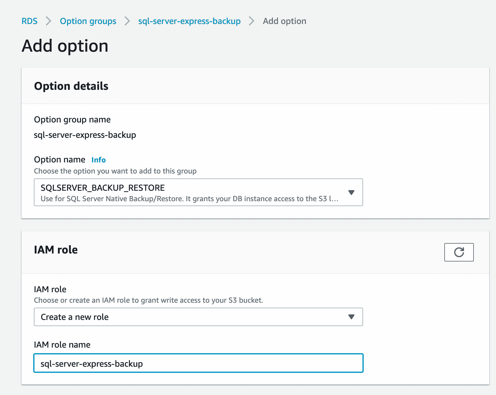

5.选择托管数据库文件的 S3 存储桶。对于调度，立即选择**。**

**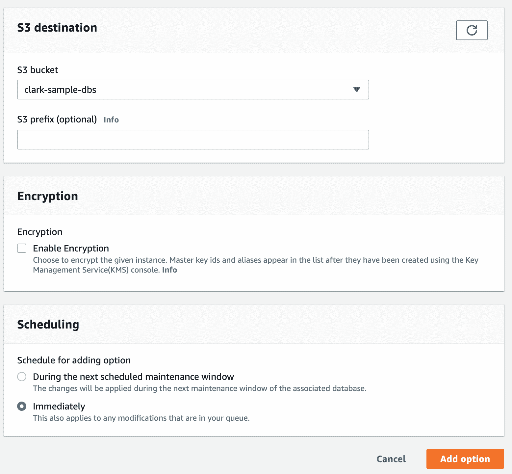**

**6.返回到您的 AWS RDS MSSQL Server 实例，并单击**修改**。**

**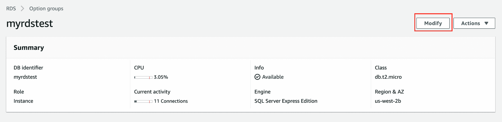**

**7.用`sql-server-express-backup`选择已创建的选项组，然后点击继续。**

**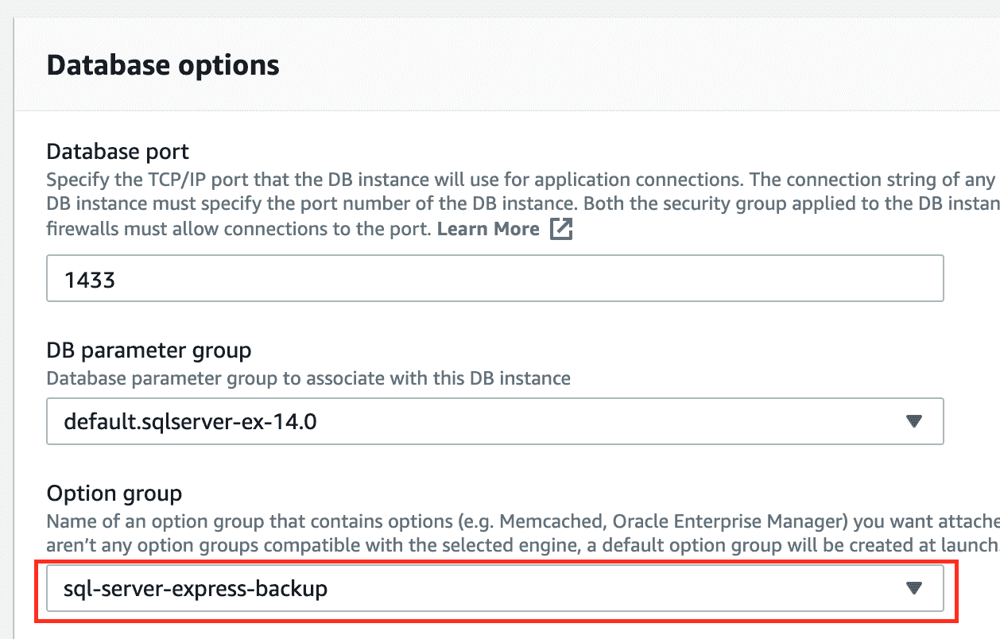**

**8.选择**立即应用**进行修改计划。**

**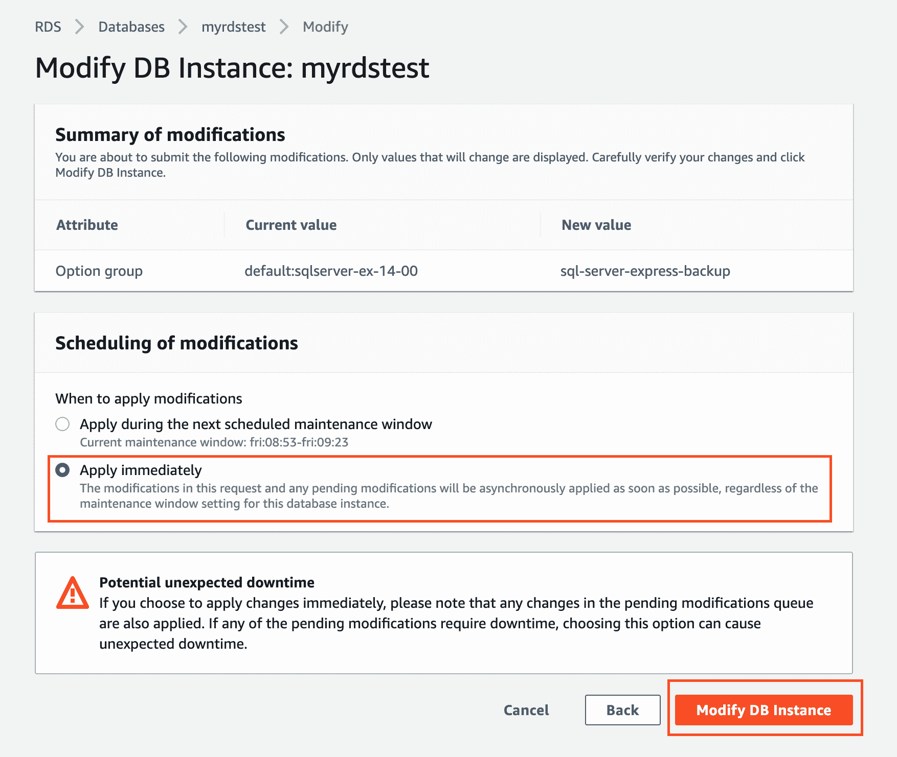**

**9.返回 AWS RDS MSSQL Server 实例页面，向下滚动并修改 *Manage IAM Roles* 。添加您在 S3 创建的 IAM 角色。对于特性，选择**S3 _ 集成**。**

**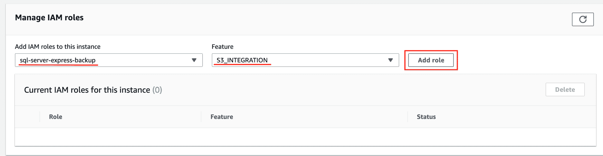****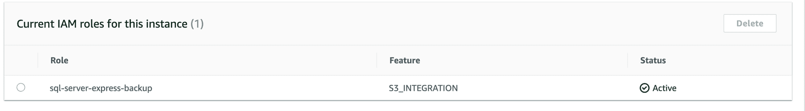**

## **Azure 数据工作室**

### **通过恢复功能将样本数据库导入 S3 桶**

1.  **在已连接的 AWS RDS MSSQL 服务器中，创建新的查询并键入以下内容:**

```
`exec msdb.dbo.rds_restore_database 
@restore_db_name='AdventureWorks-test', 
@s3_arn_to_restore_from='arn:aws:s3:::clark-sample-dbs/AdventureWorks2017.bak';`
```

**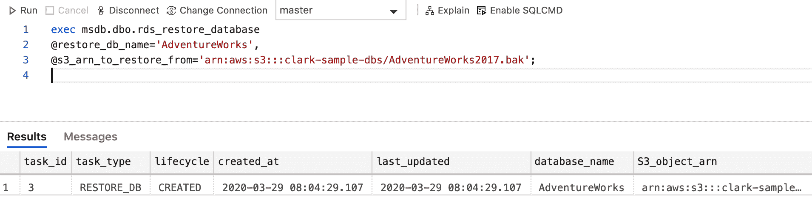**

**刷新您的 Azure Data Studio。此外，如果您的数据库没有出现或没有权限访问它，请尝试重新启动应用程序。**

**现在你完成了！干得好！？？？**

**资源:**

*   **[https://AWS . Amazon . com/premium support/knowledge-center/native-backup-rds-SQL-server/](https://aws.amazon.com/premiumsupport/knowledge-center/native-backup-rds-sql-server/)**

**在 LinkedIn 上联系我[这里](https://www.linkedin.com/in/clarkngo/)**

**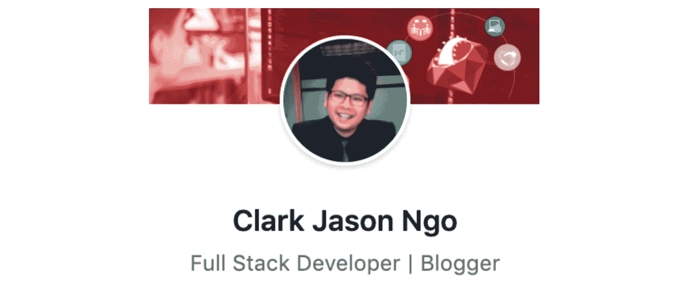**