# 如何将你的域名指向 S3 网站

> 原文：<https://www.freecodecamp.org/news/cjn-how-to-point-your-domain-to-s3-website-bucket/>

如果你在一个 S3 桶里托管一个静态网站，并且是你第一次购买域名，这个简单的指南就是为你准备的。

## 总结-你需要什么

### 亚马逊 S3

*   拥有一个与你的域名同名的 S3 桶
*   上传你网站的代码
*   允许公共访问
*   添加策略以启用 S3 GetObject
*   启用静态网站托管

### 域名提供商

*   在你的域名的 DNS 区域设置中，删除所有的 **A** 记录
*   在 DNS 区域设置中，添加 *www* 到**子域**和 **CNAME** 记录主机名中的 S3 端点

让我们一个接一个地完成这些步骤。

## 步骤 1:创建一个 S3 存储桶

创建一个 S3 桶来存放您的网站文件

首先，您需要为您的网站创建一个存储桶。您的存储桶的名称必须与您的域名相同。假设我们买了域名**www.clarkngo.net**。那么我的 S3 斗的名字也应该是 www.clarkngo.net**T3。**

配置完成后，我的端点看起来应该如下所示:

http://www.clarkngo.net.s3-website-us-west-2.amazonaws.com

转到您的 AWS 控制台并登录。选择 S3。

1.  点击**桶**
2.  点击**创建存储桶**


3.在**桶名**中添加您的域名

4.您可以选择任何**区域**

### 创建 S3 存储桶和常规配置

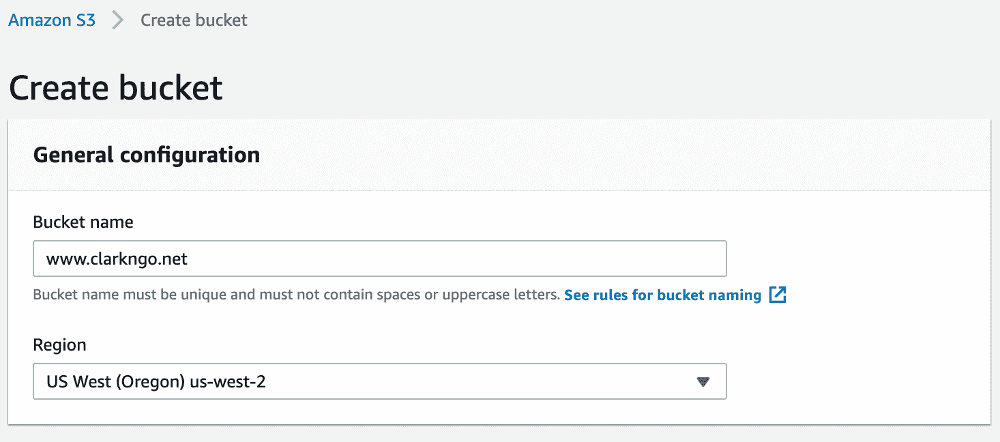

遵循下面的复选框并点击**创建存储桶**。

仅勾选以下内容:

*   **阻止通过*新的*访问控制列表(ACL)**授予的对桶和对象的公共访问
*   **阻止通过*任何*访问控制列表**授予的桶和对象的公共访问

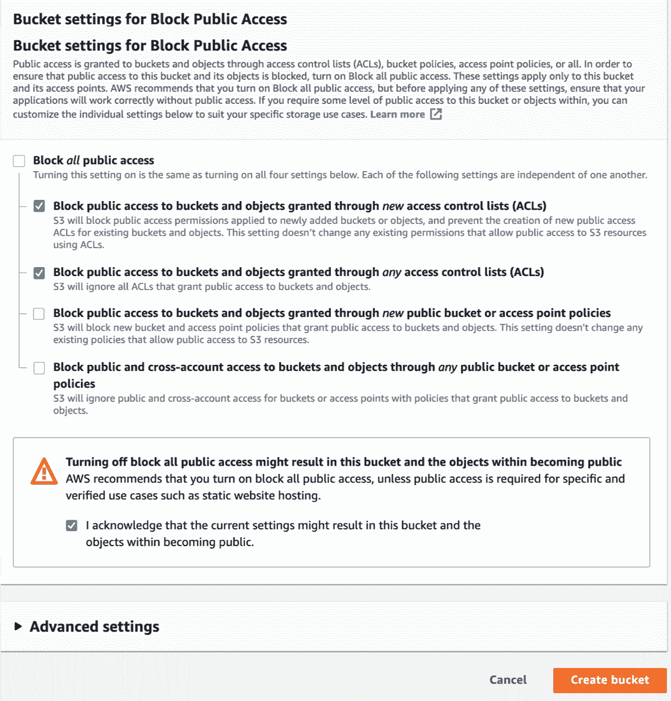

### 上传文件到 S3 桶

1.点击**总览**和**上传**。

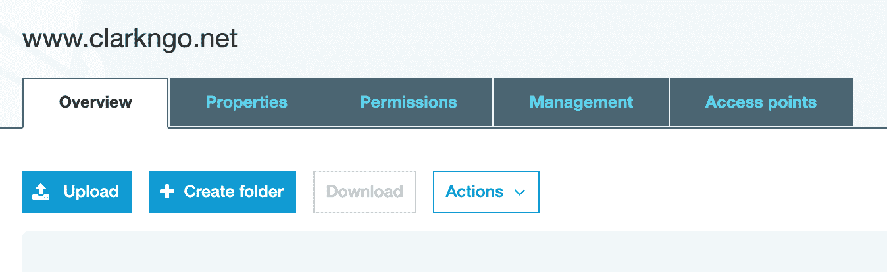

2.在**中上传您的网站文件，选择文件**

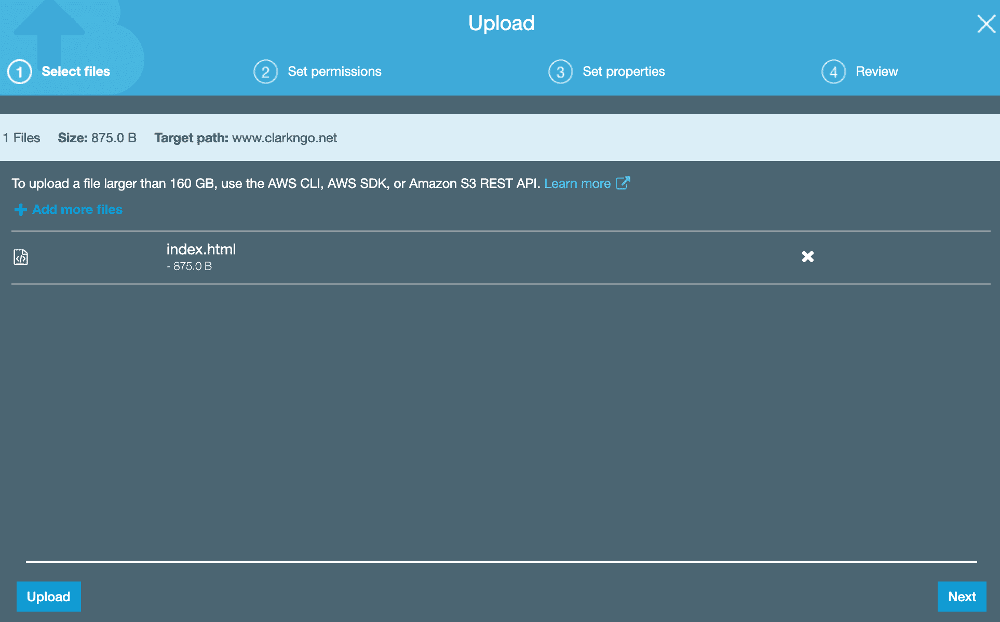

3.为**设置权限**，点击**下一个**。

4.对于**设置属性**，点击**下一个**。(默认为标准 S3。)

5.对于**审核**，点击**上传**。

### 编辑存储桶策略

1.点击**权限**，然后**斗策略**。

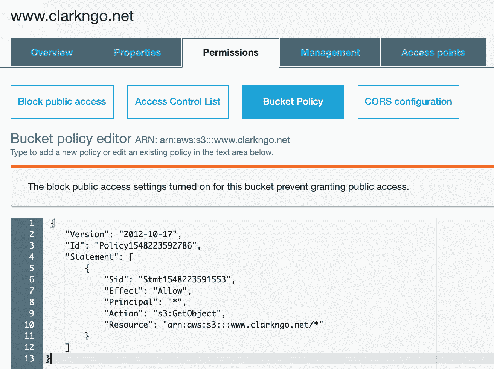

2.添加策略。(注意:对于您的网站，您将更改**arn:AWS::S3:::www . Clark NGO . net/***)

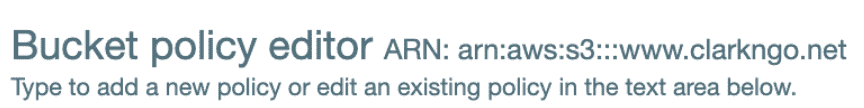

```
{
    "Version": "2012-10-17",
    "Id": "Policy1548223592786",
    "Statement": [
        {
            "Sid": "Stmt1548223591553",
            "Effect": "Allow",
            "Principal": "*",
            "Action": "s3:GetObject",
            "Resource": "arn:aws:s3:::www.clarkngo.net/*"
        }
    ]
}
```

3.点击**保存**。

### 静态网站托管

1.点击**属性**，然后**静态网站托管**。

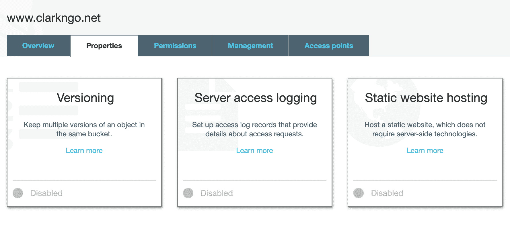

2.选择**使用此桶托管网站**。

3.对于索引文档，键入*index.html*。

4.对于错误文档，键入*index.html*。

5.点击**保存**。

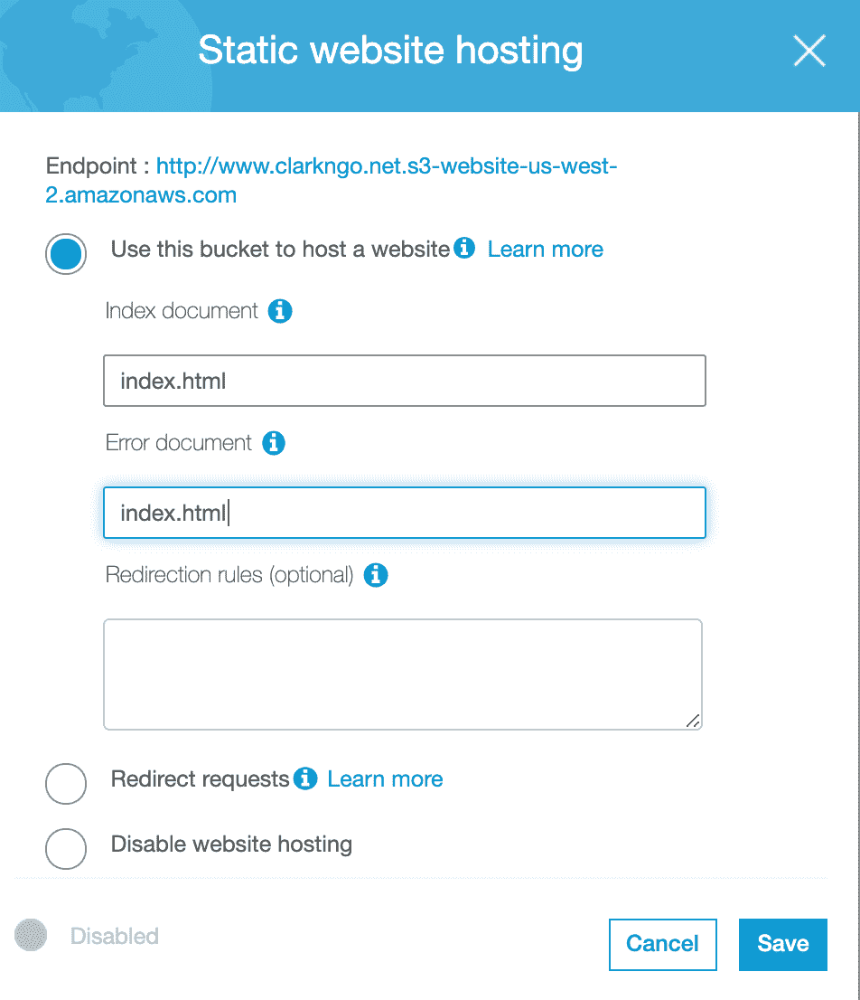

## 步骤 2:将 S3 端点添加到您的域中

### 编辑您的 DNS 区域

1.  登录到您的域提供商。
2.  在本例中，选择**名称服务器/DNS** ，然后选择**修改 DNS 区域**(或等效物)。

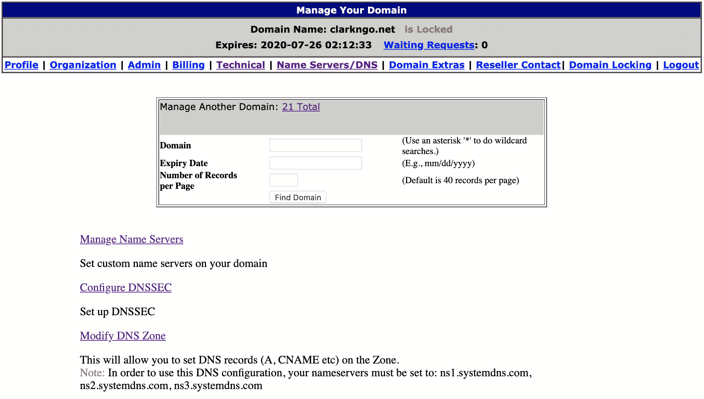

3.删除您的域中的所有 **A** 记录。通常它会有一个 404 未找到页面的默认 IP 地址。

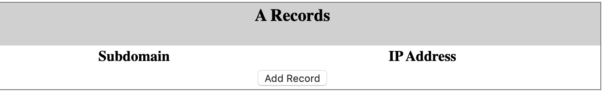

4.加一个 **CNAME** 指向 S3 桶:

*   为子域添加 **www** 。
*   将**www.clarkngo.net.s3-website-us-west-2.amazonaws.com**(S3 端点)添加到主机名。

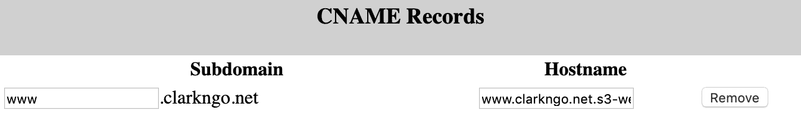

你完了！请注意，新设置可能需要一段时间才能生效。

在 LinkedIn [这里](https://www.linkedin.com/in/clarkngo/)和我联系。

