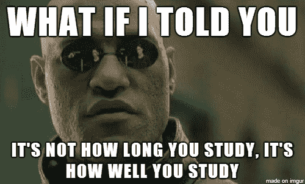
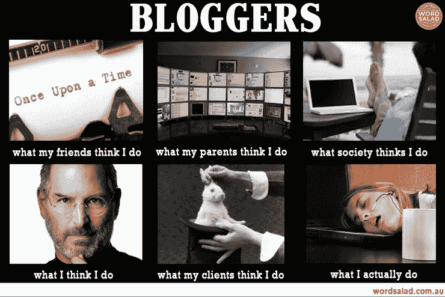
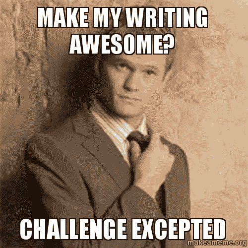
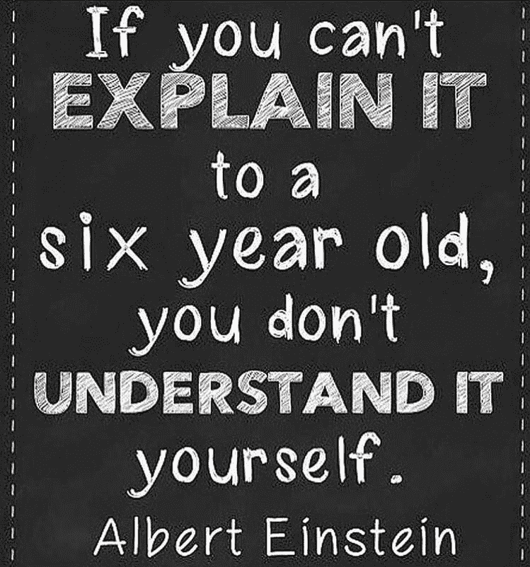
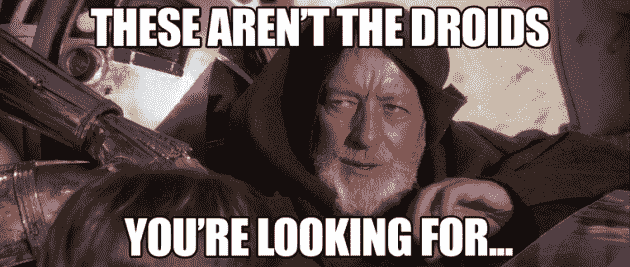
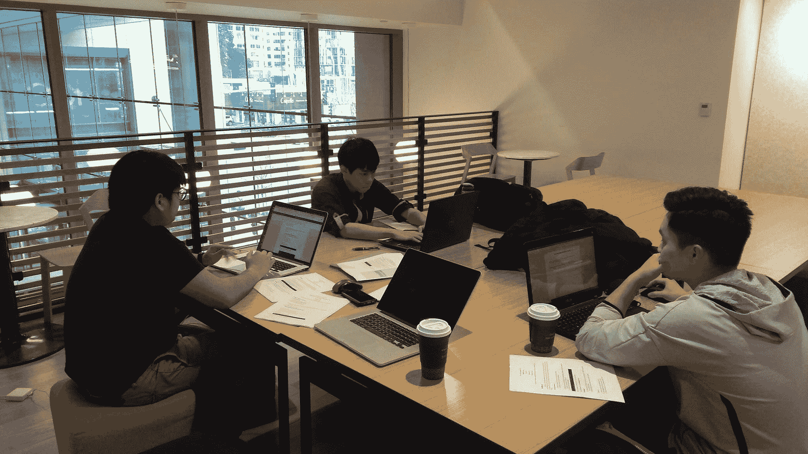
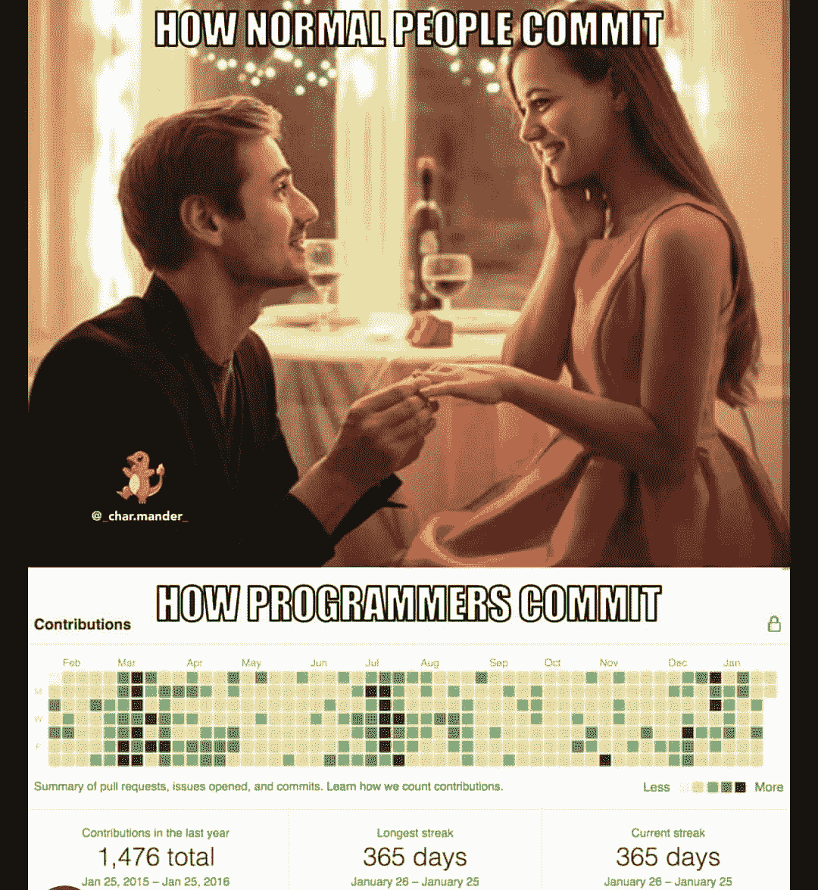

# 如何自学再学习

> 原文：<https://www.freecodecamp.org/news/cjn-how-to-teach-yourself-to-learn-again/>

这是一个关于我在公司工作了 5 年后回到学校继续攻读硕士学位的故事。通过其他人，我学到了很多东西，改善了我的日常生活。这是一个巨大的转变。

## 奋斗# 1 -学习

我理解这个概念，但它并没有留在我的脑海里。

听讲座，看视频，看课本。我得到了什么？什么都没有，有时很无聊。

我必须想出一些东西来重新训练我的大脑。

**提示 1:写作/打字增加 50%的知识记忆**。
在高中和大学期间，我经常这样做。我想大多数人都知道这个。但这仍然是一个很好的提醒。

技巧 2:写关于它的博客。这将会提高你传达想法的沟通技巧。

*你可能会说:但是等等，我不是作家，我的语法不好。=(*
我也不擅长写作。我记得我的高中和大学时光，我会让人校对我的论文，我的论文会被红墨水浸湿。哎哟。

你可能会说:有人已经写了关于插入主题的博客。
我一直相信每个人的视角是不同的。还有，这个博客真的是给自己的。别理他们。

你可以说:我很害羞。
嗯。另一个建议是，只是把它放在草案炼狱。我有 72 份由想法或笔记组成的草稿。

你可能会问:我写什么博客？
我之前发现了一个有趣的博主，他写了一些复杂的技术东西，还有一篇关于 MacBook 的 HDMI 端口的非常简单的博文。HDMI 端口博客帖子？那只是一幅图像和几个句子。

可能是:

*   图文并茂的体验。此处举例[。](https://www.freecodecamp.org/news/cjn-cashcycle-angelhack-seattle-hackathon-2018-d3f42a26ddcb/)
*   带有模因的文本和你的旅程。此处举例[。](https://www.freecodecamp.org/news/cjn-why-i-abandoned-my-mba-to-get-a-masters-in-computer-science/)
*   指南或说明。此处举例[。](https://www.freecodecamp.org/news/cjn-google-sheets-as-json-endpoint/)
*   幻灯片样式。此处举例[。](https://www.freecodecamp.org/news/cjn-understanding-hello-world-in-nodejs/)
*   纯视觉。此处举例[。](https://www.freecodecamp.org/news/cjn-bubble-sort-visualized/)

不需要做到完美，你很快就会进步。

你可能会问:你的秘诀是什么？
保持好奇。除此之外，我还有很多故事，我会继续写博客。我没有用我在语法/写作方面的弱点作为不尝试写博客的借口。我用[语法上的](https://www.grammarly.com/)来固定我的句子。

你可能会问:在哪里写博客？
现在有一个简单的博客网站，在这里你可以写下东西，并像这样有一个清晰的博客帖子，这就是 [Medium](https://medium.com/) ，一个博客网站。我曾经在那里写博客，直到他们亲切地接受我在这里，freeCodeCamp News，作为这里的作者。

技巧三:学点东西。马上教。

你可能会说:我不是专家。
事出有因。你学到了一些东西，这使你不仅仅是一个初学者。你可以说...你现在是一个有经验的初学者。

一个有经验的初学者怎么帮忙？
容易。帮助其他初学者。

它可以通过:

*   解释高层次的概念。
*   给他们指出正确的方向，让他们去查阅哪些资源。

**秘诀 4:阅读...Zzz。**
我是一个不太喜欢读书的人。刚想起来看哈利波特或者企鹅经典。

现在仔细听着，这将重新连接你的大脑来再次阅读。
首先，一个场景。给你一本书，它有一千页厚。

你的目标:阅读整本书。
*你心目中的现在是什么样子？一千页？！*
你将会发生什么:你会试着尽可能多地阅读，然后你会厌倦阅读。

## 重新连接你的大脑。

改变你的目标:每天读一章。你可能会说:它太长了，我可能无法坚持读完一章。

改变你的目标:每天读一段。你可能会说:有可能句子太多了。我不认为我能保持一致。

改变你的目标:每天读一句话。
*你可能会说:嗯。确定吗？就这些吗？我能做到。*
哈哈，你掉进我的陷阱了。这是一个绝地心灵诡计。你的大脑会被骗去读下一句话。

教训:让你的目标尽可能小。这保存了你学习的能量，减少了精神压力的可能性。

技巧 5:大声说出来！做演示。

如果你有勇气，为你的朋友和同学创造一些小对话。

这是我在一次会议上演讲的视频:

[https://www.youtube.com/embed/RxCFErjEmgs?feature=oembed](https://www.youtube.com/embed/RxCFErjEmgs?feature=oembed)

我在学校的科技俱乐部[西雅图城市大学](https://www.cityu.edu/)有很多机会练习用不同的科技术语演讲。

技巧 6:在上下班途中阅读。
*你可能会说:我晕车了。*
两个选项:

选项 1 -绝地心灵诡计。阅读 5 分钟。然后慢慢增加阅读时间，直到你感觉舒服为止。

选项 2 -带其他材料。基于能量水平研究。状态——精力充沛:读一本实体书或电子书。使用笔记本电脑/平板电脑。
状态——屏幕显示有些累:看一段教育视频。
状态——屏幕显示很累:看实体书。
状态——死眼:听播客。
状态——无能量:睡眠。

技巧 7:去当地聚会。
学习下一件令人兴奋的事情，开始与志同道合的人交流。

额外收获:在这个过程中，你可能会得到一位导师。
导师给了我很大的帮助，给了我前进的道路。
导师确实形形色色。他们可以短期或长期与你在一起，也可以是身体上的或虚拟的。

技巧 7:加入或创建一个学习小组。
你真是一石二鸟。你在社交的同时学习。

## 斗争# 2——太多的分心。

***我好内疚社交媒体。我不停地滚动。新闻提要。迷因。视频。***

有一次，我和我当地的学习小组在一起。我告诉我的朋友，我正在与社交媒体成瘾做斗争。我得到了有史以来最好的建议。

小贴士# 1 清理你的社交媒体，战胜无休止的滚动。

*谁输了:*

*   解除所有你不认识的人的好友关系。
*   同学？蝙蝠？如果你只是喜欢他们的帖子，而没有评论之类的互动，那就取消关注。你只会羡慕他们的海滩照片。
*   废话帖？取消追随。
*   太消极了？取消追随。
*   太戏剧化了？取消追随。
*   没有增值内容的页面。取消追随。

*保留谁:*

*   现在的同学
*   导师
*   知己
*   家人和亲戚

*添加/关注谁:*

*   鼓舞人心的人
*   教育和信息博主
*   提高意识的页面
*   提供与您的领域相关的提示和技巧的页面。

你得到了什么:

*   更多时间。现在，我醒来，检查我的社交媒体，我会有不到 10 个通知。
*   更有质量。我现在倾向于有更多的精力与他们互动。

小贴士# 2 让我们来点有趣的。
在我的休息时间，我看与科技有关的电影。此外，我仍然使用我的社交媒体作为娱乐，如 NBA，塞尔达传说或其他视频游戏。

接下来，我开始关注许多与我的领域技术相关的有趣页面。我的 Instagram 上有很多这样的照片。lol。

这样，我在享受乐趣的同时也在学习。

怎么会？

如果我不理解这个迷因/笑话，这意味着我缺乏知识，我会很乐意谷歌一下让它理解。

我目前在本地机器上拥有 90 多个技术迷因。哎呦！

[https://github.com/clarkngo](https://github.com/clarkngo)

**结论**

试着在日常生活中融入一些学习的小花絮。

绝地思维欺骗你的大脑。

和...这感觉像是一个很好的停止点。请随时联系我，询问更多我的学习技巧。=)

**在这里伸出手:**

[推特](https://twitter.com/djjasonclark)

[LinkedIn](https://www.linkedin.com/in/clarkngo/)

下次见！