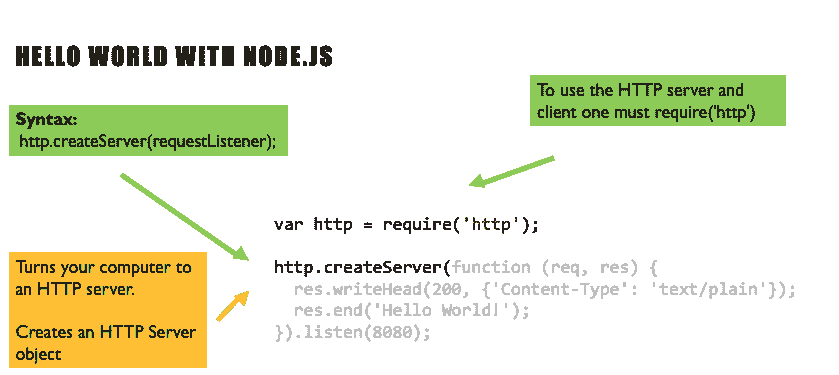
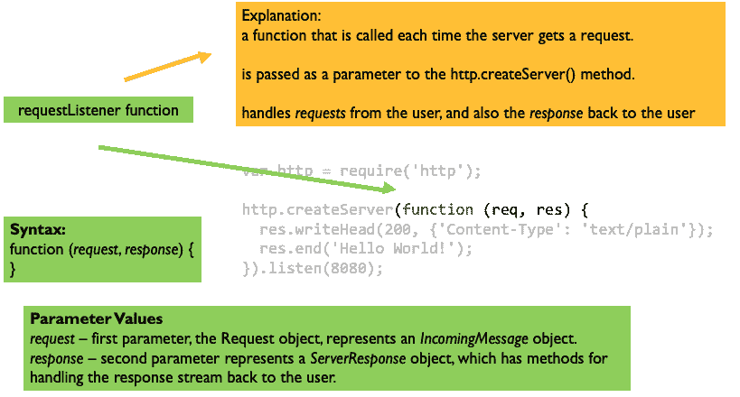
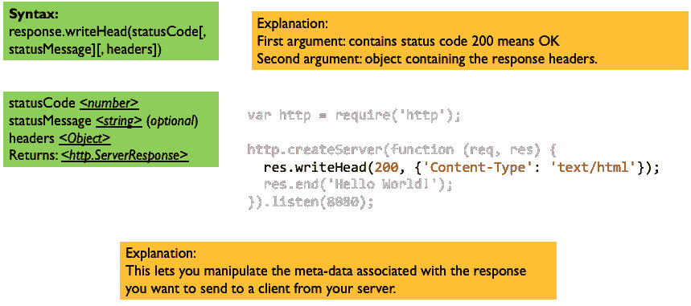
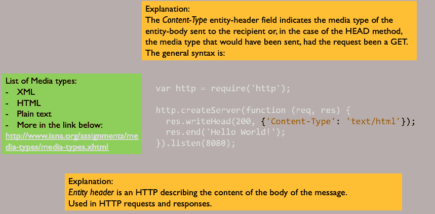
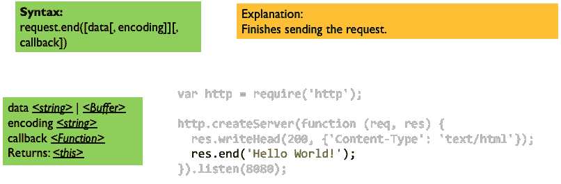
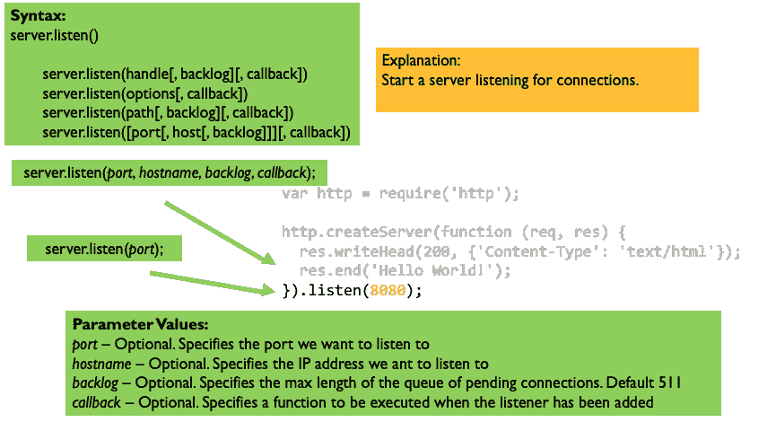

# 了解 Node.js 中的 Hello World

> 原文：<https://www.freecodecamp.org/news/cjn-understanding-hello-world-in-nodejs/>

我多么希望有一个文档能向我详细解释 Hello World 示例中发生的事情。

好吧。我没有许愿，而是开始为自己设计一个漂亮的视觉效果，我希望这也能帮助别人。

**一些基本的解释:**

**node . js 是什么？**

*   开源服务器环境。
*   它允许你在服务器上运行 JavaScript。

**Node.js 使用异步编程**

*   生成动态页面内容
*   在服务器上创建、打开、读取、写入、删除和关闭文件
*   收集表单数据
*   添加、删除和修改数据库中的数据

* * *



HTTP Server

* * *



function and parameters req and res

* * *



Status code

* * *



Content-Type

* * *



Finishing the request

* * *



Listening to the port

* * *

在你的机器上运行这个需要的东西:

1.  安装 vs code:[https://code.visualstudio.com/](https://code.visualstudio.com/)。
2.  install node . js:https://nodejs . org/en/。
3.  创建一个名为`app.js`的文件。
4.  复制下面的代码。
5.  在您的终端中，执行`node app.js`。
6.  在你的浏览器中，键入 [http://localhost:8080/](http://localhost:8080/) 并按回车键。

```
var http = require('http');

http.createServer(function (req, res) {
  res.writeHead(200, {'Content-Type': 'text/plain'});
  res.end('Hello World!');
}).listen(8080);
```

app.js

[https://www.youtube.com/embed/sTB3oP_5UXU?feature=oembed](https://www.youtube.com/embed/sTB3oP_5UXU?feature=oembed)

**参考文献:**

[https://www.w3schools.com/nodejs/default.asp](https://www.w3schools.com/nodejs/default.asp)

[https://nodejs.org/api/http.html](https://nodejs.org/api/http.html)