# 想快速了解均值栈？这里有一些文档和有用的图表。

> 原文：<https://www.freecodecamp.org/news/cjn-understanding-mean-stack-through-diagrams/>

这篇文章是基于我在西雅图城市大学的压轴戏。我的研究题目是“全栈开发的软件文档和架构分析”。我研究的目标是减少理解开源项目和全栈开发的学习曲线，我选择了 MEAN Stack。

为了更容易理解，我使用 [Lucidchart](https://www.lucidchart.com/) 创建了以下图表。这些 UML 图基于 4+1 架构视图模型:

*   餐馆类比
*   使用序列图的流程视图
*   使用序列图的场景
*   使用部署图的物理视图
*   使用包图的开发视图
*   使用类图的逻辑视图

该研究更侧重于部署、请求和响应流程。

# 平均堆栈

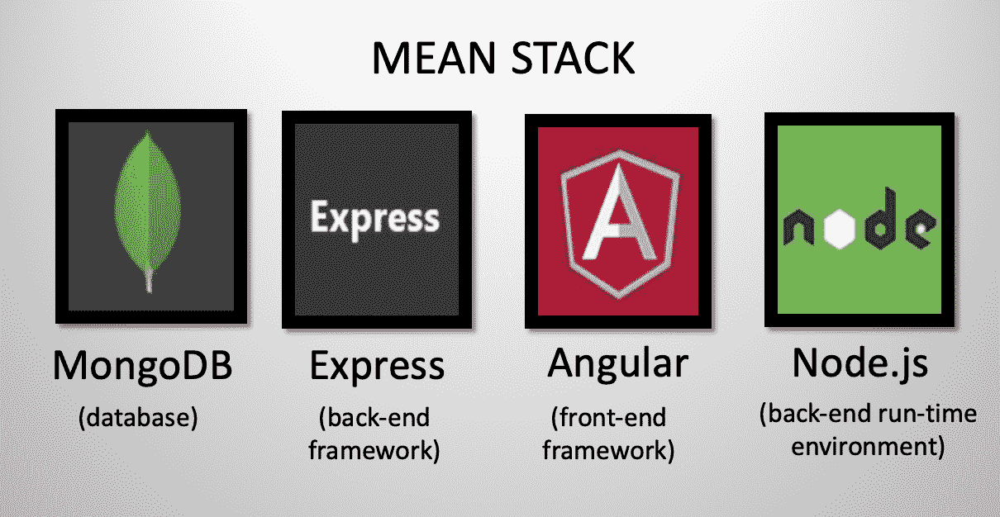

MEAN Stack 是一个全栈 JavaScript 开源解决方案。它由 MongoDB、Express、Angular 和 Node.js 组成。

其背后的想法是解决连接这些框架的常见问题，构建一个健壮的框架来支持日常开发需求，并帮助开发人员在使用流行的 JavaScript 组件时使用更好的实践。

## 使用 Node.js 的后端

Node.js 是为处理异步 I/O 而构建的，而 JavaScript 为客户端内置了一个事件循环。这使得 Node.js 比其他环境更快。然而，事件驱动/回调方法使得 Node.js 难以学习和调试。

Node.js 包括一些模块，比如 Mongoose(MongoDB 对象建模)和 Express web 应用程序框架。通过节点模块，可以实现抽象，降低了平均栈的整体复杂度。

## 具有快速框架的后端

Express 是 Node.js 的一个极简和非个人化的应用程序框架。它是 Node.js 之上的一个层，为 web 和移动开发提供了丰富的功能，而没有隐藏任何 Node.js 功能。

## 前端带角度

Angular 是一个内置于 TypeScript 中的 web 开发平台，它为开发人员提供了用于创建 web 应用程序客户端的强大工具。

它允许开发单页 web 应用程序，其中内容根据用户行为和偏好动态变化。它的特点是依赖注入，以确保每当一个组件发生变化时，与之相关的其他组件也会自动发生变化。

## 使用 MongoDB 的数据库

MongoDB 是一个 NoSQL 数据库，它以 BJSON(二进制 JavaScript 对象符号)存储数据。

MongoDB 成为 Node.js 应用程序事实上的标准数据库，使用 JSON (JavaScript Object Notation)在不同层(前端、后端和数据库)之间传输数据，实现了“JavaScript 无处不在”的范例。

现在我们已经了解了这些基础知识，让我们来看看这些图表。

## 餐馆类比

因为我想解决陡峭的学习曲线，所以我选择了一个餐馆的类比，让用户理解并记住全栈应用程序中请求和响应的过程。

客户(最终用户)通过服务员(控制员)请求他们的订单，服务员将请求交给订单窗口的人(服务工厂)。

这三个组件组成了前端服务器。服务工厂将在后端与 cook(控制器)通信。然后，厨师将在冰箱(数据库服务器)中抓取必要的配料(数据)。

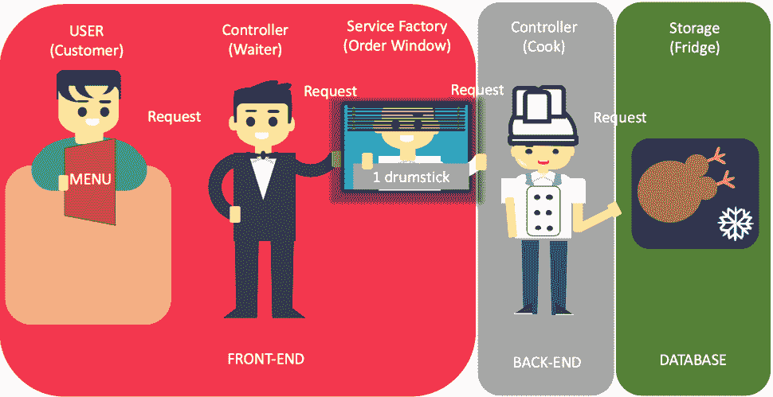

冰箱将能够向后端的厨师提供必要的材料(数据)。厨师现在可以处理数据并将其发送回前端服务工厂。

控制员(服务员)会把准备好的饭菜交给顾客(用户)。顾客现在可以享用这顿饭了(数据)。

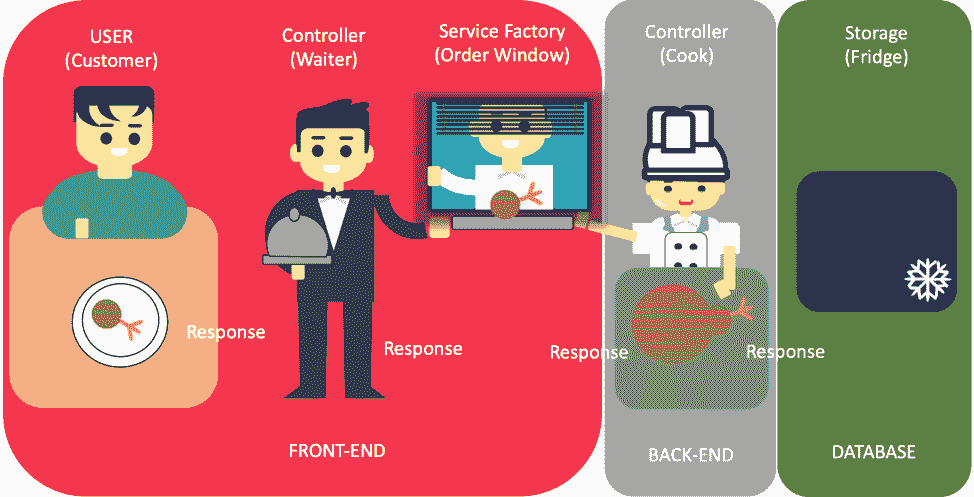

## 使用序列图的流程视图

谁使用它或它显示什么:

*   积分器
*   表演
*   可量测性

在流程视图中，我首先分别显示前端服务器和后端服务器，然后将它们与数据库服务器连接在一起。

在第一个例子中，一个 Angular 应用程序是用硬编码的 JSON 部署在一个`service.ts`文件中的(位于服务工厂中)。

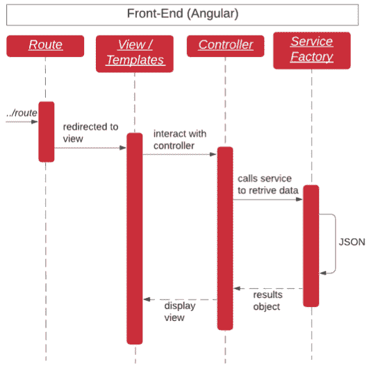

Angular 应用程序可以与第三方 API 通信，以获取数据并显示给用户。

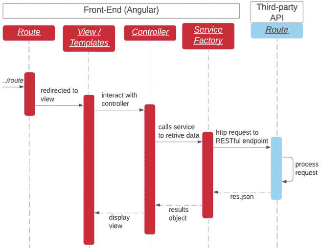

在我们的后端，Node.js 应用程序示例从一个硬编码的 JSON 开始，该 JSON 可以被处理并用作响应。

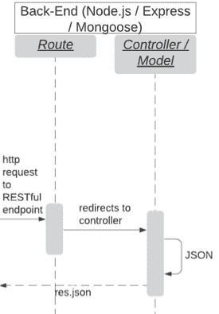

这个后端可以连接到第三方 API 或数据库服务器，以获取 JSON、处理它并将其发送回请求者。

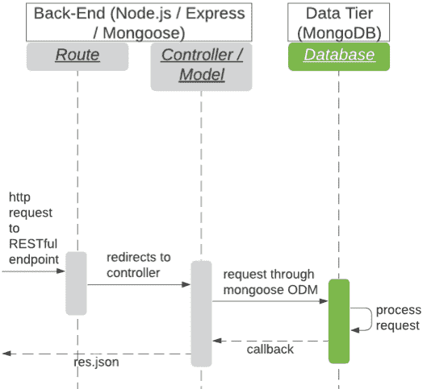

在解释了前端服务器、后端服务器和数据库服务器进程之后，我在下面展示了这三个服务器的组合:

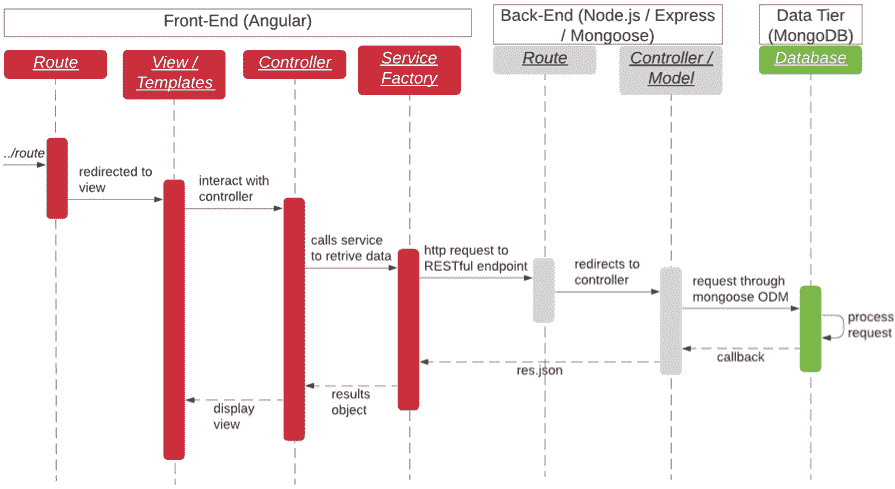

当发出 HTTP 请求时，前端将被触发，Angular 将接收请求。该请求将在 Angular 内部传递，Route 向视图/模板发送视图请求。

视图/模板将请求控制器。然后，控制器将创建一个 HTTP 请求，发送到服务器端的 RESTful(表示状态传输)端点，即 Express/Node.js。

控制器/模型将通过 Mongoose ODM 发出请求，与拥有 MongoDB 的数据库服务器进行交互。MongoDB 将处理请求，并将回调响应给 Express/Node.js。

Express/Node.js 向角度控制器发送 JSON 响应。角度控制器随后会用一个视图来响应。

## 使用序列图的场景视图

谁使用它或它显示什么:

*   描述对象之间和过程之间的交互

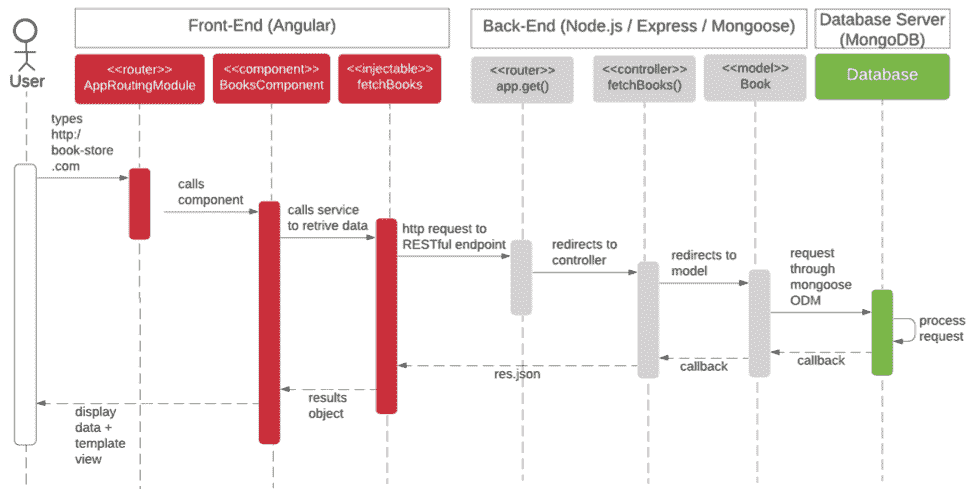

上述场景涉及用户访问书店应用程序。当用户输入 URL 时，JavaScript 就会运行，并会击中前端服务器的路由器，这就是 AppRoutingModule。AppRoutingModule 将调用 BooksComponent，后者将加载 fetchBooks 作为其依赖注入。

然后，fetchBooks 将创建一个到后端服务器的 HTTP 请求，后端服务器有一个路由器、控制器和模型来处理请求并查询数据库服务器。

数据库服务器处理查询，在后端服务器等待的情况下，将获取数据并将其作为 JSON 响应发送回前端服务器。

前端现在将有数据和模板视图显示给用户。

## 使用部署图的物理视图

谁使用它，它显示什么:

*   系统工程师
*   拓扑学
*   通信

部署图显示了 3 个服务器:前端、后端和数据库。在前端，我们需要浏览器，因为 Angular 应用是基于浏览器的 web 应用。

后端服务器在 Node.js 之上托管我们的 Node.js 和 Express。Express 将处理前端和数据库的通信。数据库服务器只包含 MongoDB。它使用 JSON 跨服务器通信。

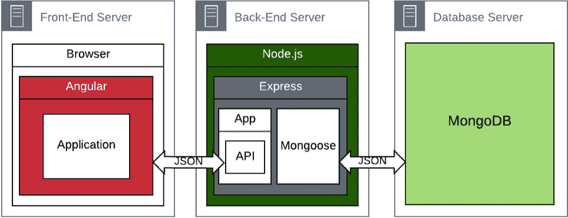

在我们第一次构建 MEAN Stack 时，我们将使用本地机器(localhost)进行本地部署，以部署前端服务器、后端服务器和数据库服务器。

我们将使用以下默认端口:Angular 端口 4200、Node.js/Express 端口 3000 和 MongoDB 端口 27017。

下图显示了 UML 符号中的全栈 web 应用程序。

进一步转向实际生产，要迁移到云中的是我们的数据库。对于 MongoDB，我选择了 MongoDB Atlas 作为云解决方案。

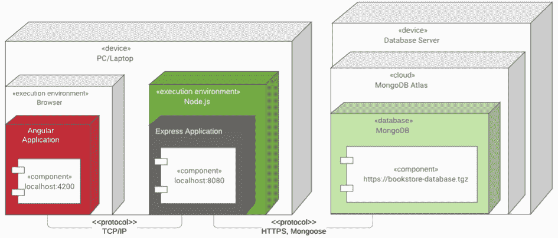

生产部署的最后一步是将我们的前端代码上传到亚马逊 S3，并上传带有 AWS 的 EC2 实例中的后端。它们都可以通过 HTTP / HTTPS 端点相互通信。

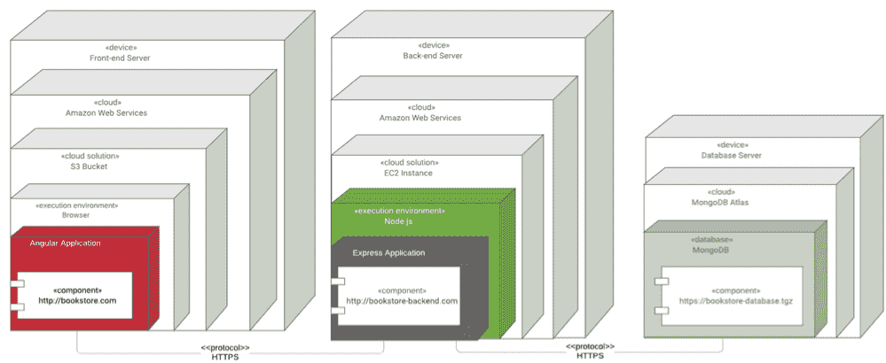

这是另一个图表，展示了我们没有使用 UML 符号的生产部署。

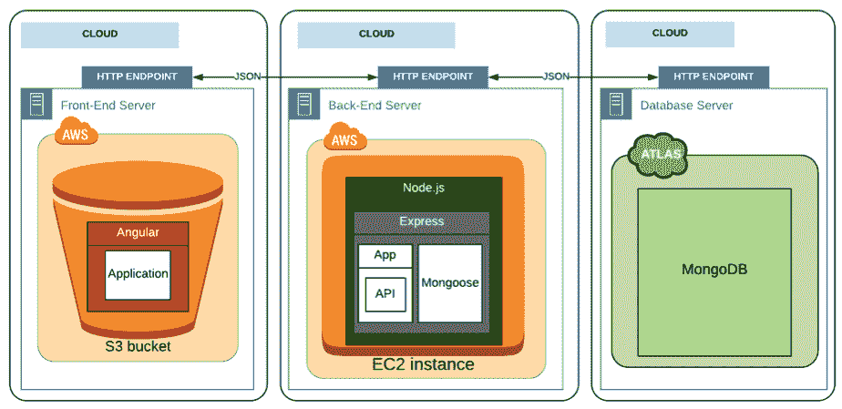

## 使用包图的开发视图

谁使用它，它显示什么:

*   方案
*   软件管理

Angular 应用程序的包视图显示每个 Angular 组件都被导入到 AppModule 中。AppModule 和 AppRoutingModule 依赖于 BooksComponent。BooksComponent 依赖于 BookDetailComponentDialog 和 ApiService。

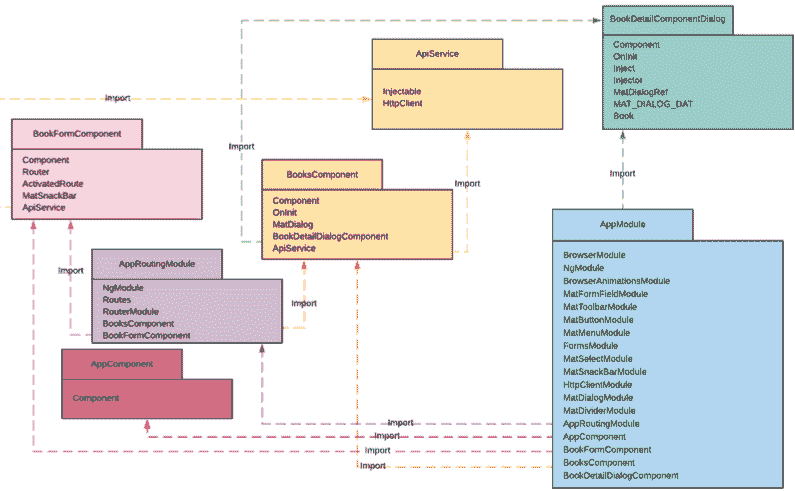

Node.js 应用程序的包视图显示，所有的 CRUD 操作(控制器)如获取所有书籍、获取一本书、更新一本书和删除一本书都是由应用程序导入的。此外，所有的 CRUD 操作逻辑都驻留在模型书中。

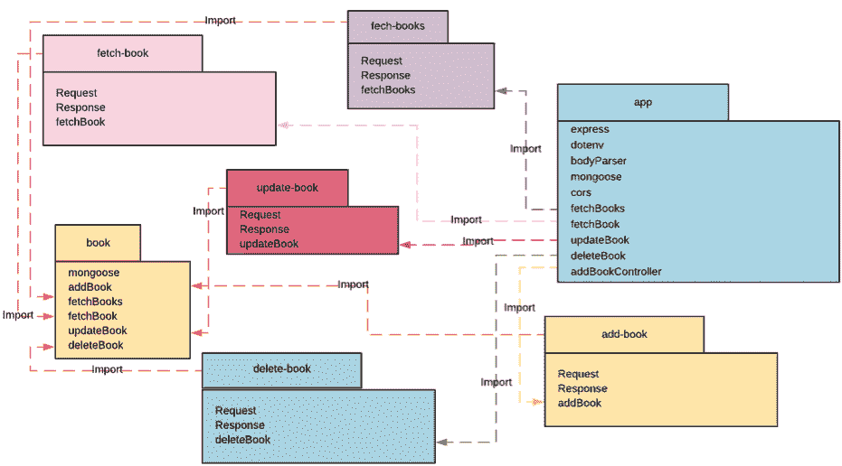

## 使用类图的逻辑视图

谁使用它，它显示什么:

*   最终用户
*   功能

书店应用程序只展示了一个名为 book 的类。类成员有:标题、isbn、作者、图片和价格。这些方法是:addBook、fetchBooks、fetchBook、updateBook 和 deleteBook。

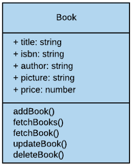

JSON 格式的样书结构。

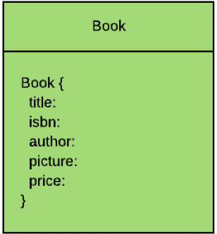

**下面是一些图表的视频:**

[https://www.youtube.com/embed/videoseries?list=PLK4sJSsw4V-fxsMJEC8YV7cPDlYxp7Ib2](https://www.youtube.com/embed/videoseries?list=PLK4sJSsw4V-fxsMJEC8YV7cPDlYxp7Ib2)

**我的 GitHub 上可用的文档:**

[clarkngo/cityu_capstoneContribute to clarkngo/cityu_capstone development by creating an account on GitHub.clarkngoGitHub](https://github.com/clarkngo/cityu_capstone)

在 [LinkedIn](https://www.linkedin.com/in/clarkngo/) 上找到我。=)