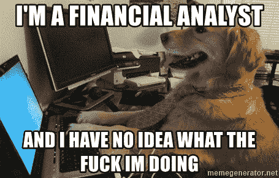
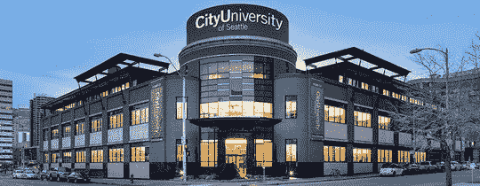
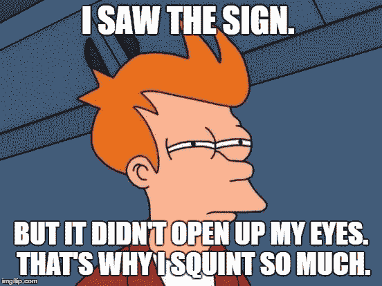
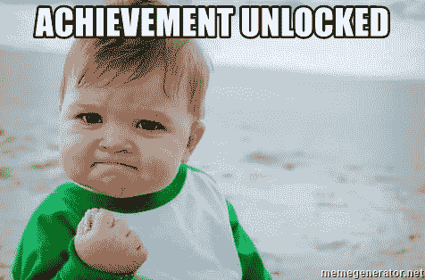
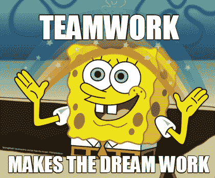
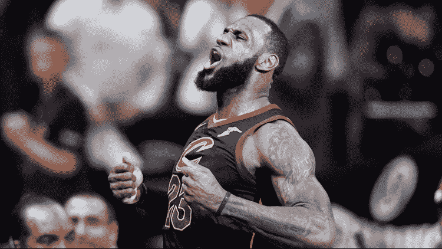

# 为什么我放弃了我的 MBA 学位去攻读计算机科学硕士学位

> 原文：<https://www.freecodecamp.org/news/cjn-why-i-abandoned-my-mba-to-get-a-masters-in-computer-science/>

### “你不能把点点滴滴串联起来向前看；你只能回头看才能把它们联系起来。所以你必须相信，在你的未来，这些点会以某种方式连接起来。”―史蒂夫·乔布斯

你有没有想过一个人是如何走到今天这一步的？嗯，这是我从自己的经历中可以讲述的故事类型。我叫克拉克，这是我的旅程。

我在菲律宾长大，进入大学前的那个夏天，我在一所学校实习，担任助理审计员，虽然不多。

### 我的大学时光

***从未有过曝光，从未有过选项***

2007 年，当我到了选择本科学位的时候，对我来说合适的学位是...有限。这并不是因为我的父母强迫我在一定程度上接受他们的选择，而是因为我所接触到的和所了解的更多。我的大多数亲戚要么经营小企业，要么从事会计或与商业相关的工作。

***猜猜现在你知道我有中国血统了吧。***

所以，我选择了会计这个专业。菲律宾马尼拉德拉萨大学的会计课程非常严格。我不得不继续重修会计科目，最终转到了金融专业。

## 我对自己说“我知道我一毕业就能找到一份与商业相关的工作。”

上金融课令人兴奋！很多领域需要学习！这些是国际银行，统计，战略，期权，衍生品，经济学，风险管理，甚至数据库管理系统，等等！

***哇！我可以在银行、保险、投资、交易、并购等领域工作。任何和钱有关的事情！***

在我的项目快结束时，我还有一次实习机会。那是在联合银行(现在的菲律宾国家银行)的财务部(交易股票/债券/货币等)。

咻。这个节目还不错。2011 年，我以高于平均水平的成绩毕业，能够兼顾高中球队排球教练的工作。

### 进入就业市场

***你在学校学到的东西在现实世界里很不一样***

从 2011 年到 2013 年，我一直在汤森路透(Thomson Reuters)工作，担任中国公司的财务分析师。我感到惊讶的是，我甚至不需要在大学里学到的技能就可以从事金融分析师的工作。这是汤森路透有自己的数据库和会计标准可循。

***等等，什么？我不需要我在大学里学到的技能？***

***嗯。好吧。工资不错，但是我不喜欢从下午 2 点到晚上 10 点的时间表。***

2013 年，我找到了一份新工作，在 S&P Capital IQ 获得了一个职位，是中国大陆和台湾公司的金融语言编辑。

***哇！薪水更高，我也喜欢我的时间表。我可以继续这样做，同时做我喜欢的事情，比如作为一名非人寿保险销售助理和自由职业音乐节目主持人赚取额外收入。***

我改变了工作场所的文化，使之更具协作性。我想了解更多。但是这些任务对我来说变得重复了。

***只是数字，数据，一遍一遍的翻译。我不再学习新东西了。***

我请求我的经理让我研究一下我们的应用程序是如何工作的。我被拒绝了。我甚至告诉他们我会在工作时间之外做这件事。但是，我还是被拒绝了。

这让我精疲力竭，我最终在 2016 年离开了我的工作。我在美国旅游了两个月，并决定攻读工商管理硕士，因为这对我的教育背景和工作经验来说是有意义的。

### 追求高等教育

***教育满足好奇心，结束无聊***

2017 年，我在[西雅图城市大学](https://www.cityu.edu/)开始了我的 MBA 学习，并决定将 IT 管理作为我的重点。在课程进行到一半的时候，我选了一门技术课程，并且爱上了它。我开始参加一些本科计算机科学课程，我想了解更多。我的教授告诉我去西雅图参加聚会。我还了解了很酷的 freeCodeCamp 平台，它帮助我了解了一些东西，并在一些黑客马拉松活动中获胜！查看这篇文章，[我的团队如何震撼 AngelHack Seattle Hackathon](https://www.freecodecamp.org/news/cjn-why-i-abandoned-my-mba-to-get-a-masters-in-computer-science/cjn-cashcycle-angelhack-seattle-hackathon-2018-d3f42a26ddcb) ，作为我关于 Hackathon 体验的博客。

City University of Seattle

***我两年做了 90+次见面会！这包括非正式聚会、学习小组、编码面试实践、讲座、研讨会、黑客马拉松和会议。***

我现在在 2019 年，目前正在攻读计算机科学硕士课程，已经参加该课程一年了。我觉得这次对我来说是最合适的。我很好奇，我喜欢做东西。但有一点不同的是，我也从我的导师、同学、社区和训练营中学到了很多。

有用的资源:

*   学习编码 [freeCodeCamp](https://www.freecodecamp.org/) ， [W3Schools](https://www.w3schools.com/)
*   阅读关于技术、[媒体](http://medium.com)和[自由代码营的新闻](https://www.freecodecamp.org/news/)
*   使用 Meetup.com 和 Eventbrite.com 的脸书、推特[和](https://meetup.com)[与社区联系](https://www.eventbrite.com/)

***计算机科学满足了我的求知欲***

### 回顾过去，这些都是我能与现在联系起来的点。

Dot 1 -在高中，我在计算机课程 Turbo Basic，Visual Basic，C++方面成绩很好。

在我的暑期工作中，我作为助理审计员对软件进行手工测试。

在我的大学时代，我很容易理解如何使用数据库管理系统。

点 4 -在我的公司时代，我是团队中解决基本 IT 问题的关键人物，甚至在他们问我们的 IT 人员之前。

还是在我的公司时代，我建立了一个电子表格，其中有大量的公式，可以将一个中文单词/短语转换成一个完整的英语句子，并且语法正确(谷歌翻译以前并不可靠)。

似乎宇宙已经给了我所有技术上的微妙迹象。

现在，我还在不断地学习，我已经接触了很多技术:

HTML5，CSS3，Sass，Bootstrap

C++，C#，Java，Ruby，Python，JavaScript，jQuery，TypeScript，Go

SQL，MySQL，PostgreSQL，NoSQL，DynamoDB

Rails，Node.js，Flask，Django，ASP.Net，React，Angular

云，无服务器，区块链

亚马逊网络服务，微软 Azure，谷歌云平台，Heroku

Wordpress

单元测试、验收测试

MVC，REST，DevOps，敏捷，测试驱动开发

## 我总是赢一些小的:

查看我的个人资料:

[http://smartandsecurecomputing.org/clarkngo](http://smartandsecurecomputing.org/clarkngo)

[https://www.linkedin.com/in/clarkngo/](https://www.linkedin.com/in/clarkngo/)

我是自由代码营新闻的作者

**我是智能和安全计算研究小组的研究员**

我是西雅图城市大学技术学院的研究生助理

我是城市大学科技俱乐部的创始人

**freeCodeCamp 认证:**响应式网页设计、数据结构和算法

**消防软管项目训练营认证:**软件工程师

## *“单靠我们能做的事很少；我们一起可以做很多事情。”–海伦·凯勒*

*不是所有的成就是我一个人完成的*

**

***三次技术会议邀请我的团队提交研究论文**:*

*“无服务器计算架构安全性和质量分析”——2019 年第 23 届信息系统安全教育年会*

*“跨越金融科技和金融专业人士之间的鸿沟:未来金融科技信息系统的区块链和云技术的基础分析”——2019 年第五届国际会计与金融会议(ICOAF)*

*“无服务器开发的软件架构分析”——2019 年美韩会议(UKC)*

***比赛:***

*第二名——2019 年西雅图 Techstars 创业周末*

*第一名——MBA 案例大赛 2018 案例研究——索尼公司的艾博:安*

*明智的决定？*

*亚军——angel hack 西雅图黑客马拉松 2018*

*这就是所有的人。下次见！*

## *梦想吧，就像你会永远活着；生活吧，就像你今天就会死去——勒布朗·詹姆斯* 

**