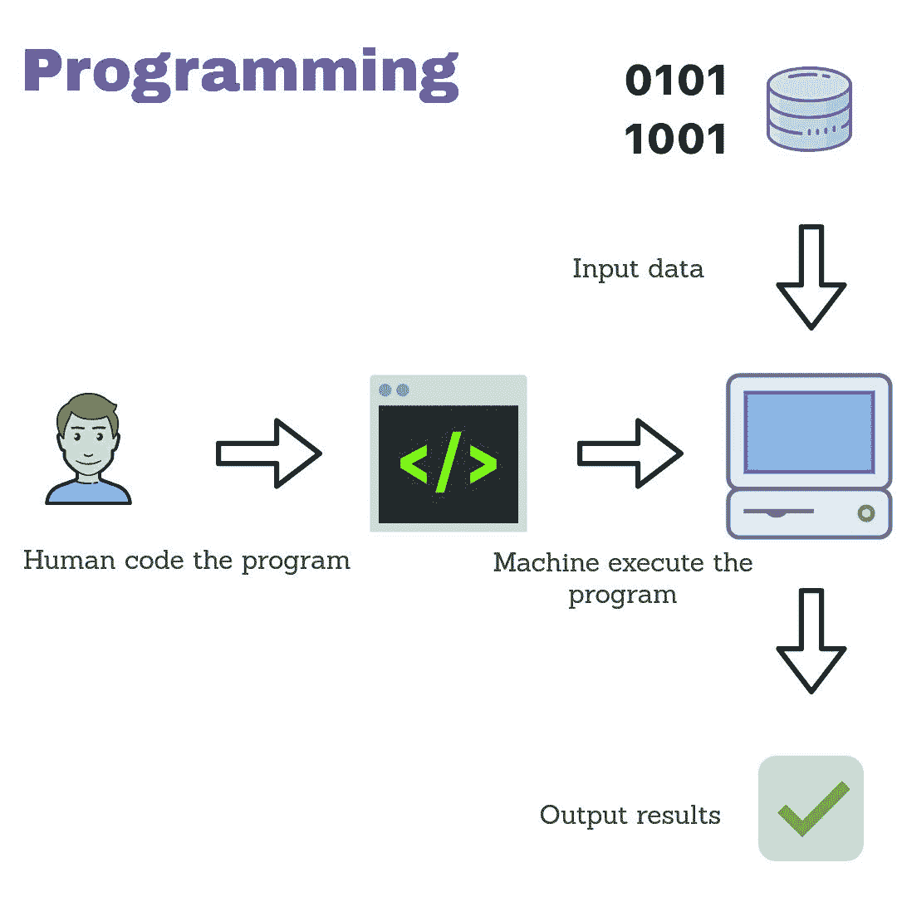
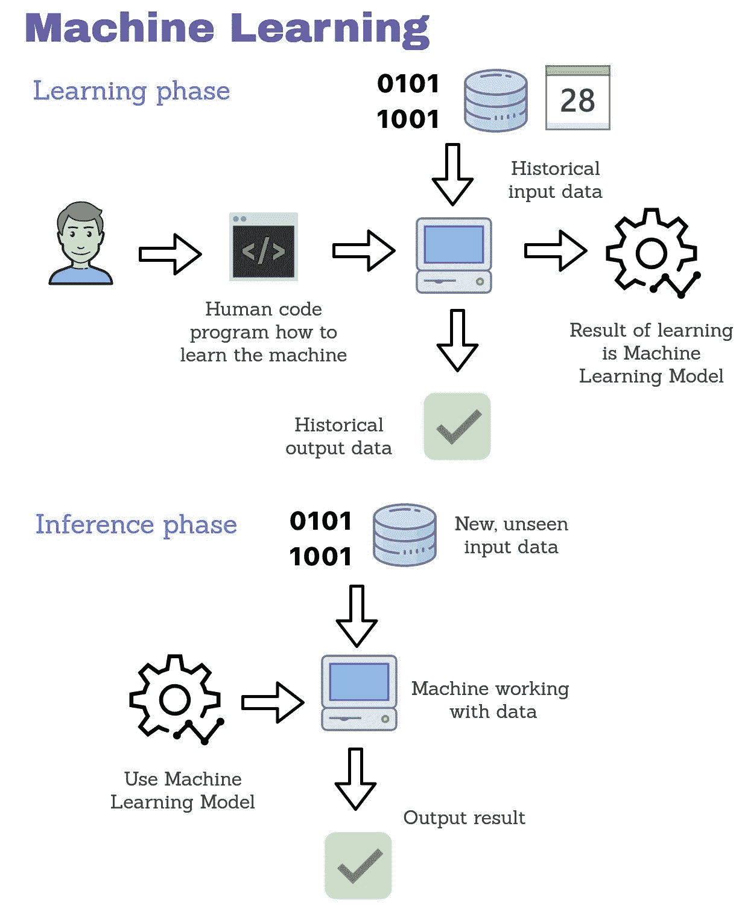
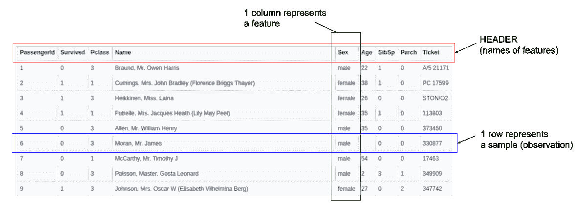
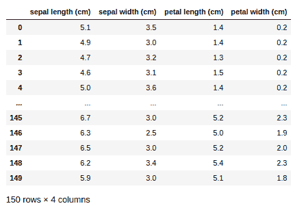
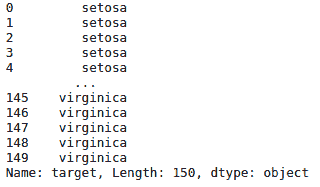
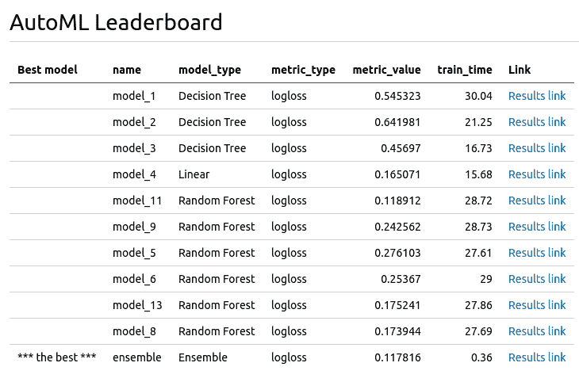
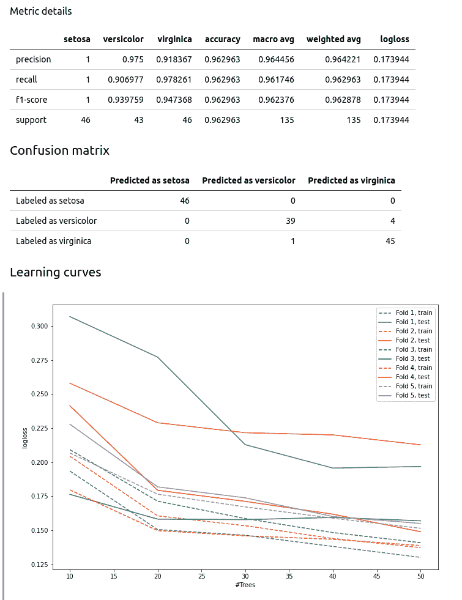

# 如何使用自动机器学习(AutoML)执行分类

> 原文：<https://www.freecodecamp.org/news/classification-with-python-automl/>

在本文中，我将向您展示如何使用自动机器学习(AutoML)来构建表格数据的分类器。别担心，我会解释所有奇怪的定义:)

这篇文章不会有什么数学(虽然我喜欢数学，但是很简洁)。我将尝试以这样的方式来展示事情，以便您可以更好地理解机器学习(和 AutoML)。

## 首先，什么是机器学习？

**机器学习(ML)** 是一个非常宽泛的话题。我们可以用它的定义来解释它是什么:教机器做一个任务。这和编程很像！

关键的区别在于，在编程中，你需要提供一个确切的配方(代码)，告诉机器应该如何执行。在**机器学习**中，你也提供代码，但是代码会告诉机器如何基于以前的例子(历史数据)进行学习。

这个代码然后被用来创建一个**机器学习模型**。机器将来做的所有动作都将由模型来计算。

这是一个非常松散的定义，但是你应该从中获得一个关于 ML 的基本认识。我准备了一些示意图，展示编程与机器学习是如何工作的。我希望它们能帮助你想象出不同之处。



In programming, humans need to provide exact steps (code) to tell a machine how it should process input data.



In Machine Learning, humans need to provide code and historical data for creating Machine Learning Models. After ML Model training, it can be used for computing outputs on unseen data.

在上面的图片中，你可以看到编程通常比机器学习简单得多(总步骤数更少，并且不需要历史数据)。

而且经常感觉编程比 ML 容易多了。但是有些情况下提供准确的程序是不可能的。

例如:图像分类任务——假设你想根据图像的内容知道图像中有什么。不可能写下所有条件来识别图片中的内容(图片可以有不同的大小、比例等等...).用肉眼看很容易，但是写一个精确的程序是不可能的。

但是用 ML 你可以创建一个能够识别图像的模型。所以我们再来看一些定义。

### 分类

分类是将标签(类别)分配给样本(数据的一个实例)的过程。进行分类的 ML 模型被称为**分类器**。

### 表列数据

表格数据就是表格格式的数据，类似于电子表格。其他数据格式可以是图像、视频、文本、文档或音频。表格格式的数据有代表样本(观察值)的行和代表特征的列。



Example of tabular data (Titanic dataset).

在本文中，我们将只分析表格数据。ML 中的典型任务是预测其中一列。这样的列被称为目标列。

## 虹膜数据集

我将向你展示如何用 AutoML 在一个叫做 **Iris** 的非常简单的数据集上建立一个机器学习模型。数据可以从很多地方下载(都是一样的数据！):

*   https://archive.ics.uci.edu/ml/datasets/Iris UCI 数据仓库:
*   我收集的从 ML 开始的好数据集:[https://github . com/pplonski/datasets-for-start/blob/master/iris/data . CSV](https://github.com/pplonski/datasets-for-start/blob/master/iris/data.csv)
*   https://www.kaggle.com/uciml/iris

**Iris** 数据集包含 150 行，每行描述一朵花。每行有 4 个特征(列)描述花的属性。这些功能是:

*   萼片长度(厘米)
*   萼片宽度(厘米)
*   花瓣长度(厘米)
*   花瓣宽度(厘米)

每朵花都有一个标签(类别),告诉我们它是哪种鸢尾。在该数据集中，有 3 个类别:

*   感觉很好
*   杂色的
*   virginica

让我们取第一行数据。我们有:

*   萼片长度= 5.1 厘米
*   萼片宽度= 3.5 厘米
*   花瓣长度= 1.4 厘米
*   花瓣宽度= 0.2 厘米
*   class = setosa

第一行告诉我们，有人取得了鸢尾类型‘setosa’，测量了它的萼片和花瓣属性，并将其保存到数据集。

这里的机器学习在哪里？假设我们有一组鸢尾花，但是我们不知道它们是什么类型(类)。我们知道如何测量萼片和花瓣的长度和宽度，但我们不能说它是什么类型或类别的虹膜。

我们可以使用机器学习来根据我们的测量对花进行分类。ML 模型将 4 个数字(我们的度量)作为输入，并将输出花的类别。

## 我们来编码吧！

我将在本教程中使用 python。所以我假设您已经安装了 python，并且知道如何安装包。

我们将需要几个包，它们都将安装 AutoML 包 [mljar-supervised](https://github.com/mljar/mljar-supervised) 。要安装它，请运行:

```
pip install mljar-supervised
```

本文给出的所有代码都可以在 [github](https://www.freecodecamp.org/news/p/49d67cd9-1642-43c6-902d-edcfd56ab013/(https://github.com/mljar/mljar-examples/blob/master/Iris_classification/Iris_classification.ipynb) 上获得。首先，让我们导入我们需要的包:

```
import pandas as pd
import numpy as np
from sklearn import datasets
from sklearn.model_selection import train_test_split
from supervised.automl import AutoML
```

然后加载数据:

```
data = datasets.load_iris()
X = pd.DataFrame(data["data"], columns=data["feature_names"])
y = pd.Series(data["target"], name="target").map({i:v for i, v in enumerate(data["target_names"])})
```

我们的数据看起来是这样的:



The `X` variable ( `print(X)` )



The `y`variable ( `print(y)` )

我们将把数据分成两组:

*   **训练** -将用于训练机器学习模型的样本
*   **测试** -样本，我们将使用这些样本来检查我们的机器学习模型如何处理(在训练过程中)看不见的数据

```
X_train, X_test, y_train, y_test = train_test_split(X, y, test_size=0.1)
```

我们将使用 90%的数据进行训练(90%*150=135 个样本)，10% (15 个样本)进行测试。

现在我们已经准备好了数据，我们可以训练机器学习模型。也许你听说过有很多 ML 算法。它们都可以用于模型训练，例如以下模型:

*   决策树，
*   逻辑回归，
*   随机森林，
*   神经网络，
*   Xgboost，

仅举几个例子。

### 我们应该使用哪个模型？哪个最好？

上述问题没有单一的答案。这完全取决于数据本身。常见的方法是尽可能多地检查，并选择性能最佳的模型。通常最简单的算法是很好的开始。

但这并不是我们问题的结束。每种算法通常都有控制模型训练方式的参数。它们就是所谓的**超参数**。应该为算法仔细设置它们。为了选择它们的值，我们还需要检查其中的一些值。

为了选择算法和超参数，我们可以使用一种可以用许多不同方式执行的验证。验证的细节我就不赘述了。我将向您展示可以处理上述所有问题的工具。就是**自动机器学习(AutoML)** 。

AutoML 可以检查许多不同的 ML 算法，并为它们调整超参数。它将搜索可用数据的最佳 ML 模型。

在现实生活中，AutoML 被用来做更多的事情，比如特性工程(为分析准备特性并构造新的特性)或者将模型作为 REST APIs 部署。

我使用的是`mljar-supervised`包中的`AutoML`(我是该包的作者)。它有一个非常简单的界面。让我们训练模型:

```
automl = AutoML(algorithms=["Decision Tree", "Linear", "Random Forest"],
                total_time_limit=5*60)
automl.fit(X_train, y_train)
```

以上两行将为我们检查 3 种不同的算法:决策树、逻辑回归和随机森林。然后它会选择最好的一个。总训练时间限制为 5 分钟(5*60 秒)。

作为运行`AutoML`的结果，您将得到如下输出:

```
Create directory AutoML_1
AutoML task to be solved: multiclass_classification
AutoML will use algorithms: ['Decision Tree', 'Linear', 'Random Forest']
AutoML will optimize for metric: logloss
AutoML will try to check about 33 models
Decision Tree final logloss 0.5453226492448378 time 30.04 seconds
Decision Tree final logloss 0.6419811899692177 time 21.25 seconds
Decision Tree final logloss 0.4569697687554296 time 16.73 seconds
Linear final logloss 0.16507067466592637 time 15.68 seconds
Random Forest final logloss 0.11891177026579884 time 28.72 seconds
Random Forest final logloss 0.24256194594421207 time 28.73 seconds
Random Forest final logloss 0.2761028104749779 time 27.61 seconds
Random Forest final logloss 0.2536702528991272 time 29.0 seconds
Random Forest final logloss 0.1752405529204018 time 27.86 seconds
Random Forest final logloss 0.17394416017742964 time 27.69 seconds
Ensemble final logloss 0.11781603875353275 time 0.36 seconds
```

运行这个 AutoML 实验的结果可以在 [github](https://github.com/mljar/mljar-examples/tree/master/Iris_classification/AutoML_1#automl-leaderboard) 上获得。当您查看由`AutoML`创建的目录时，您会看到`README.md`文件。它包含来自培训的报告:



此外，您还可以通过点击链接来检查每个已培训的模型:



要计算预测，只需运行以下代码行:

```
y_predicted = automl.predict(X_test)

print(pd.DataFrame({"Predicted": y_predicted["label"], "Target": np.array(y_test)}))
```

您将获得以下内容:

```
 Predicted      Target
0       setosa      setosa
1    virginica  versicolor
2   versicolor  versicolor
3    virginica   virginica
4   versicolor  versicolor
5       setosa      setosa
6       setosa      setosa
7   versicolor  versicolor
8       setosa      setosa
9   versicolor  versicolor
10   virginica   virginica
11  versicolor  versicolor
12   virginica   virginica
13   virginica   virginica
14  versicolor  versicolor
```

从上面可以看出，预测中有一个错误(索引为 1 的行)。ML 模型预测了类别`virginica`，但它应该是`versicolor`。ML 模型的精度为:

```
Accuracy = 14 (correct answers) / 15 (total samples) = 93.33% 
```

## 摘要

在本文中，我向您展示了编程和机器学习之间的区别。我希望你能更好地理解它。

机器学习是一个非常广泛的话题，肯定无法在一篇文章中介绍。然而，学习和应用 ML 可以给你很多满足感，所以我鼓励每个人进一步探索。

自动化机器学习通过自动化算法和超参数搜索来改进模型训练的过程。我希望 AutoML 能让很多开发者更容易使用 ML。

如果你有任何问题或者想看更多这样的文章，请告诉我。