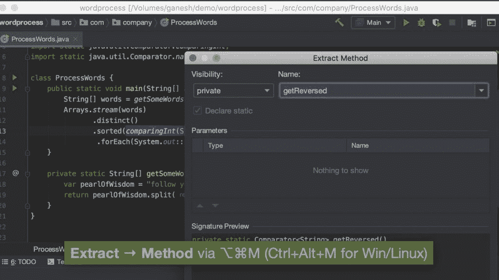

# 干净的代码解释——初学者干净编码的实用介绍

> 原文：<https://www.freecodecamp.org/news/clean-coding-for-beginners/>

> “任何一个傻瓜都能写出计算机能理解的代码。优秀的程序员会写出人类能理解的代码。”马丁·福勒

编写干净、可理解和可维护的代码是每个开发人员都必须掌握的技能。

在这篇文章中，我们将着眼于提高代码质量的最重要的原则，我会给你每一个原则的代码示例。

大多数例子摘自罗伯特·j·马丁的*干净代码*。这是一本编程经典，我建议你有时间的时候通读全文。

## 如何命名变量(以及其他事物)

> "计算机科学中只有两个难题:缓存失效和事物命名."菲尔·卡尔顿

我们不使用内存地址而用名字来代替是有原因的:名字更容易记忆。更重要的是，他们可以给你更多关于变量的信息，这样其他人就可以理解它的意义。

找到一个好名字可能需要一些时间，但它会在将来为你和你的团队节省更多的时间。我相信大多数读者都遇到过这样的情况，你在几个月后访问你的代码，却很难理解你之前做了什么。

### 如何创造有意义的名字

不要用注释来解释为什么使用一个变量。如果一个名字需要注释，那么你应该花时间重命名这个变量，而不是写注释。

> “名字应该告诉你它为什么存在，做什么，怎么用。如果一个名字需要注释，那么这个名字就不能揭示它的意图。”–干净的代码

**坏:**

```
var d; // elapsed time in days
```

这种类型的代码我见过很多次了。一个普遍的误解是，你应该用评论来隐藏你的混乱。除非有充分的理由，否则不要使用像 x、y、a 或 b 这样的字母作为变量名(循环变量是个例外)。

**好:**

```
var elapsedTimeInDays;
var daysSinceCreation;
var daysSinceModification;
```

这些名字好多了。它们告诉你什么是被测量的以及测量的单位。

### 避免虚假信息

小心那些有特定含义的词。不要将帐户分组称为*帐户列表*，除非其类型实际上是列表。这个词有特定的含义，可能会导致错误的结论。

即使类型是列表， *accounts* 也是一个更简单更好的名字。

**坏:**

```
var accountList = [];
```

**好:**

```
var accounts = []
```

### 避免干扰词

干扰词是不提供关于变量的任何附加信息的词。它们是多余的，应该删除。

一些流行的干扰词是:

*   (前缀)
*   信息
*   数据
*   可变的
*   目标
*   经理

如果您的类名为 UserInfo，您可以删除该信息并使其成为 User。使用 BookData 代替 Book 作为类名是显而易见的，因为一个类无论如何都会存储数据。

你也可以在这里阅读 Jeff Atwood 关于 SomethingManager 命名[的博文。](https://blog.codinghorror.com/i-shall-call-it-somethingmanager/)

### 使用易发音的名字

如果你不能念出一个名字，你就不能不听起来很傻地讨论它。

**坏:**

```
const yyyymmdstr = moment().format("YYYY/MM/DD"); 
```

**好:**

```
const currentDate = moment().format("YYYY/MM/DD");
```

### 使用可搜索的名称

避免在代码中使用幻数。选择可搜索的命名常量。不要对常量使用单字母名称，因为它们会出现在很多地方，因此不容易搜索到。

### 不好:

```
if (student.classes.length < 7) {
   // Do something
}
```

**好:**

```
if (student.classes.length < MAX_CLASSES_PER_STUDENT) {
    // Do something
}
```

这要好得多，因为 **MAX_CLASSES_PER_STUDENT** 可以用在代码的许多地方。如果我们将来需要把它改为 6，我们可以只改变常数。

坏的例子在读者的头脑中制造了问号，比如 7 的重要性是什么？

你还应该利用你的语言的常量命名和声明约定，比如 Java 中的 **private static final** 或者 JavaScript 中的 **const** 。

### 保持一致

遵循**每个概念一个单词**的规则。不要在不同的类中对同一操作使用*获取*、*检索、*和*获取*。选择其中一个并在整个项目中使用它，这样维护代码库的人或 API 的客户就可以很容易地找到他们正在寻找的方法。

## 如何编写函数

### 保持小规模

功能应该很小，非常小。它们应该很少是 20 行长。一个函数越长，它就越有可能做多件事情并产生副作用。

### 确保他们只做一件事

> 函数应该做一件事。他们应该做好这件事。他们应该只做这件事。–干净的代码

你的函数应该只做一件事。如果你遵循这个规则，保证他们会很小。函数唯一做的事情应该在它的名字中说明。

有时很难查看函数，看它是否在做多件事。检查的一个好方法是尝试提取另一个不同名称的函数。如果你能找到它，那意味着它应该是一个不同的函数。

这可能是本文中最重要的概念，需要一段时间来适应。但是一旦你掌握了窍门，你的代码会看起来更成熟，而且更容易重构、理解和测试。

### 在函数中封装条件

重构条件并将其放入一个命名函数中是一个让条件更具可读性的好方法。

这是我学校项目中的一段代码。这段代码负责在 Connect4 游戏的棋盘上插入一个芯片。

*isValidInsertion* 方法负责检查列号的有效性，并允许我们专注于插入芯片的逻辑。

```
public void insertChipAt(int column) throws Exception {
        if (isValidInsertion(column)) {
            insertChip(column);
            boardConfiguration += column;
            currentPlayer = currentPlayer == Chip.RED ? Chip.YELLOW : Chip.RED;
        } else {
            if (!columnExistsAt(column))
                throw new IllegalArgumentException();
            else if (isColumnFull(column - 1) || getWinner() != Chip.NONE)
                throw new RuntimeException();
        }
    }
```

如果您感兴趣，下面是 isValidInsertion 的代码。

```
 private boolean isValidInsertion(int column) {
        boolean columnIsAvailable = column <= NUM_COLUMNS && column >= 1 && numberOfItemsInColumn[column - 1] < NUM_ROWS;
        boolean gameIsOver = getWinner() != Chip.NONE;
        return columnIsAvailable && !gameIsOver;
    } 
```

如果没有该方法，if 条件将如下所示:

```
if (column <= NUM_COLUMNS
 && column >= 1
 && numberOfItemsInColumn[column - 1] < NUM_ROWS 
 && getWinner() != Chip.NONE)
```

恶心吧。我同意。

### 更少的参数

函数应该有两个或更少的参数，越少越好。尽可能避免三个或更多的争论。

参数使得阅读和理解函数变得更加困难。从测试的角度来看，它们甚至更难，因为它们需要为每个参数组合编写测试用例。

### 不要使用标志参数

标志参数是传递给函数的布尔参数。根据该参数的值采取两种不同的操作。

例如，假设有一个负责预订音乐会门票的功能，有两种类型的用户:高级用户和普通用户。您可以有这样的代码:

```
 public Booking book (Customer aCustomer, boolean isPremium) {
      if(isPremium) 
       // logic for premium book
      else
       // logic for regular booking
    }
```

旗帜论点自然与单一责任原则相矛盾。当你看到它们的时候，你应该考虑把功能一分为二。

### 没有副作用

副作用是代码的意外后果。在通过引用传递的情况下，它们可能会更改传递的参数，或者可能会更改一个全局变量。

关键是，他们承诺做另一件事，你需要仔细阅读代码，以注意到副作用。它们会导致一些讨厌的虫子。

这是书中的一个例子:

```
public class UserValidator {
      private Cryptographer cryptographer;
      public boolean checkPassword(String userName, String password) { 
        User user = UserGateway.findByName(userName);
        if (user != User.NULL) {
          String codedPhrase = user.getPhraseEncodedByPassword();
          String phrase = cryptographer.decrypt(codedPhrase, password);
          if ("Valid Password".equals(phrase)) {
            Session.initialize();
            return true; 
          }
        }
        return false; 
      }
}
```

你能看出这个功能的副作用吗？

它会检查密码，但当密码有效时，它也会初始化会话，这是一个副作用。

您可以将函数的名称更改为类似于*checkpasswordaninitializesession*的名称，以使这种效果更加明显。但是当你这样做的时候，你应该注意到你的函数实际上在做两件事，你不应该在这里初始化会话。

### 不要重复你自己

代码重复可能是软件中所有罪恶的根源。重复代码意味着当逻辑发生变化时，您需要在多个地方进行更改，这非常容易出错。

使用 IDE 的重构特性，每当遇到重复的代码段时就提取一个方法。



IntelliJ Extract Method

## 奖金

### 不要将代码留在注释中

请不要。这是一个严重的问题，因为其他人看到代码后会害怕删除它，因为他们不知道它是否有原因。注释掉的代码将会在那里保留很长时间。然后，当变量名或方法名改变时，它变得无关紧要，但仍然没有人删除它。

删了就好。即使它很重要，也有版本控制。你总能找到它。

### 了解你的语言习惯

你应该知道你的语言在间距、注释和命名方面的惯例。许多语言都有样式指南。

例如，在 Java 中应该使用 camelCase，而在 Python 中应该使用 snake_case。在 C#中，你把左括号放在新的一行，但是在 Java 和 JavaScript 中，你把它们放在同一行。

这些东西因语言而异，没有通用的标准。

以下是一些对你有用的链接:

*   [Python 风格指南](https://www.python.org/dev/peps/pep-0008/)
*   [谷歌的 Javascript 风格指南](https://google.github.io/styleguide/jsguide.html)
*   [谷歌 Java 风格指南](https://google.github.io/styleguide/javaguide.html)

# 结论

干净的编码不是一夜之间就能获得的技能。这是一个需要养成的习惯，只要你写代码的时候牢记这些原则并应用它们。

感谢您抽出时间阅读，希望对您有所帮助。

如果你有兴趣看更多这样的文章，可以订阅我的[博客](http://erinc.io/)。