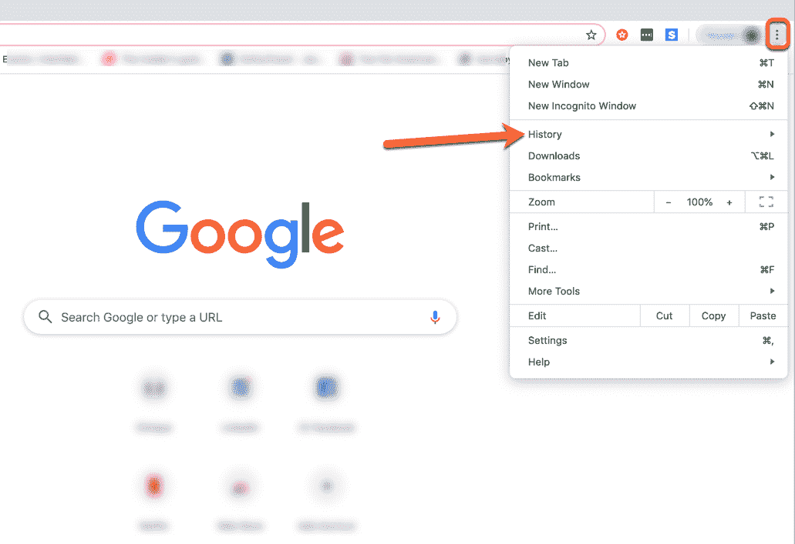
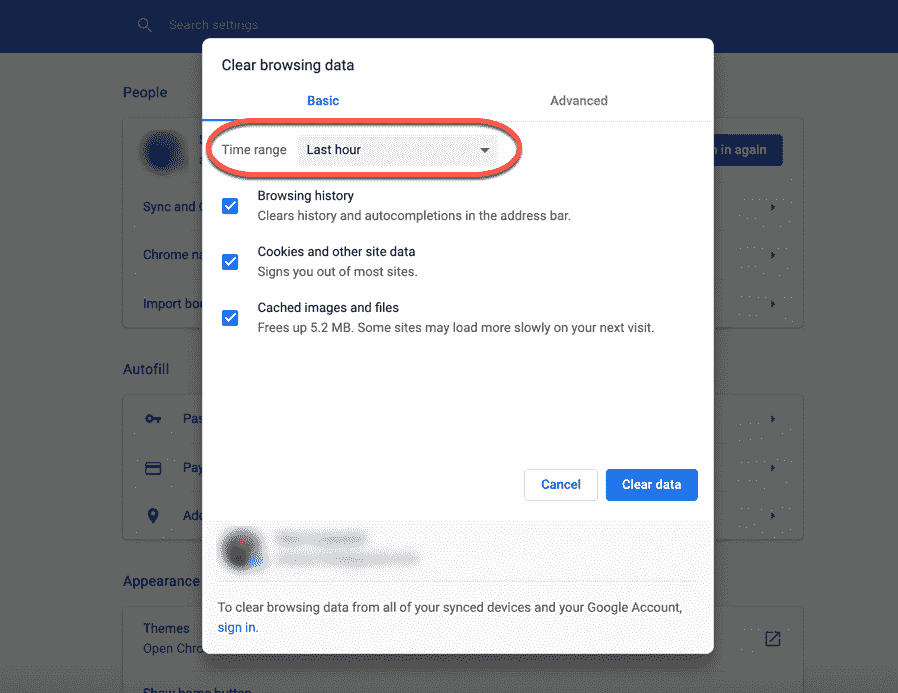
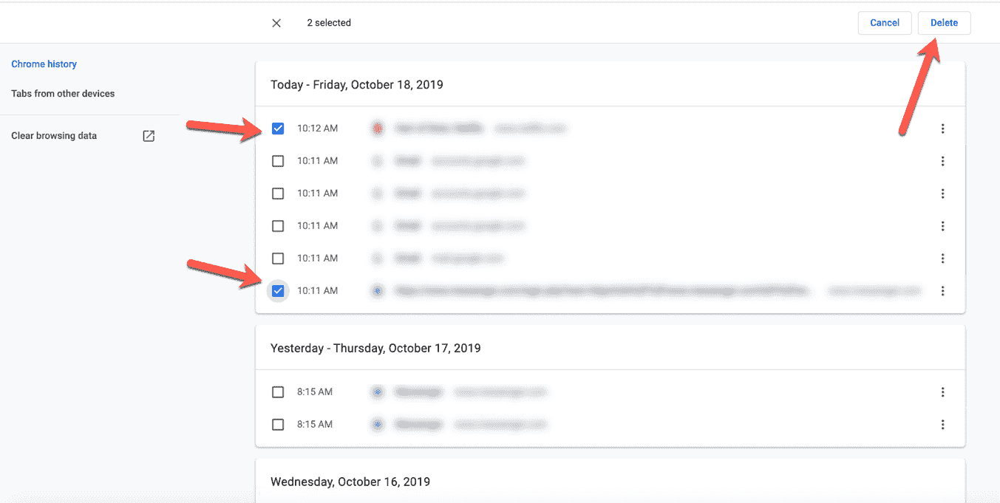
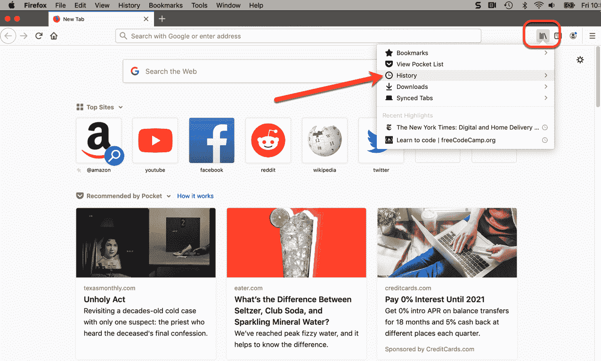
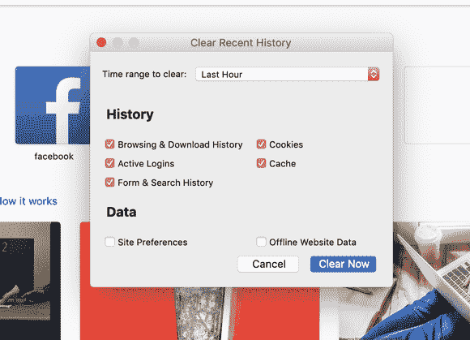
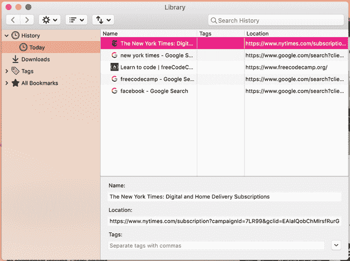
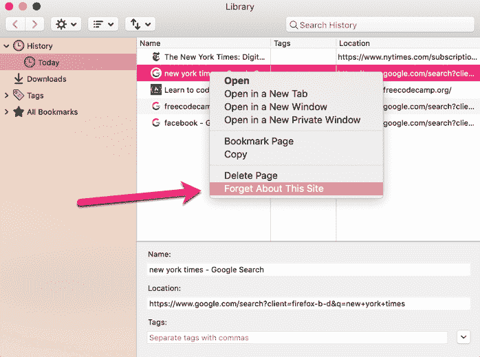
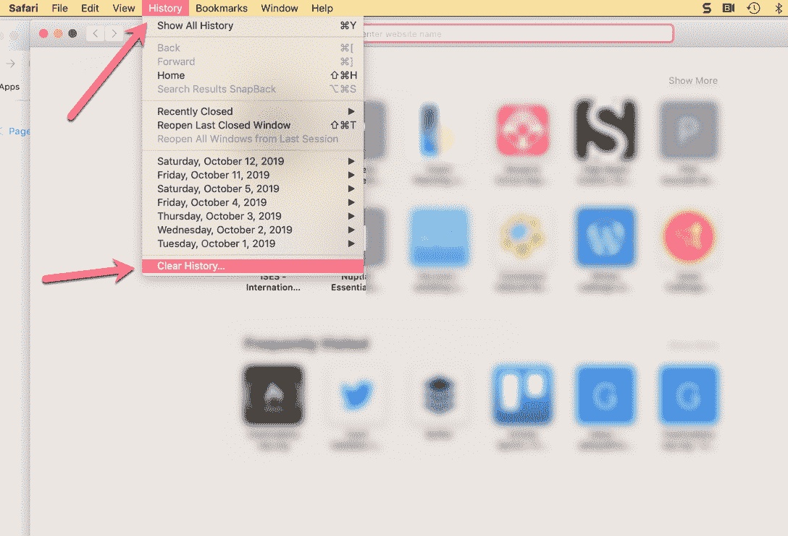
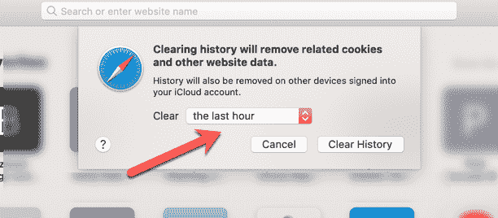
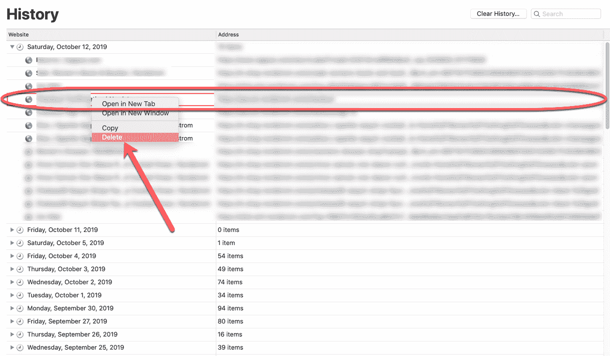

# 如何清除你的浏览器历史记录——删除你在 Chrome、Firefox 和 Safari 中的浏览历史记录

> 原文：<https://www.freecodecamp.org/news/clear-history-how-to-delete-your-browsing-history-in-chrome-firefox-and-safari/>

你试过查看自己的浏览历史吗？也许你想检查一下你昨晚查找的那家餐馆(但忘记了它的名字)，或者你想重访几天前浏览过的一个旅游网站。它会非常有用。

但是，另一方面，如果你不想在电脑上留下你访问过的网站的记录，该怎么办呢？也许你的配偶或伴侣会发现你一直在寻找他们的生日礼物(也是最后一刻！)，或者你访问了一个你宁愿保持隐私的网站。

你也可以使用公共电脑，只是不想让陌生人查看你的历史。很公平。

不管是什么原因，知道如何查看、清除或删除你的浏览历史都是一个好主意。在各种不同的浏览器中这样做是很容易的。所以我们来看看。

## 如何在 Chrome 中清除你的历史记录

Chrome 将你过去 90 天访问过的网站存储在你的浏览历史中。如果你使用匿名模式(你可以在这里了解更多)，它不会存储这些网站。但你在普通 Chrome 浏览器中浏览的任何内容都会出现在那里。

另外，**需要注意的一点**:如果你已经同步了所有设备(笔记本电脑、iPhone、平板电脑等等)，所有设备都可以看到该历史记录。同样，当您清除它时，它将从所有设备中被清除。

### 清除您所有的浏览历史

在你的电脑上，打开 Chrome 浏览器。在右上角，你会看到三个垂直的点。单击它们打开菜单，并从选项中选择“历史”选项卡。

How to get to your browsing history in Chrome

一旦你点击这个选项，你会看到你最近浏览历史的摘要。如果你只是想检查一下，很好。

Your browsing history ready for your viewing (or deleting) pleasure.

如果要清除，只需点击左边的“清除浏览数据”标签即可。您将进入此屏幕(如下)，在此您可以选择清除过去一小时、24 小时、7 天、4 周或所有时间的数据。选择您的时间范围，以及您想要清除的类别:

Click the dropdown ("Time range") to choose your time frame. Check and uncheck boxes depending on your needs.

从上面的截图可以看出，Chrome 不仅存储了你的浏览历史，还存储了你访问的网站的 cookies 和缓存的文件。

一旦你清除了这些数据，它就不会出现在你的历史中。如果你开始在地址栏中输入，Chrome 也不会自动完成这些网站。

### 清除你的部分历史

如果您只想清除几个站点，但想保留其余的站点，该怎么办？这也有可能。

打开 Chrome，点击那三个竖点，选择“历史”。目前为止都是同样的过程。现在，在历史记录的第一页上，不要点击左侧的“清除浏览数据”,只需选择/勾选您要删除的内容:

Just select the sites you'd like to delete.

一旦你选择了所有你想清除的网站，只需点击右上角的“删除”。只有这些网站将从您的历史记录中删除。

## 如何在 Firefox 中清除历史记录

为了清除你在 Firefox 中的历史记录，这个过程与 Chrome 非常相似——只是按钮看起来有点不同。

### 清除所有浏览历史

打开 Firefox 浏览器，点击右上角的“图书馆”标签(看起来像几本书靠在一起):

Once you select "History", a new window will open up in the same spot.

选择“历史记录”选项卡，然后从菜单中选择“清除最近的历史记录”选项，该选项将替换之前的选项。

您将看到弹出的这个框:

Be ready to delete it all!

你会注意到有一个“清除时间范围”下拉菜单。您可以清除过去一小时、两小时、四小时、今天或任何时间的历史记录。

与 Chrome 类似，你也可以选择想要清除的信息。

现在，做好准备:如果你选择右下角的“立即清除”,它会清除你所有的历史记录，不会问任何问题。

### 清除你的部分历史

如果您想选择清除哪些位，过程会有所不同。点击相同库标签，选择“历史”,然后点击底部的“显示所有历史”。

这个框会弹出:

You can select what history you'd like to see (today, yesterday, and so on) via the left side bar.

然后你会看到你的历史。如果你只有几个站点，你可以在你想要删除的站点上点击 ctrl 键(或者右键)。

当你按住 ctrl 键并点击该站点时，会弹出一个菜单。只需从菜单中选择“忘记这个网站”, Firefox 就会将其从历史记录中删除。

Ctrl+click (or right click) to select a site. One at a time.

与该站点相关所有历史记录(cookies、缓存、浏览和登录等)都将被删除。万岁！

## 如何在 Safari 中清除历史记录

最后，让我们看看如何在 Safari 中清除历史记录。

### 清除您的所有浏览历史

同样，这个过程与 Chrome 和 Firefox 非常相似。但在 Safari 中，你只需点击浏览器菜单顶部的“历史”标签。从下拉列表中，选择“清除历史记录”:

Easy as pie - just click the "History" tab and then "Clear history".

将弹出一个对话框，询问您是否要清除所有历史记录(包括缓存等)，以及清除的时间范围(最后一小时、今天、今天和昨天，所有历史记录)。

Similar options.

选择适当的选项，然后单击“清除历史记录”。嘣，历史为那段时间(或所有时间)清零。

### 清除你的部分历史

同样，您可能不想清除所有内容。只有一个网站。完全可行。

单击“历史记录”选项卡，并选择下拉列表顶部的“显示所有历史记录”。你浏览过的所有网站都会按天列出。

如果您想选择一个要删除的特定站点，只需按住 ctrl 单击(或右键单击)该站点，并从下拉列表中选择“删除”:

Similar to Firefox - ctrl+click or right click to select sites to delete.

只有该网站将从您的浏览历史记录中删除。

现在你知道如何从现在使用的一些主要浏览器中删除你的浏览历史——全部或部分。