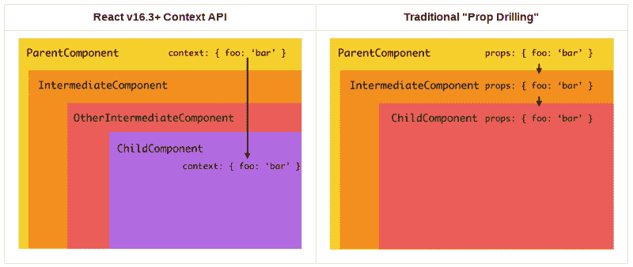
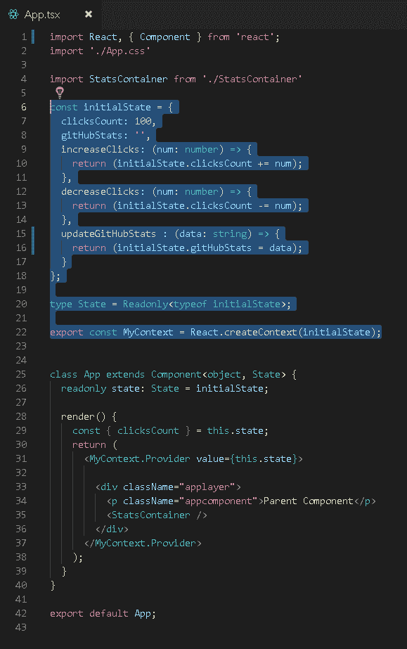
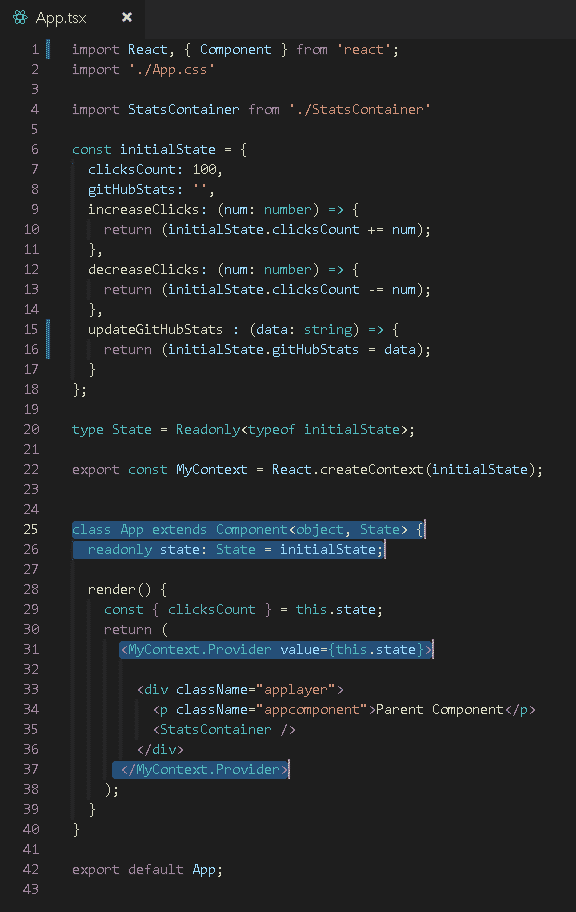
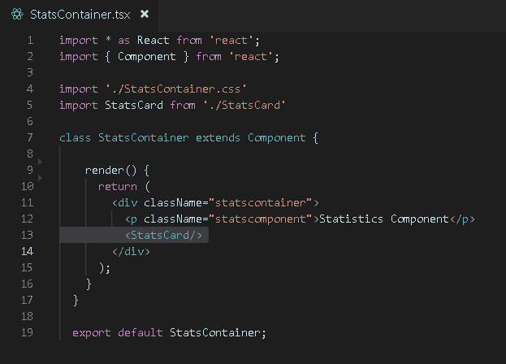
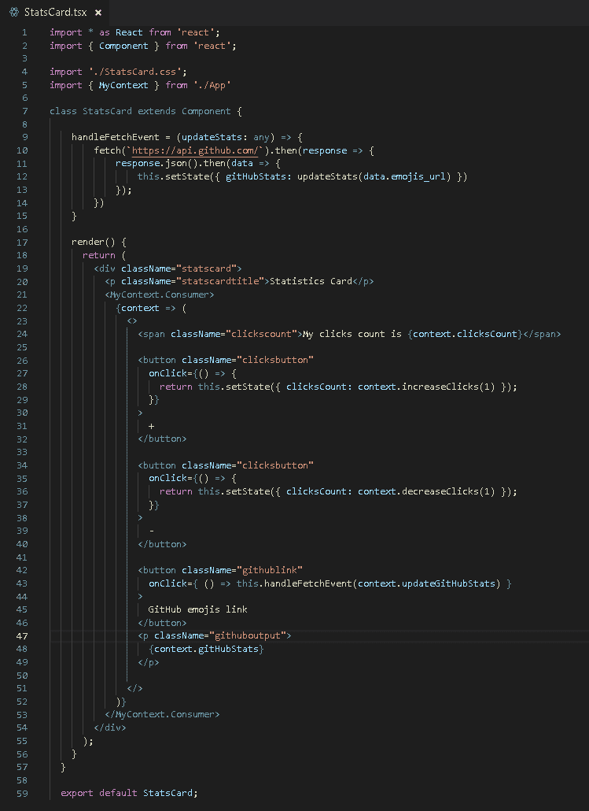
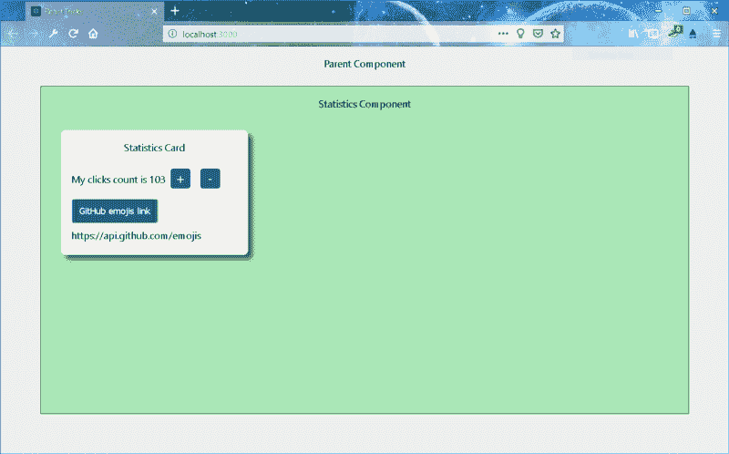

# 使用 Typescript 而不是 Redux 来巧妙应对上下文技巧

> 原文：<https://www.freecodecamp.org/news/clever-react-context-tricks-using-typescript-not-redux-7e2b9c7e5bf6/>

作者比尔·格滕

# **使用类型脚本来巧妙应对上下文技巧— *而不是* Redux**

由比尔·格滕、马丁·马扎和 T2 制作

**TLDR；**利用 [React 的上下文 API](https://reactjs.org/docs/context.html) 作为 Redux 的轻便而强大的替代方案。

让我们面对现实:当我们第一次开始玩 React 时，它就像一场糖热潮。只需创建一个. jsx 文件，添加几个依赖项，然后！—闪电般的页面。

这就是激动人心的时刻。

接下来，当您以极快的速度设计应用程序的表示层时，您会感到无限。然后你有了这个疯狂的想法，对一些微服务进行 AJAX 调用，并管理应用程序的状态。

那是痛苦开始的时候…

所以你搜索阿尔·戈尔的神奇互联网，发现管理应用程序状态的最佳解决方案是丹·阿布拉莫夫的 T2 的 Redux。现在你正在学习行动、减少和存储，并一头扎进[不变的状态](https://facebook.github.io/immutable-js/)，这样你就可以管理状态了。在您映射 StateToProps 之后，您的 React 组件通常会参与通常所说的“ [prop drilling](https://blog.kentcdodds.com/prop-drilling-bb62e02cb691) ”。

最初，您可以将属性从父代传递给子代，有时传递给孙代。然而，随着应用程序变得越来越复杂，您会注意到有时您通过组件树传递一些属性，而这些属性没有被给定的后代组件使用。

现在怎么办？！？您希望能够管理应用程序的状态，*但是*您希望不通过层次结构传递属性。是时候耍点小聪明了。

### **React 上下文 API 如何帮助**

脸书在 React v16.3 中发布了上下文 API，作为一种机制，通过提供者将应用程序的资产传递给作为消费者监听的任何子组件。这消除了“道具钻井”的范例。想象一下:在*的任何*级别，一个父组件可以定义自己的状态(包括方法),并将它们直接提供给任何参与的消费者。此外，您可以使用上下文的提供者传入的方法来设置状态。

Fig. 2 — React Context API can reduce or eliminate the need for “Prop Drilling” image source: [The JavaScript Playground](https://javascriptplayground.com/context-in-reactjs-applications/)

我们将在下面的例子中向您展示如何做到这一点。

**我们出发吧！**

[**bgirten/clever-React-Context-tricks**](https://github.com/bgirten/clever-React-Context-tricks.git)
[*new React Context experiments。在…*github.com](https://github.com/bgirten/clever-React-Context-tricks.git)上创建一个帐户，为 bgirten/clever-React-Context-tricks 开发做贡献

我们首先创建一个“初始”状态对象，它将从 App 组件传递到子组件。注意，这个 initialState 还包括方法。这种方法提供了只定义一次方法的能力，因此您可以更容易地重用它们。

将初始状态传递给 App 组件，并提供一个上下文。MyContext 中包含的每个组件。Provider 标签将能够使用上下文(在这种情况下包括 App 组件的初始状态)。

绕过从子组件到孙组件的“道具钻取”。

本地方法 handleFetchEvent 提供了执行由上下文传递的方法的能力(在本例中是 updateStats)。组件的 render 方法由于 this.setState 而触发。

在第 21 行，我们使用传入的上下文。提供者，允许我们访问应用程序组件初始状态中定义的所有成员和方法。

即使可以从 DOM 树的更高层传递方法，我们也可以通过简单地直接调用给定 React 组件的 **setState** 方法来调用 DOM 的重新呈现。

这里我们有加载的应用程序。感谢您的关注——您可以在以下网址找到这些作者的更多精彩内容:

[艾莉森的 Github，](https://www.github.com/sedulous-mortal) [马丁的 Github](https://www.github.com/87maza) ，以及[比尔的 Github](https://www.github.com/bgirten)