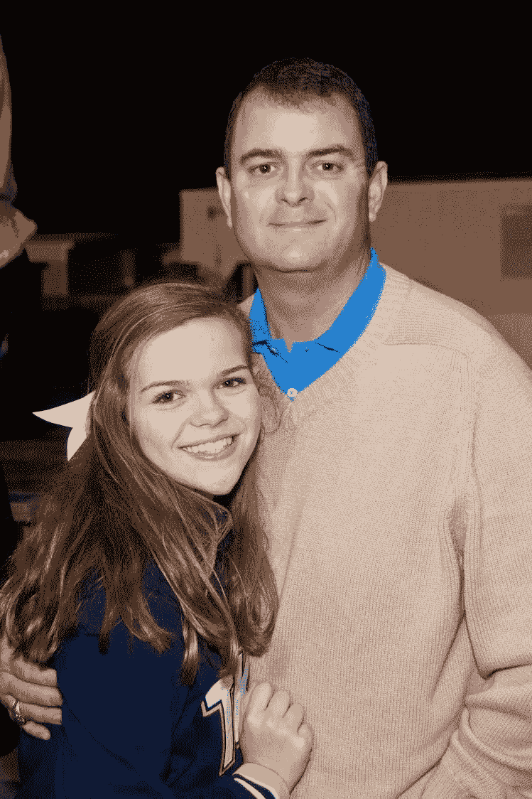

# 更接近代码，更接近爸爸

> 原文：<https://www.freecodecamp.org/news/closer-to-code-closer-to-dad-2fdd68dba444/>

由免费代码营

# 更接近代码，更接近爸爸

我从没想过我能理解代码。对我来说，代码是一种复杂的语言，人们通过多年的反复试验才学会的。尽管事实证明这在很大程度上是对的，但我并不后悔开始我掌握代码的漫长旅程。这个旅程已经开始改变我的生活。

我是一个摄影爱好者和进步中的编码者。大约一个月前的一个晚上开始的。我在努力完成一些代数作业。我爸爸给我发短信说他发现了一个新的编码社区。一开始，我以为我爸疯了。他想让从五年级开始数学课几乎不及格的女儿试着学习编码。这完全没有任何意义。直到我在自由代码营上创建了自己的账户，并开始应对最初的几个挑战，我才意识到编码真的有多酷。

数字和字母让我害怕。加上一些符号，你就有了集体歇斯底里症。但是开始编码的可怕之处在于，我实际上似乎理解了其中的一些。那是一种无法用语言描述的感觉。自由代码营的界面有趣且用户友好，它看起来像是一个我可以实际操作的程序。我的意思是，我的父亲已经在三周内完成了他的 100 小时，所以你知道这很酷。
学习编码不仅帮助我克服了对数字的恐惧(数学有时会吓到我们所有人)，还帮助我开始更好地学习和理解高中数学。我很自豪地说，从开始编码开始，我的数学成绩就拉了上来，思维过程发生了巨大的变化。这种变化如此剧烈，以至于我的数学老师经常问我是否在手上的某个地方写下了答案。这可能是世界上最棒的感觉了。

*我的自由代码营作品集页面。*

编码也让我和父亲更亲近了。在过去的一年里，我们家经历了一些艰难的障碍，这真的不容易。自从我开始写代码，我和我爸的关系就达到了新的高度。我们每天发短信给对方，说些鼓励的话，或者只是简单的“我爱你”。我们还分享了通过编写代码而共同获得的“灵感”时刻。这真的是很久以来发生在我们身上的最好的事情。编码让我找回了我的父亲，对此我非常感激。

Me with my dad, Christopher Hutchinson.

自由代码营，在一个少年的眼里，是一个任何人、任何人都可以归属的社区。起初，当我看到论坛中的每个人都准备好在我有问题或遇到错误时跳出来帮助我时，我感到震惊。你真的会对你在编码之旅中遇到的人和交的朋友心存感激。

感谢自由代码营不仅帮助我在学校表现得更好，更接近我的爸爸，还让我了解了编码的世界。感谢你，征服这 100 个小时会过得很快。我迫不及待地想开始从事非营利项目了！

#### 廷德尔住在南卡罗来纳州的佛罗伦萨。你应该看看她的照片，在推特上关注她。

*最初发布于[blog.freecodecamp.com](http://blog.freecodecamp.com/2015_02_01_archive.html)2015 年 2 月 9 日。*