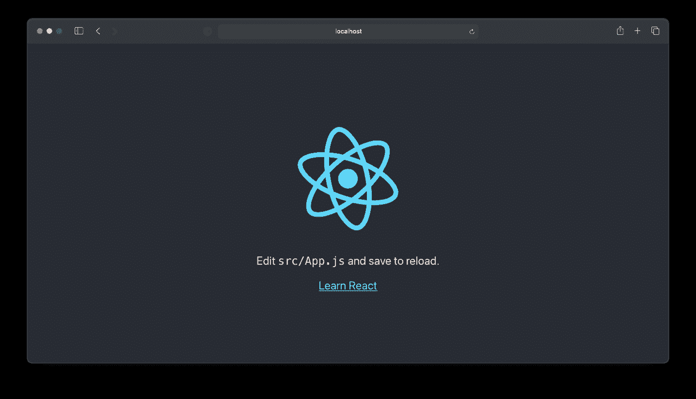
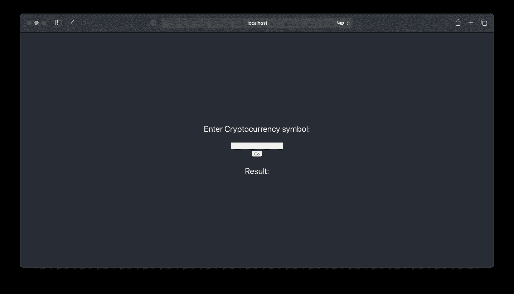
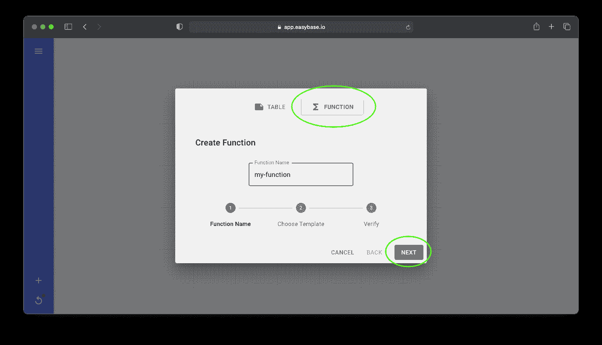
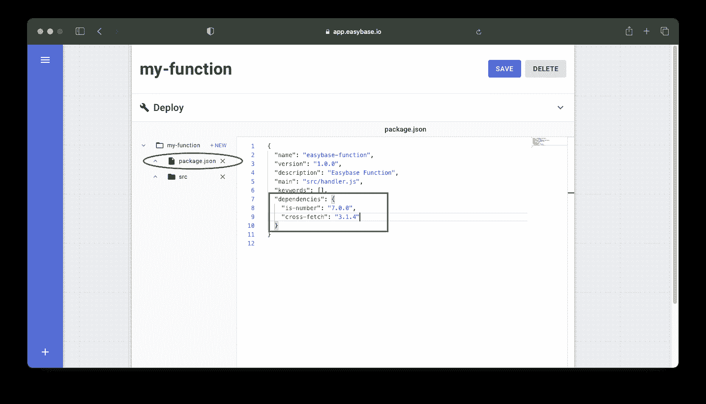
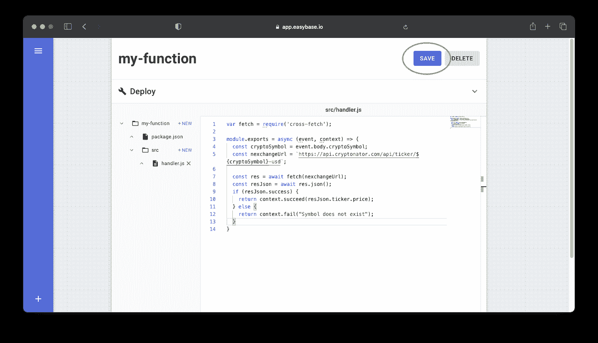
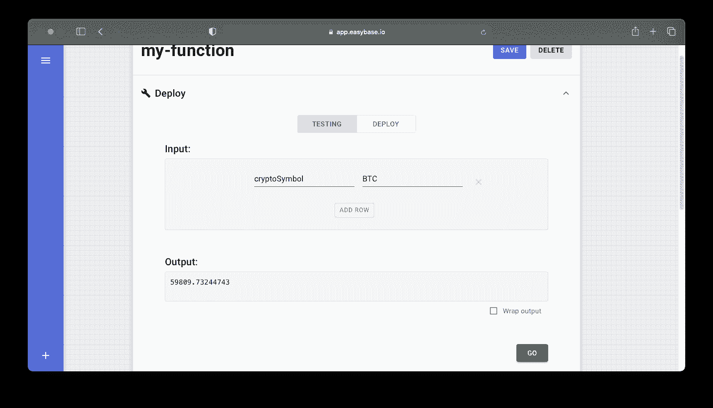
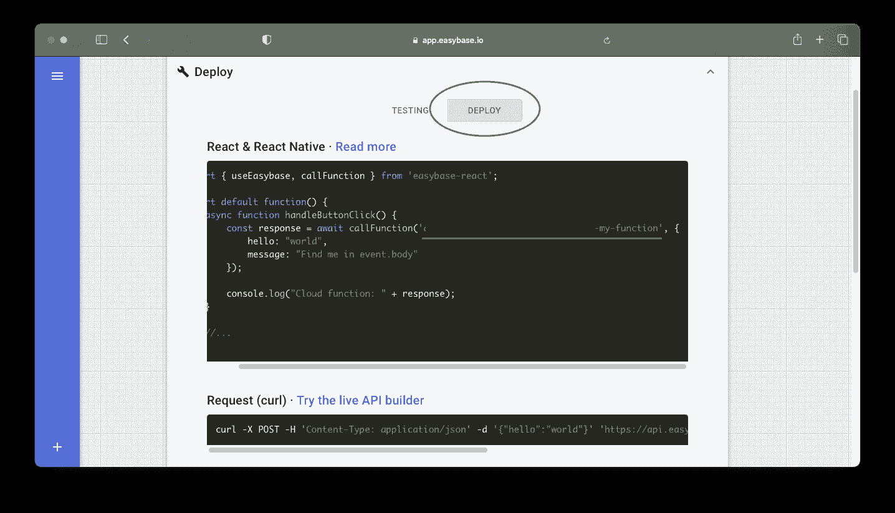
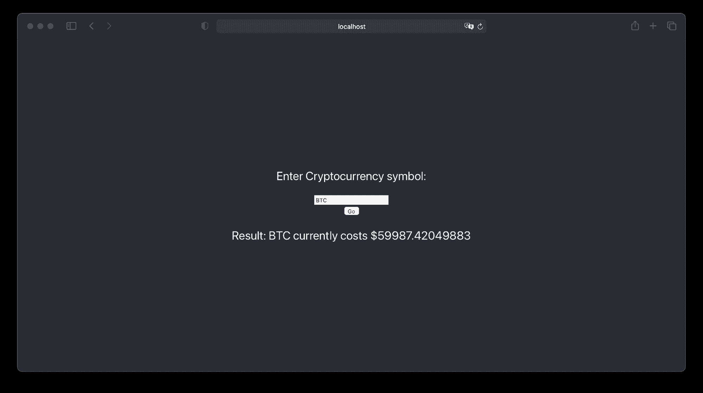

# 如何用 Easybase 在 React 和 React Native 中部署动态云功能

> 原文：<https://www.freecodecamp.org/news/cloud-functions-in-react-with-easybase/>

云函数是无状态的、单一用途的代码片段，可以通过编程或通过其他事件驱动的流程来调用。

这些代码片段不像传统函数那样内置于您的应用程序中。相反，它们存储在由提供商维护的云容器中。它们可以实时编辑，并对本地可用的前端代码隐藏业务逻辑。

React 和 React Native 由于其声明式编程风格，可以从这种应用程序开发方法中受益匪浅。UI 中的事件可以以一种反应友好的方式调用你的函数。我们试试吧！

## **设置**

我们将从创建一个全新的 React 或 React 本机应用程序开始。创建其中一个项目的最简单方法是使用标准 Node.js 安装中附带的`npx`。如果你没有安装这些模块，你可以[在这里](https://nodejs.org/en/)安装。

从那里我们可以创建一个新的项目，如下所示:

反应:`npx create-react-app my-cloud-app`

反应原生:`npx create-react-native-app`

安装完成后，进入新的项目目录并运行`npm run start`。这是我的起始 React 项目的样子:



## **例 React 项目**

我将创建的 React 项目示例是一个简单的加密货币价格获取器。

用户界面将提供一个文本框和按钮，用户可以提交加密货币的符号，如“BTC”或“ETH”。从那里，前端将调用一个由 Easybase 托管的无服务器函数。云函数将调用一个 API 并返回以美元表示的指定价格。

首先，让我们将这些界面元素添加到 React 元素中。打开`src/App.js`并清除根`header`标签下的组件。首先，我们需要四个要素:

1.  一个文本框
2.  告诉用户输入加密货币符号的文本元素
3.  基于文本框输入调用云功能的按钮
4.  最后，我们需要另一个文本元素来显示输出的结果

您的`App`函数现在可能如下所示:

```
function App() {
  return (
    <div className="App">
      <header className="App-header">
        <p>Enter Cryptocurrency symbol:</p>
        <input placeholder="BTC, ETH, etc." type="text" />
        <button>Go</button>
        <p>Result:</p>
      </header>
    </div>
  );
}
```

保存该文件，您的新应用程序将如下所示:



**太好了！**现在我们需要让我们的应用程序有状态，这样我们就可以保存用户输入并为我们的按钮提供一个回调。

我们将使用 React 的`useState`钩子来存储和显示用户输入。此外，创建一个名为`buttonCallback`的异步函数，当用户单击“Go”按钮时该函数被触发。现在，这个函数将只打印文本框输入。

下面是我对`src/App.js`的实现，供参考:

```
import { useState } from 'react';
import './App.css';

function App() {
  const [inputVal, setInputVal] = useState("");

  async function buttonCallback() {
    console.log(inputVal);
  }

  return (
    <div className="App">
      <header className="App-header">
        <p>Enter Cryptocurrency symbol:</p>
        <input placeholder="BTC, ETH, etc." type="text" value={inputVal} onChange={e => setInputVal(e.target.value)} />
        <button onClick={buttonCallback}>Go</button>
        <p>Result:</p>
      </header>
    </div>
  );
}

export default App;
```

## **如何部署您的云功能**

到目前为止，**一切都按预期进行**。是时候在云中部署代码片段了。[在 easybase.io](https://easybase.io/) 创建一个免费账户，点击视图左下角的 **'+'** 按钮。



选择 *Hello World* 模板并继续步进。这将调用一个函数，该函数简单地返回为请求体中的*消息*的值传入的任何内容。

摩纳哥代码编辑器内置在网站中，所以我们可以在我们的网络浏览器中实时编码！

我们需要一个来自 npm 的包来帮助我们向外部 API 发出请求。打开`package.json`，添加相应版本的模块(当我们保存我们的函数时，该模块将自动安装):



现在重新打开`handler.js`，用`var fetch = require('cross-fetch');`将新安装的模块放在文件的顶部。

当我们从前端发出请求时，我们将传递一个带有键`cryptoSymbol`的对象，该键代表文本框的输入值。所以，让我们创建一个变量来保存它。记住，`event.body`将引用通过请求体传递给函数的任何内容。

```
const cryptoSymbol = event.body.cryptoSymbol;
```

我们将使用 [Cryptonator API](https://www.cryptonator.com/api/) 来检索当前价格。获取价格的途径是`https://api.cryptonator.com/api/ticker/***pair_name***`，其中`***pair_name***`是给定的符号(三个字母)，后跟“-usd”。

我们在货币对名称后面加上“-usd”的原因是因为我们希望获得给定加密货币的美元价格，但是您可以使用另一个符号来进行不同的资产价格转换。让我们为这个 URL 设置一个变量:

```
const nexchangeUrl = `https://api.cryptonator.com/api/ticker/${cryptoSymbol}-usd`;
```

这是我们新功能的**完整模板**:

```
var fetch = require('cross-fetch');

module.exports = async (event, context) => {
  const cryptoSymbol = event.body.cryptoSymbol;
  const nexchangeUrl = `https://api.cryptonator.com/api/ticker/${cryptoSymbol}-usd`;

  const res = await fetch(nexchangeUrl);
  const resJson = await res.json();
  if (resJson.success) {
    return context.succeed(resJson.ticker.price);
  } else {
    return context.fail("Symbol does not exist");
  }
}
```

注意:`context.succeed`和`context.fail`都发送传递给请求客户端的任何内容。

保存功能:



我们可以扩展**部署**行并测试功能。用某个加密符号(BTC、ETH 等)的值将`cryptoSymbol`添加到输入体。



**恭喜，你的云功能正在工作！第一次调用您的函数可能需要几秒钟，因为它正在执行一个*冷启动*。当您的函数最近没有被调用时，就会发生冷启动，因此它会从提供者的后端卸载。它会在被主动调用时有所反应。**

现在让我们来看看 React/React 本机应用程序。转到你的项目目录，安装 [`easybase-react`](https://github.com/easybase/easybase-react) 库。

```
cd my-cloud-app
npm install easybase-react
```

现在在我们的`src/App.js`文件中，我们可以用`import { callFunction } from 'easybase-react`从这个新安装的包中导入一个名为`[callFunction](https://easybase.io/docs/easybase-react/modules/_callfunction_.html#callfunction)`的函数。

这个函数有两个参数:

1.  功能路线(在**展开** - >展开下可用)
2.  请求体对象，可在我们的云函数的`event.body`(可选)中访问

您可以在这里找到您的功能路线:



在我们的`buttonCallback`函数中，使用导入的`callFunction`来调用我们的云函数，如下所述。**注意`callFunction`是异步的——**两种编程方法都可以:

```
const result = await callFunction('YOUR-CUSTOM-ROUTE', { cryptoSymbol: "BTC" });
console.log(result);

// OR

callFunction('YOUR-CUSTOM-ROUTE', { cryptoSymbol: "BTC" }).then(result => console.log(result));
```

在我们的应用程序中，我们希望在最后一个`<p>`标签中显示结果。我们将用另一个`useState`实例来做这件事，这样标签现在看起来就像`<p>Result: {resultVal}</p>`。`resultVal`变量将在我们的`buttonCallback`函数中设置如下:

```
 async function buttonCallback() {
    const result = await callFunction('YOUR-CUSTOM-ROUTE', { cryptoSymbol: inputVal });
    setResultVal(`${inputVal} currently costs ${result}`);
  }
```



在文本框中输入一个密码，点击“开始” *—* **就可以了！**作为参考，以下是我的整个实现(随意编写代码，并赋予它独特的外观和感觉):

```
import { useState } from 'react';
import './App.css';
import { callFunction } from 'easybase-react';

function App() {
  const [inputVal, setInputVal] = useState("");
  const [resultVal, setResultVal] = useState("");

  async function buttonCallback() {
    const result = await callFunction('YOUR-CUSTOM-ROUTE', { cryptoSymbol: inputVal });
    setResultVal(`${inputVal} currently costs ${result}`);
  }

  return (
    <div className="App">
      <header className="App-header">
        <p>Enter Cryptocurrency symbol:</p>
        <input placeholder="BTC, ETH, etc." type="text" value={inputVal} onChange={e => setInputVal(e.target.value)} />
        <button onClick={buttonCallback}>Go</button>
        <p>Result: {resultVal}</p>
      </header>
    </div>
  );
}

export default App; 
```

## **结论**

我希望这个简短的演练对那些对云计算和无服务器应用程序开发感兴趣的人有所帮助！[有许多不同的框架/库可用于开发 ui 和应用](https://easybase.io/best-javascript-framework-library-quiz/)，但是 React 和 React Native 已被证明是蓬勃发展的社区中非常棒、健壮的选项。

对于那些感兴趣的人，这里有一些关于使用 Easybase 和 React/React Native 的全面信息。 [`easybase-react`包](https://github.com/easybase/easybase-react)可以处理用户认证等其他应用模块。

当没有流量时，你的无服务器功能将在云中保持空闲，避免任何费用。如果您的应用程序使用量激增，云提供商将会在那里*弹性地*提供所需的性能。

[这种被称为无服务器计算的基础设施将管理、扩展和就绪性的负担放在了主机上](https://easybase.io/about/2021/01/30/What-Is-a-Serverless-Application/)。最大的好处是，您不需要维护。此外，请查看我在 [freeCodeCamp 上关于 React & React Native](https://www.freecodecamp.org/news/how-to-add-a-serverless-database-to-react-projects-and-web-apps/) 的无服务器数据库的其他演练。

*感谢阅读和快乐编码！*