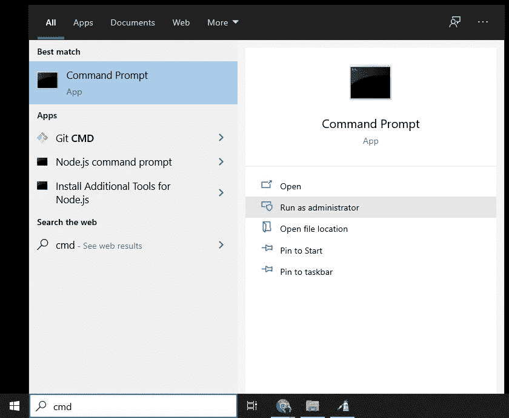
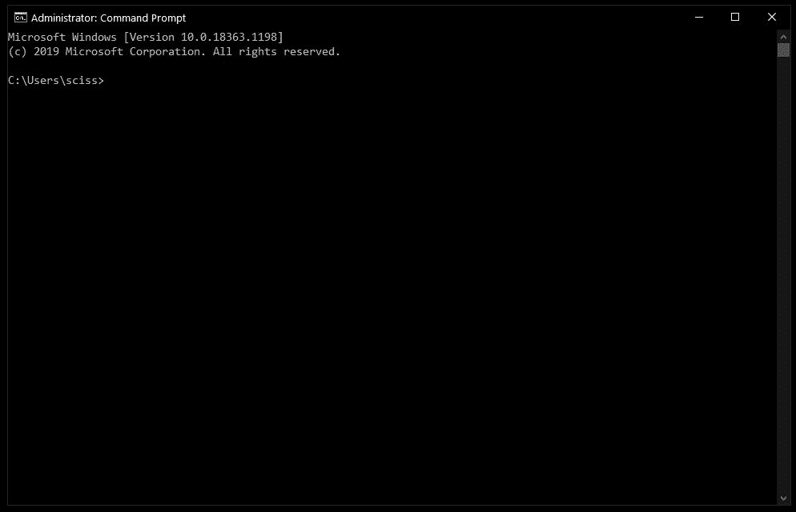
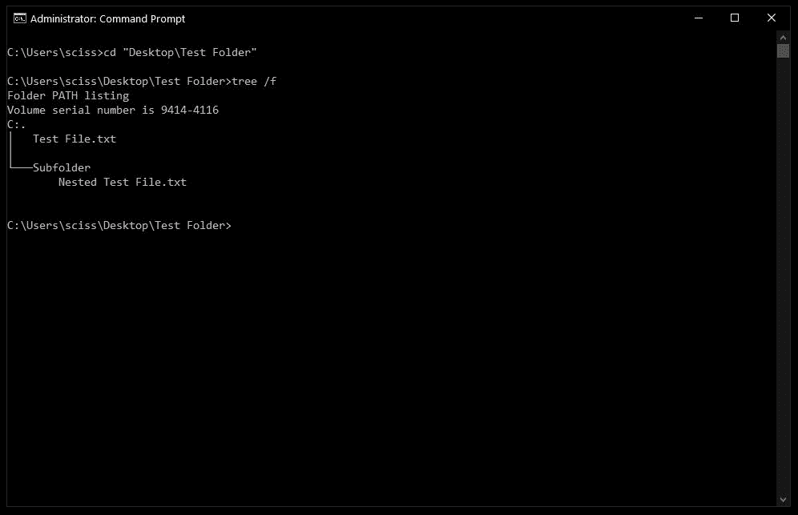
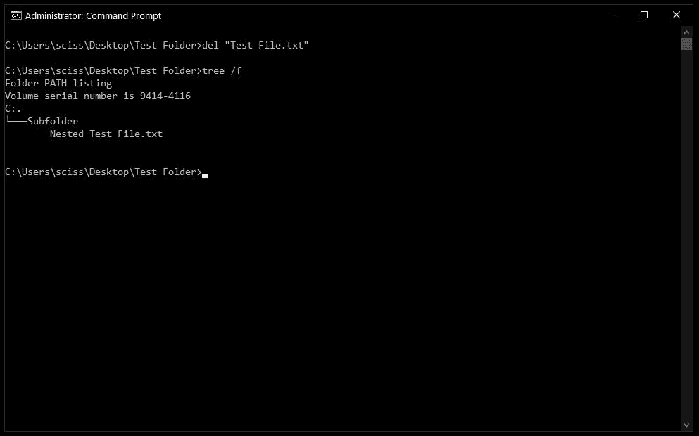
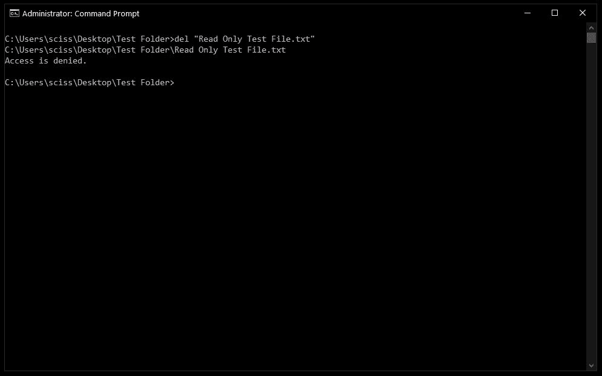
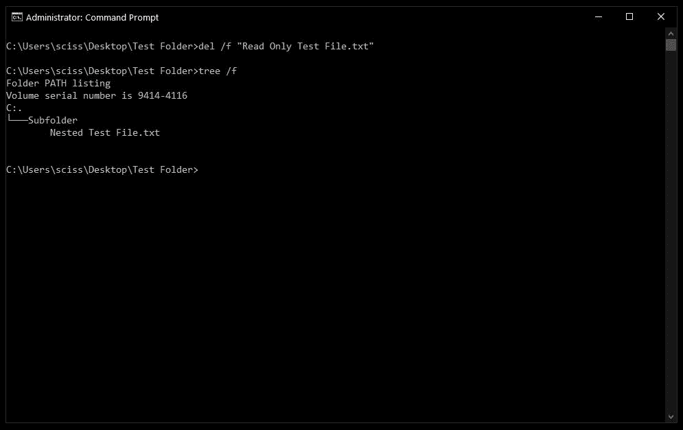
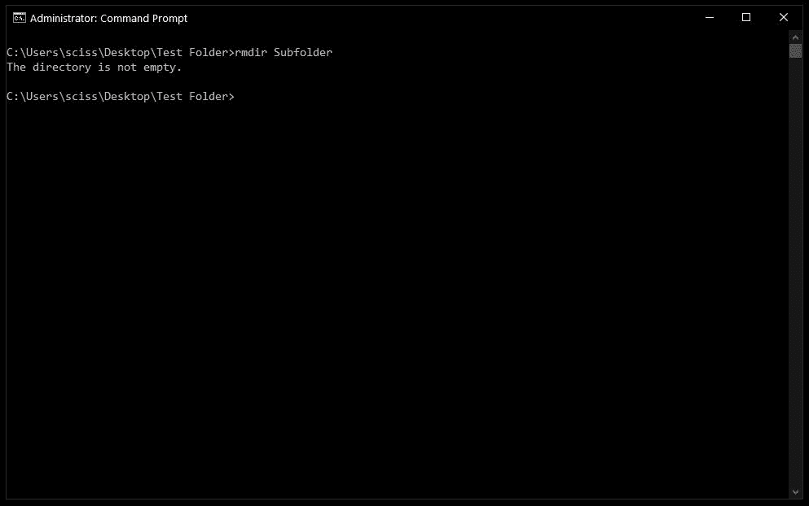
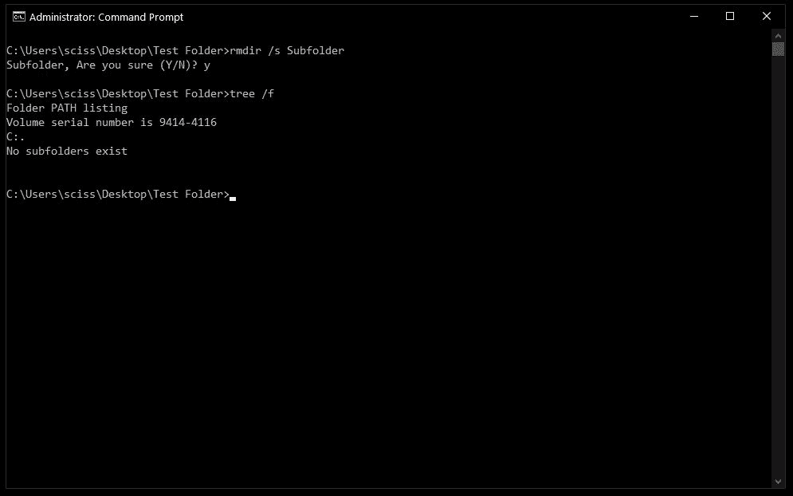

# cmd 删除文件夹–如何在 Windows 中删除文件和文件夹

> 原文：<https://www.freecodecamp.org/news/cmd-delete-folder-how-to-remove-files-and-folders-in-windows/>

有时候用命令行做事情会更快。

在这个快速教程中，我们将学习如何打开命令提示符，一些基本的命令和标志，以及如何在命令提示符下删除文件和文件夹。

如果你已经熟悉基本的 DOS 命令，请随意[跳过](#how-to-delete-files-with-the-del-command)。

## 如何打开命令提示符

要打开命令提示符，请按 Windows 键，然后键入“cmd”。

然后，点击“以管理员身份运行”:

之后，您将看到一个具有管理权限的命令提示符窗口:

Screenshot of Command Prompt window

如果您不能以管理员身份打开命令提示符，不用担心。您可以通过单击“打开”而不是“以管理员身份运行”来打开普通的命令提示符窗口。

唯一的区别是您可能无法删除一些受保护的文件，这在大多数情况下应该不是问题。

## 如何用`del`命令删除文件

现在命令提示符已经打开，使用`cd`来改变文件所在的目录。

我在桌面上准备了一个名为 Test Folder 的目录。您可以使用命令`tree /f`来查看所有嵌套文件和文件夹的树:

要删除文件，请使用以下命令:`del "<filename>"`。

例如，要删除`Test file.txt`，只需运行`del "Test File.txt"`。

可能会出现提示，询问您是否要删除该文件。如果是，键入“y”并按回车键。

**注意:**任何用`del`命令删除的文件都不能恢复。在哪里以及如何使用这个命令都要非常小心。

之后，您可以运行`tree /f`来确认您的文件已被删除:

另外，额外的提示——命令提示符有基本的自动完成功能。所以你只需要输入`del test`，按 tab 键，命令提示符就会把它变成`del "Test File.txt"`。

### 如何用`del`命令强制删除文件

有时文件被标记为只读，当您尝试使用`del`命令时，您会看到以下错误:

要解决这个问题，使用`/f`标志强制删除文件。例如，`del /f "Read Only Test File.txt"`:

## 如何用`rmdir`命令删除文件夹

要删除目录/文件夹，您需要使用`rmdir`或`rd`命令。这两个命令的工作方式是一样的，但是让我们继续使用`rmdir`，因为它更有表现力。

此外，在本教程的剩余部分，我将互换使用目录和文件夹这两个术语。“文件夹”是一个较新的术语，在早期的桌面 GUI 中很流行，但是文件夹和目录基本上是一个意思。

要删除一个目录，只需使用命令`rmdir <directory name>`。

**注意:**任何用`rmdir`命令删除的目录都不能恢复。在哪里以及如何使用这个命令都要非常小心。

在这种情况下，我想删除一个名为 Subfolder 的目录，所以我将使用命令`rmdir Subfolder`:

但是，如果您记得前面的话，子文件夹中有一个名为嵌套测试文件的文件。

您可以`cd`进入子文件夹目录并删除该文件，然后用`cd ..`返回并再次运行`rmdir Subfolder`命令，但这将变得乏味。想象一下，如果有一堆其他嵌套的文件和目录！

像使用`del`命令一样，有一个有用的标志，我们可以用它来使事情变得更快更容易。

### 如何在`rmdir`中使用`/s`标志

要删除一个目录，包括所有嵌套文件和子目录，只需使用`/s`标志:

可能会出现一个提示，询问您是否要删除该目录。如果是这样，只需键入“y”并按回车键。

就是这样！这应该是您在 Windows 命令提示符下删除文件和文件夹所需要知道的一切。

所有这些命令都应该在 PowerShell 中工作，PowerShell 基本上是命令提示符版本 2.0。此外，PowerShell 有一堆很酷的别名，比如`ls`和`clear`，如果你熟悉 Mac/Linux 命令行的话，应该会感觉很舒服。

这些命令对您有帮助吗？还有其他有用的命令吗？不管怎样，在推特上告诉我。