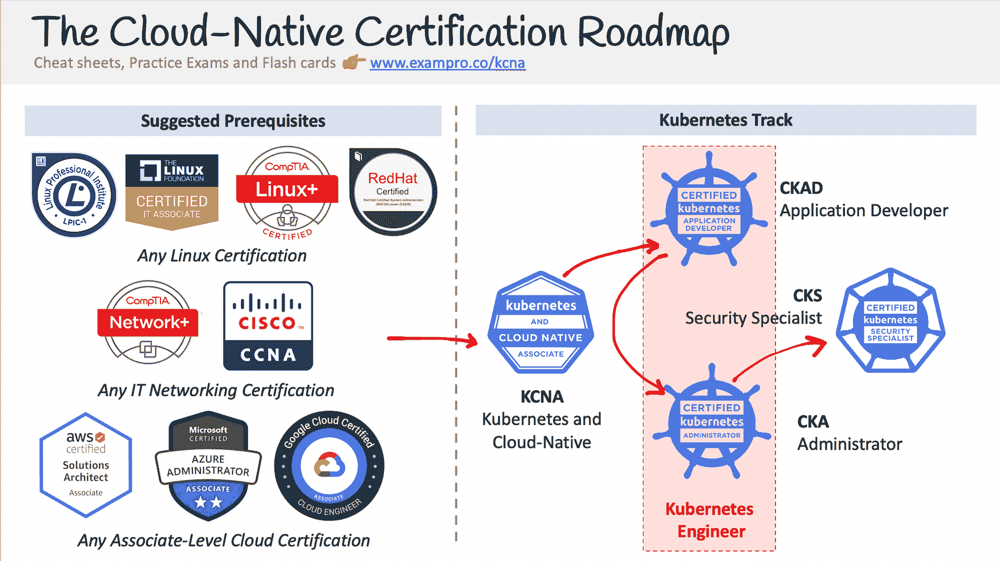
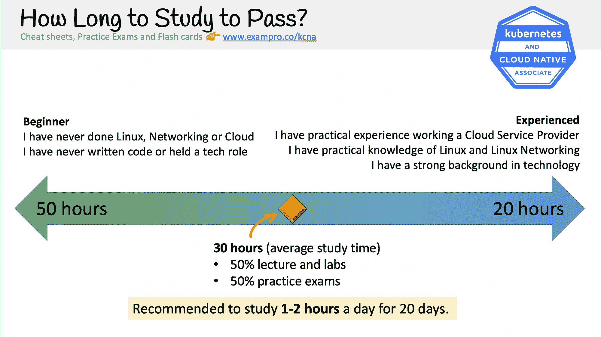

# CNCF Kubernetes 和云本地助理学习课程-通过 13 小时的免费课程考试

> 原文：<https://www.freecodecamp.org/news/cncf-kubernetes-cloud-native-associate-exam-course/>

该考试主要涉及云原生概念。即使您是云原生环境的新手，您也应该能够准备好该考试并获得 CNCF 认证。

整个免费课程现在在 YouTube 上直播，链接如下。在你深入了解之前，请阅读本指南，以帮助你决定 CNCF 朝鲜中央通讯社认证是否适合你。

## What is Kubernetes?

Kubernetes，通常简称为 K8s，是一个用于 Kubernetes pods 中的容器化应用程序的编排软件。

Kubernetes 是一项非常流行的技术，因为它允许组织部署微服务架构，该架构可以部署到任何云服务提供商(CSP)中。这种与云无关的方法为公司提供了技术灵活性，并避免了供应商锁定。

云不可知方法的代价是增加了复杂性，因此，Kubernetes 的工程师收入丰厚，非常受欢迎。

## 什么是 KNCA 库伯内特和云原生合作伙伴(KNCA)？

云原生计算基金会(CNCF)是维护各种云原生项目的组织，其中包括 Kubernetes。

*   CNCF·库伯内特和云原生助理(朝鲜中央通讯社)是入门级的 CNCF 认证教学:
*   云原生技术的前景
*   近距离观察 Kubernetes 的核心组件
*   快速浏览大量的 CNCF 项目，云原生工具
*   安全性、部署和监控概述
*   CNCF 的结构和管理，以及围绕云原生的社区

该认证课程的课程代码为**朝鲜中央通讯社**，在课程代码中没有表示版本的编号。

在朝鲜中央通讯社之前，只有 CKAD、CKA 和 CKS 认证，为了让大多数工程师更容易学习 Kubernetes，增加了朝鲜中央通讯社认证课程。

朝鲜中央通讯社需要现有的云、网络和 Linux 知识，强烈建议在学习朝鲜中央通讯社之前学习这些主题。

## 朝鲜中央通讯社概述

考试包含 5 个领域的问题，每个领域都有自己的权重。权重决定了考试中出现的关于该领域的问题数量。

*   46%领域 1: Kubernetes 基础知识
*   22%领域 2:容器编排
*   16%域 3:容器原生架构
*   8%域 4:云本地可观察性
*   8%领域 5:云原生应用交付

## 我能简单地看视频并通过考试吗？

如果你已经是一名高级工程师，也许可以简单地观看视频。但是，强烈建议您跟随自己的云服务提供商(CSP)帐户，因为这个考试将测试您的实用技术知识，如 KubeCTL 命令。

## 学习时的其他考虑

朝鲜中央通讯社完全由多项选择和多项选择组成，而 CKA、CKAD 和 CKS 等高级考试则完全是针对 Kubernetes 集群的。

因此，这个朝鲜中央通讯社学习课程除了授课内容之外，还包括大量的实践指导，专门为这些更难的考试做准备。

## 如何获得认证？

你可以在 Linux 基金会网站上报名参加考试。CNCF 是 Linux 基金会的一个子组织。

考试通过 PSI 进行，PSI 是一个由全球面对面考试中心和在线考试中心组成的网络。

你应该知道的其他细节:

*   考试有 60 道题
*   考试时间 **90 分钟**
*   及格分数为 **75%**
*   回答错误不会受到惩罚
*   考试费是 250 美元
*   你有两次机会

既然有两次机会，建议尽早参加考试。虽然考试很贵，但你可以四处寻找优惠券，或者与 CNCF 社区大使交谈，看看他们是否知道任何优惠券。

本课程附带一个完全免费的实践考试，您可以在 ExamPro 上注册，无需信用卡即可免费兑换。

ExamPro 有多个[付费模拟考试](https://exampro.co/gcp-cdl)以及其他学习材料，以增加您通过考试的机会。

前往 freeCodeCamp 的 YouTube 频道开始学习 13 个小时的课程。

[https://www.youtube.com/embed/AplluksKvzI?feature=oembed](https://www.youtube.com/embed/AplluksKvzI?feature=oembed)