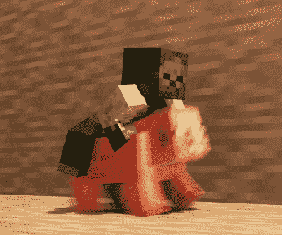

# 使用 React 和 Three.js 编写《我的世界》克隆代码

> 原文：<https://www.freecodecamp.org/news/code-a-minecraft-clone-using-react-and-three-js/>

也许不可能在 30 秒内编码一个[《我的世界》克隆体，但是你绝对可以在两个小时内创造一个。](https://www.youtube.com/watch?v=MAlSjtxy5ak)

我们刚刚在 freeCodeCamp.org YouTube 频道上发布了一门课程，将教你如何使用 React、JavaScript 和 Three.js 创建一个全功能的《我的世界》克隆

丹尼尔·巴克创建了这门课程。Daniel 是来自瑞典的高级软件工程师，是 Three.js 的专家。

Three.js 是一个 JavaScript 3D 库，允许开发人员在 web 浏览器中创建和显示动画 3D 计算机图形。

在本课程中，您将创建一个支持五种《我的世界》积木类型的游戏。它将包括移动，跳跃，切换和放置块，保存，等等。

您将了解许多 React 概念，如 useState、useEffect、useRef 和用于状态管理的自定义挂钩。您将能够应用这些原则用 JavaScript 创建其他 3D 游戏。

This is not in the game.

以下是本课程涵盖的部分:

*   样板文件
*   天空
*   口感
*   地面
*   运动员
*   键盘输入
*   活动
*   第一人称摄像机
*   状态管理
*   立方体组件
*   添加/删除多维数据集
*   纹理选择器
*   拯救世界
*   悬停立方体
*   结尾部分

在 freeCodeCamp.org YouTube 频道观看完整的课程(2 小时观看)。

[https://www.youtube.com/embed/qpOZup_3P_A?feature=oembed](https://www.youtube.com/embed/qpOZup_3P_A?feature=oembed)