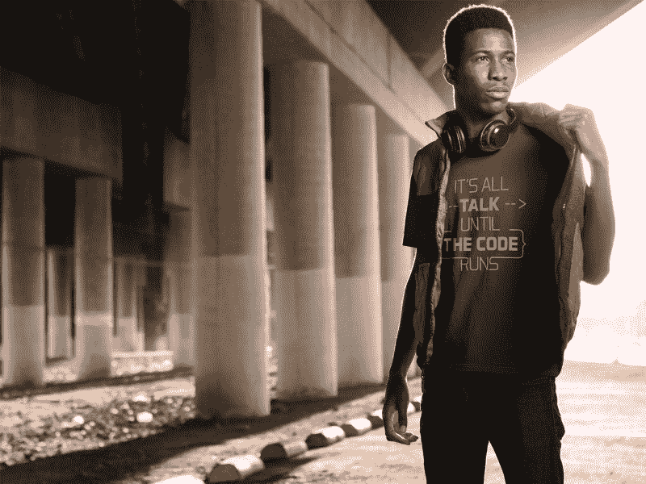

# 代码简介:通过构建一个冰淇淋圣代来解释 CSS 定位

> 原文：<https://www.freecodecamp.org/news/code-briefing-css-positioning-explained-by-building-an-ice-cream-sundae-f965f139deb9/>

以下是我们本周发表的三个故事，值得你花时间去读:

1.  通过建立一个冰淇淋圣代来解释 CSS 定位: [5 分钟阅读](http://bit.ly/2cp9G6X)
2.  一个产品经理让你去修复一个 bug… [7 分钟阅读](http://bit.ly/2bY62PC)
3.  快速移动，不要弄坏东西: [5 分钟读数](http://bit.ly/2bTENVn)

额外收获:维基的发明者沃德·坎宁安有一句名言，“在代码运行之前，一切都是空谈。”用这件黑色 t 恤来传播他的智慧，在我们的商店有男式和女式尺码[。](http://bit.ly/2b099sb)

快乐编码，

昆西·拉森，自由代码营的老师