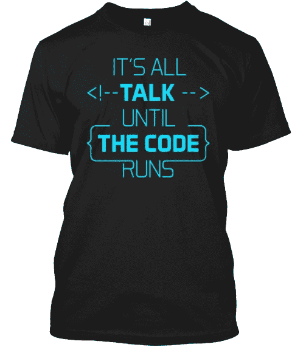

# 代码简介:如何不搞砸你的工作机会谈判

> 原文：<https://www.freecodecamp.org/news/code-briefing-how-not-to-bomb-your-job-offer-negotiation-f0660ba69add/>

以下是我们本周发表的三个故事，值得你花时间去读:

1.  如何不搞砸你的报价谈判: [27 分钟阅读](http://bit.ly/2czV9Fy)
2.  我主持了免费的设计研讨会。然后我们作为一个团队开发了一个狗收养应用: [6 分钟阅读](http://bit.ly/2ccojZz)
3.  你会随机轰炸技术面试。几乎每个人都这样。下面是数据: [10 分钟阅读](http://bit.ly/2bMxccW)

额外收获:维基的发明者沃德·坎宁安有一句名言，“在代码运行之前，一切都是空谈。”用这件黑色 t 恤来传播他的智慧，在我们的商店有男式和女式尺码[。](http://bit.ly/2b099sb)

快乐编码，

昆西·拉森，自由代码营的老师