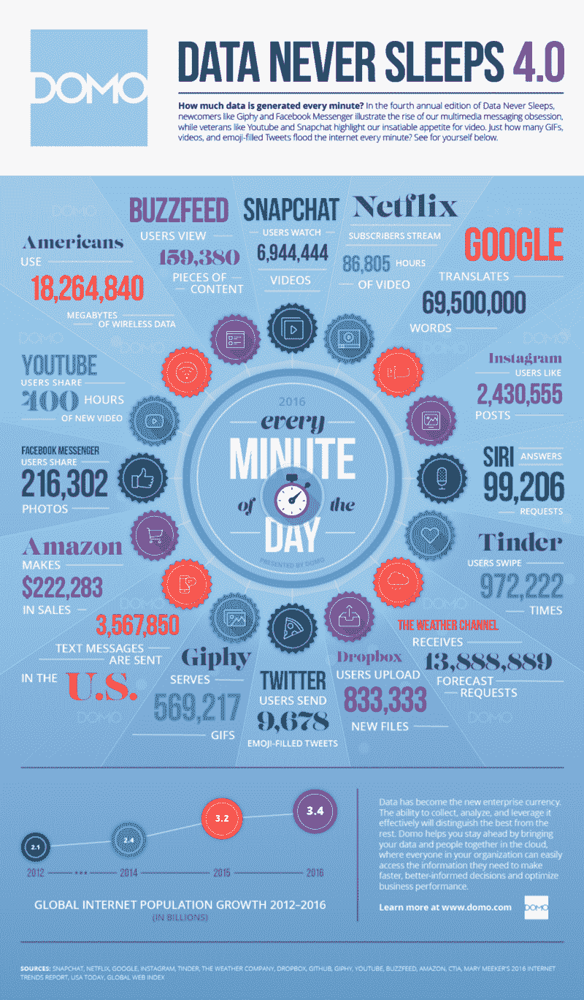

# 代码简介:来自 3000 名开发人员工作面试的经验

> 原文：<https://www.freecodecamp.org/news/code-briefing-lessons-from-3-000-developer-job-interviews-711111dcaa64/>

以下是我们本周发表的三个故事，值得你花时间去读:

1.  你毕业后做什么比你在哪里上学重要得多。下面是数据: [7 分钟读取](http://bit.ly/2iEuoBA)
2.  作为一名新的训练营毕业生，自由代码营如何让我脚踏实地: [7 分钟阅读](http://bit.ly/2iEHT3Y)
3.  数据显示的 2016 年 10 大免费网络课程: [5 分钟阅读](http://bit.ly/2iEB16I)

额外收获:到目前为止，已经有 1000 多人参加了#100DaysOfCode 挑战。如果你想快速提高你的编码技能，你也可以[接受这个挑战](http://bit.ly/2hvgvUA)。

最后，这里有一个很酷的信息图来总结 2016 年:

快乐编码，

昆西·拉森，自由代码营的老师