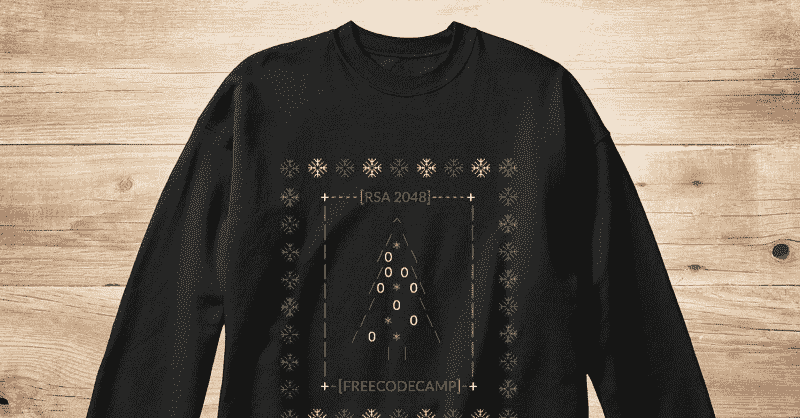

# 代码简介:是的，有完全免费的编码训练营

> 原文：<https://www.freecodecamp.org/news/code-briefing-yes-there-are-completely-free-coding-bootcamps-dcfebc05d530/>

以下是我们本周发表的三个故事，值得你花时间去读:

1.  你可能不需要那个 15K 美元的编码训练营: [6 分钟阅读](http://bit.ly/2hd3dJH)
2.  弗雷斯诺的一群陌生人如何找到一个场地，举办编码活动，并得到开发人员的工作: [4 分钟阅读](http://bit.ly/2gzwxu3)
3.  数据结构简介:图形如何工作: [8 分钟阅读](http://bit.ly/2hefMIL)

？额外收获:我们的社区设计了一件受密码学启发的丑陋圣诞毛衣。这只能再用一天。你可以在我们的商店里了解更多关于 T2 和 T4 的信息。

快乐编码，

昆西·拉森，自由代码营的老师