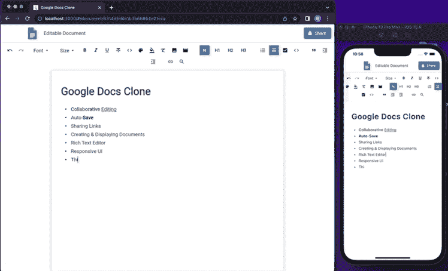

# 用 Flutter 编写谷歌文档

> 原文：<https://www.freecodecamp.org/news/code-google-docs-with-flutter/>

创建一个谷歌文档的克隆将帮助你学习许多新概念。

我们刚刚在 freeCodeCamp.org YouTube 频道上发布了一个完整的课程，将教你如何使用 Flutter 来创建一个谷歌文档的克隆。

Rivaan Ranawat 创建了这个课程。Rivaan 创建了许多关于各种主题的流行技术课程。

本教程是为 Node.js 初学者设计的，不需要 Javascript 的先验知识。您将使用 Flutter、Node、Express、Socket、MongoDB 和 Riverpod。

您构建的克隆具有以下特性:

*   谷歌认证(无 Firebase)
*   状态持久性
*   创建新文档
*   查看文档列表
*   更新文档标题
*   链接共享
*   自动保存
*   富文本编辑器中的协作编辑
*   签名登记离开

The cross-platform clone you will build.

以下是本课程的所有部分:

*   创建颤振项目
*   设计登录屏幕
*   谷歌云平台 oAuth 客户端 ID
*   Google Auth Android 设置
*   Google 授权 iOS 设置
*   Google 认证网站设置
*   关于 Auth 的重要说明
*   在特定端口的 Web 上运行
*   Google 使用 Node.js 登录
*   Node.js 是什么？
*   创建和设置节点服务器
*   MongoDB 设置
*   创建注册 API
*   调用注册 API -客户端
*   坚持状态解释
*   生成 JWT
*   认证中间件
*   局部存储器
*   在 Android 上测试
*   按指定路线发送
*   创建导航栏
*   注销
*   创建新文档
*   显示我创建的所有文档
*   设计文档屏幕
*   更新文档标题
*   插座介绍和连接
*   协作编辑
*   自动保存
*   返回主页
*   共享链接
*   结论

观看 freeCodeCamp.org YouTube 频道的全部课程(5 小时观看)。

[https://www.youtube.com/embed/F6P0hve2clE?feature=oembed](https://www.youtube.com/embed/F6P0hve2clE?feature=oembed)