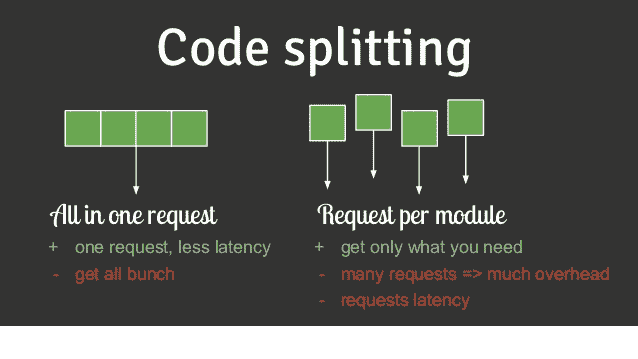

# 为什么应该对高阶元件使用代码分离

> 原文：<https://www.freecodecamp.org/news/code-splitting-with-higher-order-components-4ac8f094b059/>

作者 Nitish Phanse

# 为什么应该对高阶元件使用代码分离



当加载大量客户端应用时，代码分割可以提供一些喘息的机会。在我们所处的时代，用户的注意力跨度可能接近每页 10 秒，如果花 6 秒来获取和解析 JavaScript，你肯定不会获得转化。

Webpack 3 为动态导入提供了出色的支持。这允许您只将有用的块加载到客户端。高阶组件加上动态导入可以将 JavaScript 包分成多个小块。最近，React 团队在他们的[文档](https://reactjs.org/docs/code-splitting.html#code-splitting)中添加了一个关于代码拆分的漂亮页面。

**高阶组件**是接受一个组件作为参数并返回另一个组件的函数。

是的。这是我能想到的最简单的定义，没有什么特别的。与纯粹的客户端应用程序相比，在服务器端应用程序上对您的包进行代码拆分时，处理方式会稍有不同。

我把这篇文章分成了**两个** **部分。**第一部分解释了纯客户端应用中的代码拆分。第二部分解释了服务器渲染应用程序上的代码分割。两种方法都使用高阶分量。

### 纯客户端应用

这些应用程序都被精简了。它们通常用于认证路由(不需要利用 SEO 优势)。它们完全建立在客户端。

通常情况下，任何`App.js`看起来都如下图所示:

对于微小的应用程序，上述结构确实有效。但是如果我们的网页上有 20 条路线，那么我们就有点像一个怪物。因此，一旦用户导航到该页面，我们就动态地只导入那些需要的路由。

这应该会根据路线分割您的代码。 **asyncComponent** 是一个异步加载组件块的函数。 **LoadingComponent** 是一个占位符，我们可以在请求完成时显示它。


Webpack splits your bundle into chunks

每当你调用你的**反应堆**。 **render** 方法，相应的块将被加载。这样，您只需在用户查看的页面上加载所需的路线。当导航到一条路线时，将调用适当的包。

### 服务器渲染的应用

这一段肯定比前者更有意思。服务器呈现的应用程序在视图中创建页面的标记字符串，并将其提供给客户端。然后我们称**水合物**法。它首先进行 diff 检查，看我们的服务器 DOM 树是否与客户机上的相同。如果不一样，React 会抛出一个警告，说你的树形状不匹配。

如果我们对服务器渲染的应用程序遵循上述方法，我们肯定会得到提到的错误。为什么？？后退一步，看看发生了什么。

对页面的第一个请求返回应用程序字符串。但是当 hydrate 方法开始工作时，它会尝试获取所请求页面的包。由于获取的异步特性，它会在一小段时间内加载 **LoaderComponent** 。当获取组件时，它会重新呈现页面。这给我们的 UI 带来了抖动/锯齿效果，并在 DOM 警告中抛出了可怕的不匹配。

所以我们需要一个更好的方法来解决这个问题。

1.  在服务器端分割我们的代码
2.  在服务器端预加载我们的组件
3.  仅在获取上下文中的当前包之后调用水合物方法。


[**React loadable**](https://github.com/thejameskyle/react-loadable) 是一个相当酷的高阶组件。它做了上面提到的所有事情，并且实现起来非常简单。

在你的 **server.js:**

为了简单起见，我将代码减到最少。

现在让我们选择服务器端的包。我们将使用 ReactLoadable 的 Capture 方法，该方法将创建该块所需的包的映射。

```
const modules = [];
```

```
function fetchModuleName(moduleName: string) {  return modules.push(moduleName);}
```

```
const markup = ReactDOMServer.renderToString(  <Loadable.Capture report={fetchModuleName}>    <StaticRouter location={request.url} context={context}>      <App />    </StaticRouter>  </Loadable.Capture>);
```

一旦完成，让我们使用 **ReactLoadable** 的 Webpack 插件来创建代码块。它维护一个 stats 文件，稍后服务器文件将使用该文件来映射哪些包要提供给客户机。

```
const ReactLoadablePlugin = require(‘reactloadable/webpack’).ReactLoadablePlugin;
```

```
In webpack config
```

```
plugins : [  //Other plugins,
```

```
 new ReactLoadablePlugin({    filename: ‘./dist/build/react-loadable.json’,  })]
```

所以我们的路线是分开的。我们只需要在从服务器获取包之后调用**水合物**方法，所以让我们来解决这个问题。我们将使用 ReactLoadables 的**预加载就绪**方法。

```
window.main = () => {  Loadable.preloadReady().then(() => {    hydrate(      <BrowserRouter>        <ScrollHandler>          <App />        </ScrollHandler>      </BrowserRouter>,    document.getElementById(‘root’)    );  });};
```

我们已经为窗口对象附加了一个主函数，这个函数将在我们的服务器标记文件中被调用。

只剩下几步了。我们现在需要告诉我们的服务器文件要获取哪个合适的包。完成后，调用 main 函数，以便客户端应用程序可以接管。

因此，我们最终的标记文件将如下所示:

有几件事可以优化:

1.  最常访问的路线的预缓存包。例如，如果用户可能从主页导航到登录或产品页面，可以在主页的 componentDidMount 中使用**loadabled . preload()**。服务人员在这里会很方便。
2.  如果不想阻塞主线程，请使用 web worker。使用**window . postmessage**API**并在后台获取包。**
3.  React Loadable 可以用来以你喜欢的任何合适的方式打包成包。
4.  要决定预缓存哪些块，请从您的分析库中读取一些数据，混合 panel / GA 以查看用户从主页导航到了哪里。

随时欢迎反馈！