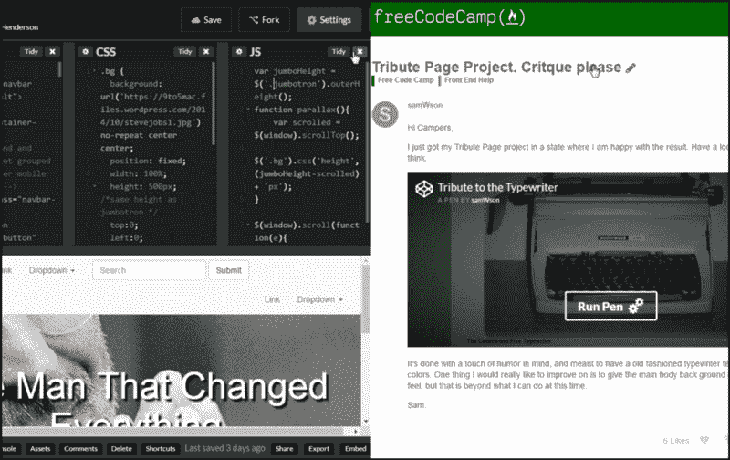
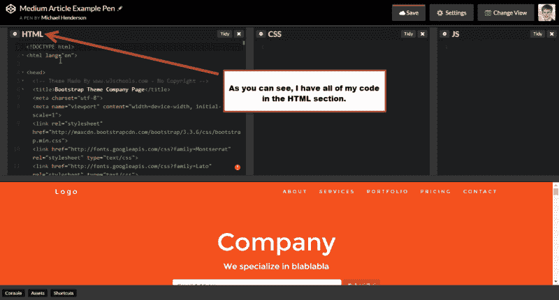
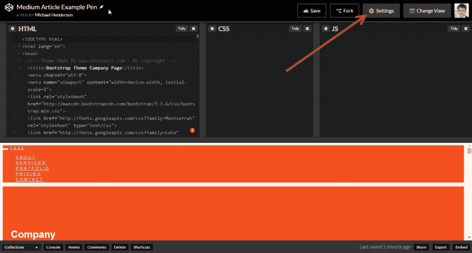
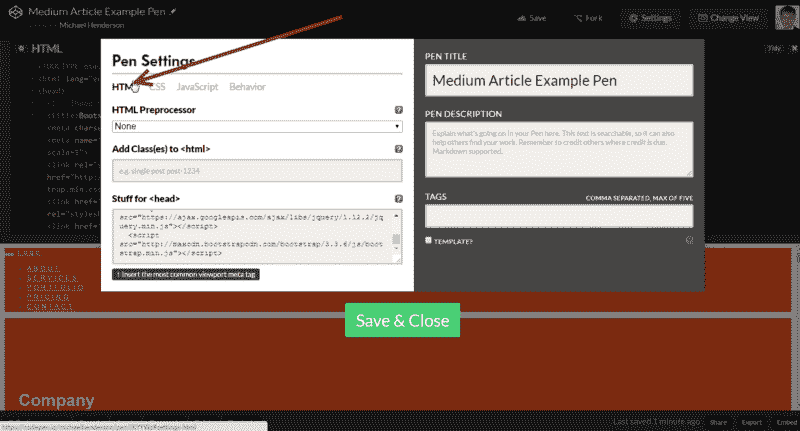
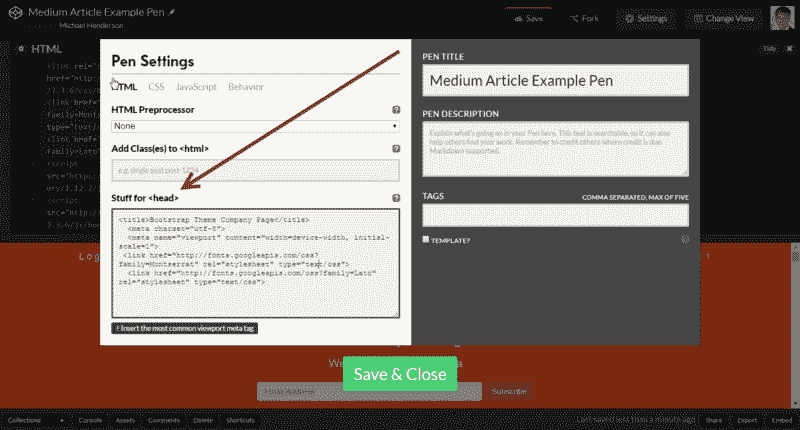
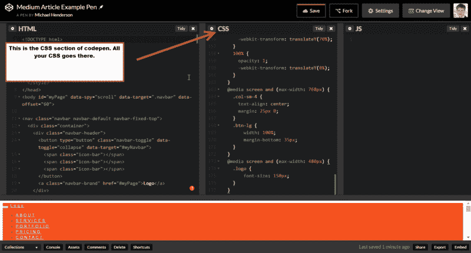
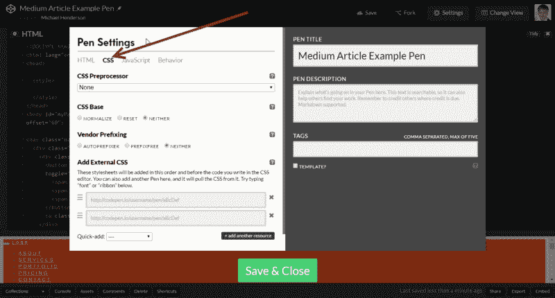
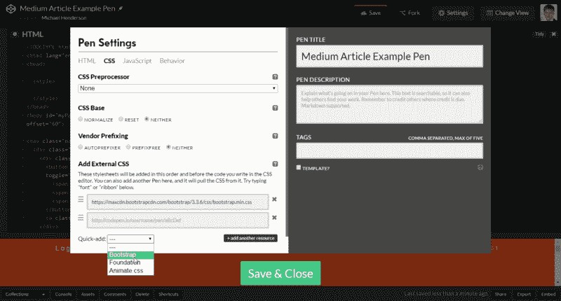
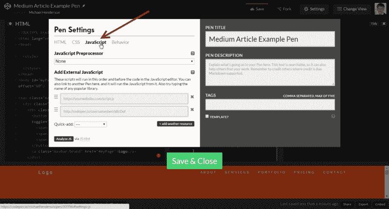
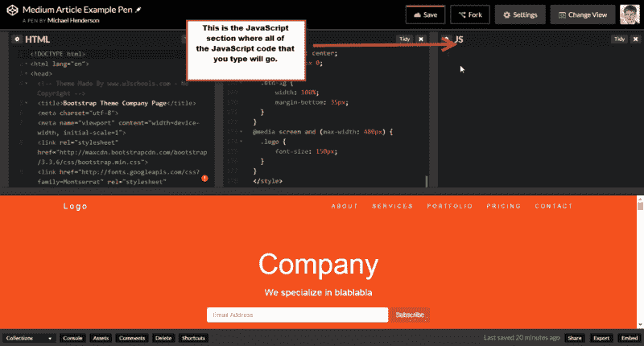

# 代码笔提示和最佳实践

> 原文：<https://www.freecodecamp.org/news/codepen-tips-and-best-practice-cf926ebd0b11/>

迈克尔·亨德森

# 代码笔提示和最佳实践



在 [FCC](https://www.freecodecamp.com) 工作时，你会有机会用 [CodePen](https://codepen.io/) 创建自己的项目。营员喜欢在[自由代码营论坛](http://forum.freecodecamp.com)上分享这些项目，以接收来自其他营员的反馈。

今天，我将向您展示如何充分利用 CodePen，以及如何在 FCC 论坛上最大限度地获得您的反馈。

去拿你的睡袋和棉花糖。哦，别忘了从那只趁你睡觉时偷走你的雪人冷却器的熊那里拿回来！我们要去远足，学习一些东西。

#### 在 CodePen 中组织代码

当我第一次使用 CodePen 时，我记得我所有的代码都在我的笔的 HTML 部分。就像下图一样，我把 HTML、CSS 和内容都放在一个地方。



这样建立你的网站绝对没有错。但是，在 CodePen 中，有一些方法可以清理你的代码，使它更有条理，更容易被那些帮助你或者只是检查你的优秀项目的人阅读。

您可以通过单击此处的在另一个标签中打开这支笔。这将允许您摆弄代码并跟随代码。

#### 让我们移除一些东西

```
<!-- Remove The Following Lines of Code From The Html Section --> 
```

```
<!DOCTYPE html>
```

```
<html lang="en">
```

```
</html>
```

我们不需要这些代码，因为 CodePen 会自动将它们注入到我们的项目中。

#### 按照这些步骤，将你的头部内容正确地放置在 CodePen 中需要放置的地方。

让我们把元内容和谷歌字体链接移到 CodePen 的部分。

下面是 head 标签之间的代码快照。你应该只移动我用粗体显示的代码。

```
<head>  <! — Theme Made By www.w3schools.com — No Copyright --> <title>Bootstrap Theme Company Page</title> <meta charset=”utf-8"> <meta name=”viewport” content=”width=device-width, initial-scale=1"> <link rel=”stylesheet” href=”http://maxcdn.bootstrapcdn.com/bootstrap/3.3.6/css/bootstrap.min.css"> <link href=”http://fonts.googleapis.com/css?family=Montserrat" rel=”stylesheet” type=”text/css”> <link href=”http://fonts.googleapis.com/css?family=Lato" rel=”stylesheet” type=”text/css”> <script src=”https://ajax.googleapis.com/ajax/libs/jquery/1.12.2/jquery.min.js"></script> <script src=”http://maxcdn.bootstrapcdn.com/bootstrap/3.3.6/js/bootstrap.min.js"></script> <style> body { font: 400 15px Lato, sans-serif; line-height: 1.8; color: #818181; } h2 { font-size: 24px; text-transform: uppercase; color: #303030; font-weight: 600; margin-bottom: 30px; } h4 { font-size: 19px; line-height: 1.375em; color: #303030; font-weight: 400; margin-bottom: 30px; }  .jumbotron { background-color: #f4511e; color: #fff; padding: 100px 25px; font-family: Montserrat, sans-serif; } .container-fluid { padding: 60px 50px; } .bg-grey { background-color: #f6f6f6; } .logo-small { color: #f4511e; font-size: 50px; } .logo { color: #f4511e; font-size: 200px; } .thumbnail { padding: 0 0 15px 0; border: none; border-radius: 0; } .thumbnail img { width: 100%; height: 100%; margin-bottom: 10px; } .carousel-control.right, .carousel-control.left { background-image: none; color: #f4511e; } .carousel-indicators li { border-color: #f4511e; } .carousel-indicators li.active { background-color: #f4511e; } .item h4 { font-size: 19px; line-height: 1.375em; font-weight: 400; font-style: italic; margin: 70px 0; } .item span { font-style: normal; } .panel { border: 1px solid #f4511e;  border-radius:0 !important; transition: box-shadow 0.5s; } .panel:hover { box-shadow: 5px 0px 40px rgba(0,0,0, .2); } .panel-footer .btn:hover { border: 1px solid #f4511e; background-color: #fff !important; color: #f4511e; } .panel-heading { color: #fff !important; background-color: #f4511e !important; padding: 25px; border-bottom: 1px solid transparent; border-top-left-radius: 0px; border-top-right-radius: 0px; border-bottom-left-radius: 0px; border-bottom-right-radius: 0px; } .panel-footer { background-color: white !important; } .panel-footer h3 { font-size: 32px; } .panel-footer h4 { color: #aaa; font-size: 14px; } .panel-footer .btn { margin: 15px 0; background-color: #f4511e; color: #fff; } .navbar { margin-bottom: 0; background-color: #f4511e; z-index: 9999; border: 0; font-size: 12px !important; line-height: 1.42857143 !important; letter-spacing: 4px; border-radius: 0; font-family: Montserrat, sans-serif; } .navbar li a, .navbar .navbar-brand { color: #fff !important; } .navbar-nav li a:hover, .navbar-nav li.active a { color: #f4511e !important; background-color: #fff !important; } .navbar-default .navbar-toggle { border-color: transparent; color: #fff !important; } footer .glyphicon { font-size: 20px; margin-bottom: 20px; color: #f4511e; } .slideanim {visibility:hidden;} .slide { animation-name: slide; -webkit-animation-name: slide; animation-duration: 1s; -webkit-animation-duration: 1s; visibility: visible; } @keyframes slide { 0% { opacity: 0; -webkit-transform: translateY(70%); }  100% { opacity: 1; -webkit-transform: translateY(0%); } } @-webkit-keyframes slide { 0% { opacity: 0; -webkit-transform: translateY(70%); }  100% { opacity: 1; -webkit-transform: translateY(0%); } } @media screen and (max-width: 768px) { .col-sm-4 { text-align: center; margin: 25px 0; } .btn-lg { width: 100%; margin-bottom: 35px; } } @media screen and (max-width: 480px) { .logo { font-size: 150px; } } </style></head> 
```

1.  单击设置按钮。



2.单击 HTML。



3.将内容粘贴到<和 ad >的**素材中。完成后点击保存&关闭。**



#### 现在让我们把 CSS 移到它应该去的地方

1.  复制开始和结束样式标签之间的所有内容，并将其粘贴到 CSS 部分。



你的 HTML 和 CSS 现在是分开的。这有助于营造一个有组织、高效的工作环境。请注意:你不必在你的 CSS 部分放置<styles>标签。</styles>

#### 将[引导](http://getbootstrap.com/)样式表添加到项目中

1.  单击设置。
2.  点击 **CSS。**



3.单击底部显示“快速添加”的下拉箭头，然后选择引导。它将把它添加到你的外部 CSS 链接中。



**快速提示:**还可以添加字体 Awesome 作为外部样式表。阅读**下的内容添加外部 CSS。**

#### **添加 JavaScript**

1.  仍然在设置中，点击 **JavaScript。**



2.单击“快速添加”下拉菜单，添加 jQuery 和 Bootstrap。

3.单击保存并关闭。

#### 从 HTML 部分移动我们的 JavaScript

1.  滚动到底部，在脚本标记之间复制 javascript 代码。

```
<script>$(document).ready(function(){ // Add smooth scrolling to all links in navbar + footer link $(“.navbar a, footer a[href=’#myPage’]”).on(‘click’, function(event) { // Make sure this.hash has a value before overriding default behavior if (this.hash !== “”) { // Prevent default anchor click behavior event.preventDefault();
```

```
// Store hash var hash = this.hash;
```

```
// Using jQuery’s animate() method to add smooth page scroll // The optional number (900) specifies the number of milliseconds it takes to scroll to the specified area $(‘html, body’).animate({ scrollTop: $(hash).offset().top }, 900, function(){  // Add hash (#) to URL when done scrolling (default click behavior) window.location.hash = hash; }); } // End if });  $(window).scroll(function() { $(“.slideanim”).each(function(){ var pos = $(this).offset().top;
```

```
var winTop = $(window).scrollTop(); if (pos < winTop + 600) { $(this).addClass(“slide”); } }); });})</script>
```

2.将其粘贴到 JavaScript 部分。



#### 收尾工作

既然 HTML、CSS 和 JavaScript 已经分离出来，CodePen 中就有了一个更有组织的工作环境。这也使得其他人更容易在自由代码营论坛中帮助你，因为他们可以定位你的代码并容易地诊断任何错误。在 CodePen 设置中做些尝试，看看你还能做些什么。

下次在 CodePen 中构建项目时，您将知道如何添加样式表，在哪里正确放置内容，如何添加 JavaScript 库，以及如何分离 HTML、CSS 和 JavaScript。希望这有帮助！

我也有一个[视频](http://forum.freecodecamp.com/t/codepen-tips-for-building-your-projects/5824)解释如何做这些。

快乐编码我的朋友们！

如果你喜欢这篇文章，请在评论中告诉我们。

另外，请随意查看我的 YouTube 频道，在那里我可以做一些很酷的事情，比如回顾项目和分享我作为软件工程师的生活。