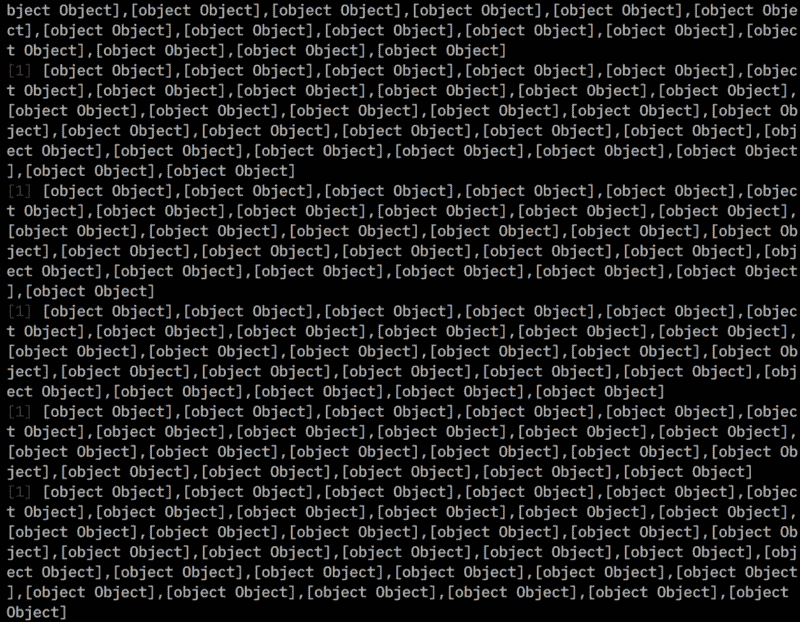
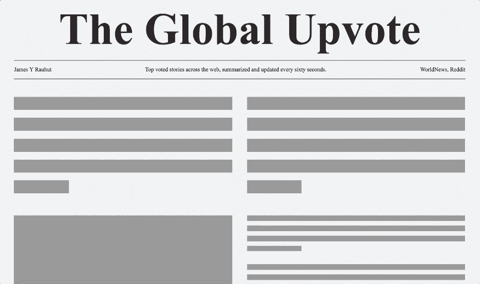
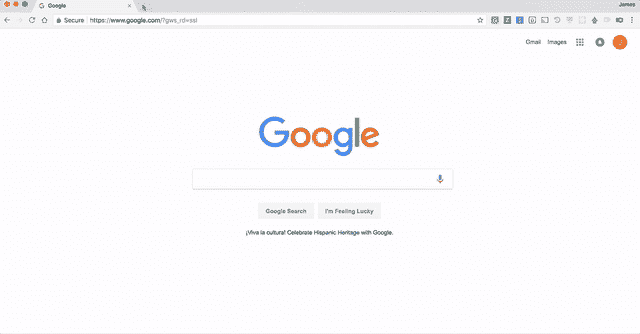
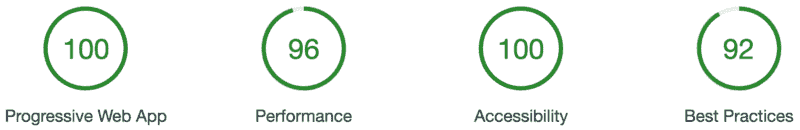

# 如何编写一个进步的 Web 应用程序新闻网站

> 原文：<https://www.freecodecamp.org/news/coding-a-newspaper-as-a-freakin-progressive-web-app-e456d4a2b9cd/>

在过去的两周里，我在做一个名为“全球向上投票”的个人项目。Global Upvote 汇总了全网投票率最高的报道，每 60 秒汇总更新一次。

这篇文章主要讲述了我是如何为有抱负的开发人员实现全球向上投票的。关于这个背后的[设计过程，我单独写了一篇文章。这两个故事看似完全不同。但是设计和开发过程在现实生活中是深深交织在一起的。](https://medium.com/@seejamescode/designing-a-newspaper-as-a-freakin-progressive-web-app-22acf4eb5a68)

注意，我已经写了一篇关于如何设计这个进步的 Web 应用新闻网站的姐妹文章[在这里](https://medium.freecodecamp.org/designing-a-newspaper-as-a-freakin-progressive-web-app-22acf4eb5a68)。

### 寻找数据

在设计中，有一个内容第一的概念。内容第一设计说你需要围绕内容进行设计。为了做到这一点，我需要确保我能够获得正确的数据。在开始任何实际的前端工作之前，我使用了 Reddit API 和我的节点服务器。

我知道我想从 Reddit 获取两部分内容:

1.  r/WorldNews 的头条新闻
2.  一个机器人用户的评论总结了这个故事



These objects were sweet, sweet Reddit data.

幸运的是，这个 API 有一个很棒的节点包装器，叫做 [Snoowrap](https://github.com/not-an-aardvark/snoowrap) 。它很容易使用，让我[很快就满足了](https://github.com/seejamescode/global-upvote/blob/master/server.js#L33-L92)。

我在这个项目中学到的一件大事是请求管理。过去，每当用户访问我的应用程序时，我都使用我的节点服务器作为 API 请求者。但是，我有一个明显的顿悟。

我可以保留服务器上的少量数据(故事),并通过简单的`setInterval`每分钟更新一次。这停止了滥用我的 Reddit API 限制的风险，并缩短了故事加载时间，因为我不必每次都 ping Reddit API。

### 保持进步

想知道在 React 中制作一个渐进式 web 应用程序的廉价、肮脏的秘密吗？使用[创建-反应-应用](https://github.com/facebookincubator/create-react-app)即可。该项目的贡献者做了一件非常棒的工作，他们为近乎即时的加载添加了服务人员，为您的元数据添加了一个清单文件，并尽可能地优化了 Webpack 捆绑。过去，我不得不为 PWAs(渐进式网络应用)做很多工作，甚至写了一篇关于完善它们的[教程](https://medium.freecodecamp.org/how-to-crank-your-progressive-web-apps-google-lighthouse-score-up-to-100-cfc053eb7661)。

这是我第一次在 Chrome 和 Firefox 的离线友好模式下工作，在我的电脑连接 wifi 之前阅读文章。

前半部分是使用事件监听器在[互联网连接](https://github.com/seejamescode/global-upvote/blob/master/src/App.js#L156-L157)改变时做一些事情。这样，一个新的互联网连接可以触发抓取故事，而一个丢失的连接可以通知用户他们离线了。

离线模式的第二部分是在每次获取新故事时将它们保存到用户的设备上。这是我第一次使用 [LocalStorage](https://github.com/seejamescode/global-upvote/blob/master/src/App.js#L192-L194) ，我对它的简单程度感到惊喜。



PWA 需要完成的最后一点是提高感知速度指数。你可以通过打开 Chrome DevTools 并运行一个[审计](https://medium.com/design-ibm/the-quick-new-way-designers-can-test-user-centric-metrics-37e78daf48df)来查看这个以用户为中心的指标。为了提高这个分数，我制作了当我的应用程序状态为[抓取](https://github.com/seejamescode/global-upvote/blob/master/src/Placeholder.js#L8)时会出现的骨架。

### 插入插件

我决定让用户能够将体验保存为 Chrome 和 Firefox 的新标签。浏览器本身支持设置主页。但是这并不能让你立即控制地址栏。这是一个重要的细节，因为用户不希望每次打开新标签页时都必须点击地址栏。



我担心我将要深入到浏览器扩展开发的最深处。这是我不熟悉的东西，除了一个网格检查器来帮助我的视觉技能。这个解决方案又一次被放在银盘子里交给了我。Google 在他们的[样本下载中包含了一个类似的扩展。](https://developer.chrome.com/extensions/samples)我很快就开始使用[全局向上投票选项卡扩展](https://github.com/seejamescode/global-upvote-tab)。提交到 Firefox 的商店甚至不需要任何修改！

### 最后的结局

从开发的角度来看，我喜欢我为全球投票而提出的所有不同的解决方案。这些解决方案告诉我，网络社区正在更好地合作，让开发体验不那么令人沮丧。面对 Chrome DevTools 审计，以前的 Google Lighthouse 扩展也变得前所未有的简单。



所有的源代码都是开源的，以防你想挖掘或者让它为你工作。

需要注意的几个快速事项:

*   CSS 文件在哪里？！没有。我使用[样式组件](https://www.styled-components.com/)将样式直接附加到它们的组件上！看看我在 IBM 做的关于 CSS-in-JS 为什么非常好的演讲:[https://vimeo.com/230614037](https://vimeo.com/230614037)
*   您的选项卡扩展的源代码在哪里？
    在[全球向上投票选项卡](https://github.com/seejamescode/global-upvote-tab)的单独回购中查看。
*   我如何开始在本地运行它？
    如果你还没有查阅过[创建-反应-应用](https://github.com/facebookincubator/create-react-app#getting-started)的文档，请查阅。
    厉害哇。您还需要在根目录中有一个名为`keys.json`的文件，其中包含您用于 [Snoowrap](https://github.com/not-an-aardvark/snoowrap) 的信息。它应该是这样的:

```
{
  "userAgent": "random-term",
  "clientId": "FromYourRedditAPISettings",
  "clientSecret": "FromYourRedditAPISettings",
  "username": "YourRedditUsername",
  "password": "YourRedditPassword"
}
```

我希望您喜欢这篇案例报道！

再次，我已经写了一篇关于如何设计这个进步的 Web 应用新闻网站的姐妹文章[在这里](https://medium.freecodecamp.org/designing-a-newspaper-as-a-freakin-progressive-web-app-22acf4eb5a68)。

如需了解更多信息:欢迎通过评论、[电子邮件](mailto:james@seejamescode.com)或 [@seejamescode](https://twitter.com/seejamescode) 联系我。我在 ATX 的 IBM Design 工作，总是喜欢和网页设计社区交流。留下你可能有的任何问题，我将尽力为你解答！