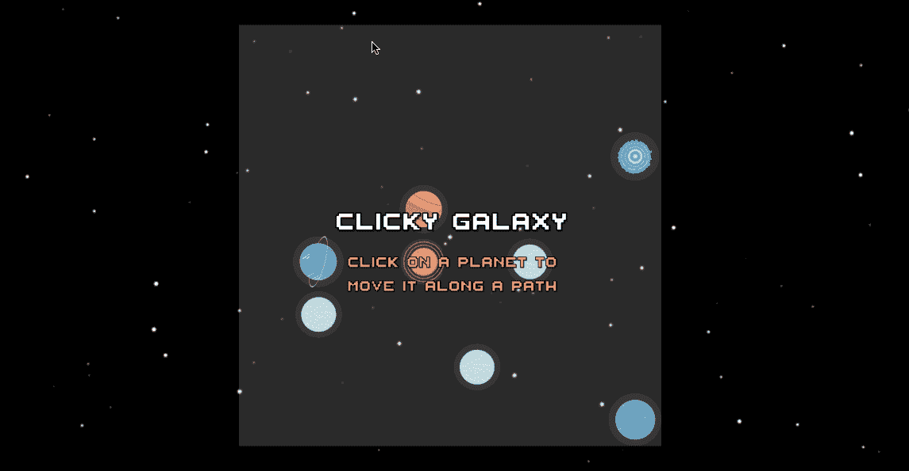
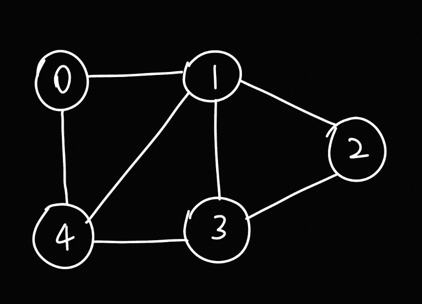
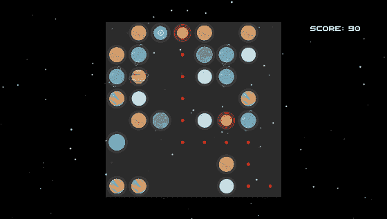
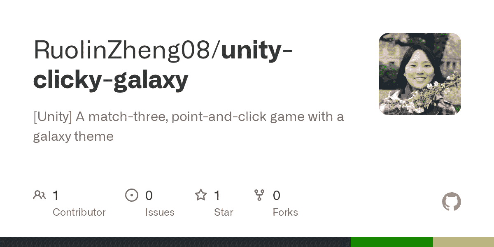

# 编码面试图遍历速成班-你唯一需要的课程

> 原文：<https://www.freecodecamp.org/news/coding-interview-graph-traversal-crash-course-the-only-one-youll-ever-need/>

你在准备编码面试吗？我设计了一系列速成课程来帮助你。

我叫 Lynn，是一名软件工程师，刚从芝加哥大学毕业。这是我的编码面试速成班系列的第三个课程。请随意查看我的 YouTube 频道，Lynn 的 DevLab，了解这个系列的最新动态。

这个速成班讲的是**图遍历。**如果你只想一头扎进去，你可以在这里找到课程(并在本文底部链接)。如果你想了解更多信息，请继续阅读。😎

[https://www.youtube.com/embed/d31vGF-Z69c?feature=oembed](https://www.youtube.com/embed/d31vGF-Z69c?feature=oembed)

## 介绍

我们将介绍两种常见的图遍历技术:**深度优先搜索(DFS)** 和**广度优先搜索(BFS)。**

我们将首先了解它们是如何工作的，以及如何用代码实现它们。然后，我们将通过解决一个 LeetCode 问题来了解算法的运行情况，并查看我如何在我的游戏[**【Clicky Galaxy**](https://github.com/RuolinZheng08/unity-clicky-galaxy)**(也是我学习 Unity 时的第一个游戏)中应用图遍历😉).**

**

Clicky Galaxy, a game I made when learning Unity** 

## **课程大纲**

**[本课程视频](https://youtu.be/d31vGF-Z69c)时长 1 小时，主要内容包括:**

*   **对图、DFS 和 BFS 的高级描述**
*   **DFS 实施**
*   **BFS 实施**
*   **如何找到源节点和目的节点之间的路径**
*   **LeetCode Demo: 785。图是二分的吗？**
*   **Unity C#中的 Clicky Galaxy 演示和图形遍历🚀**

**图表是谷歌、微软和脸书等顶级科技公司最喜欢的面试主题。更重要的是，它在游戏开发这样的实际软件工程中也很有趣和有用。让我们在我的课程中一起探讨这个话题吧！**

## **图的定义**

**我们将使用下图来显示两种遍历算法的遍历路径。**

****

**我们可以通过将每个节点映射到其邻居列表来表示该图，如以下 Python 代码片段所示:**

```
`graph = {
    0: [1, 4],
    1: [0, 2, 3, 4],
    2: [1, 3],
    3: [1, 2, 4],
    4: [0, 1, 3]
}`
```

## **如何使用深度优先搜索**

**顾名思义，DFS 在搜索中优先考虑深度。**

**对于一个给定的节点(比如 1)，在访问了它的一个邻居(比如 0)之后，它不是立即访问其余的邻居(节点 2、3 和 4)，而是缓存那些邻居，并立即恢复对 0 的邻居的访问。只有当它用尽深度时，它才会返回到那些缓存的邻居。**

### **迭代实现**

```
`def dfs(graph, start):
  visited, stack = set(), [start]
  while stack:
    node = stack.pop()
    if not node in visited:
        # perform some operations on the node
        # for example, we print out the node
        print('Now visiting', node)
    visited.add(node)
    for neighbor in graph[node]:
      if not neighbor in visited:
        stack.append(neighbor)
  return visited`
```

**在这个模板中，注释行是我们可以在节点上执行一些操作的地方:例如，打印出它的值，检查是否相等，等等。**

**我们跟踪被访问过的名为**的集合**，以避免多次访问图中有循环的同一个节点，就像上面的例子图一样。**

**在我们上面定义的图上运行这段代码会产生下面的输出:**

```
`Now visiting 0
Now visiting 4
Now visiting 3
Now visiting 2
Now visiting 1`
```

## **如何使用广度优先搜索**

**BFS 在搜索中优先考虑广度。对于一个给定的节点，它在移动到邻居的邻居之前访问它的所有直接邻居。**

### **迭代实现**

```
`def bfs(graph, start):
  visited, queue = set(), deque([start])
  while queue:
    node = queue.popleft()
    if not node in visited:
        # perform some operations on the node
        print('Now visiting', node)
    visited.add(node)
    for neighbor in graph[node]:
      if not neighbor in visited:
          queue.append(neighbor)
  return visited`
```

**在我们上面定义的图上运行这段代码会产生下面的输出:**

```
`Now visiting 0
Now visiting 1
Now visiting 4
Now visiting 2
Now visiting 3`
```

## **如何找到源和目的地之间的路径**

**现在我们已经看到了如何使用 DFS 和 BFS 来遍历整个图并打印出整个遍历历史，我们可以对模板做一些小的修改，以在图中的任意两个节点之间找到一个**路径**(如果这样的路径存在的话)。**

**在每条边都具有相同权重的图上，BFS 等价于 **Dijkstra 的最短路径算法**。它查找源节点和目的节点之间的最短路径(节点数最少的路径)。这是 DFS 路径搜索所不具备的一个很好的特性。**

**下面是我们如何修改 DFS 模板以返回给定一个 **src** 和一个 **dst** 节点的路径:**

```
`def dfs_path(graph, src, dst):
  stack = [(src, [src])]
  visited = set()
  while stack:
    node, path = stack.pop()
    if node in visited:
      continue
    if node == dst:
      return path
    visited.add(node)
    for neighbor in graph[node]:
      stack.append((neighbor, path + [neighbor]))
  return None`
```

**BFS 也是如此:**

```
`def bfs_path(graph, src, dst):
  visited, queue = set(), deque([[src]])
  while queue:
    path = queue.popleft()
    node = path[-1]
    if node in visited:
      continue
    if node == dst:
      return path
    for neighbor in graph[node]:
      queue.append(path + [neighbor])
  return None`
```

## **让我们解决一个 LeetCode 问题！**

**现在让我们应用我们所学的关于图遍历的知识来解决一个关于 785 的问题。图是二分的吗？**

**根据[这篇文章](https://www.geeksforgeeks.org/bipartite-graph/)，我们需要的是一个修正的 BFS 算法:**

> **下面是一个简单的算法，使用广度优先搜索(BFS)来确定一个给定的图是否是二分的。
> 1。将红色分配给源顶点(放入集合 U)。
> 2。给所有的邻居涂上蓝色(放入集合 V)。
> 3。给所有邻居的邻居涂上红色(放入集合 U)。
> 4。这样，给所有顶点分配颜色，使得它满足 m 路着色问题的所有约束，其中 m = 2。
> 5。在分配颜色时，如果我们找到一个与当前顶点颜色相同的邻居，那么这个图不能用 2 个顶点着色(或者这个图不是二分图)**

**堵住我们的模板，解决方案就这么简单。查看[我的视频](https://youtu.be/d31vGF-Z69c)获得逐行解释。**

```
`RED = 0
BLUE = 1
from collections import deque

class Solution:
    def isBipartite(self, graph: List[List[int]]) -> bool:
        if not graph:
            return False
        queue, visited = deque([]), set()
        for v in range(len(graph)):
            if v in visited:
                continue
            queue.append(v)
            node_colors = {v: RED}
            while queue:
                node = queue.popleft()
                visited.add(node)
                my_color = node_colors[node]
                for neighbor in graph[node]:
                    if neighbor in node_colors and node_colors[neighbor] == my_color:
                        return False
                    if not neighbor in visited:
                        queue.append(neighbor)
                    node_colors[neighbor] = RED if my_color == BLUE else BLUE

        return True`
```

## **行动中的图形遍历:Clicky Galaxy，我的游戏**

**关于图遍历的另一个有趣的演示:Clicky Galaxy🚀，一个我在学 Unity 的时候做的随便的 match-three 游戏。**

****

**在游戏中，你将一个行星移动到一个空的单元格中，当有三个或更多相同的行星水平或垂直排列时得分。一颗行星只能水平或垂直运动，其运动路径不能被其他行星遮挡。**

**我应用了图形遍历来检查玩家点击的星球和目标单元格之间的有效路径，以确定星球是否可以移动到该单元格。**

**网格中的每个单元格都是一个节点，有四个直接邻居:上、下、左、右。因为我想在源和目的地之间找到一条最短的路径(如果存在的话)， **BFS 寻路**非常适合我的用例。**

**下面是我的代码在 C#中的样子。我使用了一个名为 **GetNeighbors** 的助手来获取四个直接邻居，忽略越界的邻居。**

```
`List<Vector2Int> BreadthFirstSearch(Vector2Int srcIndices, Vector2Int dstIndices) {
    // identify a path from srcIndices to dstIndices, could be null
    // the path include src and dst
    HashSet<Vector2Int> visited = new HashSet<Vector2Int>();
    Queue<List<Vector2Int>> pathQueue = new Queue<List<Vector2Int>>();

    List<Vector2Int> startPath = new List<Vector2Int>();
    startPath.Add(srcIndices);
    pathQueue.Enqueue(startPath);

    while (pathQueue.Count > 0) {
        List<Vector2Int> path = pathQueue.Dequeue();
        Vector2Int node = path[path.Count - 1];
        if (visited.Contains(node)) {
            continue;
        }
        if (node == dstIndices) { // done
            return path;
        }
        visited.Add(node);
        List<Vector2Int> neighbors = GetNeighbors(node);
        foreach (Vector2Int neighbor in neighbors) {
            Sprite sprite = GetSpriteAtIndices(neighbor.x, neighbor.y);
            if (sprite == null) { // can visit this next
                List<Vector2Int> newPath = new List<Vector2Int>(path);
                newPath.Add(neighbor);
                pathQueue.Enqueue(newPath);
            }
        }
    }

    return null;
}

List<Vector2Int> GetNeighbors(Vector2Int indices) {
    // return the four immediate neighbors, left, right, up, down
    List<Vector2Int> neighbors = new List<Vector2Int>();
    if (indices.x >= 0 && indices.x < gridDimension && indices.y >= 0 && indices.y < gridDimension) {
        if (indices.y >= 1) {
            neighbors.Add(new Vector2Int(indices.x, indices.y - 1));
        }
        if (indices.y < gridDimension - 1) {
            neighbors.Add(new Vector2Int(indices.x, indices.y + 1));
        }
        if (indices.x >= 1) {
            neighbors.Add(new Vector2Int(indices.x - 1, indices.y));
        }
        if (indices.x < gridDimension - 1) {
            neighbors.Add(new Vector2Int(indices.x + 1, indices.y));
        }
    }
    return neighbors;
}`
```

**我的游戏和这个算法结合得非常好！**

****

## **最后的想法**

**在这个速成课程中，我们学习了两种图遍历算法，DFS 和 BFS。我们首先在实现中看到它们，然后在 LeetCode 问题和我的游戏中看到它们。**

**如果你喜欢图表，想想它们与树的关系。剧透警报！树中的前序遍历本质上是图中的 DFS，而树中的级序遍历本质上是图中的 BFS。🤫**

**尝试自己解决这个问题，或者观看[我的树遍历速成班](https://youtu.be/uaeCfsCcYWo)复习一下。相信我，算法很有趣！😃**

## **资源**

**点击此处观看课程:**

 **[https://www.youtube.com/embed/d31vGF-Z69c?feature=oembed](https://www.youtube.com/embed/d31vGF-Z69c?feature=oembed)** 

**访问我的 GitHub 上的代码模板:**

**[[Algo] Graph Traversal Template[Algo] Graph Traversal Template. GitHub Gist: instantly share code, notes, and snippets.262588213843476Gist](https://gist.github.com/RuolinZheng08/a86a3940a23d653bae4d5c399c06639e)**

**在我的 GitHub 上查看 Clicky Galaxy:**

**[GitHub - RuolinZheng08/unity-clicky-galaxy: [Unity] A match-three, point-and-click game with a galaxy theme[Unity] A match-three, point-and-click game with a galaxy theme - GitHub - RuolinZheng08/unity-clicky-galaxy: [Unity] A match-three, point-and-click game with a galaxy themeRuolinZheng08GitHub](https://github.com/RuolinZheng08/unity-clicky-galaxy)**

**与整个速成系列保持同步:**

**[Coding Interview Crash CoursesHere is my list of coding interview crash courses. Let’s crunch coding interviews and have fun while doing it!YouTube](https://youtube.com/playlist?list=PLKcjA7XxXuvSsE-_heuBxIvzWcx4IKfXD)**

**最后，欢迎订阅我的 YouTube 频道，获取更多类似的内容:)**

**[Lynn’s DevLabHi, I’m Lynn. I’m a Software Engineer and hobbyist Game Developer. I completed my joint BS/MS degree in Computer Science in four years at the University of Chicago, graduating in 2021.Here at my channel, you can expect to enjoy monthly updates of fun technical project tutorials, my game dev demos, …YouTube](https://www.youtube.com/channel/UCZ2MeG5jTIqgzEMiByrIzsw)**