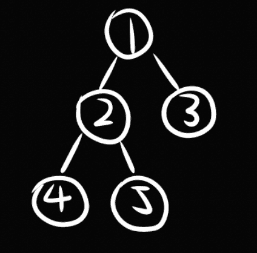
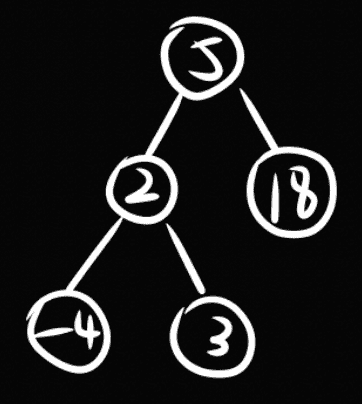
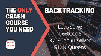

# 编码面试树遍历速成班——你唯一需要的课程

> 原文：<https://www.freecodecamp.org/news/coding-interview-tree-traversal-crash-course-the-only-one-youll-ever-need/>

你在准备编码面试吗？我设计了一系列速成课程来帮助你。

我叫 Lynn，是一名软件工程师，刚从芝加哥大学毕业。这是我的编码面试速成班系列的第二个课程。请随意查看我的 YouTube 频道，Lynn 的 DevLab，了解这个系列的最新动态。

这个速成班是关于树遍历的。如果你只想一头扎进去，[你可以在这里找到课程](https://youtu.be/uaeCfsCcYWo)(链接在本文底部)。如果你想了解更多信息，请继续阅读。😎

## 这门课程是为谁开设的，什么是树遍历算法？🌳

如果你已经对**树**数据结构有所了解，你将会从本课程中获益匪浅。如果你需要复习，请查看[的这些](https://www.freecodecamp.org/news/binary-data-structures-an-intro-to-trees-and-heaps-in-javascript-962ab536cb42/) [教程](https://www.freecodecamp.org/news/the-codeless-guide-to-tree-data-structures/)。

我们将涵盖**二叉树**和 **N 叉树**的遍历算法(其中每个父节点有任意数量的子节点)。

如果你以前听说过二分搜索法树(BST ),那是一种特殊类型的二叉树，所以我们在这里学习的技术也适用。

树木是谷歌、微软和脸书等顶级科技公司最喜欢的面试主题，所以让我们来研究一下这个话题吧！

我们将学习四种遍历技术，并动手解决它们相应的 LeetCode 问题。

这四种技术是:

*   **预先排序(深度优先搜索，DFS)**
*   **后期订单**
*   **有序**
*   **等级顺序(广度优先搜索，BFS)。**

## 课程大纲

本课程视频共 30 分钟，包括以下内容:

*   四种遍历技术的高级描述:**前序、后序、按序和层次顺序**
*   **递归**前序、后序和按序的实现(注意:这不适用于层级顺序)
*   **前序、后序、按序和层级顺序的迭代**实现
*   模板从**二叉树**到 **N 叉树**的扩展

让我们深入下面的四种技术。

## 使用示例树的树遍历演示

我们将使用下面的树来演示四种遍历技术的输出。

注意，这个树是一个简单的二叉树，而不是二叉查找树(BST)。BST 是一种特殊类型的二叉树，所以我们的技术也适用。同样，当我们使用 BST 时，**有序遍历**变得特别有趣，正如我们将在下面看到的。



An example Binary Tree. Note that it's not a Binary Search Tree (BST).

给定此树，四种技术的遍历结果如下:

*   预购:1，2，4，5，3
*   后顺序:4，5，2，3，1
*   按顺序:4，2，5，1，3
*   等级顺序:1，2，3，4，5

### 前序遍历

如果我们将树作为一个图来分析，并在搜索中以树根节点作为我们的开始节点，那么前序遍历也被称为**深度优先搜索(DFS)** 。

和上面的例子一样，在访问作为某个父节点的左子节点的任何其他节点之前，我们一直向下到最左边的**节点。**

前序遍历允许我们先探索根，再探索叶，因此对于像复制一棵树这样的任务来说是理想的。

### 后序遍历

后序遍历与前序遍历相反，允许我们先探索叶子再探索根。

### 有序遍历

有序遍历对于将树展平为数组表示特别有用。

对于下面这样的二叉查找树，按序遍历输出一个有序的非降序数组:-4，3，2，5，18。



Binary Search Tree example

### 层次顺序遍历

如果我们把树看作一个图，并从树根节点开始搜索，层次顺序遍历也被称为**广度优先搜索(BFS)** 。

在移动到下一层之前，我们访问当前层(深度)上的每个节点。实际上，在访问更远的邻居之前，我们先访问当前节点的近邻(一步之遥)。

## 如何实现这四种技术

我们将对二叉树的节点使用以下定义:

```
# Definition for a binary tree node.
# class TreeNode:
#     def __init__(self, val=0, left=None, right=None):
#         self.val = val
#         self.left = left
#         self.right = right
```

### 递归实现

递归实现是最简单的。要记住的最重要的事情是我们将两个递归调用的结果(一个在左子树上，一个在右子树上)与当前节点的值连接起来的顺序。

```
def preorder(root):
    if not root:
        return []
    return [root.val] + preorder(root.left) + preorder(root.right)
```

```
def postorder(root):
    if not root:
        return []
    return postorder(root.left) + postorder(root.right) + [root.val]
```

```
def inorder(root):
    if not root:
        return []
    return inorder(root.left) + [root.val] + inorder(root.right)
```

### 迭代实现

与递归实现相比，迭代实现非常重要。大多数都要求我们使用堆栈或队列来跟踪我们需要访问的节点。

```
def preorder(self, root):
    if not root:
        return []
    ret = []
    stack = [root]
    while stack:
        node = stack.pop()
        ret.append(node.val)
        # note that we append the right child before the left child
        if node.right:
            stack.append(node.right)
        if node.left:
            stack.append(node.left)
    return ret
```

```
def postorder(self, root):
    if not root:
        return []
    from collections import deque
    ret = deque()
    stack = [root]
    while stack:
        node = stack.pop()
        ret.appendleft(node.val)
        if node.left:
            stack.append(node.left)
        if node.right:
            stack.append(node.right)
    return ret
```

有序遍历的实现看起来与前序和后序非常不同:

```
def inorder(self, root):
    if not root:
        return []
    ret = []
    stack = []
    while root is not None or stack:
        while root is not None:
            stack.append(root)
            root = root.left
        root = stack.pop()
        ret.append(root.val)
        root = root.right
    return ret
```

最后，我们有层次顺序遍历，我们将输出结果为`[[nodes on the first level], [nodes on the second level], [nodes on the third level], ...]`。

```
def levelorder(self, root):
    if not root:
        return []
    ret = []
    from collections import deque
    queue = deque([root])
    while queue:
        ret_row = []
        # fixed size for current level
        for _ in range(len(queue)):
            node = queue.popleft()
            ret_row.append(node.val)
            if node.left:
                queue.append(node.left)
            if node.right:
                queue.append(node.right)
        ret.append(ret_row)
    return ret
```

### n 元树

我们现在将模板从处理二叉树扩展到处理 N 叉树。我们对 N 元树的节点使用以下定义:

```
class Node:
    def __init__(self, val=None, children=[]):
        self.val = val
        self.children = children
```

为了扩展我们的迭代实现来处理 N 元树，我们需要做的就是确保我们以正确的顺序附加了将要访问的子节点。

回想一下，在前序遍历中，我们在左孩子之前附加了右孩子。因此，当追加一个 N 元树节点的子节点时，我们需要反转子节点列表。

```
def preorder(self, root):
    if not root:
        return []
    ret = []
    stack = [root]
    while stack:
        node = stack.pop()
        ret.append(node.val)
        # reverse the list of children
        for child in node.children[::-1]:
            stack.append(child)
    return ret
```

对于其他遍历技术，由于我们从左到右追加孩子，我们可以正常地迭代孩子列表:

```
def postorder(self, root):
    if not root:
        return []
    from collections import deque
    ret = deque()
    stack = [root]
    while stack:
        node = stack.pop()
        ret.appendleft(node.val)
        for child in node.children:
            stack.append(child)
    return ret
```

```
def levelorder(self, root):
    if not root:
        return []
    ret = []
    from collections import deque
    queue = deque([root])
    while queue:
        ret_row = []
        # fixed size for current level
        for _ in range(len(queue)):
            node = queue.popleft()
            ret_row.append(node.val)
            for child in node.children:
                queue.append(child)
        ret.append(ret_row)
    return ret
```

现在我们可以将我们的树遍历模板应用于每个节点有任意数量的子节点的树。

## 结论

在这个关于树遍历的速成课程中，我们学习了四种技术:前序、后序、按序和层次序。我们讨论了它们的区别以及它们最适合做什么工作。

我们还以递归和迭代的方式实现了它们。最后但同样重要的是，我们不仅扩展了处理二叉树的技术，还扩展了处理 N 元树的技术。

我希望现在你对遍历树面试问题更有信心了。这也是我下一个关于图遍历的速成课程的主题的一个很好的继续。

有了前序遍历和级序遍历的知识，DFS 和 BFS 不会完全出乎你的意料🤓我甚至会谈到我在为我的第三场比赛游戏 Clicky Galaxy 开发算法时是如何应用图遍历的，敬请关注！

## 资源

点击此处观看课程:

[https://www.youtube.com/embed/uaeCfsCcYWo?feature=oembed](https://www.youtube.com/embed/uaeCfsCcYWo?feature=oembed)

访问我的 GitHub 上的代码模板:

[[Algo] Tree Traversal Template[Algo] Tree Traversal Template. GitHub Gist: instantly share code, notes, and snippets.262588213843476Gist](https://gist.github.com/RuolinZheng08/f6e55b09eb096fe5fe630249cd859b07)

查看整个速成班系列:

[Coding Interview Crash CoursesHere is my list of coding interview crash courses. Let’s crunch coding interviews and have fun while doing it!YouTube](https://youtube.com/playlist?list=PLKcjA7XxXuvSsE-_heuBxIvzWcx4IKfXD)

最后，欢迎订阅我的 YouTube 频道，获取更多类似的内容:)

[Lynn’s DevLabHi, I’m Lynn. I’m a Software Engineer and hobbyist Game Developer. I completed my joint BS/MS degree in Computer Science in four years at the University of Chicago, graduating in 2021.Here at my channel, you can expect to enjoy monthly updates of fun technical project tutorials, my game dev demos, …YouTube](https://www.youtube.com/channel/UCZ2MeG5jTIqgzEMiByrIzsw)