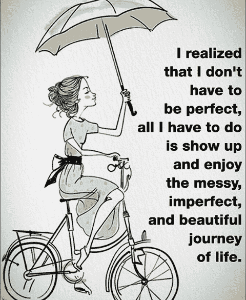
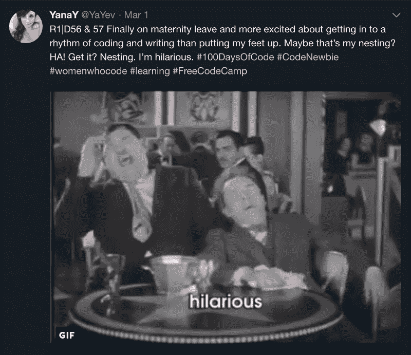
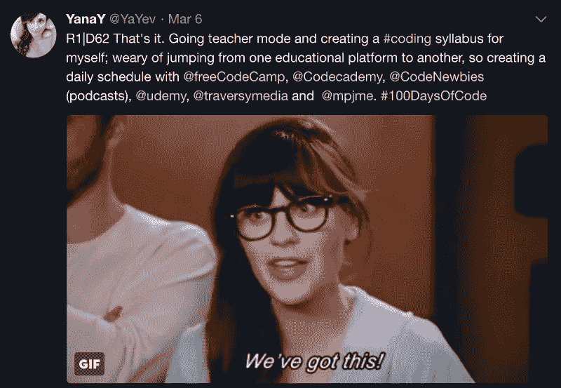
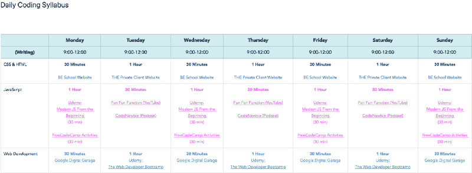
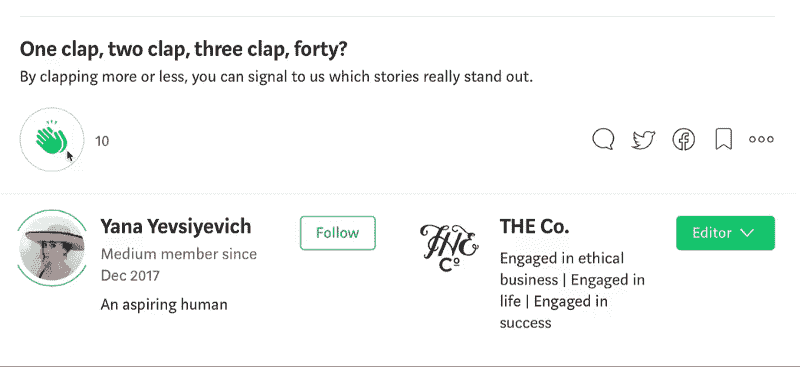

# 为什么编码和善良是携手并进的，我是如何学会善待自己的

> 原文：<https://www.freecodecamp.org/news/coding-kindness-41e6cf3d5f83/>

亚娜·叶夫西耶维奇

# 为什么编码和善良是携手并进的，我是如何学会善待自己的

在我丈夫的鼓励下，开始参加#100DaysOfCode 挑战，我学到了一些意想不到的东西。首先，正如我在我的文章 [*中所探讨的，一个编程新手|我感觉最接近躁郁症*](https://medium.com/@yanayev/a-newbie-coding-the-closest-i-feel-to-being-bipolar-8c8179bd84d1) ，这可能是一个非常情绪化的经历。

第二，更出乎意料的是，这一经历不断强调了善良的重要性。这种善意不会减损挑战的严肃性、承诺或严格性。这是我发现最令人惊讶和迷惑的。

作为一个正在恢复的完美主义者(见本文[文章](https://medium.com/the-co/5-steps-towards-blissful-imperfection-from-a-recovering-perfectionist-7d0fae98f57a))，我每天的战斗是保持可接受的控制水平和个人高标准，同时保持理智。这比看起来要困难得多。

这从本质上来说，对于那些患有控制问题或完美主义的人来说，并不适合伟大的自爱或宽恕。相反，它几乎定义了一种奇怪的情感二元结构。一方面，你可能会达到当天的标准，在这种情况下，你会欣喜三秒钟，然后迅速设定下一个雄心勃勃但几乎不可能实现的目标。或者，另一方面，你没有达到当天的标准，在这种情况下，你疯狂地恐慌，发起一场淫秽程度的存在主义危机，并提醒自己，这再次证明你不值得与人交往。

对于一个完美主义者来说，任何达不到军事精度的东西都是不可接受的，并且是承诺减弱或无能的表现。

这种心态，在空间上尽可能远离增长的心态，对于编码来说不是一个好兆头(或者一般的生活，但那是另一篇文章)。编码就是奋斗和奋斗。编码就是成为一个专业的错误制造者。编码就是认识到个人的局限性。但这也是关于成为一个鼓励、关爱、现实、乐于助人和好奇的社区的一部分。

在 Twitter 上，我已经变得非常喜欢#100DaysOfCode ( [亚历山大·卡拉威](https://www.freecodecamp.org/news/coding-kindness-41e6cf3d5f83/undefined))社区，以及 freeCodeCamp ( [昆西·拉森](https://www.freecodecamp.org/news/coding-kindness-41e6cf3d5f83/undefined))、[编码女性、](https://www.freecodecamp.org/news/coding-kindness-41e6cf3d5f83/undefined) [编码新手](https://twitter.com/CodeNewbies)和许多其他社区。更不用说那些学习 Javascript 的勇敢的人了。

在编码挑战的过程中，他们已经成为一个编码新手所希望的最精彩多样的啦啦队员和母鸡妈妈。从他们身上，我学到了一些宝贵的经验。

#### 第一课:你并不孤单

也许这次经历中最不和谐的一面是我并不孤单。追求完美往往是一场孤独而黑暗的战斗，与那些不关心情感或精神健康的恶魔战斗。当你意识到其他人也感受到挫折、困惑、小胜利和大胜利时，它们就更加人性化了。作为人类，我们真正渴望的是联系和理解。有人在听我说话吗？有人听到我吗？有人关心我吗？这些是我们在体验人类状况时会问的问题。

在编码的世界里，*每个人*都知道幻想扼杀代码行是什么感觉，因为你盯着它们看了 7 个小时，才意识到你漏掉了一个逗号，现在眼睛在抽搐。

每个人都知道阅读或聆听 28 次挑战指令是什么感觉，因为你几乎 97%确定这些句子没有可传达的意义，而挑战的一部分是破译英语的巨大(白痴般的非语音)代码。

每个人都知道最终得到你想要的结果是什么感觉，像个疯子一样在房间里跳舞，然后意识到你完全不知道你是怎么做到的。

你的那些看似愚蠢(我指的是 D.U.M.B .)的问题(认为你是世界上唯一一个想知道模数运算符有什么该死的目的的人)，它们是完全合法的，每个人都有同样的疑问。

也许除了你丈夫为相关婴儿名字的编码创建了一个 twitter 投票(说真的，这包括 JSON 和 Codie)之外，知道你并不孤单是一种无尽的安慰。以太中的某个人不仅经历了起起落落，他们还在耐心地等待一个相信你的机会。

这很美。

#### **第二课:完美不存在于此**

如果编码的大门上有一个标志，那就是*滚开，完美——你在这里没有家！很容易想象编码是关于完美的，在某种程度上，这是真的。毕竟，除非遵循特定的语法并正确编写，否则代码不会起作用或执行。但是任何传达意思或动作的语言都是如此。然而，除此之外，还有一个充满创造力和混乱的世界。这与其说是关于代码本身，不如说是关于代码背后的人。*

编码是一种不断进化的野兽，似乎每天都有新的语言、程序、平台或资源可用(或者至少你已经发现了)！这足以让你头晕目眩。因此，学习的机会是无限的。混乱、错误、困惑和不知所措的机会也是如此。对于任何有控制问题的人来说，这是令人生畏的。

上周早些时候，我达到了这种恐慌的顶点。休产假的时候，我厚颜无耻地认为我会继续我的#100DaysOfCode，这样我就会成为下一个杰出的女性程序员(下面的例子 A)，但我远远没有达到目标。哦，傲慢。

相反，我花了一周时间小睡和狂看英国最佳避孕方式的剧集，每分钟都有一部诞生。哦，亲爱的摩西，离你预产期还有一周的时候，不要告诉我！

关键是，当我五天后从疯狂观看的迷迷糊糊中醒来时，我有一种全面的内疚感，内心有点像这样(有点像你睡过头了，在 T-12 分钟内有一场考试):

> 见鬼，我完全浪费了这段宝贵的时间！我本可以征服编码，并建立一个数百万美元的创业公司！新币#！新币#！新币#！孩子一周后就要出生了，我在 R1 |挑战的第 62 天。新币#！新币#！新币#！必须学习互联网。等等，我今天洗澡了吗？我头发里到底有什么？新币#！专注！好吧。啊，干得好，新手程序员，大多数人会扯下一个肢体，有这个时间编码没有中断！你不擅长 Javascript——你应该花更多的时间。可耻，只是可耻。说真的，你头发里到底有什么？！你真是一团糟——去把自己收拾干净。我现在都不敢看你。

听着，我从没说过这是理性的，甚至在现实世界里也没有！

远远没有达到我的高标准或期望(从疯狂观看的盛宴中走出来后，我有点担心我的个人卫生)，我感到完全彻底的失败。是的，我每天都做一些与编码相关的事情，但是没有达到我对自己期望的规模。因此，我不得不仔细思考我的兴奋和热情是否(以及为什么)在潜意识里似乎减弱了。

我意识到这是因为两个非常相关的原因:首先，因为我被材料的数量和多样性淹没了。要学的东西太多了，要用的资源太多了，光是想到所有的选择就可能让人筋疲力尽！第二，因为我对自己想要完成的目标没有明确的目标。一旦我意识到这一点，我不得不面对我的失败感，并找到一种富有成效的前进方式。

我创建了每日编码大纲，不仅帮助我专注于我想从事的编码领域(为了清晰)，还帮助我为我想使用的资源分配适当的时间(为了理智)。这样，我所有的基础都被覆盖了，我也不会感到不知所措。值得称赞的是，编码社区的人非常鼓励我，一路上都在为我加油！

这并不意味着每天都是完美的。我不得不坐下来听一句严厉但温和的话。这就引出了我的最后一点。

#### **第三课:** **为人和善**

虽然我还没有完成我的挑战，但迄今为止我学到的最重要的一课是，没有善良，你就无法茁壮成长。善良的一部分来自于认清现实和优先事项。对我来说，这意味着认识到应对疲惫是成长的一部分，休息会优先于数小时的编码——这并不意味着我是一个失败者。

这也意味着挑战意味着你的生活会与众不同。是的，当然有指导方针(看看[昆西·拉森](https://www.freecodecamp.org/news/coding-kindness-41e6cf3d5f83/undefined)的[文章](https://medium.freecodecamp.org/the-crazy-history-of-the-100daysofcode-challenge-and-why-you-should-try-it-for-2018-6c89a76e298d)和#100DaysOfCode [网站](http://www.100daysofcode.com/))，但最终方法完全取决于你。

也有卖弄学问的时候，也有友善地关上电脑屏幕深呼吸几下的时候。你脑海中那些消极的声音绝不敢对任何人这样说话，你也应该一样。

你对你的程序员同事倾注的爱、鼓励、热情和骄傲……嗯，也对你自己倾注一点吧！不仅仅是当你达到自己的高标准时。事实上，每天做一些与编码相关的事情(无论你能做多少),并享受一会儿。

编码社区帮助我认识到，就像所有真正的旅程一样，编码没有终点。所以，让我们在通往伟大的道路上为自己和彼此加油吧。

