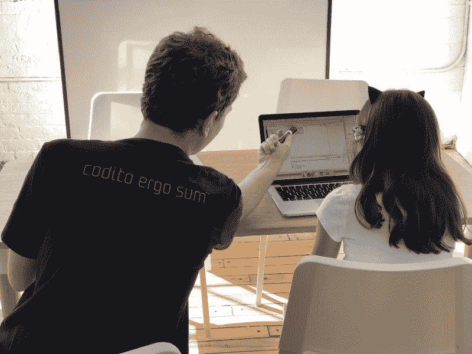
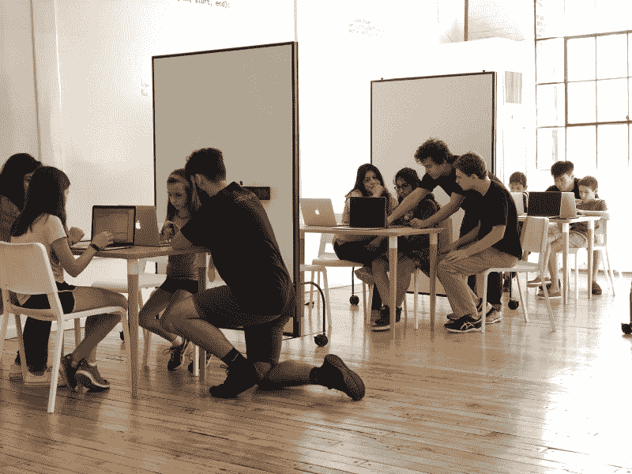
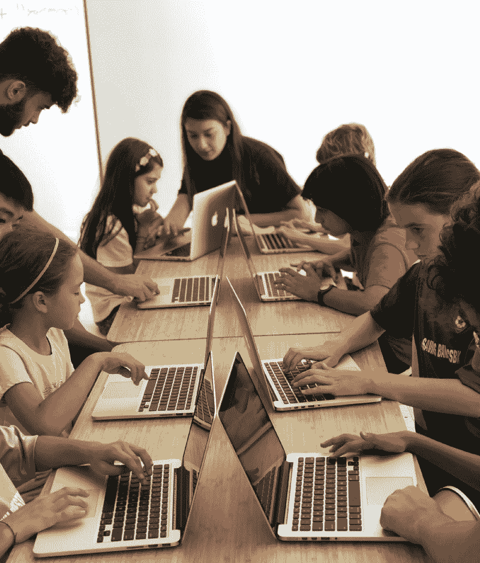

# 编码我们的技术头脑的孩子成为明天的自我实现的老师

> 原文：<https://www.freecodecamp.org/news/coding-our-tech-minded-kids-to-become-self-actualized-teachers-of-tomorrow-31c4219a8584/>

作者史蒂文·芬克

# 编码我们的技术头脑的孩子成为明天的自我实现的老师

今天的编码学校应该做的不仅仅是教孩子们 Java 和 Python。他们应该帮助他们成为教授 Java 和 Python 的专家。

这是我在成立技术营后的几年里学到的许多经验之一。2002 年，当我们来到纽约州 SUNY 市普什学院的校园时，我们很快意识到，让我们分开的——父母真正欣赏的——并不是我们的营员回国后所具备的基础知识。

相反，我们的成功是因为我们有能力向这些孩子展示，他们周围都是不同但志趣相投的孩子。有一个社区，在那里他们可以对自己的皮肤感到舒适。最重要的是，我们课程作业的协作性和支持性让他们成为领导者——通常是我们班上其他孩子非常尊敬的有影响力的编码老师。

在 [SummerTech](http://www.summertech.net/) 和 [Coditum](http://www.coditum.com/) ，我们面向 8-17 岁学生的全年编码实验室——每个学生都开始走上成为教师的道路。虽然这可能不是每个人的长期现实，但这种方法培养了一定程度的互动，这对我们的学生理解材料和他们成为完全自我实现的个人的能力都非常有益。

**三比一比率**

对于我们的班级，我们采用了几乎闻所未闻的 3:1 师生比例，创建了四人会议，既沉浸式又高度协作。虽然拥有如此多的教师需要我们付出相当大的努力，但其结果——为数以千计的年轻人提供真正有影响力的编码教育和重要的社交活动——已被证明是值得投资的。

如果你是一名公立学校的教育工作者，你可能会读到这里并想:“哈，3 比 1 的师生比。好主意。这永远不会飞到这里。”

但是为什么不呢？想象一下，你可以花一点时间教十几个七年级的学生如何编程。如果在八年级，他们有机会与比自己小一点的孩子分享这些知识，这对学校和学生来说有多大价值？

这就是所谓的双赢。每个人都变聪明了。

虽然互联网上充满了 Java 和 Python(当今最普遍认可和可访问的计算机编码平台)的完美课程，但我们没有使用在线课程。

我们的课程是由学生、他们的同龄人和我们的老师之间的互动推动的。使用笔记本电脑和白板，他们一起处理课程，确保它在一个基本的水平上理解。

在小组中，也更容易将学生与最适合他们特定学习需求的同龄人和老师相匹配。不是每个人的工作节奏都一样，有些人的性格并不完全适合其他人。小组规模小便于即时调整。

**‘社交总监’**

杰克·龙威是教育领域领导力发展的一个很好的例子。杰克是土生土长的纽约州拉伊人，当他 10 岁加入我们的 SummerTech 时，他是一个内向的人。他和我们在一起的头三个星期几乎不说话，但我们给他时间敞开心扉。他和我们一起度过了许多个夏天，成长为一流的班主任，也是他的父亲拉里现在称之为“游轮社交总监”的人。

杰克目前在加州大学圣克鲁斯分校学习计算语言学。

“称之为变革是轻描淡写，”杰克谈到他从害羞的学生转变为外向教师的经历。“我理解各种概念的能力呈指数级增长。我对与他人相处的整个看法发生了变化，最重要的是，我觉得我真的找到了自己的家。”

为了让你了解我们的模式在实践中是如何运作的，这里是我们如何构建 Coditum 的:在 15 岁或 9 年级之后，在完成我们课程的前五个模块后，学生可以成为实习生。在 10 个班的辅导班之后，他们会接受一次技术审查，如果成功的话，他们可以成为带薪的初级教师。进入大学后，他们会晋升到高级教师的职位。

通常，你会看到编码学校和营地广告说他们不使用初级教师或培训辅导员(CITs)。他们说，只给你的孩子最好的！我非常不同意这种哲学。

当这些学校告诉兴奋的孩子们“这里没有你的位置……走开”时，他们应该加倍努力学习学生刚刚学到的技能，让他们通过成为教师在更深的层次上理解这些知识，并磨练成为领导者所需的社交技能。当他们有一天坐下来参加工作面试时，这将是有所不同的，而不是他们是否通过了大学计算机科学课程。

当然，他们会通过那门课程，因为在小团体中与你的同龄人互动是有趣的，有趣导致学习。例如，在 SummerTech，我们在大约三到四周的教学中涵盖了整个 AP 计算机科学课程。

伦斯勒理工学院 19 岁的贾里德·奥肯(Jared Okun)也是我们的学生教师之一，他最近告诉我，“我对自己能教孩子们大学水平的东西印象深刻。”

Jared 说:“教代码是提高我自己的代码知识和增加我使用不属于我的代码的经验的一个很好的方法。

与大多数行业一样，找到并留住优秀的员工是任何成功教育计划的关键，包括教授编程等技能的小企业。那些投资于学生教学潜力的教育者最终会拥有一个由聪明、有魅力和自信的年轻人组成的网络，他们喜欢分享知识的体验。

你还能要求什么？