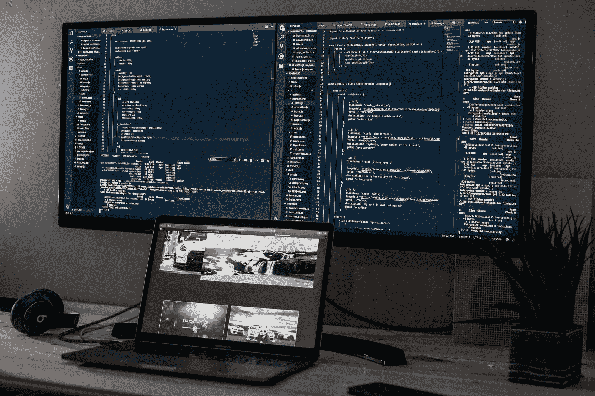
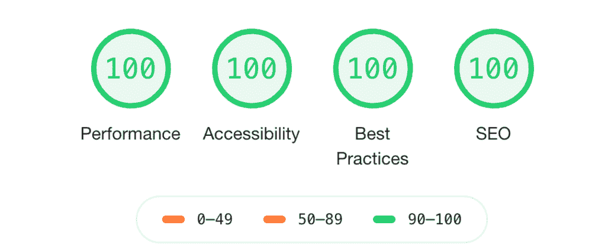

# 你应该在你的前端投资组合中包括 5 个编码项目

> 原文：<https://www.freecodecamp.org/news/coding-projects-to-include-in-your-frontend-portfolio/>

作品集是向潜在雇主展示你技能的好方法。对于可能没有任何专业工作经验的入门级开发人员来说，这尤其有用。

然而，在建立投资组合时，你可能会遇到的一个常见问题是不知道该包括什么。

你为一门课程制作的简单网页是否足以放到你的网站上？你必须只包括你得到报酬的项目吗，或者你可以包括甚至是最小的事情吗？是否有“合适”的项目数量？

本文的目的是通过示例项目，为如何填充您的前端开发人员组合提供一些指导。

下面是我们将在本文中涉及的项目的快速总结:

1.  投资组合网站
2.  克隆网站
3.  CRUD web 应用程序
4.  API 连接的网站
5.  一个“满分”网站

注意:这并不意味着您必须构建所有这些项目。这个列表只是给你提供一些关于你可以建立的项目的想法。

此外，这些项目面向入门级开发人员，他们已经掌握了前端开发的基础知识，正在寻找稍微高级一些的项目。

## 1.建立一个作品集网站

Photo by [Joshua Aragon](https://unsplash.com/@goshua13?utm_source=ghost&utm_medium=referral&utm_campaign=api-credit) / [Unsplash](https://unsplash.com/?utm_source=ghost&utm_medium=referral&utm_campaign=api-credit)

只要你自己建立了你的作品集网站，把它包含在你的项目列表中是完全可以的。如果你倾向于定期改变你的作品集设计，你也可以包括以前的版本。

当在你的作品集里包含一个项目时，你不仅仅是在炫耀你的技能，你也在解释设计背后的思维模式。这是潜在雇主通常感兴趣的事情。

对于前端开发人员来说，解释你是如何得到你选择的布局和拥有一个美学上吸引人的设计一样重要。

你可以进一步描述你采取的步骤，以确保你的网站遵循最佳开发实践。例如，分享你如何专注于提高网站的搜索引擎优化和性能。

**资源和例子**:[Laurence Bradford](https://www.freecodecamp.org/news/15-web-developer-portfolios-to-inspire-you-137fb1743cae/)的这篇文章提供了关于投资组合结构的更多信息，并包括了一些优秀的 web 开发人员投资组合的例子，你可以从中获得灵感。

**推荐技术:**对于初学者，我会推荐使用 HTML、CSS 和 vanilla JavaScript 来构建作品集，尤其是如果是第一次的话。

## 2.建立一个克隆网站

能够准确地将设计转换成功能完整的网页是每个前端开发人员都应该具备的技能。

要做到这一点，你需要对布局和颜色有敏锐的眼光。您还需要基于经验的知识，比如知道匹配布局的最佳 CSS 显示属性，或者能够根据规范呈现动画。

在大多数组织中，前端开发人员负责将模型和原型翻译成网页，所以如果你的作品集展示了你的“从设计到编码”的技能，那将是有益的。建立一个克隆网站是一个很好的方法。

有两种方法来建立一个克隆网站:

首先，你可以重建一个现有的网站。初级开发人员面临的一个常见挑战是克隆谷歌主页。

这种方法对于理解流行网站中样式选择的实际应用特别有用。您可以检查页面中的元素，并尝试理解用于盒子的方法——建模、定位和显示。

Photo by [Solen Feyissa](https://unsplash.com/@solenfeyissa?utm_source=ghost&utm_medium=referral&utm_campaign=api-credit) / [Unsplash](https://unsplash.com/?utm_source=ghost&utm_medium=referral&utm_campaign=api-credit)

第二，你可以从头开始重新设计。对于一个更具挑战性的项目，你可以在[运球](https://dribbble.com/shots/popular/web-design)或[行为](https://www.behance.net/search/projects?field=web%20design)上查找设计，并尝试将设计翻译成代码。

为了让这种方法对初学者更友好，可以尝试重新创建一个简单的页面或功能，比如登录表单或天气应用程序。

推荐技术:克隆一个网站的设计不需要任何功能，所以 HTML 和 CSS 就可以了。你也可以利用这段时间来熟悉 CSS 框架或预处理器，比如 [SASS](https://sass-lang.com/guide) 。

**注意**:所有上传到这些平台的设计都是其所有者的版权财产，所以你不允许将它们用于商业目的。然而，如果你给他们发一封电子邮件或留下一条评论，请求允许出于非商业目的重新设计，设计师可能会允许你免费重新设计他们的设计。

在你的作品集上注明这个项目是别人设计的克隆作品或再创作也很重要。

## 3.CRUD web 应用程序

执行 CRUD(创建-读取-更新-删除)操作是大多数网站(如博客、电子商务、仪表板等)的一个非常常见的功能，因此作为前端开发人员，您需要习惯于构建这种功能。

CRUD 应用程序的基本形式是待办事项列表或 Notes 网页。在你的网站上有这样一个项目显示了你操作数据结构的技巧。这也是一个展示你的前端框架工作的好机会。

Photo by [Jess Bailey](https://unsplash.com/@jessbaileydesigns?utm_source=ghost&utm_medium=referral&utm_campaign=api-credit) / [Unsplash](https://unsplash.com/?utm_source=ghost&utm_medium=referral&utm_campaign=api-credit)

Tania Rascia 关于使用本地存储的文章对学习如何用普通 JavaScript 创建 CRUD web 应用程序是一个很有帮助的介绍。或者，如果你想要一篇更具体的框架文章，可以看看同一作者关于[用 React 钩子构建 Crud 应用的文章](https://www.taniarascia.com/crud-app-in-react-with-hooks/)

**推荐技术:** CRUD 应用程序需要使用可重用的组件，因此根据您的熟悉程度，使用 React 或 Vue 等框架来构建它们是一个好主意。

**示例站点:**[React CRUD App with Hooks](https://taniarascia.github.io/react-hooks/)

## 4.API 连接的网站

许多大型项目需要与后端服务器进行某种通信，并显示从该服务器获取的数据。这在大多数情况下需要使用[应用编程接口(API)](https://www.freecodecamp.org/news/what-does-api-stand-for-a-definition-of-the-coding-acronym-in-plain-english/) 。

API 是...我喜欢把它想象成一个数字图书管理员。想象一下，图书馆里有很多书，你需要用这些书写一份报告。

所以，你去找图书管理员，要求借一本书。你需要告诉图书管理员某些关键词(比如说书名和作者的名字)并且有正确的授权(这里是借书证)才能得到这本书。

现在将“图书馆”替换为“服务器”，“书籍”替换为“数据”，“报告”替换为“网站”，“图书管理员”替换为“API”。

Photo by [İsmail Enes Ayhan](https://unsplash.com/@ismailenesayhan?utm_source=ghost&utm_medium=referral&utm_campaign=api-credit) / [Unsplash](https://unsplash.com/?utm_source=ghost&utm_medium=referral&utm_campaign=api-credit)

API 允许前端开发人员从后端数据库收集、修改和删除数据。构建一个使用 API 来显示数据的网站是一个很好的项目，可以包含在您的投资组合中。

**示例站点:**您可以选择创建一个数据显示站点(例如，一个连接到天气 API 并显示当前天气的[网站)，或者，对于一个更具挑战性的项目，您可以建立一个](https://webdesign.tutsplus.com/tutorials/build-a-simple-weather-app-with-vanilla-javascript--cms-33893) [RESTful API](https://www.callicoder.com/node-js-express-mongodb-restful-crud-api-tutorial/) 并在您的网站上执行操作。

## 5.一个“满分”网站

满分网站是指在 [Chrome Lighthouse](https://developers.google.com/web/tools/lighthouse) 审计报告中所有类别的得分都是 100%的网站。建立一个满足所有要求的网站显示了你遵循最佳实践和确保高质量项目的技能。

你可以在这篇文章[我如何建立我的完美分数组合网站](https://blog.jemimaabu.com/how-i-built-my-perfect-score-portfolio-website#how-to-get-a-perfect-lighthouse-score-on-your-website)中阅读如何优化你的网站的性能和可访问性以获得完美的灯塔分数。

## 结论

所以你有它:5 个项目，你可以包括在你的前端投资组合。此外，这些不一定都是独立的项目。您可以创建一个完美的克隆网站或 CRUD 应用程序，使用 API 从 JSON 文件中调用数据。

现在你可以向前去建造。快乐编码:)

如果你觉得这篇文章有帮助，或者你有任何问题，你可以在 Twitter 上告诉我。