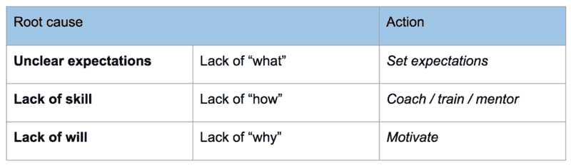

# 认知偏差和为什么绩效管理如此困难

> 原文：<https://www.freecodecamp.org/news/cognitive-bias-and-why-performance-management-is-so-hard-8852a1b874cd/>

奥斯曼(奥兹)艾哈迈德·奥斯曼

# 认知偏差和为什么绩效管理如此困难

Photo Credit: [Tim Gouw](https://www.freecodecamp.org/news/cognitive-bias-and-why-performance-management-is-so-hard-8852a1b874cd/undefined) on Unsplashed

通常，在工作中，你可能会遇到“没有做好本职工作”的人。可以是同事、报告者，甚至是你自己的经理。如果是报告，我们通常会称之为“性能问题”。作为经理中的经理，我经常在我的同事和同事中看到这样的例子。

在尝试修复问题之前，准确诊断问题是非常重要的。谷歌已经“开源”了它的[经理培训幻灯片](https://rework.withgoogle.com/guides/managers-develop-and-support-managers/steps/review-googles-new-manager-training/)，他们有一个很好的诊断框架。在他们的框架中，性能问题往往是由以下原因引起的:

*   **不明确的期望:**你的同事不知道**对他们的期望是什么**。也许他们的经理(你？)没有明确设定对他们的期望，或者某个团队成员没有阐明他们的工作受阻或工作质量受到损害。
*   缺乏技能:你的同事不知道**如何** 完成期望他们完成的任务。
*   **缺乏意愿:**你的同事对做这些工作没有动力或兴趣(他们对**为什么**他们应该做这些工作缺乏理解或认同)。

安迪·格罗夫在他的《高产出管理》一书中有一个类似的框架:

> “当一个人没有做好他的工作时，只有两种原因。这个人要么不能做，要么不会做；他不是**没有能力**就是**没有动力**。”
> —安迪·格罗夫

你有没有试图改善其中一种情况，却让它变得更糟？我有。当我回头看的时候，很多时候是因为我应用了我认为是正确的解决方案，但是应用到了错误的问题上。

例如，你有没有试图激励某人去做一些他们不知道如何去做的事情，结果只会让他们(和你)更加沮丧？另一方面，你有没有尝试过训练某人去做一件他们已经知道如何做，但却没有兴趣去做的事情——贬低他们，进一步削弱他们的动力？

所以…那就很简单了，对吧？约翰，假设你的一份报告没有按照你的期望完成任务。只要使用这个框架，诊断问题，然后着手解决它。

不幸的是，事情没有这么简单。这个模型过于简单。在这些情况下，我们的大脑倾向于通过所谓的“认知偏差”来反对我们，这种偏差倾向于简化情况和错误归因行为。

### 认知偏差——我们的大脑如何倾向于(不正确地)简化事物

我们的大脑已经进化到不断简化我们周围的世界。在社交场合，我们已经进化到可以很快给周围的人贴上“好”或“坏”的标签，有两个维度:能力和动机。

人有能力或没有能力。他们是朋友还是敌人。他们可以是这些的任意组合:能干的朋友(合作者或领导者)、无能的朋友(我们可以帮助的人)、能干的敌人(对手、敌人)等等。(很多时候，我们在这两个维度上积极地看待**自己***——这种现象被称为“ [beneffectance](http://biasandbelief.pbworks.com/w/page/6537179/Beneffectance) ”:有益且有效。)*

*这两个维度听起来熟悉吗？能力=技能。动机=意愿。缺乏意愿和缺乏技能基本上是这种简化的工作场所版本。*

*“朋友或敌人”的本能往往会更快地发生作用，从进化的角度来看，这是有道理的。当我们的祖先遇到彼此时，他们必须迅速做出“战斗或逃跑”的评估，所以我们往往会更快做出这种评估，但不太准确。我们会花更长的时间来判断我们部落或团队中其他人的能力，这是基于我们与谁的互动更密切/更频繁。*

*你的大脑在不断地简化，但你必须防止你的大脑妄下结论——因为我们经常出错。你可以利用一些心理现象来对抗自己的认知偏见。*

*首先是[基本面归因错误](https://en.wikipedia.org/wiki/Fundamental_attribution_error)。简而言之，我们倾向于将他人的行为归因于他们的内在特征，而不是他们所处的环境。约翰懒惰，而不是 T4，因为他忙于其他事情，所以无法完成任务。*

*使根本归因错误复杂化的是[确认偏差](https://en.wikipedia.org/wiki/Confirmation_bias)。既然我们的大脑已经创造了一个不正确的属性，我们倾向于寻找证据来支持这个假设。而且，通常，如果你把基本归因错误和确认偏差结合起来，你最终会得到一些主要的[号角](https://en.wikipedia.org/wiki/Horn_effect)和[光环效应](https://en.wikipedia.org/wiki/Halo_effect)。从现在开始，**约翰变懒了** *，*我们开始到处寻找那件事的“证据”，而忽略任何相反的证据*。**

*让我们把最后一个认知偏见也加入进来:[自私偏见](https://en.wikipedia.org/wiki/Self-serving_bias)。作为一个人的经理(甚至是同事)，在困难和不明确的情况下，我们更有可能简化和错误归因问题，以消除我们的任何指责。将责任归咎于某人的遗传特征(懒惰、缺乏能力)比承认也许作为管理者，我们未能激励或指导那个人更容易。*

*查看[这些](http://yalescientific.org/thescope/2015/03/what-split-brain-patients-can-tell-us-about-consciousness/) [两个](http://serendipstudio.org/bb/neuro/neuro02/web2/hhochman.html)资源阅读更多。*

*例如，大脑分裂受试者的左眼收到了站立的命令。这个人站着，但当被问及为什么站起来时，她用左半球的语言中枢回答说，她想要一杯苏打水。*

### *现实要复杂得多*

*所以我们的大脑一直在与我们作对——简化、错误归因和虚构。基本上是在耍流氓。另一方面，在现实中，人们往往比我们想象的要复杂得多。事实上，三个“原因”(缺乏意愿、缺乏技能和不明确的期望)往往会以微妙且难以理清的方式相互渗透。*

*让我们再举一个懒惰的例子。你的团队中有人没有做他们应该**清楚**知道如何做的事情。有时，一个“缺乏意愿”的问题可能与激励完全无关，可能与其他心理因素更相关。有一篇关于[拖延症和](https://medium.com/@dr_eprice/laziness-does-not-exist-3af27e312d01)懒惰的精彩文章，作者是 [E Price](https://www.freecodecamp.org/news/cognitive-bias-and-why-performance-management-is-so-hard-8852a1b874cd/undefined) :*

> *如果你看一个人的作为(或不作为)，只看到懒惰，你就错过了关键细节。总会有解释的。障碍总是存在的。*

*更具体地说…*

> *当一个人未能开始一个他们关心的项目时，通常是由于 [a)担心他们的尝试不够“好”](https://onlinelibrary.wiley.com/doi/abs/10.1002/j.1556-6676.1998.tb02548.x)或者 b [不清楚任务的第一步是什么](https://www.researchgate.net/profile/Kate_Eskine/publication/49641657_Academic_procrastination_in_college_students_The_role_of_self-reported_executive_function/links/5413057e0cf2bb7347db1857.pdf)。不是懒惰。事实上，当任务有意义并且个人关心如何做好它时，拖延更有可能发生。*

*第一个原因，如果你归结起来，其实根本不是缺乏意志的问题。确切地说，这是一种**感知** 缺乏的技巧。请注意，**你**是否认为他们有能力完成任务并不重要。在这种情况下，这是关于**他们的** 被认为缺乏技能/能力。你可能不知道他们心里在想什么——不安全感、[冒名顶替综合症](https://en.wikipedia.org/wiki/Impostor_syndrome)、抑郁、过去的失败。换句话说，缺乏技能会导致缺乏意愿。*

*试图激励一个人去做一项他们因为焦虑而拖延的任务，可能会产生相反的效果——这会让任务更有意义，并增加焦虑。*

*第二个原因，对第一步的困惑，同样令人费解。在这种情况下，他们不清楚如何开始。开始一项任务的能力和执行它的能力是非常不同的技能。If 经常涉及到把一个大任务分解成小任务。我可能知道如何完成每一项任务，但我可能不知道如何分解更大的任务。*

*在软件工程中尤其如此，在软件工程中，考虑整个系统或一组变更的技能与进行更小的、更多的增量变更的技能是非常不同的。前者被称为“架构”，很多公司对于纯“架构师”的人都有非常高级的角色。*

### *一些建议*

*那么，我们该怎么办？*

*让我们再举一次懒惰的例子。约翰没有按时开始或交付他的任务。他似乎会被其他事情分心，其中一些甚至可能与工作无关。事实上，他似乎根本不想做任何工作。*

*首先，看看历史，但不要让认知偏见困住你。约翰一直都是这样吗，还是发生了什么变化？毫无疑问，他被聘用或调到团队，是期望他能完成这些任务。*

*这种行为以前被触发过吗？如果是，什么时候？这与任务的性质/难度有关吗？也许那些任务很乏味，没有挑战性。或者可能它们太有挑战性，引发了“拖延”机制。也许他的私人生活中发生了一些事情。或者他对团队中的其他人不满意…或者对你不满意！*

*所以一方面，你需要看历史和模式来诊断情况。然而，如果你已经给约翰打上了懒惰和没有动机的烙印，你会通过这个镜头来看待历史和模式，而不会深入挖掘。所以要小心那些认知偏见，并寻找相反的证据。*

*信任和开诚布公的交流也大有裨益。希望你已经投资了与同事的关系，因此可以就这些问题进行公开对话。*

*我通常会先问他们对自己的工作进展感觉如何，然后明确表示我在尽力帮助他们(这是不能假装的，你必须真的想帮忙)。虚心提问。*

*你对事情的进展满意吗？*

*你认为其他利益相关者满意吗？*

*你认为这是为什么？*

*你感觉如何？*

*在过去，你什么时候有过这种感觉？*

*有些问题很难回答，让人不舒服。但是，如果你有良好的关系和积极的意图，你可以通过它们来发现(并修复)根本原因。*

*综上所述，一些提示:*

*   ***熟悉各种[认知偏差](https://en.wikipedia.org/wiki/List_of_cognitive_biases)。**了解你和你周围的人可能会落入的陷阱。不断质疑自己的判断。良好绩效管理的最大敌人是管理者容易陷入认知偏差。*
*   *与你的同事和下属建立信任和坦诚的关系。如果一个人不信任你，并且在问题出现时你无法与他沟通，那么理解他就变得无比困难。要有同理心和[同情心](https://www.linkedin.com/learning/jeff-weiner-on-managing-compassionately/what-is-compassionate-management)。*
*   ***了解动机理论，尤其是内在动机。关于这个主题有很多文献，但我最喜欢的是丹尼尔·平克的《T2 之旅》。***