# 如何用 100 行神经网络代码给黑白照片上色

> 原文：<https://www.freecodecamp.org/news/colorize-b-w-photos-with-a-100-line-neural-network-53d9b4449f8d/>

埃米尔·沃纳

# 如何用 100 行神经网络代码给黑白照片上色

今年早些时候，Amir Avni 使用神经网络[troll the subred dit](http://www.whatimade.today/our-frst-reddit-bot-coloring-b-2/)/r/Colorization——一个人们使用 Photoshop 手动为历史黑白图像着色的社区。

他们对阿米尔的深度学习机器人感到惊讶。过去需要一个月的手工劳动现在只需几秒钟就能完成。

我被阿米尔的神经网络迷住了，所以我复制了它并记录了这个过程。首先，让我们看看我的实验的一些结果/失败(滚动到底部查看最终结果)。

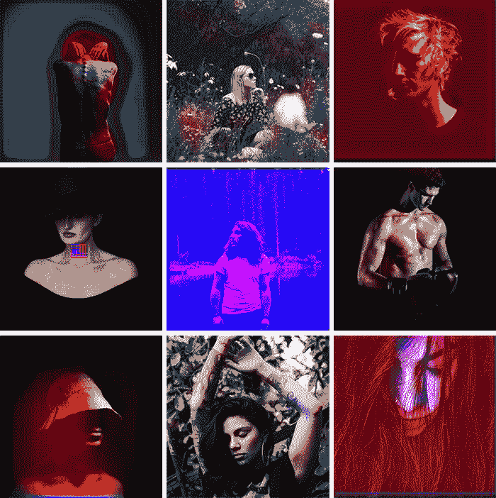

The original b&w images are from Unsplash

今天，着色通常是在 Photoshop 中手工完成的。为了欣赏这一过程背后的所有辛勤工作，看一看这个华丽的彩色化记忆巷视频:

简而言之，一幅画可能需要一个月的时间上色。这需要广泛的研究。光是一张脸就需要多达 20 层的粉色、绿色和蓝色色调来保持恰到好处。

这篇文章是写给初学者的。然而，如果你是深度学习术语的新手，你可以阅读我之前的两篇文章[这里](https://blog.floydhub.com/my-first-weekend-of-deep-learning/)和[这里](https://blog.floydhub.com/coding-the-history-of-deep-learning/)，并观看安德烈·卡帕西的[讲座](https://www.youtube.com/watch?v=LxfUGhug-iQ)了解更多背景知识。

我将向你展示如何用三个步骤来构建你自己的着色神经网络。

第一部分分解了核心逻辑。我们将构建一个基本的 40 行神经网络作为“阿尔法”着色机器人。这段代码没有多少魔力。这有助于我们熟悉语法。

下一步是创建一个可以概括的神经网络——我们的“测试”版本。我们将能够给机器人以前从未见过的图像上色。

对于我们的“最终”版本，我们将结合我们的神经网络和分类器。我们将使用已经在 120 万张图像上训练过的[盗梦空间 Resnet V2](https://research.googleblog.com/2016/08/improving-inception-and-image.html) 。为了让颜色流行起来，我们将在来自 [Unsplash](https://unsplash.com/) 的肖像上训练我们的神经网络。

如果你想向前看，这里有一个 [Jupyter 笔记本](https://www.floydhub.com/emilwallner/projects/color/43/code/Alpha-version/alpha_version.ipynb)，里面有我们机器人的 Alpha 版本。你还可以在 [FloydHub](https://www.floydhub.com/emilwallner/projects/color/43/code) 和 [GitHub](https://github.com/emilwallner/Coloring-greyscale-images-in-Keras) 上查看三个版本，以及我在 FloydHub 的云 GPU 上运行的所有实验的代码[。](https://www.floydhub.com/emilwallner/projects/color/jobs)

### 核心逻辑

在这一节，我将概述如何渲染图像，数字颜色的基础知识，以及我们的神经网络的主要逻辑。

黑白图像可以用像素网格来表示。每个像素都有一个与其亮度相对应的值。值的范围从 0 到 255，从黑到白。

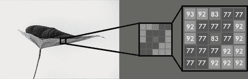

彩色图像由三层组成:红色层、绿色层和蓝色层。这可能与你的直觉相反。想象将白色背景上的一片绿叶分成三个通道。凭直觉，你可能会认为这种植物只存在于绿色层。

但是，正如您在下面看到的，叶子在所有三个通道中都存在。图层不仅决定颜色，还决定亮度。

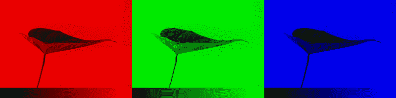

例如，为了获得白色，你需要所有颜色的均匀分布。通过添加等量的红色和蓝色，它使绿色更亮。因此，彩色图像使用三个层对颜色和对比度进行编码:


就像黑白图像一样，彩色图像中的每一层都有一个从 0 到 255 的值。值 0 表示该层中没有颜色。如果所有颜色通道的值都为 0，则图像像素为黑色。

您可能知道，神经网络在输入值和输出值之间建立了一种关系。为了使我们的彩色化任务更加精确，网络需要找到将灰度图像与彩色图像联系起来的特征。

总之，我们正在寻找将灰度值网格与三种颜色网格联系起来的特征。

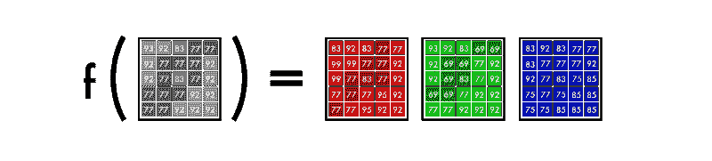

f() is the neural network, [B&W] is our input, and [R],[G],[B] is our output.

### 阿尔法版本

我们将从制作一个简单的神经网络开始，给一张女人的脸着色。这样，当我们向模型添加特性时，您可以熟悉模型的核心语法。

只用 40 行代码，我们就可以完成下面的转换。中间的图片是用我们的神经网络完成的，右边的图片是原始的彩色照片。该网络在相同的图像上进行训练和测试——我们将在测试版中回到这一点。

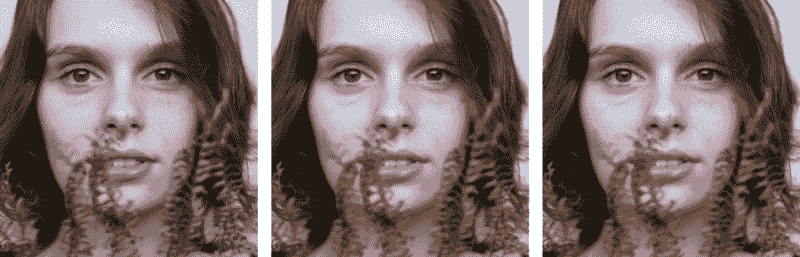

Photo by Camila Cordeiro

#### 彩色空间

首先，我们将使用一种算法来改变颜色通道，从 RGB 到 Lab。 ***L*** 代表明度， ***a*** 和 ***b*** 代表光谱绿色-红色和蓝色-黄色。

如下图所示，Lab 编码图像有一个灰度层，并将三个颜色层压缩成两个。这意味着我们可以在最终预测中使用原始灰度图像。而且，我们只有两个渠道可以预测。

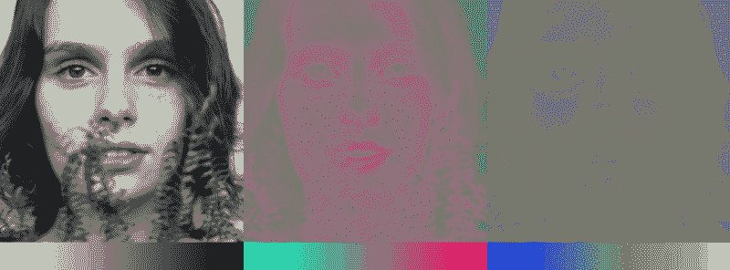

科学事实——我们眼睛中 94%的细胞决定亮度。这使得我们的受体中只有 6%充当颜色传感器。正如你在上面的图像中看到的，灰度图像比彩色图层要清晰得多。这是我们在最终预测中保留灰度图像的另一个原因。

#### 从 B&W 到彩色

我们最终的预测是这样的。我们有一个用于输入的灰度层，我们想要预测两个颜色层，即**实验室**中的 **ab** 。为了创建最终的彩色图像，我们将包含用于输入的**L**/灰度图像。结果将是创建一个**实验室**图像。

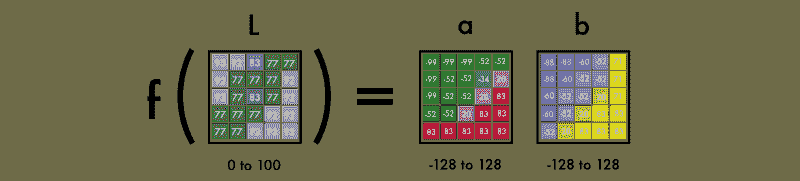

为了将一层变成两层，我们使用卷积滤波器。你可以把它们想象成 3D 眼镜中的蓝/红滤镜。每个滤镜决定了我们在图片中看到的内容。他们可以突出显示或删除一些东西，从图片中提取信息。网络可以从一个过滤器创建一个新的图像，或者将几个过滤器组合成一个图像。

对于卷积神经网络，每个滤波器都会自动调整，以帮助实现预期的结果。我们将从堆叠数百个过滤器开始，并将它们缩小到两层，即 **a** 和 **b** 层。

在我们详细了解它是如何工作的之前，让我们运行一下代码。

#### 在 FloydHub 上运行代码

点击下面的按钮你会在 [FloydHub](https://www.floydhub.com/?utm_medium=readme&utm_source=colornet&utm_campaign=aug_2018) 上打开一个[工作区](https://blog.floydhub.com/workspaces/)，在那里你会发现与*完整版*使用的相同的环境和数据集。还可以找到[服](https://github.com/floydhub/colornet-template#serve-an-interactive-web-page-for-your-own-model)的训练好的模特。


你也可以用他们的 [2 分钟安装](https://www.floydhub.com/)进行本地 FloydHub 安装，观看我的 [5 分钟视频教程](https://www.youtube.com/watch?v=byLQ9kgjTdQ&t=6s)或者查看我的[分步指南](https://blog.floydhub.com/my-first-weekend-of-deep-learning/)。在云 GPU 上训练深度学习模型是最好的(也是最简单的)方法。

#### 阿尔法版本

安装 FloydHub 后，使用以下命令:

```
git clone https://github.com/emilwallner/Coloring-greyscale-images-in-Keras
```

打开文件夹并启动 FloydHub。

```
cd Coloring-greyscale-images-in-Keras/floydhubfloyd init colornet
```

FloydHub web dashboard 将在您的浏览器中打开。您将被提示创建一个名为`colornet`的新 FloydHub 项目。一旦完成，回到您的终端并运行相同的`init`命令。

```
floyd init colornet
```

好，让我们开始工作:

```
floyd run --data emilwallner/datasets/colornet/2:data --mode jupyter --tensorboard
```

关于我们工作的一些简短说明:

*   我们在 FloydHub 上的`data`目录下挂载了一个公共数据集(我已经上传了),代码如下:

```
--dataemilwallner/datasets/colornet/2:data
```

您可以通过在 [FloydHub](https://www.floydhub.com/emilwallner/datasets/cifar-10/1) 上查看来探索和使用该数据集(以及许多其他公共数据集)

*   我们用`--tensorboard`启用了 Tensorboard
*   我们用`--mode jupyter`在 Jupyter 笔记本模式下运行作业
*   如果你有 GPU 信用，你也可以在你的命令中添加 GPU 标志`--gpu`。这将使其速度提高约 50 倍

去朱庇特笔记本。在 FloydHub 网站的“作业”选项卡下，单击 Jupyter 笔记本链接并导航至该文件:

```
floydhub/Alpha version/working_floyd_pink_light_full.ipynb
```

打开它，并在所有单元格上单击 Shift+Enter。

逐渐增加 epoch 值以了解神经网络的学习方式。

```
model.fit(x=X, y=Y, batch_size=1, epochs=1)
```

以纪元值 1 开始，并将其增加到 10、100、500、1000 和 3000。历元值指示神经网络从图像学习的次数。一旦你训练了你的神经网络，你会在主文件夹中找到图片`img_result.png`。

```
# Get imagesimage = img_to_array(load_img('woman.png'))image = np.array(image, dtype=float)
```

```
# Import map images into the lab colorspaceX = rgb2lab(1.0/255*image)[:,:,0]Y = rgb2lab(1.0/255*image)[:,:,1:]Y = Y / 128X = X.reshape(1, 400, 400, 1)Y = Y.reshape(1, 400, 400, 2)
```

```
# Building the neural networkmodel = Sequential()model.add(InputLayer(input_shape=(None, None, 1)))model.add(Conv2D(8, (3, 3), activation='relu', padding='same', strides=2))model.add(Conv2D(8, (3, 3), activation='relu', padding='same'))model.add(Conv2D(16, (3, 3), activation='relu', padding='same'))model.add(Conv2D(16, (3, 3), activation='relu', padding='same', strides=2))model.add(Conv2D(32, (3, 3), activation='relu', padding='same'))model.add(Conv2D(32, (3, 3), activation='relu', padding='same', strides=2))model.add(UpSampling2D((2, 2)))model.add(Conv2D(32, (3, 3), activation='relu', padding='same'))model.add(UpSampling2D((2, 2)))model.add(Conv2D(16, (3, 3), activation='relu', padding='same'))model.add(UpSampling2D((2, 2)))model.add(Conv2D(2, (3, 3), activation='tanh', padding='same'))
```

```
# Finish modelmodel.compile(optimizer='rmsprop',loss='mse')
```

```
#Train the neural networkmodel.fit(x=X, y=Y, batch_size=1, epochs=3000)print(model.evaluate(X, Y, batch_size=1))
```

```
# Output colorizationsoutput = model.predict(X)output = output * 128canvas = np.zeros((400, 400, 3))canvas[:,:,0] = X[0][:,:,0]canvas[:,:,1:] = output[0]imsave("img_result.png", lab2rgb(canvas))imsave("img_gray_scale.png", rgb2gray(lab2rgb(canvas)))
```

运行此网络的 FloydHub 命令:

```
floyd run --data emilwallner/datasets/colornet/2:data --mode jupyter --tensorboard
```

#### 技术解释

概括地说，输入是一个代表黑白图像的网格。它输出两个带有颜色值的网格。在输入和输出值之间，我们创建过滤器将它们连接在一起。这是一个卷积神经网络。

当我们训练网络时，我们使用彩色图像。我们将 RGB 颜色转换到 Lab 颜色空间。黑白层是我们的输入，两个彩色层是输出。

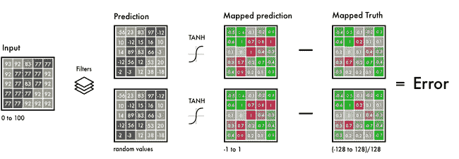

在左边，我们有 B&W 输入，我们的过滤器，和来自我们的神经网络的预测。

我们在相同的区间内映射预测值和真实值。这样，我们可以比较值。间隔范围从-1 到 1。为了绘制预测值，我们使用了一个双曲正切函数。对于您给[双曲正切函数](http://mathworld.wolfram.com/HyperbolicTangent.html)的任何值，它将返回-1 到 1。

真彩色值的范围在-128 和 128 之间。这是 Lab 色彩空间中的默认间隔。将它们除以 128，它们也落在-1 比 1 的区间内。这种“标准化”使我们能够比较预测的误差。

在计算出最终误差后，网络更新滤波器以减少总误差。网络继续这个循环，直到误差尽可能低。

让我们澄清代码片段中的一些语法。

```
X = rgb2lab(1.0/255*image)[:,:,0]Y = rgb2lab(1.0/255*image)[:,:,1:]
```

**1.0/255** 表示我们使用的是 24 位 RGB 色彩空间。这意味着我们对每个颜色通道使用 0-255 之间的数字。这产生了 1670 万种颜色组合。

由于人类只能感知 200-1000 万种颜色，因此使用更大的颜色空间没有太大意义。

```
Y = Y / 128
```

与 RGB 相比，Lab 色彩空间具有不同的范围。Lab 中的色谱 **ab** 从-128 到 128。通过将输出层中的所有值除以 128，我们将范围限制在-1 和 1 之间。

我们将其与我们的神经网络进行匹配，神经网络也返回-1 和 1 之间的值。

使用函数`rgb2lab()`转换色彩空间后，我们选择灰度层:`**[ : , : , 0].**`这是我们神经网络的输入。`[ : , : , 1: ]`选择绿色-红色和蓝色-黄色两种颜色层。

在训练神经网络之后，我们做出最终的预测，并将其转换成图片。

```
output = model.predict(X)output = output * 128
```

在这里，我们使用灰度图像作为输入，并通过我们训练的神经网络运行它。我们将-1 和 1 之间的所有输出值乘以 128。这给了我们实验室色谱中正确的颜色。

```
canvas = np.zeros((400, 400, 3))canvas[:,:,0] = X[0][:,:,0]canvas[:,:,1:] = output[0]
```

最后，我们创建一个黑色的 RGB 画布，用三层 0 填充。然后，我们从测试图像中复制灰度层。然后，我们将两个颜色层添加到 RGB 画布上。然后，该像素值阵列被转换成图片。

#### 总是从 alpha 版本中获取

*   阅读研究论文具有挑战性。一旦我总结了每篇论文的核心特点，浏览论文就变得更容易了。这也让我能够把细节放到一个背景中。
*   **开始简单是关键**。我在网上能找到的大多数实现都有 2 10K 线那么长。这使得人们很难对问题的核心逻辑有一个总体的了解。一旦我有了一个基本版本，阅读代码实现和研究论文就变得更容易了。
*   探索公共项目。为了大致了解编码的内容，我浏览了 Github 上 50-100 个彩色化项目。
*   事情不会总是像预期的那样发展。一开始，它只能创造红色和黄色。起初，我有一个 Relu 激活功能用于最终激活。因为它只能把数字映射成正数，所以它不能产生负数，即蓝色和绿色的光谱。添加一个 tanh 激活函数并映射 Y 值解决了这个问题。
*   **了解> Spe** ed。我看到的许多实现都很快，但是很难操作。我选择优化创新速度，而不是代码速度。

### 测试版

要了解 alpha 版本的弱点，请尝试给一个未经训练的图像着色。如果你尝试一下，你会发现这是一次拙劣的尝试。是因为网络把信息记住了。它还没有学会如何给它以前没见过的图像上色。但这是我们将在测试版中做的。我们将教会我们的网络进行归纳。

下面是用我们的测试版给验证图片上色的结果。

我没有使用 Imagenet，而是在 FloydHub 上创建了一个具有更高质量图像的公共数据集[。这些图片来自](https://www.floydhub.com/emilwallner/datasets/colornet)[Unsplash](https://unsplash.com/)——由专业摄影师创作的知识共享图片。它包括 9，500 幅训练图像和 500 幅验证图像。

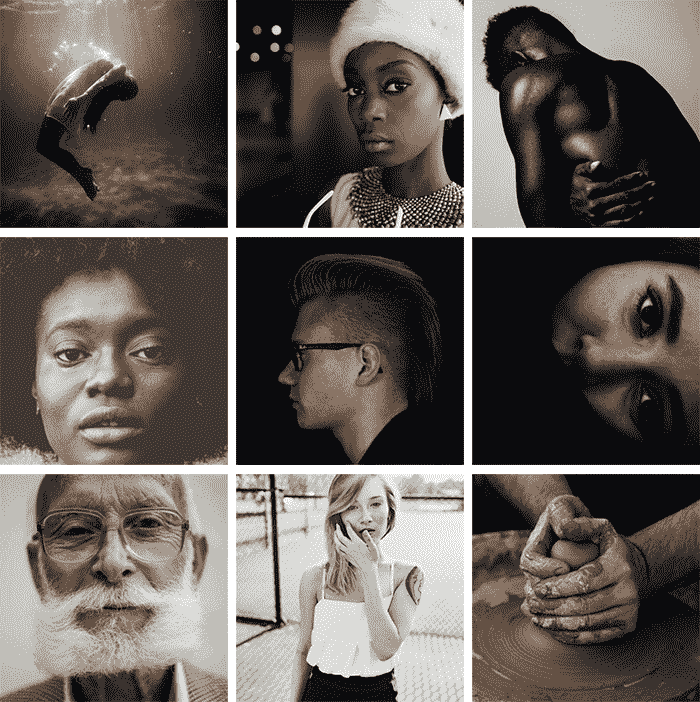

#### 特征提取器

我们的神经网络发现了将灰度图像与其彩色版本联系起来的特征。

想象一下，你必须给黑白图像着色，但是有限制，你一次只能看到九个像素。你可以从左上角到右下角扫描每张图片，并尝试预测每个像素应该是哪种颜色。


例如，这九个像素是上面那个女人鼻孔的边缘。正如你所想象的，要做出一个好的着色几乎是不可能的，所以你把它分成几个步骤。

首先，你寻找简单的图案:一条对角线，全黑像素，等等。您在每个方块中寻找相同的精确模式，并删除不匹配的像素。您可以从 64 个迷你滤镜生成 64 个新图像。

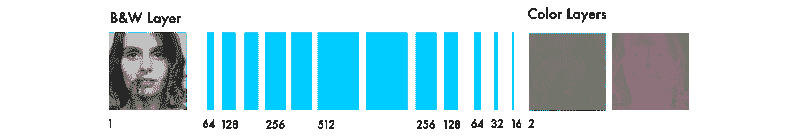

The number of filtered images for each step

如果你再次扫描这些图像，你会看到你已经探测到的相同的小图案。为了更好地理解图像，您可以将图像尺寸缩小一半。

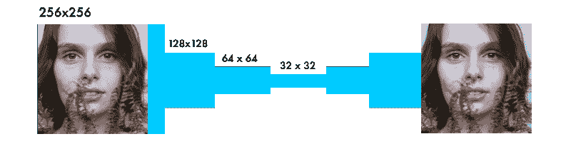

We decrease the size in three steps

你仍然只有一个 3x3 的过滤器来扫描每张图片。但是，通过将新的 9 个像素与较低级别的过滤器相结合，您可以检测更复杂的图案。一个像素组合可能形成一个半圆、一个小点或一条线。再次，你从图像中重复提取相同的模式。这一次，您生成 128 个新的过滤图像。

经过几个步骤后，您生成的过滤图像可能如下所示:

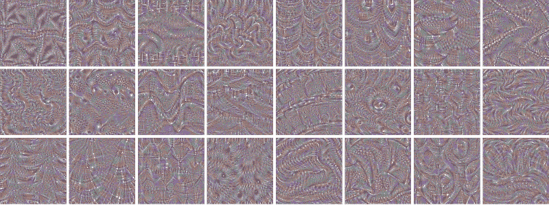

From Keras layer tutorial

如上所述，您从低级特征开始，例如边。更接近输出的层被组合成图案。然后，它们组合成细节，最终转化成一张脸。这个[视频教程](https://www.youtube.com/watch?v=AgkfIQ4IGaM)提供了进一步的解释。

这个过程类似于大多数处理视觉的神经网络。这里的网络类型被称为卷积神经网络。在这些网络中，你结合几个过滤的图像来理解图像中的上下文。

#### 从特征提取到颜色

神经网络以试错的方式运行。它首先对每个像素进行随机预测。基于每个像素的误差，它通过网络反向工作以改进特征提取。

它开始针对产生最大误差的情况进行调整。在这种情况下，调整是:是否着色，以及如何定位不同的对象。

该网络从将所有对象都涂成棕色开始。它是与所有其他颜色最相似的颜色，因此产生的误差最小。

因为大多数训练数据都非常相似，所以网络很难区分不同的对象。它将不能产生更细微的颜色。这就是我们将在完整版中探讨的内容。

下面是测试版的代码，后面是代码的技术解释。

```
# Get imagesX = []for filename in os.listdir('../Train/'):    X.append(img_to_array(load_img('../Train/'+filename)))X = np.array(X, dtype=float)
```

```
# Set up training and test datasplit = int(0.95*len(X))Xtrain = X[:split]Xtrain = 1.0/255*Xtrain
```

```
#Design the neural networkmodel = Sequential()model.add(InputLayer(input_shape=(256, 256, 1)))model.add(Conv2D(64, (3, 3), activation='relu', padding='same'))model.add(Conv2D(64, (3, 3), activation='relu', padding='same', strides=2))model.add(Conv2D(128, (3, 3), activation='relu', padding='same'))model.add(Conv2D(128, (3, 3), activation='relu', padding='same', strides=2))model.add(Conv2D(256, (3, 3), activation='relu', padding='same'))model.add(Conv2D(256, (3, 3), activation='relu', padding='same', strides=2))model.add(Conv2D(512, (3, 3), activation='relu', padding='same'))model.add(Conv2D(256, (3, 3), activation='relu', padding='same'))model.add(Conv2D(128, (3, 3), activation='relu', padding='same'))model.add(UpSampling2D((2, 2)))model.add(Conv2D(64, (3, 3), activation='relu', padding='same'))model.add(UpSampling2D((2, 2)))model.add(Conv2D(32, (3, 3), activation='relu', padding='same'))model.add(Conv2D(2, (3, 3), activation='tanh', padding='same'))model.add(UpSampling2D((2, 2)))
```

```
# Finish modelmodel.compile(optimizer='rmsprop', loss='mse')
```

```
# Image transformerdatagen = ImageDataGenerator(        shear_range=0.2,        zoom_range=0.2,        rotation_range=20,        horizontal_flip=True)
```

```
# Generate training databatch_size = 50def image_a_b_gen(batch_size):    for batch in datagen.flow(Xtrain, batch_size=batch_size):        lab_batch = rgb2lab(batch)        X_batch = lab_batch[:,:,:,0]        Y_batch = lab_batch[:,:,:,1:] / 128        yield (X_batch.reshape(X_batch.shape+(1,)), Y_batch)
```

```
# Train modelTensorBoard(log_dir='/output')model.fit_generator(image_a_b_gen(batch_size), steps_per_epoch=10000, epochs=1)# Test imagesXtest = rgb2lab(1.0/255*X[split:])[:,:,:,0]Xtest = Xtest.reshape(Xtest.shape+(1,))Ytest = rgb2lab(1.0/255*X[split:])[:,:,:,1:]Ytest = Ytest / 128print model.evaluate(Xtest, Ytest, batch_size=batch_size)
```

```
# Load black and white imagescolor_me = []for filename in os.listdir('../Test/'):        color_me.append(img_to_array(load_img('../Test/'+filename)))color_me = np.array(color_me, dtype=float)color_me = rgb2lab(1.0/255*color_me)[:,:,:,0]color_me = color_me.reshape(color_me.shape+(1,))
```

```
# Test modeloutput = model.predict(color_me)output = output * 128
```

```
# Output colorizationsfor i in range(len(output)):        cur = np.zeros((256, 256, 3))        cur[:,:,0] = color_me[i][:,:,0]        cur[:,:,1:] = output[i]        imsave("result/img_"+str(i)+".png", lab2rgb(cur))
```

下面是运行 Beta 神经网络的 FloydHub 命令:

```
floyd run --data emilwallner/datasets/colornet/2:data --mode jupyter --tensorboard
```

#### 技术解释

与其他视觉神经网络的主要区别在于像素位置的重要性。在着色网络中，图像的大小或比例在整个网络中保持不变。在其他类型的网络中，图像越接近最终图层就越失真。

分类网络中的最大池层增加了信息密度，但也扭曲了图像。它只重视信息，而不重视图像的布局。在着色网络中，我们使用步长 2，将宽度和高度减半。这也增加了信息密度，但不会扭曲图像。

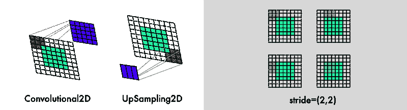

另外两个区别是:对图层进行上采样和保持图像比例。分类网络只关心最终的分类。因此，当图像在网络中传输时，它们会不断降低图像的大小和质量。

着色网络保持图像比例不变。这是通过添加白色填充完成的，如上图所示。否则，每个卷积层都会切割图像。这是用`*padding='same'*`参数完成的。

为了使图像尺寸翻倍，着色网络使用了[一个上采样层](https://keras.io/layers/convolutional/#upsampling2d)。

```
for filename in os.listdir('/Color_300/Train/'):    X.append(img_to_array(load_img('/Color_300/Test'+filename)))
```

这个 for 循环首先计算目录中的所有文件名。然后，它遍历图像目录，将图像转换为像素数组。最后，它将它们组合成一个巨大的向量。

```
datagen = ImageDataGenerator(        shear_range=0.2,        zoom_range=0.2,        rotation_range=20,        horizontal_flip=True)
```

使用`[ImageDataGenerator](https://keras.io/preprocessing/image/)`，我们调整图像发生器的设置。这样每个图像永远不会一样，从而提高学习率。`shear_range`将图像向左或向右倾斜，其他设置有缩放、旋转和水平翻转。

```
batch_size = 50def image_a_b_gen(batch_size):    for batch in datagen.flow(Xtrain, batch_size=batch_size):        lab_batch = rgb2lab(batch)        X_batch = lab_batch[:,:,:,0]        Y_batch = lab_batch[:,:,:,1:] / 128        yield (X_batch.reshape(X_batch.shape+(1,)), Y_batch)
```

我们使用 Xtrain 文件夹中的图像，根据上面的设置生成图像。然后，我们为`X_batch`提取黑白图层，为两个彩色图层提取两种颜色。

```
model.fit_generator(image_a_b_gen(batch_size), steps_per_epoch=1, epochs=1000)
```

你的 GPU 越强大，你就能放入越多的图像。使用此设置，您可以使用 50–100 幅图像。`steps_per_epoch`的计算方法是将训练图像的数量除以您的批量。

例如:批量大小为 50 的 100 个图像给出了每个时期的 2 个步骤。历元的数量决定了您想要训练所有图像的次数。具有 21 个时期的 10K 图像在 Tesla K80 GPU 上需要大约 11 个小时。

#### 外卖食品

*   在进行大规模实验之前，先进行小批量的实验。即使做了 20–30 次实验，我还是会发现错误。它在运行并不意味着它在工作。神经网络中的错误通常比传统的编程错误更加微妙。其中更奇怪的是[我的亚当打嗝](https://twitter.com/EmilWallner/status/916309564966006784)。
*   一个更加多样化的数据集使图片变成褐色。如果你有[非常相似的图像](https://github.com/2014mchidamb/DeepColorization/tree/master/face_images)，你可以得到一个不错的结果，而不需要更复杂的架构。代价是网络的概化能力越来越差。
*   **形状，形状，形状。**每个图像的大小必须精确，并在整个网络中保持比例。开始的时候，我用的是 300 的图片尺寸。将此减半三次得到 150、75 和 35.5 的尺寸。结果是损失半个像素！这导致了许多“黑客攻击”，直到我意识到最好使用 2 的幂:2、8、16、32、64、256 等等。
*   **创建数据集:**一)[禁用](http://osxdaily.com/2010/02/03/how-to-prevent-ds_store-file-creation/)该。DS_Store 文件，简直把我逼疯了。b)要有创意。我最后用 Chrome [控制台脚本](https://github.com/emilwallner/useful-scripts/blob/master/auto_scroll_browser_window_console)和[扩展](https://chrome.google.com/webstore/detail/imagespark-ultimate-image/hooaoionkjogngfhjjniefmenehnopag)下载文件。c)复制您抓取的原始文件，并构建您的[清理脚本](https://github.com/emilwallner/useful-scripts)。

### 完整版

我们的彩色化神经网络的最终版本有四个组件。我们将之前的网络分为编码器和解码器。在它们之间，我们将使用一个融合层。如果你是分类网络的新手，我推荐你看一看这个教程。

与编码器并行，输入图像也通过当今最强大的分类器之一——[Inception ResNet v2](https://research.googleblog.com/2016/08/improving-inception-and-image.html)。这是一个在 1.2M 图像上训练的神经网络。我们提取分类层，并将其与编码器的输出合并。

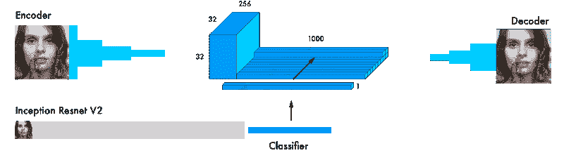

这里有一个来自原始论文的更详细的视觉效果。

通过将学习从分类器转移到着色网络，网络可以了解图片中的内容。从而使网络能够将对象表示与颜色方案相匹配。

这里是一些验证图像，仅使用 20 个图像来训练网络。

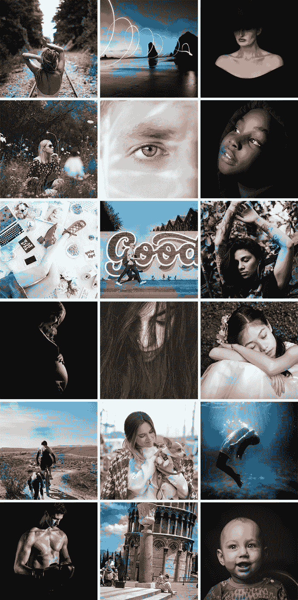

大多数图像结果都很差。但是我能够找到几个不错的，因为验证集很大(2500 张图片)。在更多的图像上训练它得到了更一致的结果，但大多数图像变成了褐色。这里是我运行的[实验的完整列表，包括验证图像。](https://www.floydhub.com/emilwallner/projects/color)

以下是之前研究中最常见的架构，并附有链接:

*   在图片中手动添加颜色的小点来引导神经网络([链接](http://www.cs.huji.ac.il/~yweiss/Colorization/)
*   找到一个匹配的图像，并转移颜色(了解更多[这里](https://dl.acm.org/citation.cfm?id=2393402)和[这里](https://arxiv.org/abs/1505.05192)
*   残差编码器和合并分类层([链接](http://tinyclouds.org/colorize/)
*   从分类网络中合并超列(更多细节[此处](https://arxiv.org/pdf/1603.08511.pdf)和[此处](https://arxiv.org/pdf/1603.06668.pdf)
*   合并编码器和解码器之间的最终分类(细节[此处](http://hi.cs.waseda.ac.jp/~iizuka/projects/colorization/data/colorization_sig2016.pdf)和[此处](https://arxiv.org/abs/1712.03400))

**色彩空间:** Lab、YUV、HSV 和 LUV(更多细节[在此](http://cs231n.stanford.edu/reports/2016/pdfs/219_Report.pdf)和[在此](https://arxiv.org/abs/1605.00075))

**损失:**均方差，分类，加权分类([环节](https://arxiv.org/pdf/1603.06668.pdf)

我选择了“融合层”架构(上面列表中的第五个)。

这是因为它产生了一些最好的结果。在 [Keras](https://keras.io/) 中也更容易理解和再现。虽然它不是最强的彩色化网络设计，但它是一个很好的起点。理解着色问题的动力学是一个伟大的架构。

我使用了 Federico Baldassarre 及其合作者的论文中的神经网络设计。我继续用我自己的方式解释喀拉斯语。

注意:在下面的代码中，我从 Keras 的顺序模型切换到他们的函数式 API。[ [文档](https://keras.io/getting-started/functional-api-guide/)

```
# Get imagesX = []for filename in os.listdir('/data/images/Train/'):    X.append(img_to_array(load_img('/data/images/Train/'+filename)))X = np.array(X, dtype=float)Xtrain = 1.0/255*X
```

```
#Load weightsinception = InceptionResNetV2(weights=None, include_top=True)inception.load_weights('/data/inception_resnet_v2_weights_tf_dim_ordering_tf_kernels.h5')inception.graph = tf.get_default_graph()
```

```
embed_input = Input(shape=(1000,))
```

```
#Encoderencoder_input = Input(shape=(256, 256, 1,))encoder_output = Conv2D(64, (3,3), activation='relu', padding='same', strides=2)(encoder_input)encoder_output = Conv2D(128, (3,3), activation='relu', padding='same')(encoder_output)encoder_output = Conv2D(128, (3,3), activation='relu', padding='same', strides=2)(encoder_output)encoder_output = Conv2D(256, (3,3), activation='relu', padding='same')(encoder_output)encoder_output = Conv2D(256, (3,3), activation='relu', padding='same', strides=2)(encoder_output)encoder_output = Conv2D(512, (3,3), activation='relu', padding='same')(encoder_output)encoder_output = Conv2D(512, (3,3), activation='relu', padding='same')(encoder_output)encoder_output = Conv2D(256, (3,3), activation='relu', padding='same')(encoder_output)
```

```
#Fusionfusion_output = RepeatVector(32 * 32)(embed_input) fusion_output = Reshape(([32, 32, 1000]))(fusion_output)fusion_output = concatenate([encoder_output, fusion_output], axis=3) fusion_output = Conv2D(256, (1, 1), activation='relu', padding='same')(fusion_output)
```

```
#Decoderdecoder_output = Conv2D(128, (3,3), activation='relu', padding='same')(fusion_output)decoder_output = UpSampling2D((2, 2))(decoder_output)decoder_output = Conv2D(64, (3,3), activation='relu', padding='same')(decoder_output)decoder_output = UpSampling2D((2, 2))(decoder_output)decoder_output = Conv2D(32, (3,3), activation='relu', padding='same')(decoder_output)decoder_output = Conv2D(16, (3,3), activation='relu', padding='same')(decoder_output)decoder_output = Conv2D(2, (3, 3), activation='tanh', padding='same')(decoder_output)decoder_output = UpSampling2D((2, 2))(decoder_output)
```

```
model = Model(inputs=[encoder_input, embed_input], outputs=decoder_output)
```

```
#Create embeddingdef create_inception_embedding(grayscaled_rgb):    grayscaled_rgb_resized = []    for i in grayscaled_rgb:        i = resize(i, (299, 299, 3), mode='constant')        grayscaled_rgb_resized.append(i)    grayscaled_rgb_resized = np.array(grayscaled_rgb_resized)    grayscaled_rgb_resized = preprocess_input(grayscaled_rgb_resized)    with inception.graph.as_default():        embed = inception.predict(grayscaled_rgb_resized)    return embed
```

```
# Image transformerdatagen = ImageDataGenerator(        shear_range=0.4,        zoom_range=0.4,        rotation_range=40,        horizontal_flip=True)
```

```
#Generate training databatch_size = 20
```

```
def image_a_b_gen(batch_size):    for batch in datagen.flow(Xtrain, batch_size=batch_size):        grayscaled_rgb = gray2rgb(rgb2gray(batch))        embed = create_inception_embedding(grayscaled_rgb)        lab_batch = rgb2lab(batch)        X_batch = lab_batch[:,:,:,0]        X_batch = X_batch.reshape(X_batch.shape+(1,))        Y_batch = lab_batch[:,:,:,1:] / 128        yield ([X_batch, create_inception_embedding(grayscaled_rgb)], Y_batch)
```

```
#Train model      tensorboard = TensorBoard(log_dir="/output")model.compile(optimizer='adam', loss='mse')model.fit_generator(image_a_b_gen(batch_size), callbacks=[tensorboard], epochs=1000, steps_per_epoch=20)
```

```
#Make a prediction on the unseen imagescolor_me = []for filename in os.listdir('../Test/'):    color_me.append(img_to_array(load_img('../Test/'+filename)))color_me = np.array(color_me, dtype=float)color_me = 1.0/255*color_mecolor_me = gray2rgb(rgb2gray(color_me))color_me_embed = create_inception_embedding(color_me)color_me = rgb2lab(color_me)[:,:,:,0]color_me = color_me.reshape(color_me.shape+(1,))
```

```
# Test modeloutput = model.predict([color_me, color_me_embed])output = output * 128
```

```
# Output colorizationsfor i in range(len(output)):    cur = np.zeros((256, 256, 3))    cur[:,:,0] = color_me[i][:,:,0]    cur[:,:,1:] = output[i]    imsave("result/img_"+str(i)+".png", lab2rgb(cur))
```

下面是运行完整神经网络的 FloydHub 命令:

```
floyd run --data emilwallner/datasets/colornet/2:data --mode jupyter --tensorboard
```

#### 技术解释

当我们连接或合并几个模型时，Keras 的功能 API 是理想的。


首先，我们下载 [Inception ResNet v2](https://research.googleblog.com/2016/08/improving-inception-and-image.html) 神经网络并加载权重。因为我们将并行使用两个模型，所以我们需要指定我们正在使用的模型。这是在 Keras 的后端 [Tensorflow](https://www.tensorflow.org/) 中完成的。

```
inception = InceptionResNetV2(weights=None, include_top=True)inception.load_weights('/data/inception_resnet_v2_weights_tf_dim_ordering_tf_kernels.h5')inception.graph = tf.get_default_graph()
```

为了创建我们的批处理，我们使用调整后的图像。我们将它们转换成黑色和白色，并通过 Inception ResNet 模型运行它们。

```
grayscaled_rgb = gray2rgb(rgb2gray(batch))embed = create_inception_embedding(grayscaled_rgb)
```

首先，我们必须调整图像的大小以适应初始模型。然后，我们使用预处理器根据模型格式化像素和颜色值。在最后一步，我们通过初始网络运行它，并提取模型的最后一层。

```
def create_inception_embedding(grayscaled_rgb):    grayscaled_rgb_resized = []    for i in grayscaled_rgb:        i = resize(i, (299, 299, 3), mode='constant')        grayscaled_rgb_resized.append(i)    grayscaled_rgb_resized = np.array(grayscaled_rgb_resized)    grayscaled_rgb_resized = preprocess_input(grayscaled_rgb_resized)    with inception.graph.as_default():        embed = inception.predict(grayscaled_rgb_resized)    return embed
```

让我们回到发电机。对于每一批，我们生成 20 张图像，格式如下。在特斯拉 K80 GPU 上大概需要一个小时。它可以一次处理多达 50 幅图像，而不会有内存问题。

```
yield ([X_batch, create_inception_embedding(grayscaled_rgb)], Y_batch)
```

这与我们的 colornet 模型格式相匹配。

```
model = Model(inputs=[encoder_input, embed_input], outputs=decoder_output)
```

`encoder_input`被输入到我们的编码器模型中，然后编码器模型的输出与融合层中的`embed_input`融合；融合的输出然后被用作我们的解码器模型的输入，解码器模型然后返回最终输出`decoder_output`。

```
fusion_output = RepeatVector(32 * 32)(embed_input) fusion_output = Reshape(([32, 32, 1000]))(fusion_output)fusion_output = concatenate([fusion_output, encoder_output], axis=3) fusion_output = Conv2D(256, (1, 1), activation='relu')(fusion_output)
```

在融合层，我们先把 1000 类别层乘以 1024 (32 * 32)。这样，我们从初始模型的最后一层获得了 1024 行。

然后，这是重塑从 2D 到三维，32 x 32 网格与 1000 个类别的支柱。这些然后与来自编码器模型的输出链接在一起。我们应用一个 254 滤波的卷积网络和一个 1X1 内核，融合层的最终输出。

#### 外卖食品

*   研究术语令人望而生畏。我花了三天时间在 Keras 中搜索实现“融合模型”的方法。因为听起来很复杂，我不想面对这个问题。相反，我骗自己去寻找捷径。
*   我在网上提问。我在 Keras slack 频道没有任何评论，Stack Overflow 删除了我的问题。但是，通过公开分解问题以使其简单回答，它迫使我隔离错误，使我更接近解决方案。
*   给人们发邮件。虽然论坛可以很冷，但人们会在意你是否直接与他们联系。通过 Skype 与研究人员讨论色彩空间令人振奋！
*   在延迟了融合问题之后，我决定先构建所有的组件，然后再将它们缝合在一起。这里有一个[我用来分解融合层的几个实验](https://www.floydhub.com/emilwallner/projects/color/24/code/Experiments/transfer-learning-examples)。
*   一旦我有了我认为有用的东西，我会犹豫是否要运行它。虽然我知道核心逻辑没问题，但我不相信这行得通。喝了一杯柠檬茶，走了很长一段路——我跑完了。它在我的模型的第一行之后产生了一个错误。但是过了四天，几百个 bug，几千次谷歌搜索，我的模型下出现了“纪元 1/22”。

### 后续步骤

给图像着色是一个非常有趣的问题。这既是一个艺术问题，也是一个科学问题。我写这篇文章是为了让你能够跟上着色的速度，并从我停下来的地方继续。以下是一些开始行动的建议:

*   用另一个预先训练好的模型实现它
*   尝试不同的数据集
*   通过使用更多图片来提高网络的准确性
*   在 RGB 颜色空间内构建一个放大器。创建一个类似于着色网络的模型，将饱和的彩色图像作为输入，将正确的彩色图像作为输出。
*   实施加权分类
*   将其应用于视频。不要太担心着色，但要使图像之间的切换保持一致。你也可以对更大的图像做类似的事情，通过平铺更小的图像。

使用 FloydHub，你也可以用我的三个版本的彩色化神经网络轻松地给你自己的黑白图像着色。

*   对于 alpha 版本，只需用您的同名文件(图像大小为 400x400 像素)替换`woman.jpg`文件。
*   对于测试版和完整版，在运行 FloydHub 命令之前，将您的图像添加到`Test`文件夹中。您也可以在笔记本运行时将它们直接上传到测试文件夹中。请注意，这些图像需要正好是 256x256 像素。此外，您可以上传所有彩色测试图像，因为它会自动将它们转换为 B & W。

如果你建立了一些东西或者遇到了困难，在 twitter 上 ping 我: [emilwallner](https://twitter.com/EmilWallner) 。我很想看看你在建什么。

非常感谢 Federico Baldassarre 回答我的问题以及他们之前在着色方面的工作。还要感谢 Muthu Chidambaram，他影响了 Keras 的核心实现，还要感谢 Unsplash 社区提供了图片。也感谢 Marine Haziza、Valdemaras Repsys、Qingping Hou、Charlie Harrington、Sai Soundararaj、Jannes Klaas、Claudio Cabral、Alain Demenet 和 Ignacio Tonoli 阅读本文的草稿。

#### 关于埃米尔·沃纳

这是 Emil 学习深度学习的多部分博客系列的第三部分。埃米尔花了十年时间探索人类的学习。他曾在牛津大学商学院工作，投资教育创业公司，并建立了一家教育技术公司。去年，他在第 42 大学注册，将他在人类学习方面的知识应用于机器学习。

你可以在 Twitter 和 T2 媒体上跟随埃米尔。

这篇文章最初发表在 Floydhub 的博客上。