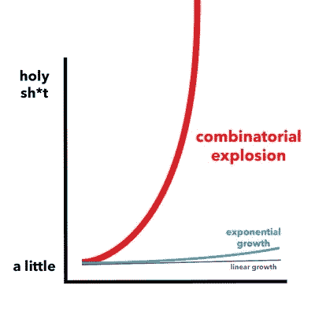

# 用冰淇淋解释的组合爆炸:如何增加一点，获得很多

> 原文：<https://www.freecodecamp.org/news/combinatorics-handle-with-care-ed808b48e5dd/>

让我们探索有趣的、反直觉的组合学世界。

组合值以形成不同的组合集可能是一件棘手的事情。即使忽略顺序，可能集合的数量也会惊人地增长。

对于两个值[1，2]的数组，可以生成:

*   [](空集)
*   [1]
*   [2]
*   [1，2](或[2，1])

如果允许重复(例如[2，2])，增加甚至更大。随着输入值数量的增加，对应的输出集[的数量也是一飞冲天](http://www.intmath.com/counting-probability/4-combinations.php)！



[Combinatorial Explosion](http://www.torbair.com/blog/2015/12/26/4mvxoio4tc8j28reqsbz449tlab4ss), indeed

让我们称输入值**项**和这些值的每个组合为**选择**。此外，让我们考虑多个项目，每个项目都有不同的选择。菜单就是一个很好的例子。我们将模拟 **Ye Olde 冰激凌店**的菜单，为顾客提供冰激凌、浇头和糖浆口味的组合。

冰淇淋口味有:**巧克力、草莓、香草**

配料:**菠萝、草莓、椰子片、山核桃**

糖浆:**巧克力、棉花糖、奶油糖果、枫糖**

在选择上有一些限制:顾客可以选择任何**两种**冰淇淋、**两种**配料和**一种**糖浆。冰淇淋和浇头的选择是排他性的，这意味着我不能选择菠萝+菠萝。顾客可以选择不加配料和糖浆，但必须选择至少一种冰淇淋。在这些约束条件下，增长率是指数级的，即 2 的 n 次方，这比如果顺序重要且允许重复的情况要小得多。

#### 适口性

Ye Olde 冰激凌店的经营方式实际上相当现代，它正在开发一个人工智能专家系统来判断冰激凌、浇头和糖浆的组合是否可口。当顾客选择了不可口的食物时，服务员会在他们的登记簿上显示警告。然后，服务员被指示与顾客再次核对他们的订单是否正确。

### 步骤 1:构建数据

这篇文章的代码可以在这里找到。我假设你熟悉 JavaScript 和 Node.js。对 Lodash(或下划线)的工作知识是有帮助的。代码使用 map/reduce 数据库进行存储。

第一步是创建一个所有冰淇淋、浇头和糖浆组合的数据库。输入内容如下:

```
var menu = {
  iceCream: {min: 1, max: 2, values: ["CHOCOLATE", "STRAWBERRY", "VANILLA"]},
  topping: {min: 0, max: 2, values: ["pineapple", "strawberry", "coconut flakes", "pecans"]},
  syrup: {min:0, max: 1, values: ["chocolate", "marshmallow", "butterscotch", "maple"]}
}
```

menu.js: Ice cream values are capitalized so that CHOCOLATE ice cream is distinguishable form chocolate syrup

有了这些数据，我可以编写一个[组合子](https://github.com/JeffML/Combinatorics/blob/master/Combinator.js)函数，它接受每个菜单项并生成所有可能的允许组合。每个组合都存储为一个数组。例如，冰淇淋组合看起来像:

```
[ [ ‘CHOCOLATE’, ‘STRAWBERRY’ ],
 [ ‘CHOCOLATE’, ‘VANILLA’ ],
 [ ‘CHOCOLATE’ ],
 [ ‘STRAWBERRY’, ‘VANILLA’ ],
 [ ‘STRAWBERRY’ ],
 [ ‘VANILLA’ ] ]
```

一旦确定了冰淇淋、浇头和糖浆的组合，剩下的就是将每个项目组合与其他项目组合进行迭代:

```
var allChoices = [];

_.each(iceCreamChoices, function(ic) {
  _.each(toppingChoices, function(tp) {
    _.each(syrupChoices, function(sy) {
      allChoices.push([ic,tp,sy]);
    })
  })
})
```

buildChoices.js

这就产生了冰淇淋、浇头和糖浆的组合，比如:

```
[ [ 'VANILLA' ], [ 'coconut flakes', 'pecans' ], [] ],
  [ [ 'VANILLA' ], [ 'coconut flakes' ], [ 'chocolate' ] ],
  [ [ 'VANILLA' ], [ 'coconut flakes' ], [ 'marshmallow' ] ],...
```

显示的选项翻译为:

*   香草冰淇淋配椰子片和山核桃，不加糖浆
*   香草冰淇淋配椰子片和巧克力糖浆
*   香草冰淇淋配椰子片和棉花糖糖浆

即使只有几个受限制的菜单项，允许选择的数量也有 330 个！

### 步骤 2:存储数据

现在确定了可订购项目的每一种组合，就可以做进一步的工作了。用于确定合意选择组合的人工智能系统被证明是复杂的，不会被嵌入到收银机的操作系统中。取而代之的是，一个 AJAX 请求将被发送到一个包含 AI 程序的服务器。输入将是客户的菜单选择，输出将这些选择的可口性评级为:**【啊，嗯，美味，崇高】。**适口性评级 **ugh** 触发前述警告。

我们需要对请求做出快速响应，因此适口性评级将被缓存在数据库中。鉴于指数增长的性质，如果未来菜单上增加更多的项目选择，这可能会演变成一个大数据问题。

假设决定将选项组合和评级存储在 NoSQL 数据库中。使用 [PouchDB，](https://pouchdb.com/guides/)将每个选择和适口性值存储为 JSON 文档。将每个选择作为关键字的一个 [*二级索引*](https://pouchdb.com/guides/queries.html) (又名*视图*)将允许我们快速查找适口性评级。我可以将 JSON 文档推送到数据库进行存储，而不是像上面的 [buildChoices.js](https://gist.github.com/JeffML/c0f9c7c02272da7c57604bd685910cd2) 中所示的那样将数据推送到 **allChoices** 数组中。

简单地说，我可以在 Step1.js 中做几处修改来得到 Step2.js:首先，我需要通过 npm 安装 PouchDB，然后需要它。然后，我创建一个名为 **choices** 的 NoSQL 数据库。

```
var PouchDB = require('pouchdb');
var db = new PouchDB('choices');
```

现在，每个选择都被发布到选择数据库:

```
var count = 0;

_.each(iceCreamChoices, function(ic) {
  _.each(toppingChoices, function(tp) {
    _.each(syrupChoices, function(sy) {
      //allChoices.push([ic,tp,sy]);
      db.post({choice: [ic,tp,sy]}, function(err, doc){
        if (err) console.error(err);
        else console.log(`stored ${++count}`);
      });
    })
  })
});

console.log('done??');
```

pouchPost.js

这个管用！算是吧。从对 **db.post** 的回调参数可以推断，该操作是异步的。我们在日志中看到的是:

```
>node Step2.js
done??
stored 1
stored 2
stored 3
...
```

所以代码说它甚至在记录 1 被存储之前就完成了。如果我要对数据库做进一步的处理，而所有的记录还不在那里，这将是一个问题。

### 第三步:固定和提炼

还有一个更微妙的问题:潜在的资源枯竭。如果数据库限制并发连接数，大量并发 post 请求可能会导致连接超时。

对于 [Step3.js](https://github.com/JeffML/Combinatorics/blob/master/Step3.js) ，我对 Step2.js 中的内容做了一些错误修复、重新格式化和重构。一个错误是每次运行都会向数据库中添加越来越多的记录，复制之前的内容。解决方案是破坏现有的数据库，重新创建它，然后运行主程序:

```
// remove old
db.destroy(null, function () {
    db = new PouchDB('choices');
    run();
});
```

下一步是添加一个存储文档的运行计数和进程中的 post 请求，这样程序:1)知道最后一个文档是什么时候存储的；2)任何时候只允许五个帖子继续。run()方法现在看起来是这样的(有一些遗漏):

```
function run() {
    var menu = { //...
    }

    var iceCreamChoices = new Combinator({ //...
    });
    var toppingChoices = new Combinator({ //...
    });
    var syrupChoices = new Combinator({ //...
    });

    var count = 0;
    var total = iceCreamChoices.length * toppingChoices.length * syrupChoices.length;
    var postCount = 0;
    var postCountMax = 5;

    _.each(iceCreamChoices, function (ic) {
        _.each(toppingChoices, function (tp) {
            _.each(syrupChoices, function (sy) {
                var si = setInterval(() => {
                    if (postCount < postCountMax) {
                        clearInterval(si);
                        postChoice(ic, tp, sy);
                    }
                }, 10);
            })
        })
    });

    function postChoice(ic, tp, sy) {
        ++postCount;
        db.post({
            choice: [ic, tp, sy]
        }, function (err, doc) {
            --postCount;
            done(err);
        });
    }

    function done(err) {
        if (err) {
            console.error(err);
            process.exit(1);
        }

        console.log(`stored ${++count}`);
        if (count === total) {
            console.log('done');
        }
    }
}
```

run.js

需要注意的主要变化是:

1.  一个 **postCount** 跟踪有多少帖子是未完成的
2.  间隔计时器检查**后计数**，并在 post 插槽可用时发布和退出
3.  当所有选择都被存储时，调用一个 **done()** 处理程序

### 第四步:增加适口性

有了所有可能的菜单选择，我们现在可以让人工智能来决定每一个的可口性。AI 目前只是一个模拟，它为 PouchDB 中的每个文档记录分配随机值。这些值将通过用口味等级更新每个文档而被存储在数据库中。

```
var _ = require('lodash');

var PouchDB = require('pouchdb');
var db = new PouchDB('choices');

db.allDocs({
        include_docs: true
    })
    .then(docs => {
        _.each(docs.rows, r => {
            r.doc.taste = palatability();
            db.put(r.doc);
        });
    });

function palatability() {
    var scale = Math.round(Math.random() * 10);

    var taste;

    switch (true) {
    // this switch is a horrible hack;  don't ever do this ;-P
    case (scale < 2):
        taste = "ugh";
        break;
    case (scale < 5):
        taste = "meh";
        break;
    case (scale < 8):
        taste = "tasty";
        break;
    default:
        taste = "sublime";
        break;
    }

    return taste;
}
```

palatability.js

为了验证我们存储的内容是否正确，我们可以将数据库中的文档转储到控制台:

```
db.allDocs({
        include_docs: true
    })
    .then(docs => {
        _.each(docs.rows, r => {
            console.log(r.doc.choice, r.doc.taste)
        });
    });
//output looks like:
/*
[ [ 'STRAWBERRY' ], [ 'coconut flakes' ], [ 'maple' ] ] 'sublime'
[ [ 'CHOCOLATE' ], [ 'pecans' ], [ 'chocolate' ] ] 'tasty'
[ [ 'CHOCOLATE', 'STRAWBERRY' ], [], [ 'chocolate' ] ] 'sublime'
[ [ 'VANILLA' ], [], [ 'marshmallow' ] ] 'meh'
[ [ 'CHOCOLATE', 'STRAWBERRY' ],
  [ 'pineapple' ],
  [ 'marshmallow' ] ] 'meh'
*/
```

### 第五步:寻找可口的食物

文档在数据库中，但现在需要有一种方法来确定什么是适合客户选择的。这是通过定义一个视图来实现的，视图是一个为每个文档返回一个键和一个值的函数。关键应该是什么？

我可以使用 r.doc.choice 作为键，但是数组有一个顺序，如果在步骤 1 中定义的菜单项后来被重新排列，这个顺序可能会改变。这个键只是一个选项选择的标识符，它本身没有语义。应该做的是:

*   展平每个 r.doc.choice 数组，
*   按字母顺序排列元素，然后
*   将它们连接在一起
*   结果是关键

但是，如果将来添加了更多选择，密钥长度可能会超过数据库允许的限制。代替使用构造的密钥，密钥的散列可以用作真正的密钥。十六进制的 SHA256 哈希有 64 个字符长，哈希冲突的可能性基本上为零，即使是千万亿次选择。使用 Node.js **crypto** 模块和一个 Lodash 链，编写用于选择的散列函数很容易:

```
const crypto = require('crypto');
const _ = require('lodash')

function hash(choice) {
    var str = _.chain(choice)
        .flatten()
        .sortBy()
        .join('|')
        .value();

    return crypto.createHmac('sha256', 'old ice cream')
        .update(str)
        .digest('hex');
}

module.exports = hash;
```

hashChoices.js

将散列添加到我们现有的文档中是一件简单的事情，即遍历每个数据库文档，计算它的散列，并用一个键值更新文档:

```
const _ = require('lodash');
const hash = require('./hash');

const PouchDB = require('pouchdb');
const db = new PouchDB('choices');

db.allDocs({
        include_docs: true
    })
    .then(docs => {
        _.each(docs.rows, r => {
            r.doc.key = hash(r.doc.choice);
            db.put(r.doc);
        });
    })
    .catch(e => {
        console.error(e)
    });
```

addHashKey.js

接下来，使用文档关键字字段作为索引来构建数据库视图；我就称之为**选择**。

```
const PouchDB = require('pouchdb');
const db = new PouchDB('choices');

// doc that defines the view
var ddoc = {
    _id: '_design/choice',
    views: {
        by_key: {
            map: function (doc) {
                emit(doc.key, doc.taste);
            }.toString()
        }
    }
};

// remove any existing view, then add new one:
db.get(ddoc._id)
    .then(doc => {
        return db.remove(doc);
    })
    .then(() => {
        db.put(ddoc)
            .catch(function (err) {
                console.error(err);
            });
    });
```

view.js

对于任何文档键(选择数组的散列)，我可以通过视图**选择找到它的味道。**现在一切就绪，可以决定顾客的选择是**呃，嗯，好吃，**还是**极品**。为了验证这一点，我们做了一些随机选择，看看我们是否能找到味道:

```
 const choices = [
        [['VANILLA'], ['coconut flakes', 'pecans'], ['marshmallow']],
        [['CHOCOLATE'], ['pecans'], ['chocolate']],
        [['STRAWBERRY', 'VANILLA'], ['pineapple', 'coconut flakes'], ['marshmallow']],
        [['STRAWBERRY'], ['pecans'], ['maple']],
        [['VANILLA'], ['coconut flakes', 'pineapple'], ['chocolate']],
        [['CHOCOLATE, STRAWBERRY'], ['pineapple', 'pecans'], ['butterscotch']],
    ];

    const keys = _.map(choices, c => {
        return hash(c);
    });

    db.query('choice/by_key', {
        keys: keys,
        include_docs: false,
    }, function (err, result) {
        if (err) {
            return console.error(err);
        }
        _.each(result.rows, (r, i) => {
            console.log(`${choices[i]} tastes ${r.value}`);
        })
    });
```

test.js

结果是:

```
=> node test
VANILLA,coconut flakes,pecans,marshmallow tastes ugh
CHOCOLATE,pecans,chocolate tastes sublime
STRAWBERRY,VANILLA,pineapple,coconut flakes,marshmallow tastes tasty
STRAWBERRY,pecans,maple tastes meh
VANILLA,coconut flakes,pineapple,chocolate tastes sublime
```

就是这样！剩下的工作就是编写客户端软件，通过 AJAX 提交选择，并获得一个味道(适口性)值。如果是 **ugh** ，那么寄存器上就会出现一个警告。

在随后的一篇文章中，我改进了上面使用的算法。[来看看](https://medium.com/@jefflowery/recursive-generator-f8bc30e5e412#.wa7sl6bt7)！

### 参考

[**指数增长并不酷。组合爆炸是。**](http://www.torbair.com/blog/2015/12/26/4mvxoio4tc8j28reqsbz449tlab4ss)
[*如此多的科技行业都痴迷于指数级增长。任何线性的东西都是垂死的，或者已经死去多年……*](http://www.torbair.com/blog/2015/12/26/4mvxoio4tc8j28reqsbz449tlab4ss)
[www.torbair.com](http://www.torbair.com/blog/2015/12/26/4mvxoio4tc8j28reqsbz449tlab4ss)

[**组合排列计算器**](https://www.mathsisfun.com/combinatorics/combinations-permutations-calculator.html)
[*找出你可以选择物品的多少种不同方式。有关公式的深入解释，请访问…*](https://www.mathsisfun.com/combinatorics/combinations-permutations-calculator.html)
[www.mathsisfun.com](https://www.mathsisfun.com/combinatorics/combinations-permutations-calculator.html)