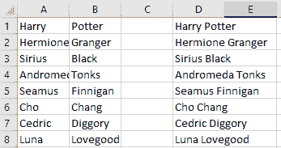
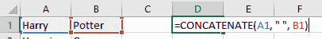

# 如何在 Excel 中组合名字和姓氏

> 原文：<https://www.freecodecamp.org/news/combine-first-last-names-excel/>

在 Excel 中，您可能有一个包含名字的列和一个包含姓氏的列，您希望对它们进行联接。在本教程中，我将解释你如何可以轻松地做到这一点。

假设我们在列 A 中有名字列表，在列 B 中有姓氏列表，我们想在列 d 中连接它们，我们需要使用 Excel 的`CONCAT`函数来完成这个任务。

`CONCAT`函数接受一个文本字符串列表或范围，并连接它们(或组合它们)以创建一个新的连续值。所以基本上它可以让你将两列中的信息合并到一个新列中。

## 如何在 Excel 中使用 CONCAT

在 D 列的第一个单元格中，我们写`=CONCAT(A1, " ", B1)`。这是创建新字符串的语法，新字符串由名字(`A1`)、空格(`" "`)、姓氏(`B1`)组成。

因此，Excel 不会将“哈利”和“波特”放在两个不同的单元格中，而是会根据我们的需要，为我们提供一个包含“哈利波特”的新列。

如果您想将此公式应用于多行，您可以复制此公式并将其粘贴到以下所有单元格中。或者，您可以单击单元格右下角的绿色手柄并拖动它，使绿色边框包围我们希望应用此公式的所有单元格。当您释放时，Excel 会将`CONCAT`应用到您高亮显示的所有单元格。

### CONCAT 兼容性问题

Excel 2016 中增加了`CONCAT`函数。因此，如果您使用 Excel 的早期版本，您需要使用`CONCATENATE`来代替。

它有一些细微的差别，但是对于这种情况，你可以按照上面的说明，只要在使用`CONCAT`的时候直接替换`CONCATENATE`，它会给你同样的结果。

## 结论

在本教程中，我们学习了 Excel `CONCAT`函数及其前身`CONCATENATE`。我们使用这个函数将名和姓的列表连接在一起，得到全名列表。