# 命令行命令–CLI 教程

> 原文：<https://www.freecodecamp.org/news/command-line-commands-cli-tutorial/>

Windows 命令行是 Windows PC 上最强大的实用程序之一。有了它，你可以直接与操作系统交互，做许多图形用户界面(GUI)中没有的事情。

在本文中，我将向您展示可以在 Windows 命令行上使用的 40 个命令，它们可以增强您作为 Windows 用户的信心。

注意:在使用我将向你展示的命令时，你必须小心。这是因为有些命令会对您的 Windows PC 产生持久的负面或正面影响，直到您重置它。

此外，其中一些命令要求您以管理员身份打开命令提示符。

## Windows 命令行命令

### `powershell start cmd -v runAs`–以管理员身份运行命令提示符

以管理员身份输入该命令会打开另一个命令提示符窗口:
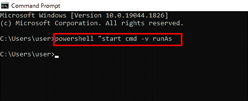

### `driverquery`–列出所有已安装的驱动程序

访问所有驱动程序很重要，因为它们经常会导致问题。

这就是这个命令的作用——它甚至向您显示您在设备管理器中找不到的驱动程序。
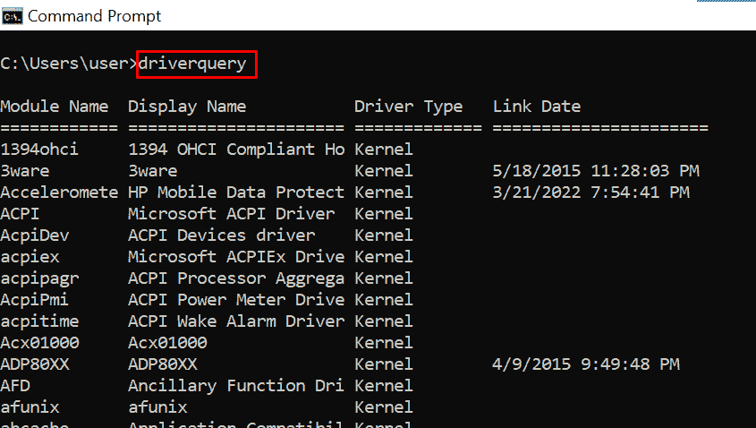

### `chdir`或`cd`–将当前工作目录切换到指定目录

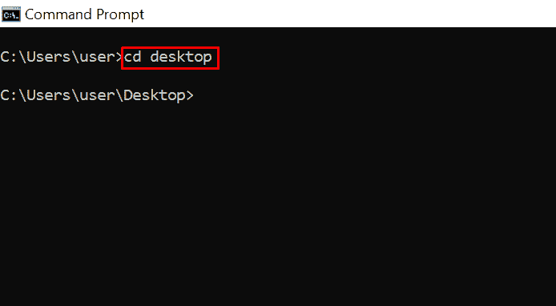

### `systeminfo`–显示您电脑的详细信息

如果您想查看在 GUI 中看不到的关于您的系统的更多详细信息，这是适合您的命令。
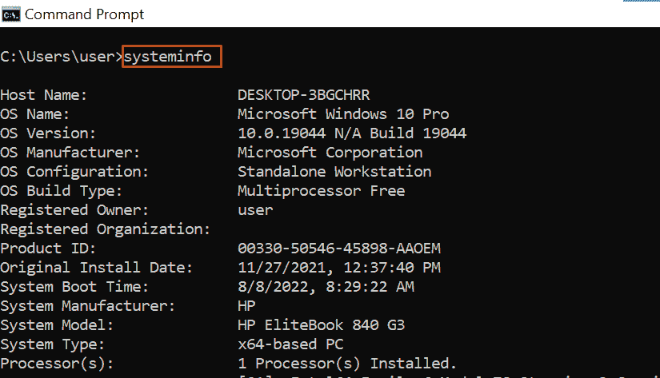

### `set`–显示您电脑的环境变量

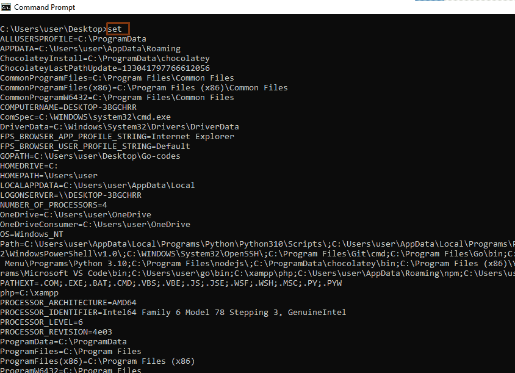

### `prompt`–更改输入命令前显示的默认文本

默认情况下，命令提示符显示您的用户帐户的 c 盘路径。

您可以使用`prompt`命令用语法`prompt prompt_name $G` :
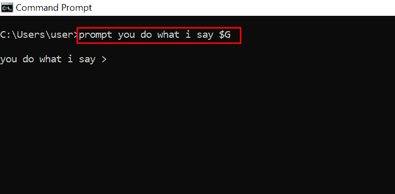来更改默认文本

**注意:B** :如果你不把`$G`加到命令后面，你就不会在文本前面看到大于号。

### `clip`–将项目复制到剪贴板

例如，`dir | clip`将当前工作目录的所有内容复制到剪贴板。
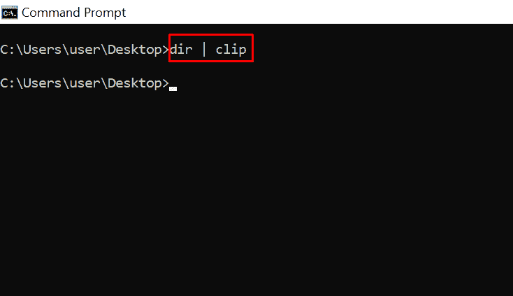

你可以输入`clip /?`然后打`ENTER`看看怎么用。

### `assoc`–列出程序及其相关的扩展名

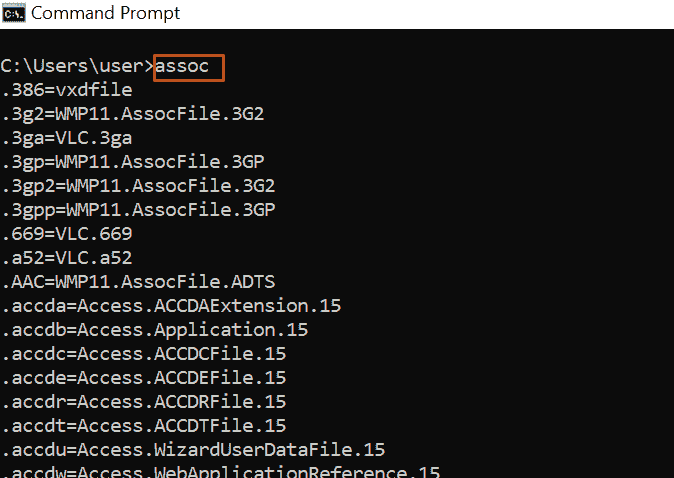

### `title`–使用格式`title window-title-name`更改命令提示符窗口标题

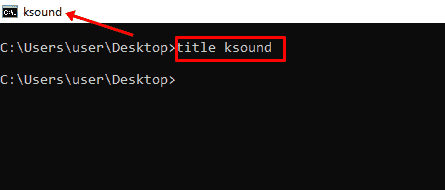

### `fc`–比较两个相似的文件

如果您是一名程序员或作者，并且希望快速了解两个文件之间的不同之处，您可以输入以下命令，然后输入这两个文件的完整路径。比如`fc “file-1-path” “file-2-path”`。
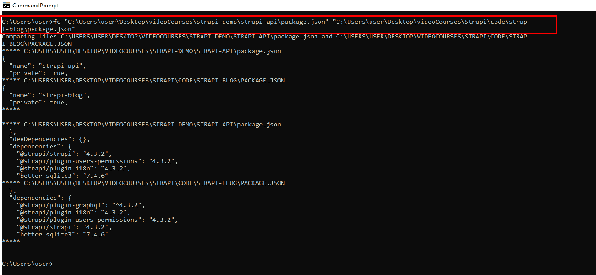

### `cipher`–擦除可用空间并加密数据

在 PC 上，您和其他用户仍然可以访问已删除的文件。所以，从技术上讲，它们并没有被删除。

您可以使用 cipher 命令来清除驱动器上的数据并加密这些文件。
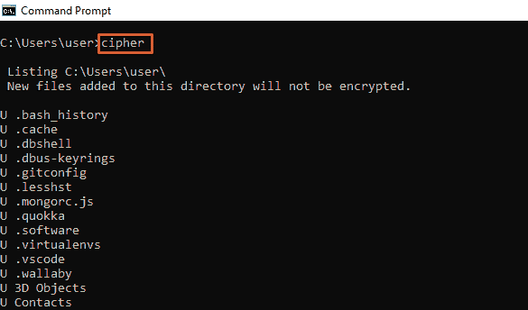

### `netstat -an`–显示打开的端口、它们的 IP 地址和状态

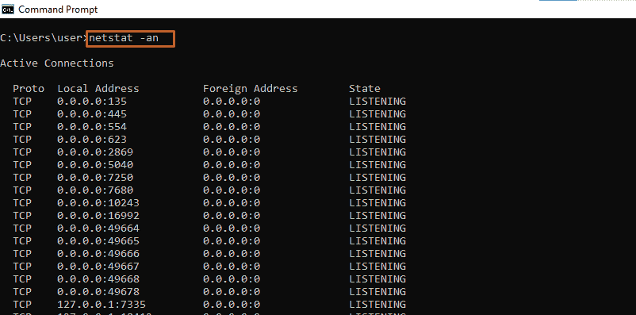

### `ping`–显示网站 IP 地址，让您知道传输数据和获得响应需要多长时间

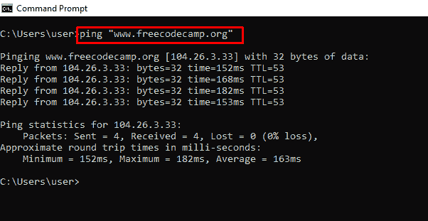

### `color`–改变命令提示符的文本颜色

输入`color attr`查看你可以改变的颜色:
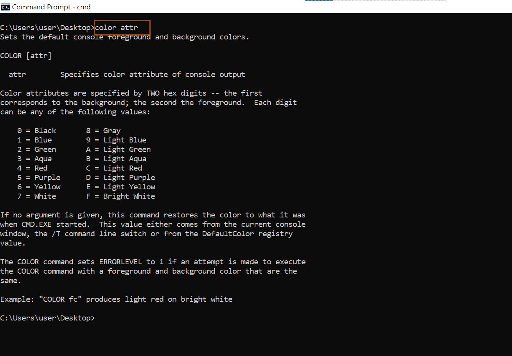

输入`color 2`，终端颜色变为绿色:
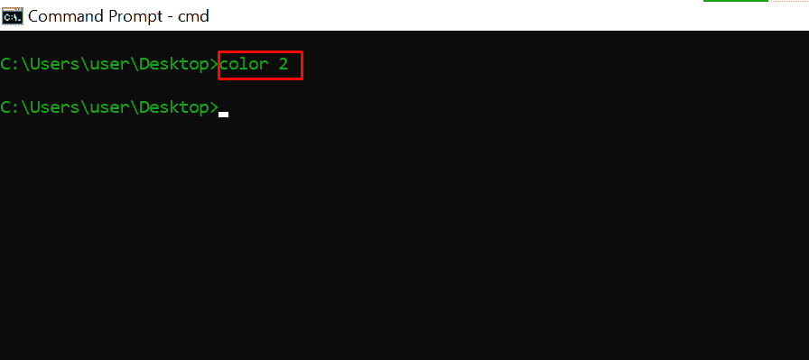

### `for /f "skip=9 tokens=1,2 delims=:" %i in ('netsh wlan show profiles') do @echo %j | findstr -i -v echo | netsh wlan show profiles %j key=clear`–显示所有 Wi-Fi 密码

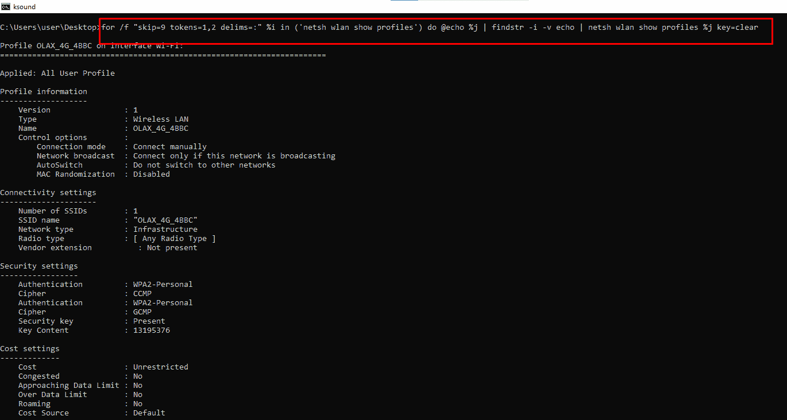

### `ipconfig`–显示关于电脑 IP 地址和连接的信息

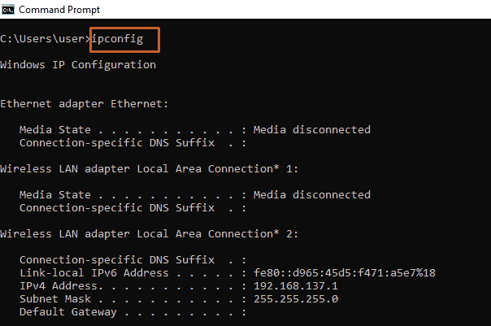

该命令还具有诸如`ipconfig /release`、`ipconfig /renew`和`ipconfig /flushdns`的扩展名，您可以使用这些扩展名对互联网连接问题进行故障诊断。

### `sfc`–系统文件检查器

此命令扫描您的计算机上损坏的文件并修复它们。您可以用来运行扫描的命令的扩展名是`/scannow`。
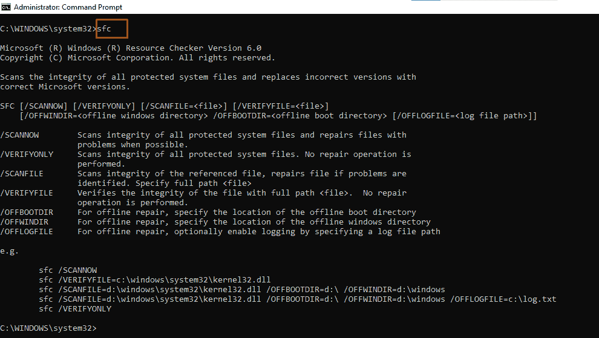

### `powercfg`–控制可配置的电源设置

您可以使用此命令及其多个扩展名来显示有关电脑电源状态的信息。

您可以输入`powercfg help`来显示这些扩展名。
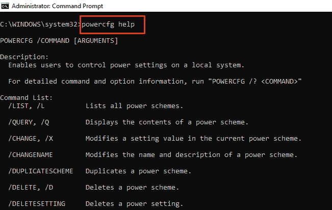

例如，您可以使用`powercfg /energy`生成电池健康报告。
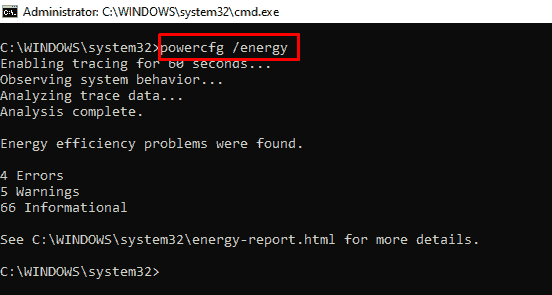

`powercfg /energy`命令将生成一个包含报告的 HTML 文件。你可以在`C:\Windows\system32\energy-report.html`中找到 HTML 文件。

### `dir`–列出目录中的项目

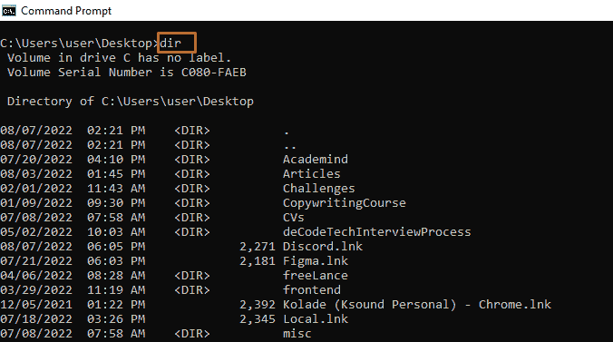

### `del`–删除文件

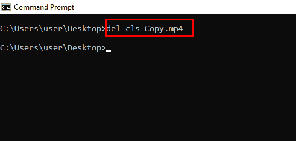

### `attrib +h +s +r folder_name`–隐藏文件夹

你可以通过在命令行中输入`attrib +h +s +r folder_name`然后按下`ENTER`来隐藏一个文件夹。

要再次显示文件夹，执行命令`– attrib -h -s -r folder_name`。
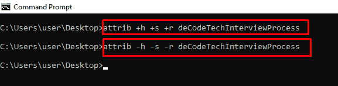

### `start website-address`–从命令行登录网站

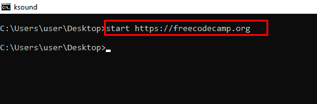

### `tree`–显示当前目录或指定驱动器的树

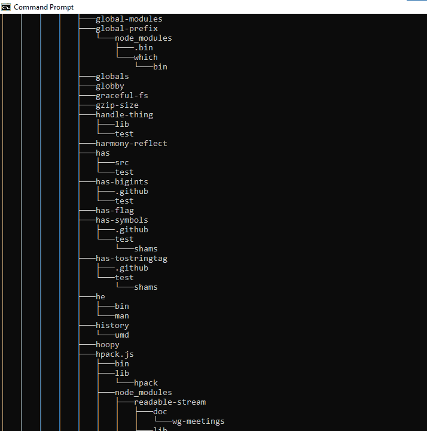

### `ver`–显示操作系统的版本

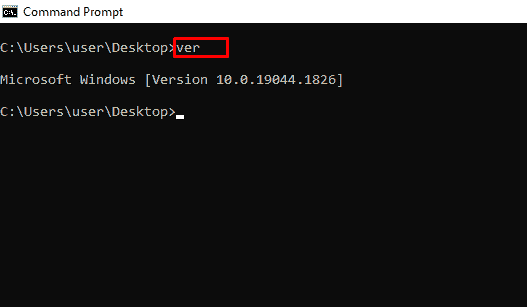

### `tasklist`–显示打开的程序

你可以用这个命令做和任务管理器一样的事情:
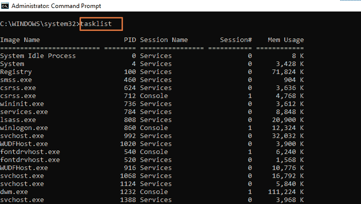
下一个命令告诉你如何关闭一个打开的任务。

### `taskkill`–终止正在运行的任务

要终止任务，运行`taskkill /IM "task.exe" /F`。比如`taskkill /IM "chrome.exe" /F`:

### `date`–显示和更改当前日期

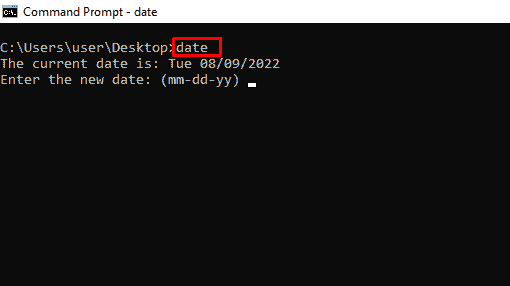

### `time`–显示和改变当前时间

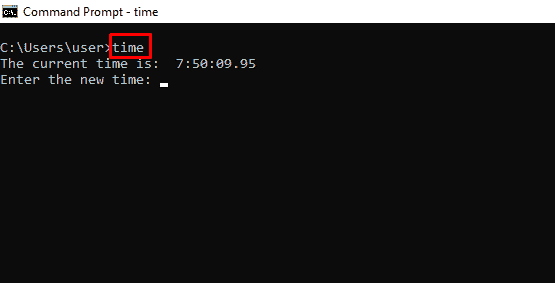

### `vol`–显示当前驱动器的序列号和标签信息

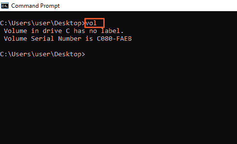

### `dism`–运行部署映像服务管理工具

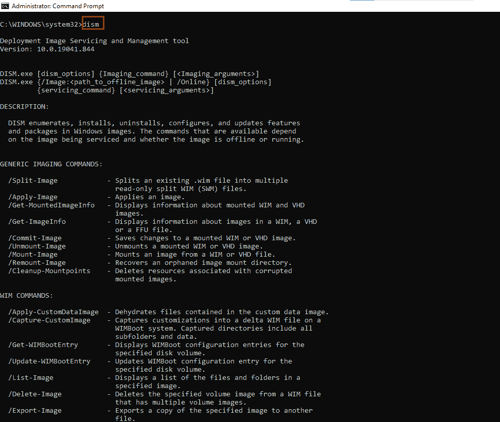

### `CTRL + C`–停止命令的执行

### `-help`–提供其他命令的指南

例如，`powercfg -help`显示了如何使用`powercfg`命令
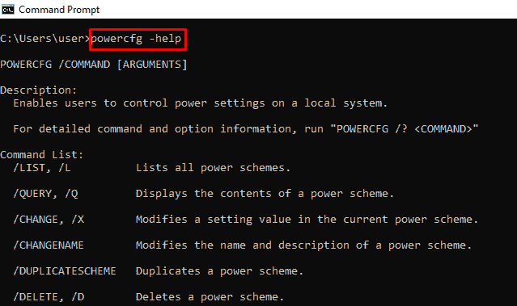

### `echo`–显示自定义消息或来自脚本或文件的消息

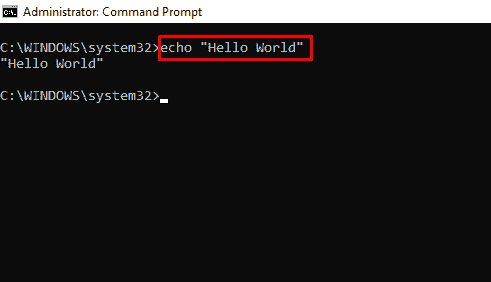

您也可以使用`echo`命令创建一个语法为`echo file-content > filename.extension`的文件。

### `mkdir`–创建一个文件夹

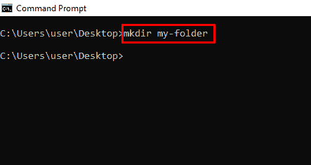

### `rmdir`–删除文件夹

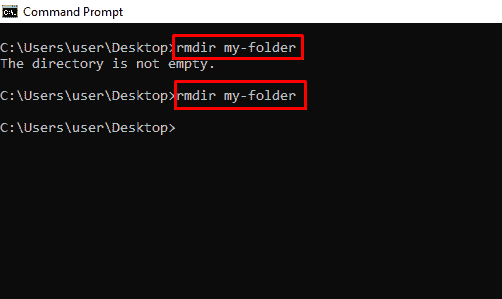

**注意:**文件夹必须为空，此命令才能生效。

### `more`–显示文件的更多信息或内容

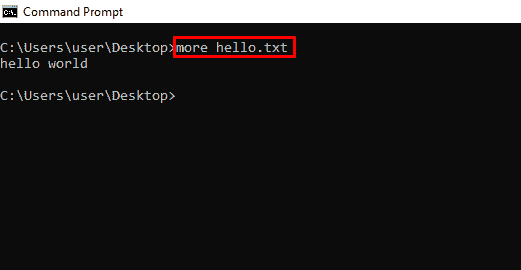

### `move`–将文件或文件夹移动到指定的文件夹

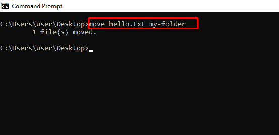

### `ren`–使用语法`ren filename.extension new-name.extension`重命名文件

### `cls`–清除命令行

如果您输入了几个命令，而命令行堵塞，您可以使用`cls`清除所有条目及其输出。
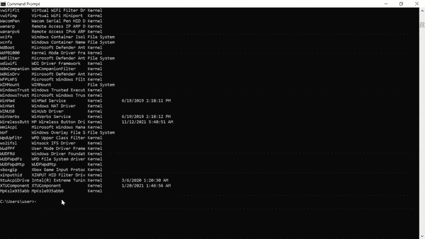

### `exit`–关闭命令行

### `shutdown`–关闭、重启、休眠、睡眠电脑

您可以从命令行关闭、重启、休眠和睡眠您的电脑。

在命令行中输入`shutdown`,这样就可以看到可以用来执行动作的扩展。例如，shutdown /r 将重新启动计算机。
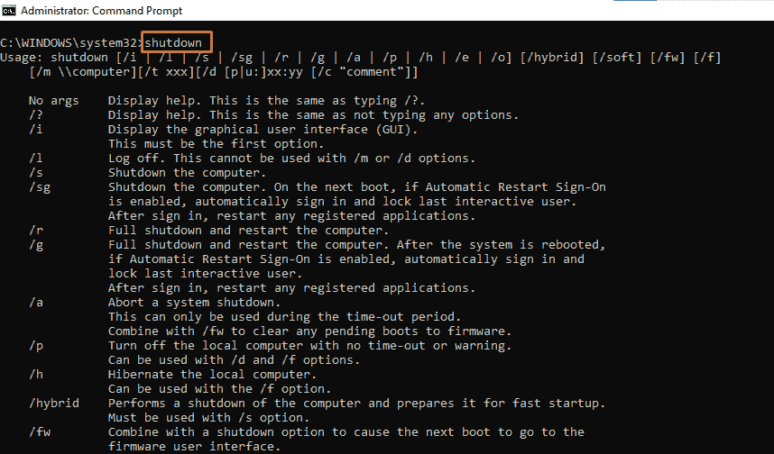

## 结论

本文向您展示了几个“未知对多”命令，您可以使用它们来访问 Windows PC 上的隐藏功能。

同样，使用这些命令时要小心，因为它们会对操作系统产生持久的影响。

如果您发现这些命令很有帮助，请与您的朋友和家人分享这篇文章。

如果你知道我没有列出的另一个有用的命令，[在 Twitter 上告诉我吧](https://twitter.com/Ksound22)。我会添加它，并提及您作为来源。