# 命令 Javascript 控制台

> 原文：<https://www.freecodecamp.org/news/commanding-the-javascript-console-4e1caaeab345/>

凯尔·吉尔


# 命令 Javascript 控制台

#### 调试、格式化和效率的有用技巧

控制台是开发人员最先了解的工具之一。控制台是开发人员调试自己的应用程序时使用的工具。工具定律指出，人们很容易对熟悉的工具过于自信。

> “我想，如果你唯一的工具是一把锤子，那么把一切都当成钉子是很有诱惑力的。”-马斯洛

同样的想法也可以应用到控制台上。在一个生态系统中，工具、键盘快捷键和 API 就像乐土中的牛奶和蜂蜜一样流动，当你的旧锤子工作正常时，很难证明拿起新锤子是正确的。不过相信我，你锤子后面的那些尖头物不仅仅是用来拔钉子的。

以下是我在控制台中发现的一些最简单的调试技巧。

#### #1:包装参数

如果您将传递给`console.log`的参数包装在{}中，您将以对象形式输出您正在记录的数据。这个对象将会有一个好听的名字来告诉你你想要输出的是什么。

而不是在您的控制台中看到一大堆具有类似字段(如 id 和 name)的对象，如下所示:

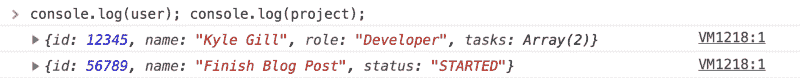

您将在打印的数据前获得变量的名称，如下所示:

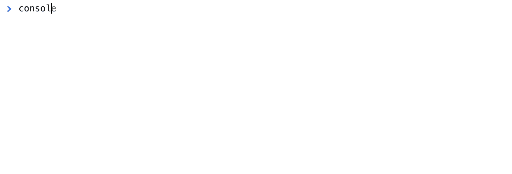

Down with ambiguity!

#### #2:将数据复制到剪贴板

您可以将控制台中记录的数据复制到计算机的剪贴板上。当你想在 REPL 中操作一个对象或者取出你正在调试的数据时，我发现这很有用。

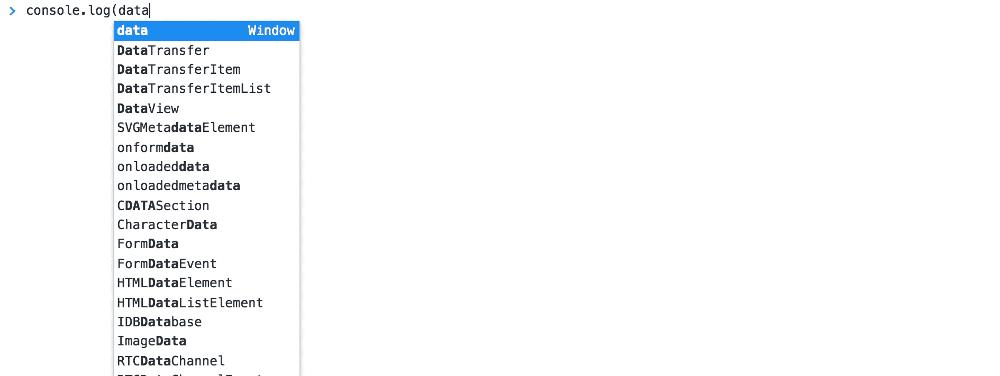

右键单击要复制的数据，然后选择“存储为全局变量”。这将用一个临时名称将数据作为变量保存在控制台中。(如果这是你第一次在控制台窗口中这样做，它将是`temp1`。)然后您可以使用`copy()`命令，将名称`temp1`作为参数。这会将存储的数据复制到您的剪贴板，您可以像粘贴任何其他复制的数据一样粘贴这些数据。

当数据库查询返回的数据格式与您的数据在前端被操作的格式不匹配时，这尤其有用。你可以向你展示数据是如何变异或转化的。

#### #3:短路表达式

如果你用一个`||`来缩短一个表达式，你可以更快地重构代码或者添加一个调试语句。这对于单行粗箭头函数特别有用，在这种情况下，您希望看到作为参数接收的数据。

```
// THISsomeFunction = data => (  <div>    <Component data={data} />  </div>)
```

```
// BECOMES...someFunction = data =&gt; console.log(data) || (  <div>    <Component data={data} />  </div>)
```

```
// RATHER THAN...someFunction = data =&gt; {  console.log(data)    return (    <div>      <Component data={data} />    </div>  )}
```

您跳过了用花括号将整个函数包装起来并添加一个回车。这看起来没什么大不了的，直到你优化性能，并做了一千次，试图找出你犯了什么惊人的反应。

#### #4:日志、错误、警告

除了`console.log()`之外，控制台还有其他几个功能，以不同的预定义格式将数据打印到控制台。其中包括:

*   `console.log()`

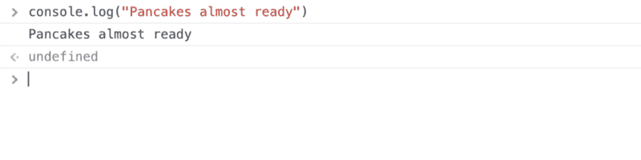

*   `console.warn()`

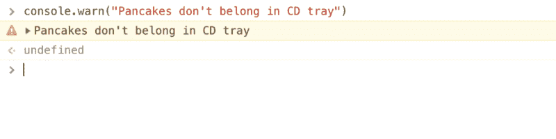

*   `console.error()`

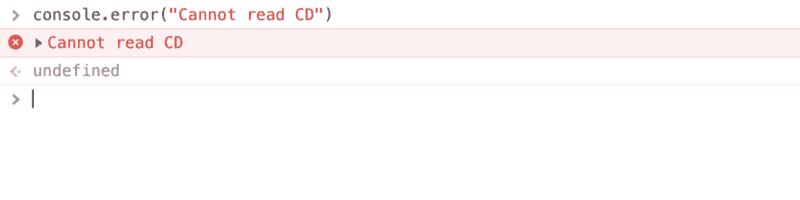

#### #5:控制台输出的自定义格式

您可以做的不仅仅是用`console.log`、`warn`和`error`实现内置格式。你可以扮演艺术家的角色，控制台就是你的画布！

也许可以尝试在您想要强调的输出周围打印一个漂亮的药丸:

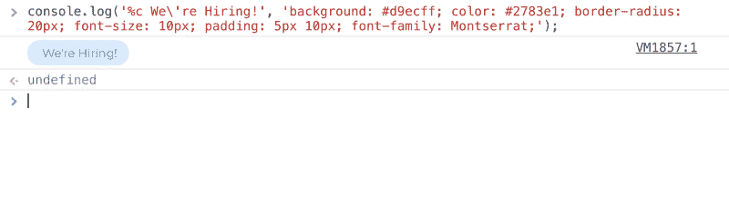

Required skills: HTML, CSS, and Quantum Computing Experience

以下是片段:

您还可以将 CSS 存储在变量中作为样式应用于输出。你可以用彩虹溅击你的同事来跟踪你输出的所有东西。如果你想让巨大的彩虹跟随一切，试试这个:

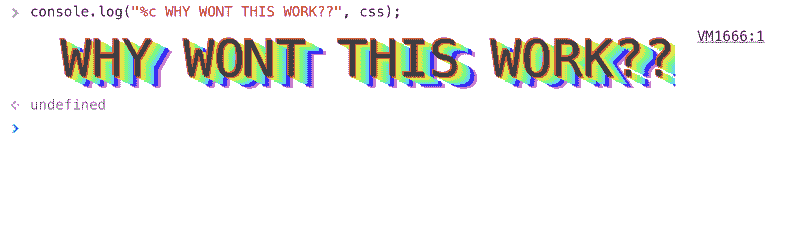

Effective when venting frustration

#### #6:将 JSON 打印成表格

许多人不知道，控制台有一个内置的方法，用于以表格格式打印表格数据。这对于快速阅读 JSON 数据非常有用。

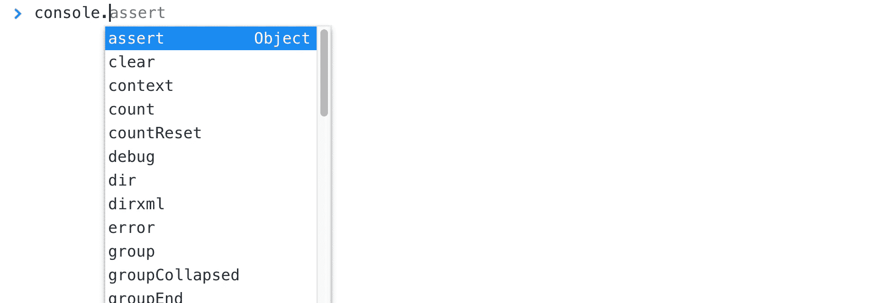

#### #7:易于计数

`console.count()`方法可以让记录你在代码中点击一个点的次数变得非常简单。您不再需要在代码中加入增量变量。

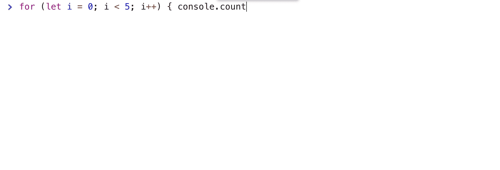

> 专业提示:你可以用一个变量的标签替换“数字”,它会计算带有该标签的计数方法被点击的次数。

我发现这在尝试调试 React 应用程序中的竞争条件或不必要的重新渲染时非常有用。

#### #8:使用 DOM 元素

您可以在 Elements 选项卡中选择一个 DOM 元素，然后用`$0`访问它。浏览器实际上会保留一个历史记录，其中`$0`代表当前的选择。`$1`代表先前的选择。`$2`倒数第二次选择等等最多 5 个元素。

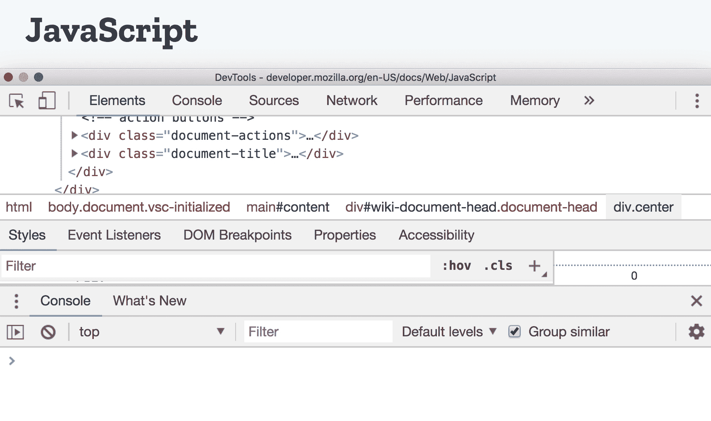

With a typing speed of approximately 15 words per minute

你可能会问自己:我什么时候想从控制台改变我的应用程序的 innerHTML？答案可能是只有当你想要一个非常简单的博客文章的 GIF 示例时。但是这也有它的使用案例。

#### #9:调试器语句

如果你曾经添加了一个 console.log，进入浏览器工具并添加了一个断点，看看当它到达那个代码时发生了什么，用`debugger`语句解放你自己。

如果您在 Javascript 的某一行添加了`debugger`,浏览器将会停止并打开调试工具并暂停执行。

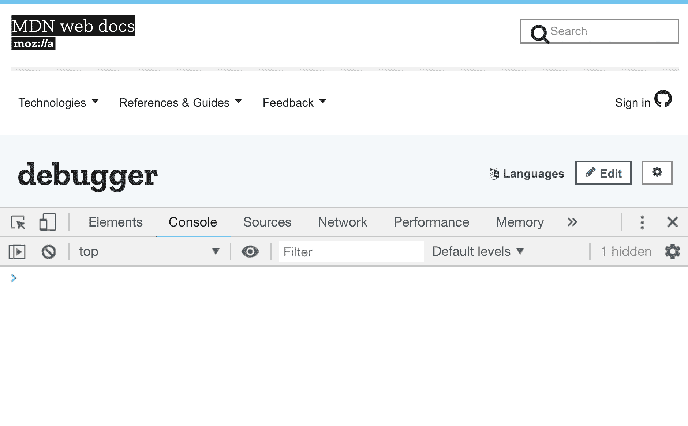

Shortcut!

虽然这不是一个控制台功能，但知道这一点很重要。将信息记录到控制台不如浏览器内置的调试工具有效或高效(如 Chrome 的 Sources 选项卡或 Firefox 的 Debugger 选项卡)。为了进一步改进调试，请查看深入这些工具的资源。

然而，控制台仍然是一种非常快速有效的方式来查看应用程序中的应用程序流，其中许多不同的生命周期方法和重新渲染正在启动，改进您使用它们的方式也将使您成为一名更好的开发人员。

### 感谢阅读！

如果你有自己的小技巧，请分享！我很乐意在评论中、在 Twitter 上或通过电子邮件听到你的意见。

如果你觉得你读到的有趣或有帮助，欢迎留下一两个掌声，订阅未来的更新，或转发/分享这条推文:？