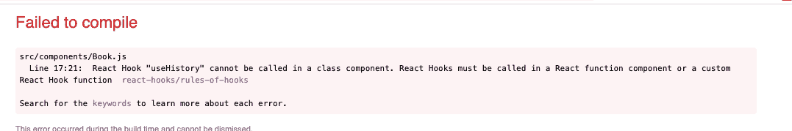
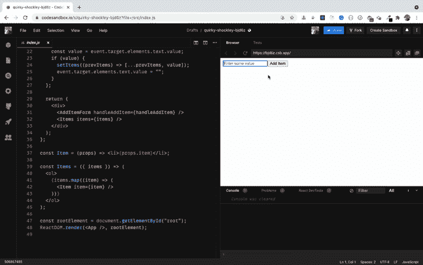
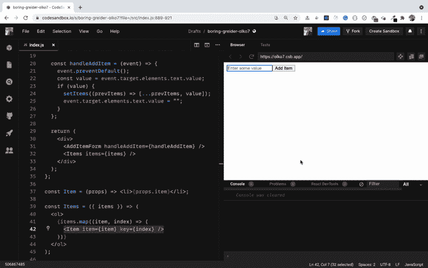
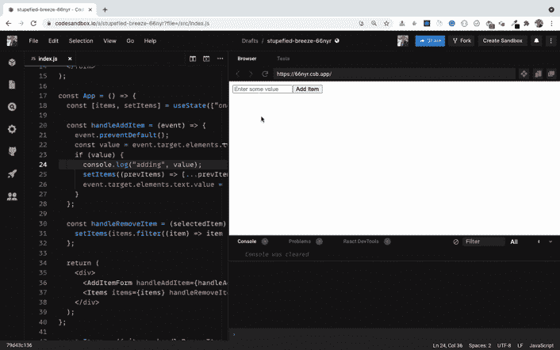

# 开发人员常犯的错误——以及如何解决它们

> 原文：<https://www.freecodecamp.org/news/common-mistakes-react-developers-make-and-how-to-fix-them/>

在本文中，我们将看到 React 开发人员会犯的一些常见错误，以及如何避免这些错误。

所以让我们开始吧。

## 不要忘记，每次路由更改都会装载和卸载一个组件

每当在 React 应用程序中使用路由时，都要在`Switch`组件中声明路由。这意味着一次只显示一个具有匹配管线的元件。

因此，每当您从一个路由转到另一个路由时，先前显示的组件将被卸载，而具有新匹配路由的组件将被装载。

如果您需要在一次路由变更中保存一些数据，您需要在封装路由的组件中声明它。它可以是下面代码沙箱中的`App`组件，或者其他一些持久化数据的方式，比如使用[本地存储或者会话存储](https://javascript.plainenglish.io/everything-you-need-to-know-about-html5-local-storage-and-session-storage-479c63415c0a?source=friends_link&sk=f429aa5008683a3b0359db43f976efb3)

[https://codesandbox.io/embed/hopeful-faraday-hqz9x?file=/src/App.js](https://codesandbox.io/embed/hopeful-faraday-hqz9x?file=/src/App.js)

正如您在上面的代码沙箱中看到的，每当我们通过点击链接来改变路线时，相应的`console.log`就会显示在控制台上。这表示先前的组件已卸载，新的组件已装载。

## 不要使用错误的 setState 语法

每当你在一个基于类的组件中声明某个状态时，它总是一个这样的对象:

```
this.state = {
 counter: 0
} 
```

因此，每当您使用 setState 语法的 updater 形式来更新状态时，它看起来就像这样:

```
this.setState((prevState) => {
  return {
    counter: prevState.counter + 1
  };
}); 
```

因为状态是一个对象，`prevState`也是一个对象——所以您使用`prevState.counter`来访问`counter`。

但是当您使用带有 React 挂钩的功能组件时，状态可以是一个对象或非对象值，如下所示:

```
const [counter, setCounter] = useState(0); 
```

这里，`counter`的值不是一个对象，而是一个数字。因此，要使用 updater 语法更新状态，您将编写如下代码:

```
setCounter((prevCounter) => prevCounter + 1); 
```

在这里，`prevCounter`是一个数字。所以你不用`prevCounter.counter`——只用`prevCounter`。或者您可以简化它，如下所示:

```
setCounter((counter) => counter + 1); 
```

> 在这里查看我的文章，获得对反应状态的完整介绍。

## 不要从类组件中调用钩子

从 16.8.0 版本开始，React 引入了钩子。它们允许您编写更好的 React 代码，并在功能组件中使用状态和组件生命周期方法。

> 查看我的文章了解 React 钩子的介绍。

为了使编码更容易，React 提供了许多挂钩，如:

*   使用 React 路由时访问 URL 参数的`useParams`挂钩
*   用于访问任何组件内部的历史 API 的`useHistory`钩子
*   用于访问 DOM 元素的`useRef`钩子

和许多其他挂钩。

但是所有这些钩子(通常以关键字`use`开始)只在功能组件内部工作。

如果你有一个基于类的组件，那么你不能使用这些钩子。您需要重构代码，将其转换为功能组件。如果不这样做，您可能会得到一个类似于下面截图中的错误:



## 使用 Array `map`方法时，不要忘记添加一个关键道具

看看[这个代码沙盒演示](https://codesandbox.io/s/quirky-shockley-bjd6z?file=/src/index.js)。

在这里，要显示项目列表，可以使用以下代码:

```
const Items = ({ items }) => (
  <ol>
    {items.map((item) => (
      <Item item={item} />
    ))}
  </ol>
); 
```

在 React 中，您通常会使用 array `map`方法来显示存储在数组中的项目列表。

但是当您在上面的代码沙箱中向列表添加一个项目时，您会看到控制台中显示一个缺少键的警告。



这是因为每次使用 array `map`方法遍历条目时，都需要提供一个唯一的`key`属性。React 使用这个来识别屏幕上的哪些元素需要重新渲染，所以添加`key`道具可以帮助你避免应用程序中不必要的重新渲染。

这里有一个更新的[代码沙盒演示](https://codesandbox.io/s/boring-greider-olko7?file=/src/index.js)，增加了`key`道具。

这里，我为我们循环的每个元素提供了一个独特的`key`道具，如下所示:

```
<Item item={item} key={index} /> 
```

现在，如果你试图添加一些项目，你不会在控制台得到任何警告。



> 注意:在上面的代码中，由于元素没有重新排序或删除，使用`index`作为`key`也可以。但是如果您要删除或更改显示元素的顺序，那么您需要提供一个唯一的键，而不是使用`index`。

## 不要错误地使用内联函数

看看[这个代码沙盒演示](https://codesandbox.io/s/stupefied-breeze-66nyr?file=/src/index.js)。

在这里，我向状态添加了一些项目:

```
const [items, setItems] = useState(["one", "two"]); 
```

我们将它们循环显示在屏幕上:

```
{items.map((item, index) => (
  <li key={index}>
    {item} <button onClick={handleRemoveItem(item)}>Remove</button>
  </li>
))} 
```

如果您检查应用程序，您将看到屏幕上没有显示任何项目。添加新项目也不起作用，如下所示:



这是因为按钮的`onClick`处理程序:

```
<button onClick={handleRemoveItem(item)}>Remove</button> 
```

这里，当用户点击按钮时，我们调用`handleRemoveItem`方法——但是我们调用方法的方式是错误的。

因此，如果您不需要传递任何参数，可以使用以下语法:

```
<button onClick={handleRemoveItem}>Remove</button> 
```

但是后来如果你决定传递一些参数给函数，你需要像这样调用内联函数中的处理程序:

```
<button onClick={() => handleRemoveItem(item)}>Remove</button> 
```

大多数 React 开发人员忘记添加一个内联函数，然后要花几个小时调试才能明白为什么有些东西不能工作。

这里有一个更新的工作代码沙盒演示。

### **感谢阅读！**

从 ES6 开始，JavaScript 增加了许多有用的功能，比如:

*   ES6 破坏
*   导入和导出语法
*   箭头功能
*   承诺
*   异步/等待
*   可选的链接操作符等等。

****你可以在我的[掌握现代 JavaScript](https://modernjavascript.yogeshchavan.dev/) 书中详细了解所有 ES6+特性的一切。****

> 点击查看该书[的免费预览内容。](https://www.freecodecamp.org/news/learn-modern-javascript/)

还有，你可以查看我的 ****免费****[React 路由器入门](https://yogeshchavan1.podia.com/react-router-introduction)课程，从零开始学习 React 路由器。

想要了解关于 JavaScript、React、Node.js 的最新常规内容吗？[在领英上关注我](https://www.linkedin.com/in/yogesh-chavan97/)。

[](https://bit.ly/3w0DGum)