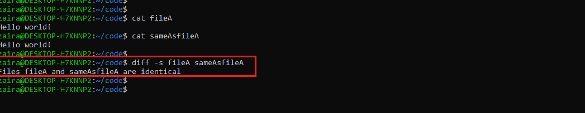
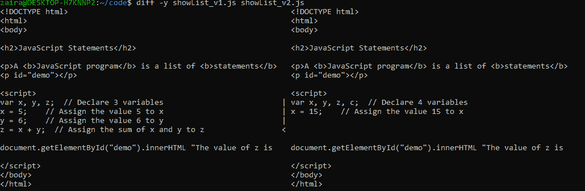
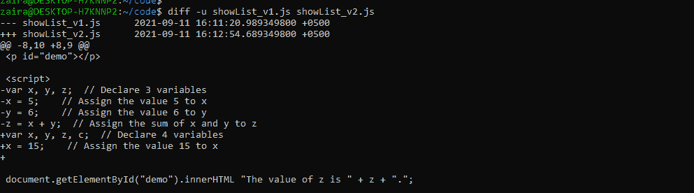
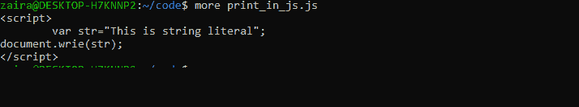
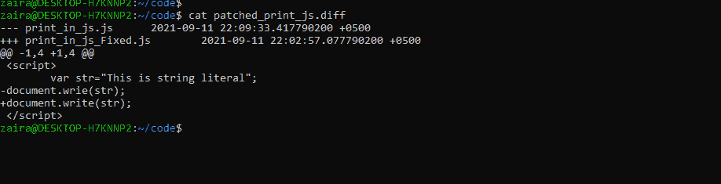
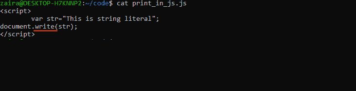

# Linux diff——如何比较两个文件并使用 Patch 命令应用更改

> 原文：<https://www.freecodecamp.org/news/compare-files-with-diff-in-linux/>

想象一下，有一天醒来，发现您的生产系统因为一个尚未被追踪到的 bug 而停机了。你最可怕的噩梦之一，对吗？

您还发现需要比较两个版本的代码，恢复系统的压力越来越大。每个人都很恐慌，这是完全合法的！

幸运的是，有一个名为`diff`的 Linux 实用程序支持你。

## Linux 中的`diff`命令是什么？

比较文件并找出它们之间的差异是一种广泛使用的操作。当您必须比较复杂的代码或配置文件时，这特别有用。

Linux 为您提供了一个名为`diff`的内置且强大的实用程序，而不是手动比较(这很容易出现人为错误)。也节省了时间。

为了补充 diff 命令，Linux 还提供了另一个名为`patch`的命令，用于将一个文件的更改应用到另一个文件。在本文中，我们将研究这些有趣的通用命令，看看如何使用它们。

## `diff`命令语法

`diff`的语法分享如下:

```
diff [options] file1 file2
```

Syntax for diff

diff 命令可以根据更改显示三个字符:

| 性格；角色；字母 | 意义 |
| --- | --- |
| c | 改变——需要做出改变。 |
| d | 删除-有些东西应该被删除。 |
| a | 需要添加一些东西。 |

在`diff`命令的输出中，符号`<`指向第一个文件，符号`>`指向用作参考的第二个文件。

让我们看一些使用中的`diff`命令的例子。

### Linux `diff`命令的例子

为了说明文件是相同的，我们使用标志`-s`和`diff`。在我们的示例中，两个文件 fileA 和 sameAsfileA 包含相同的内容。



在下一个示例中，有两个内容不同的文件。在下面突出显示的输出中，`diff`命令显示 showList_v2.js 中的第 11 行和第 14 行应该与 showList_v1.js 中的第 11 行和第 13 行相匹配。


下一种使用 diff 的方式是我最喜欢的，因为你可以并排看到不同之处。

就像这样使用`-y`标志:

```
diff -y file1 file2
```



Compare files side by side

我要讨论的最后一个例子是统一输出。该输出通常用作`patch`命令的输入。我们还将了解 patch 命令是如何工作的:



Unified output, used as an input to patch.

下面是一些你可以和`diff`一起使用的其他有用的标志。

*   `-i`忽略大小写。`diff`默认区分大小写。
*   忽略文件中的空白。默认情况下，空白被认为是一种差异。

## `patch`命令语法

代码中随时都会发生变化，为每次变化共享经过编辑和修复的文件是不现实的，而且非常耗时。通常开发人员会与团队分享代码中的修正，这样他们就可以立即应用。

使用补丁是仅发布改进的最安全的方法。

让我们看看修补是如何工作的:

```
patch file_to_change < patch_file
```

syntax for patch

### Linux `patch`命令的例子

这里有一个打补丁的例子:假设我们有一个简单的 JavaScript 代码[文件名:print_in_js.js]打印一个字符串。



但是，打印功能有问题，我们需要一个固定装置。我们将文件 print_in_js.js 发送给我们的同事，他修复代码并将其发送回来。

首先，我们的同事能够在第 3 行找到一个类型。他们更正文件。

一旦文件被纠正，代码是功能性的，他们就创建一个补丁。

```
diff -u print_in_js.js  print_in_js_Fixed.js > patched_print_js.diff
```

patch creation

让我们回顾一下补丁的内容:



contents of patch

一旦我们有了补丁，我们应用它如下:

```
patch print_in_js.js  < patched_print_js.diff
```

patch application



Code fixed after patch application

是的，我们的代码是固定的！

## 包扎

使用`patch`和`diff`创建和应用补丁相对简单直接。

当您使用 Git 或 SVN 这样的版本控制系统时，类似的方法也是有效的。学习基础知识确实有助于您过渡到并理解版本控制是如何工作的，这是软件开发的一个重要方面。

感谢阅读到最后。我很乐意和你联系。你可以在推特上的这里找到我。请分享你的想法。

回头见。