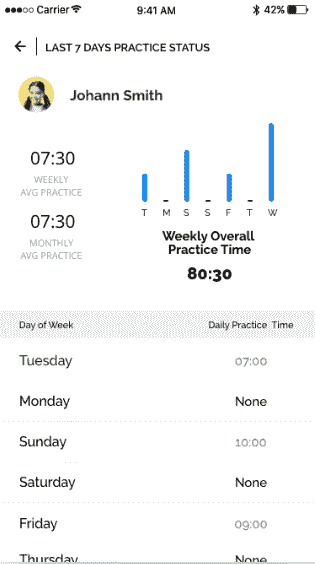
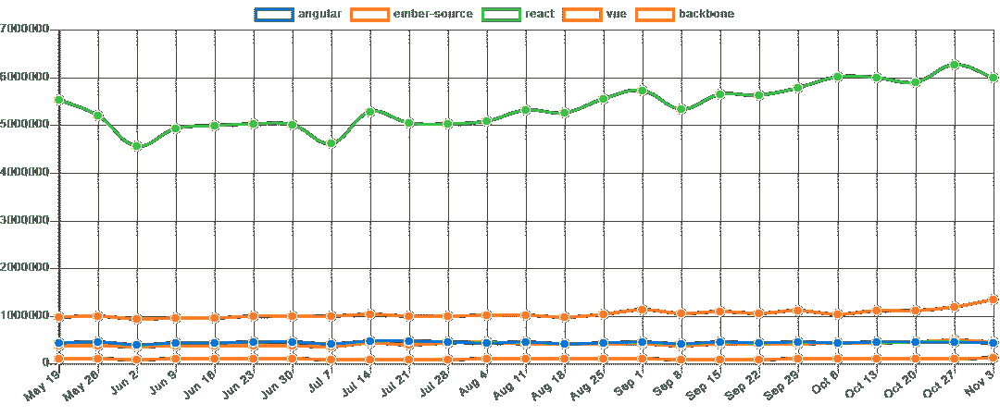
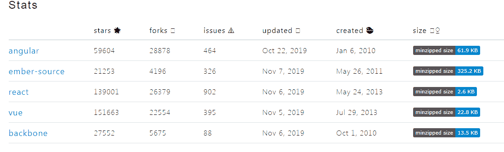

# 2020 年前端开发的顶级 JavaScript 框架

> 原文：<https://www.freecodecamp.org/news/complete-guide-for-front-end-developers-javascript-frameworks-2019/>

前端开发人员可能已经知道这个游戏了:你在 Google 中输入“顶级 JavaScript 框架”,你会得到这么多可供选择的 JavaScript 框架。

JavaScript 框架总是有更多的选择。为前端开发选择一个 JavaScript 框架总是很困难的。

那么，前端开发人员在他们的技术堆栈中寻找什么呢？作为一名全职开发人员，我知道这归结于快速开发和易于制作的 ui。

我们, [ValueCoders 软件开发公司](https://www.valuecoders.com/)的 450 多名开发人员没有试图做出决定，而是投票选出了几个最佳 JavaScript 框架。

### 我们的投票会做出反应

看到这一点我并不惊讶。我们的大多数开发人员投票支持 React 作为最好的 JavaScript 框架之一。在这个过程中，我们的前端开发人员处理了大量突出 JS 框架优势的项目。React 提供了以下功能的组合:

*   可重用组件
*   状态和视图的同步
*   路由和模板系统

我们的开发人员通过严重依赖 React 来实现前端逻辑。与此同时，我惊讶于用 React 创建应用程序是如此简单。

### 这是我们应用程序的概述

应用程序很简单。这是一款针对音乐教师的工作室管理应用,可以帮助他们更专注于教学，而不是管理他们的音乐工作室。

关键的挑战是为教师创建一个“活动仪表板”，他们可以在那里管理学生的所有活动，并跟踪他们的进度。我们通过使用 [Redux 库](https://redux.js.org/introduction/ecosystem)来构建平台，克服了这个挑战。我们建立了一个教师工作室，他们可以在这里管理学生的进度，展示新的音乐课程，与他们聊天，比较学生的音乐演奏和现场音乐，并向他们提供反馈。

所以，这就是我用 React JS 的体验。但是很多人会说 Vue 是最好的前端 JavaScript 框架之一，有很多有用的工具。

前端开发人员决定哪个 JavaScript 框架将完成这项工作。在这样做的时候，他们会面临很多挑战，因为他们需要决定他们一直需要什么。通常，我们必须现在就选择一个 JavaScript 框架，而不是经过一周的研究。在这种情况下，大多数开发人员会按照他们所知道的去做。但是，也许你所熟悉的堆栈在性能方面不再适用。

即使只是在 Angular、React 和 Vue 之间进行选择，对新开发人员来说也很困难。这里列出了前端开发人员的顶级 JavaScript 框架，而不是让它更加详尽。

## 五大 JavaScript 框架

就流行程度和使用情况而言，目前主导市场的五个 JavaScript 框架是:

*   反应
*   某视频剪辑软件
*   有角的
*   余烬
*   Backbone.js

他们都有大型社区。如果你是一名前端开发人员，或者打算开始你的前端技术新项目，这五个是你的最佳选择。以下是过去六个月的 npm 趋势。

## 1.反应

React 无疑是 JS 世界的领导者。这个 JavaScript 框架使用了一种[反应式方法](https://en.wikipedia.org/wiki/Reactive_programming),并且引入了许多自己的前端 web 开发概念。

要使用 React，您必须学会使用大量的附加工具来实现前端开发的高度灵活性。例如，这里有一个不太详尽的可以与 React 一起使用的库列表:Redux、MobX、Fluxy、Fluxible 或 RefluxJS。React 也可以与 jQuery AJAX、fetch API、Superagent 和 Axios 一起使用。

### 并发模式

> 今天，我们很高兴分享并发模式的第一个早期社区预览。它提供了新的可组合原语来帮助您编排愉快的用户体验。[https://t.co/mMrCmv4D5U](https://t.co/mMrCmv4D5U)
> 
> — React (@reactjs) [October 24, 2019](https://twitter.com/reactjs/status/1187411505001746432?ref_src=twsrc%5Etfw)