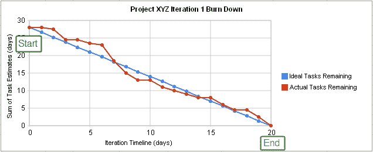
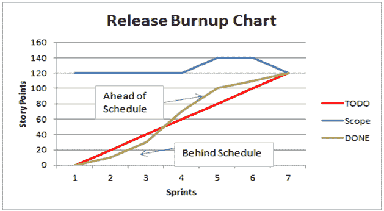
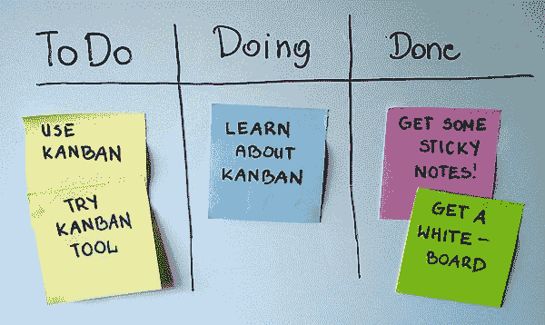
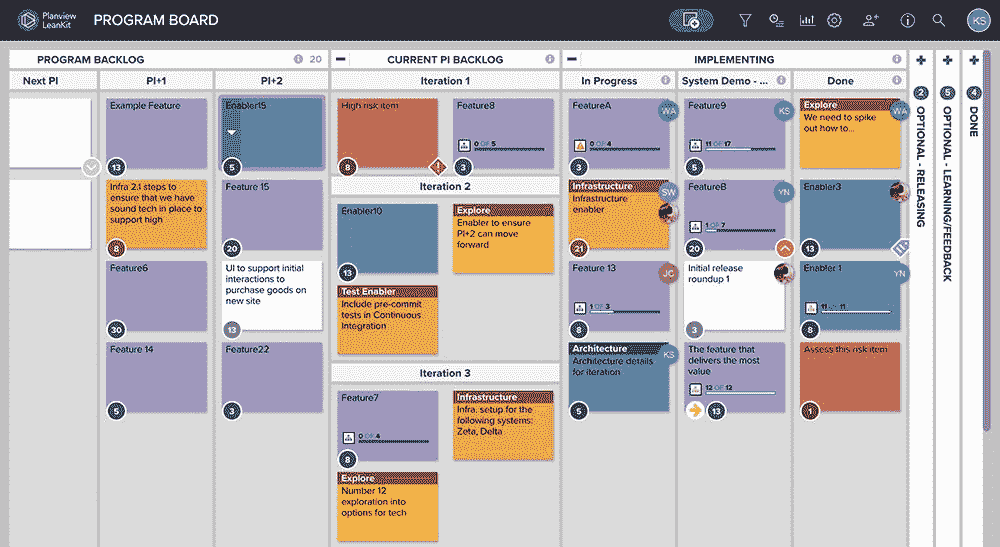
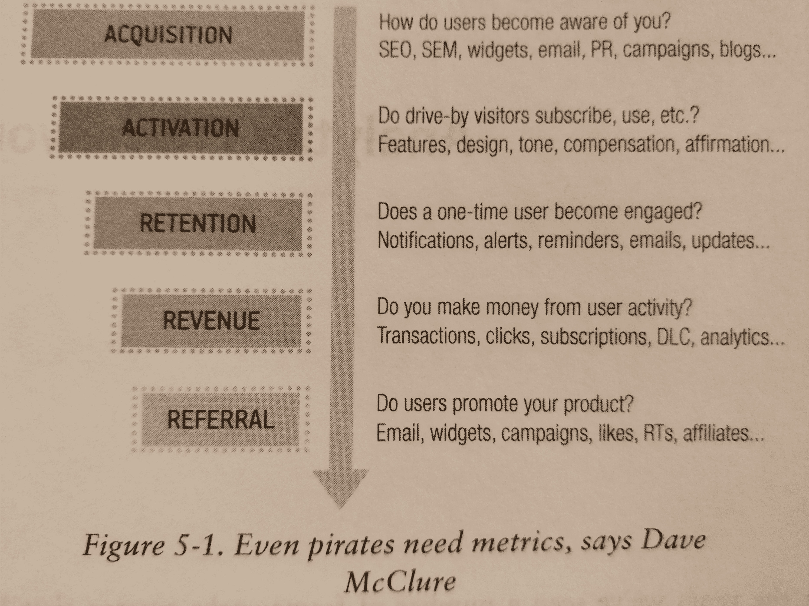
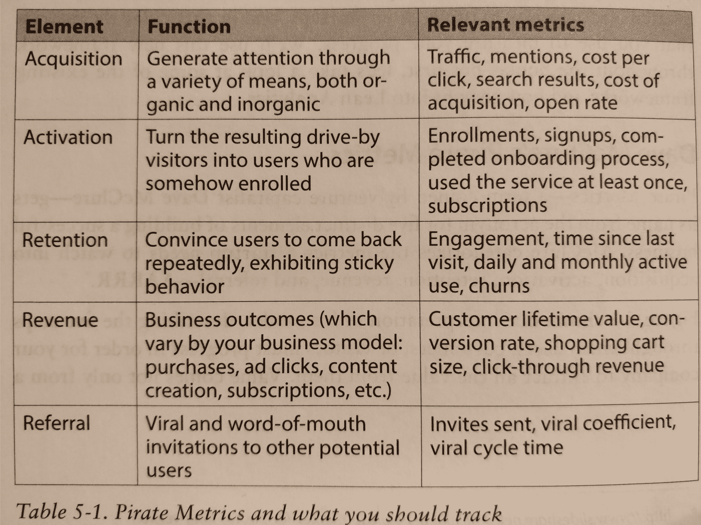
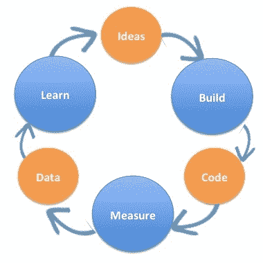

# 敏捷方法完全指南

> 原文：<https://www.freecodecamp.org/news/complete-guide-to-agile-methodology/>

## **故事点和复杂点**

在 Scrum/Agile 中，开发中的产品的功能是通过 ****故事**** 来探索的，用户可能会讲述他们想从产品中得到什么。当团队估计交付一个用户故事所需的工作量时，他们使用 ****故事点**** 。

故事点的显著特征是:

*   代表整个团队的贡献
*   不要直接等同于任务可能花费的时间
*   是用于规划目的的粗略度量，类似于数量级
*   按照类似斐波纳契数列的顺序分配:0，1，2，3，5，8，13，20，40，100
*   估计故事*相对于彼此*的“大小”

如果你不熟悉敏捷的做事方式，故事点的概念可能会很难理解。你会发现许多网上资源以不同的方式讨论故事点，很难弄清楚它们是什么以及它们是如何被使用的。

随着你对 Scrum 等实践的原则和术语的了解，这些特性的原因将变得显而易见。故事点的使用，特别是在“仪式”中，如计划扑克，通过观察或参与比书面解释更容易理解！

### **更多信息:**

*   用户故事: [freeCodeCamp](https://guide.freecodecamp.org/agile/user-stories)

## **并行开发**

并行开发代表开发过程被分成多个分支，以提供具有稳定版本和新特性的通用产品。在一个更常见的简单的软件开发过程中，你只有一个分支，除了新特性之外，还有错误修复和改进。在并行开发中，多个分支可以共存。

通常，并行开发包含一个主要的“主”分支，它是最稳定的，包含对现有代码的重要修复。从主分支开始，会创建更多的分支，向现有代码添加新的“路径”。这些分支提供了新的特性，但是不包括同时从主分支应用的修复。客户知道这些版本，并有特殊的设备或测试机器来测试新特性。当 QA 测试通过时，侧分支可以与主分支合并，从而为发布版本引入新的特性。

## **燃耗图和燃耗图**

Burndown 和 burnup 图表用于度量项目的进展——通常是敏捷方法下的开发冲刺。这两个图表直观地显示了工作与时间的关系。

燃尽图显示还有多少工作要做，还有多少时间。Y 轴代表有待完成的工作——通常与分配给每个任务的时间估计有关，例如故事点——X 轴代表剩余时间。使用了两条线；第一条是“理想工作剩余线”，代表理想的燃尽，每天完成的工作量与总时间成比例，形成一条直线。第二条“实际剩余工时线”用于绘制 tak 从开发到完成状态的实际进度。燃尽图的一个例子如下所示。



许多 Scrum 团队使用燃尽图来查看他们在冲刺阶段的表现。有一个均匀和稳定的烧毁可能是一个指标，故事是小的和可管理的。如果一个团队在 sprint 的中途注意到“实际剩余工作线”在“理想剩余工作线”之上，他们可以对范围进行调整:故事可以从 sprint 中去掉，或者故事的范围可以缩小。在 sprint 结束时的回顾中查看 burndown 可能会引发一些有趣的讨论，并导致过程改进。

燃耗图非常相似，但它们显示的是已完成的工作与剩余的工作总量和时间。使用三条线——理想线、完成工作线和总工作线。在这个图表中，整个工作线在图表的顶部应该是稳定的，并且很好地代表了范围的变化。完成的工作线应该在项目时间内向总工作线稳步上升——它的理想轨迹由理想线显示。下面是一个例子。



*图片由[有效 PMC](https://sites.google.com/a/effectivepmc.com/www/blog/agile/information-radiators/burn-up-chart?overridemobile=true)提供*

## **设计模式**

设计模式是针对常见设计问题的常见设计解决方案。相关领域或领域的设计模式的集合称为模式语言。注意，在其他层次也有模式:代码、并发、架构、交互设计…

在软件工程中，软件设计模式是对软件设计中给定上下文中常见问题的通用可重用解决方案。它不是一个可以直接转化为源代码或机器码的成品设计。它是如何解决一个问题的描述或模板，可以在许多不同的情况下使用。设计模式是形式化的最佳实践，程序员可以用它来解决设计应用程序或系统时的常见问题。

面向对象的设计模式通常显示类或对象之间的关系和交互，而不指定所涉及的最终应用程序类或对象。隐含易变状态的模式可能不适合函数式编程语言，有些模式在具有解决问题的内置支持的语言中可能变得不必要，而面向对象的模式不一定适合非面向对象的语言。

设计模式可以被视为一种结构化的计算机编程方法，介于编程范例和具体算法之间。

普及该领域的书是“四人帮”的 ****设计模式:可重用面向对象软件的元素**** (1994)。它为传统(C++) OO 语言提供了一系列(23)模式，分为三种类型:

*   ****creative****(创建对象):抽象工厂、构建器、工厂方法、原型、单体。
*   ****结构化**** (组成对象):适配器、桥、复合、装饰、门面、flyweight、代理。
*   ****行为**** (对象之间的通信):责任链、命令、解释器、迭代器、中介器、备忘录、观察者、状态、策略、模板方法、访问者。

模式可以用于多种目标(学习、交流、改进工具)，但是在敏捷中，它们应该从代码中重构，而不仅仅是在开始时添加(紧急设计/架构),因为最初你对将要发展的(未来)系统没有足够的了解。请注意，在一种语言或工具中需要模式的东西可能并不需要，或者已经是另一种语言或工具的一部分。框架是一组合作的类，它们组成了特定类型软件的可重用设计，并且通常是模式密集型的。

## **任务板和看板**

看板对于进行软件开发的团队和跟踪他们个人任务的个人来说都是一个很好的方法。

源自日语术语“招牌”或“广告牌”,代表一种信号，关键原则是在给定时间内将你的在制品(WIP)限制在有限数量的任务内。可以进行的数量由团队(或个人)的受限能力决定。当一项任务完成时，这是你将另一项任务向前推进的信号。

看板任务显示在任务板上的一系列列中，这些列显示了任务的状态。在其最简单的形式中，使用三列

*   去做
*   做
*   完成的



*图片来自[维基百科](https://en.wikipedia.org/wiki/Kanban_board)*

但是可以添加许多其他列或状态。例如，软件团队还可能包括等待测试、完成或接受。



A more complicated example.

*图片由[leankit](https://leankit.com/learn/kanban/kanban-board-examples-for-development-and-operations/)T3 提供*

## **整合地狱**

集成地狱(Integration Hell)是一个俚语，指的是一个开发团队的所有成员都在随机地经历实现他们代码的过程，却没有办法将不同的代码片段合并成一个无缝的代码串。开发团队将不得不花费几个小时或几天的时间来测试和调整代码，以使其全部工作。

实际上，组件独立开发的时间越长，接口就越有可能偏离预期。当组件最终在项目结束时被集成时，它将花费比分配的时间多得多的时间，这经常导致最后期限的压力和困难的集成。项目结束时这种痛苦的集成工作是以其名字命名的地狱。

持续集成，即开发团队应该使用特定的工具来“持续集成”他们每天工作多次的代码部分，以便工具可以将不同的代码“块”匹配在一起，从而比以前更加无缝地集成。

代码库，如 Git(以及我们都知道和喜欢的开源接口 GitHub)允许开发团队组织他们的工作，以便花更多的时间编写代码，而不用担心代码的不同部分是否会集成。

持续集成是解决这个问题的敏捷方法。集成仍然是痛苦的，但是至少每天做一次可以避免界面过多的分离。

## 用户故事

根据 [Mountain Goat 软件](https://www.mountaingoatsoftware.com/agile/user-stories)，用户情景为:

> ...敏捷方法的一部分，有助于将焦点从写需求转移到谈论需求。所有敏捷用户故事都包括一两个书面句子，更重要的是，一系列关于期望功能的对话。

用户故事通常使用以下模式编写:

**作为一个【用户类型】，我想要【某个目标】，以便【某种原因或需要】**

用户故事应该从用户的角度用非技术术语来写。故事应该强调用户的需求，而不是如何去做。用户故事中不应该提供解决方案。

在编写用户故事时，一个常见的错误是从开发人员或解决方案的角度来编写。一定要陈述目标和需求，功能需求在后面。

#### **确定用户故事的规模:史诗和小故事**

就像用户故事的标题或占位符。史诗通常是大而粗的笔划，然后被分解成几个用户故事。

从 epic 开始，你可以规划出产品的功能，而不必拘泥于具体细节。采用这种方法可以让你有时间更多地了解你的用户以及如何满足他们的需求。

当考虑可能的故事时，考虑“错误用户案例”和“不愉快的路径”故事也很重要。系统将如何处理异常？你将向用户提供什么样的信息？恶意用户会如何滥用这个应用程序功能？这些错误故事可以节省返工，并成为 QA 中有用的测试用例。

## **策划扑克**

### **简介**

规划扑克是敏捷开发模型中的评估和规划技术。它用于估计一个[用户故事](https://en.wikipedia.org/wiki/User_story)或一个特性所需的开发工作。

### **流程**

规划扑克是一次完成一个用户故事。

每个评估者都有一套相同的扑克牌，由不同数值的牌组成。牌值通常来自斐波那契数列。用于这些值的单位可以是天数、故事点或者团队同意的任何其他类型的估计单位。

产品所有者(PO)或利益相关者解释要评估的故事。

团队讨论这个故事，询问他们可能有的任何澄清问题。这有助于团队更好地了解*PO 想要什么*。

在讨论结束时，每个人首先选择一张卡片(代表他们对故事的估计),不要给其他人看。然后，他们同时亮出底牌。

如果所有的卡片都有相同的值，这个值就成为故事的估计值。如果有差异，团队讨论他们选择的价值观的原因。给出最低和最高估计的团队成员为他们的估计提供正当理由是很有价值的。

这样讨论完，再重复一遍私下挑一张牌，然后同时露出来的过程。这样做，直到对估计达成一致意见。

因为规划扑克是一种调节*联合*专家评估的工具，它导致更好的共同理解，甚至可能细化特性请求。即使团队是在无评估的模式下运作，它也有很高的价值。

主持人应该尽量避免确认偏差。

值得一提的事情:

*   团队之间的评估是不可比的，因为每个团队都有自己的 scala。
*   评估应该包括为了完成一项工作所需要做的一切:设计、编码、测试、沟通、代码评审(以及所有可能的风险)
*   使用规划扑克的价值在于由此产生的讨论，因为它们揭示了对可能的实现的不同观点

## **行为驱动开发**

行为驱动开发(BDD)是从[测试驱动开发(TDD)](https://www.freecodecamp.org/news/an-introduction-to-test-driven-development-c4de6dce5c/) 中出现的软件开发过程。行为驱动开发将 TDD 的一般技术和原则与来自领域驱动设计和面向对象分析和设计的思想相结合，为软件开发和管理团队提供共享的工具和共享的过程，以便在软件开发中进行协作。它是一种软件开发方法，在这种方法中，应用程序是通过描述其行为如何呈现给外部观察者来指定和设计的。

虽然 BDD 主要是一个关于软件开发应该如何被商业利益和技术洞察力管理的想法，但是 BDD 的实践确实假设使用专门的软件工具来支持开发过程。

尽管这些工具通常是专门为 BDD 项目开发的，但是它们可以被看作是支持测试驱动开发的工具的特殊形式。这些工具为无处不在的语言增加了自动化，这是 BDD 的中心主题。

BDD 侧重于:

*   在这个过程中从哪里开始
*   测试什么和不测试什么
*   一次测试多少
*   如何称呼这些测试
*   如何理解测试失败的原因

BDD 的核心是对单元测试和验收测试方法的重新思考，这些问题自然会出现。例如，BDD 建议单元测试名称应该是以条件动词开头的完整句子(例如英语中的“should”)，并且应该按照商业价值的顺序书写。验收测试应该使用用户故事的标准敏捷框架来编写:“作为一个*角色*，我想要*的特性*，这样*才能受益*”。验收标准应根据场景编写，并按类实现:给定*初始上下文*，当*事件发生*，则*确保某些结果*。

例子

```
Story: Returns go to stock

As a store owner
In order to keep track of stock
I want to add items back to stock when they're returned.

Scenario 1: Refunded items should be returned to stock
Given that a customer previously bought a black sweater from me
And I have three black sweaters in stock.
When he returns the black sweater for a refund
Then I should have four black sweaters in stock.

Scenario 2: Replaced items should be returned to stock
Given that a customer previously bought a blue garment from me
And I have two blue garments in stock
And three black garments in stock.
When he returns the blue garment for a replacement in black
Then I should have three blue garments in stock
And two black garments in stock.
```

随之而来的是一些好处:

1.  所有开发工作都可以直接追溯到业务目标。
2.  软件开发满足用户需求。用户满意=生意好。
3.  高效的优先级划分——首先交付关键业务功能。
4.  所有各方都对项目有共同的理解，并能参与到沟通中来。
5.  共享的语言确保每个人(技术或非技术)对项目的进展有全面的了解。
6.  最终的软件设计符合现有的业务需求并支持未来的业务需求。
7.  改进质量代码，降低维护成本，最小化项目风险。

## **Scrum**

Scrum 是敏捷保护伞下的方法论之一。这个名字来源于橄榄球运动中的一种恢复比赛的方法，在这种方法中，全队一起移动以占据场地。类似地，敏捷中的 scrum 涉及团队的所有部分都致力于同一套目标。在 scrum 方法中，任务的优先列表被呈现给团队，在“冲刺”过程中(通常是两周)，这些任务由团队按顺序完成。这确保了最高优先级的任务或可交付成果在时间或资金耗尽之前完成。

### Scrum 的组成部分

Scrum 是敏捷保护伞下的方法论之一。它起源于“scrummage ”,这是一个橄榄球术语，指的是球员挤在一起抢球。实践围绕着

*   一组角色(交付团队、产品负责人和 scrum master)
*   仪式(冲刺计划，每日站立，冲刺回顾，冲刺回顾，和积压整理)
*   工件(产品积压，sprint 积压，产品增量，以及信息辐射器和报告)。
*   主要目标是让团队在项目进展上保持一致，以促进快速迭代。
*   许多组织选择了 Scrum，因为与瀑布模型不同，它确保了在每个冲刺阶段结束时的可交付性。

### 史前古器物

*   Sprint:它是一个团队努力实现或创建一个可交付成果的持续时间，通常是几周。可交付成果可以定义为团队想要实现的最终产品的一段代码或片段。Scrum 建议将冲刺的持续时间保持在 2-4 周之间。
*   产品积压:它是一个团队应该在当前冲刺阶段完成的任务列表。它由产品负责人决定，与管理层和交付团队达成一致。

### 角色

*   产品负责人(PO):唯一对管理层负责的人。PO 决定什么进入或离开产品待办事项。
*   交付团队:他们被要求按照他们的 PO 在产品 backlog 中设置的任务工作，并在 sprint 结束时交付所需的可交付产品。
*   Scrum Masters: - Scrum Master 必须严格遵守 Scrum 指南，并让团队理解在遵循 Scrum 时遵守 Scrum 指南的必要性。scrum 主管的工作是确保所有的 Scrum 仪式都按时进行，并且所有需要的人都按照 Scrum 指南参与进来。SM 必须确保团队定期并积极参与每日的 Scrum。

## **每日站立和每日混战**

每日站立会议(DSU)或每日 scrum 会议是 Scrum 方法论不可或缺的一部分。

顾名思义，您每天在同一时间召开会议，并且对于一个协同定位的团队来说，在同一地点召开会议。会议应该简短，在 15 分钟内结束。

只有开发团队的成员需要参加每日例会。通常情况下，Scrum Master 和产品负责人也会参加，但他们不是必需的。

每个人的标准议程是:

*   自从上次 DSU 之后你做了什么
*   DSU 之后你打算做什么
*   阻止你进步的主要障碍是什么，你在哪里需要帮助

团队成员要认真听取彼此的贡献，并尝试找出他们可以帮助彼此进步的领域。站立会议还将提出需要在团队不同成员之间进行的更长的讨论主题。这些长时间的讨论应该停止，并在会议之外进行，只涉及相关的参与者，而不是整个团队。

### **站立会议示例**

[https://www.youtube.com/watch?v=_3VIC8u1UV8](https://www.youtube.com/watch?v=_3VIC8u1UV8)

## **盗版指标**

Dave McClure 确定了对创业公司成功至关重要的五个高级指标类别:获取、激活、保留、收入、推荐。

他从这五个度量类别的首字母缩略词中创造了术语“盗版度量”。

在《精益分析》一书中，Croll 和 Yoskovitz 将这些指标形象地解释为一个漏斗:



精益分析，2013 年

并以表格的形式给出了更有针对性的解释:



精益分析，2013 年

## **非功能需求**

非功能性需求(NFR)是一种指定标准的需求，这些标准可以用来判断系统的操作，而不是特定的行为(功能性需求)。非功能需求通常被称为“质量属性”、“约束”或者“非行为需求”。

非正式地，这些有时被称为“能力”，来源于稳定性和可移植性等属性。非森林资源可分为两大类:

*   **运行质量，如安全、保障和可用性，在运行期间(运行时)可观察到。**
*   ****演化品质，如可测试性、可维护性、可扩展性和可伸缩性，这些都体现在系统的静态结构中****

****通常，您可以将一个非功能性需求细化为一组功能性需求，作为一种详述和允许(部分)测试和验证的方式。****

### ******例子:******

*   ****按下按钮 5 秒钟后，打印机应该开始打印****
*   ****代码应该用 Java 编写****
*   ****用户界面应该易于导航****

## ******基于特征的规划******

********基于特性的规划**** 是一种规划方法，可用于根据将要交付给客户的特性来决定何时发布软件，而不是基于任意截止日期的发布。****

**在这种发布计划的方法中，团队决定应该优先考虑什么特性。基于这些特性的范围，团队可以预测下一个版本何时可以部署。**

## ****职能经理****

**职能经理是对一组人有管理权力的人。这种权威来自于该人在组织中的正式职位(如部门主管、质量部门经理、开发团队经理)。职能经理的角色不同于项目经理或 ScrumMasters，不是基于项目的。在更敏捷的组织中，存在不同的模型。职能经理通常负责发展他们团队中的人员，确保人员的预算和时间。然而，也有一些敏捷公司模型，其中通常分配给职能经理的职能被分配给组织内的其他角色(例如，Spotify 模型，具有部落、行会、分会、团队)。**

**在传统的工作环境中，公司将人们组织成一个等级体系。具有相似工作角色的人被分组到不同的职能领域，由一个职能经理领导。职能经理通常负责直接向其汇报的员工的指导和福利。**

**敏捷项目团队通常会与控制团队完成工作所需资源的职能经理一起工作。例如，与采购部门的职能经理合作，指派一个人与团队一起采购软件许可证。**

## ****构建测量学习****

**构建-测量-学习循环是一种用于构建正确产品的方法。埃里克·赖斯(Eric Reis)在《精益创业》(Lean Startup)一书中创造了这个循环，它让快速试验成为可能，唯一的目的是实现市场适应。换句话说，这是一个强大的系统，可以验证关于你要交付的产品的假设。分解循环，它由以下部分组成:**

****

### ****想法****

**每个循环都始于一个将为一些用户提供商业价值的想法。这样的想法必须由一个产品的远景组成——它将指导你构建什么，以及一个度量标准，它将指出你对商业价值的假设是否正确。**

### ****建造****

**为了验证您的想法，您着手构建一个最小可行产品(MVP)，结合预定义的指标(首选一个)，其目的是验证您的理论，并帮助您决定是否应该保留或转向。**

### ****测量****

**这一阶段的重点是从 MVP 中收集数据和指标。**

### ****学习****

**接下来，使用收集的数据，必须做出一个决定，你的产品是否被用户使用，因此你应该保留，或者用户是否对产品不感兴趣，因此你必须转向。因此，学习阶段以一个想法(如何扩展产品，或者如何从原始产品开始)结束，适用于下一个构建度量学习循环。**

## ****冲刺规划会议****

**冲刺计划由团队的 Scrum Master 推动，由 Scrum 团队组成:开发团队、产品负责人(PO)和 Scrum Master (SM)。它的目标是将产品待定项的子集规划到 Sprint 待定项中。Scrum Sprint 通常在 Sprint 计划会议之后开始。**

### ****主要部分****

**对于团队来说，通过提出以下两个问题将会议分成两部分是很有价值的:**

*   ******团队应该为即将到来的冲刺做哪些**** 的规划？**
*   ****团队应该如何(大致)处理计划好的项目？****

#### ******什么******

****在哪个阶段，团队从订购产品待办事项的顶部开始。团队通过预测 Sprint Backlog 中可能包含的内容，至少隐含地评估了这些项目。如果需要，他们可以向 PO 询问/讨论项目，PO 必须出席此次会议。****

#### ******如何******

****在 How 阶段，团队简短地讨论每一个挑选出来的 Sprint Backlog 项目，重点是他们将如何处理它。SM 帮助团队不要深入讨论和实现细节。如果团队对采购订单提出了更多的问题，或者对项目进行了细化，或者完成了积压工作，这是很有可能的，也是很好的。****

### ******冲刺目标/结束******

****团队应该为 Sprint 提出一个共享的 Sprint 目标，以将焦点保持在 Sprint 时间框中。在 Sprint 规划的最后，团队预测他们可以实现 Sprint 目标，并且很可能完成所有 Sprint Backlog 项目。SM 应该通过提供有用的见解或统计数据来防止团队高估。****

## ******精益软件开发******

### ******简介******

****精益软件开发是构建软件的过程，重点是使用最小化额外工作和浪费精力的技术。这些技术是从精益制造运动中借鉴来的，并应用于软件开发的环境中。****

### ******关键概念******

****该方法中有七项原则，包括:****

1.  ****消除浪费****
2.  ****加强学习****
3.  ****尽可能晚地决定****
4.  ****尽可能快地交付****
5.  ****授权给团队****
6.  ****在...中建立诚信****
7.  ****看到整体****

### ******比喻******

****编程的行为被视为一条装配线，其中的每个特性或错误修复都被称为一个“变更请求”。这个“变更请求”的装配线可以被认为是一个“价值流”,目标是最小化每个“变更请求”在交付之前的时间。****

****尚未交付的软件被认为是“库存”，因为它还没有为公司或客户提供价值。这包括任何部分完成的软件。因此，为了最大化吞吐量，交付许多小的完整的软件工作片段是很重要的。****

****为了最大限度地减少“库存”,将控制权交给软件开发人员“工人”是很重要的，因为他们最有能力创建自动化流程来“防错”装配线的各个部分。****

### ******参考文献******

****关于精益技术的书面文档的原始来源是 Mary 和 Tom Poppendieck 所著的《精益软件开发，一个敏捷工具包》一书。****

****作者的其他书籍包括:****

*   ****实施精益软件开发:从概念到现金****
*   ****领导精益软件开发:结果不是重点****

## ******搭配 Vs 分布式******

*   ****协同定位指的是坐在一起的团队；同一个办公室。理想情况下，每个人都坐在相邻的办公室或一个开放的工作区。****
*   ****分布式团队成员地理位置分散；不同的建筑，城市，甚至国家。在分布式团队的情况下，基础设施应该促进流程，以便解决团队成员之间的时差和距离，从而提供一种高效的工作方式。****

## ******持续集成******

****在最基本的层面上，持续集成(CI)是一种敏捷开发方法，在这种方法中，开发人员定期将他们的代码直接合并到主源代码中，通常是一个远程`master`分支。为了确保不引入破坏性的变化，对每个潜在的构建运行完整的测试套件，以回归测试新代码，即测试新代码不会破坏现有的工作特性。****

****这种方法需要对代码库进行良好的测试覆盖，这意味着大部分(如果不是全部的话)代码都要进行测试，以确保其功能完全正常。理想情况下，持续集成将与完全的[测试驱动开发](https://guide.freecodecamp.org/agile/test-driven-development)一起实践。****

### ******主要步骤******

****下面的基本步骤是进行持续集成的最标准的当前方法所必需的。****

1.  ****维持一个中央回购和一个活跃的`master`分支。****

****必须有一个代码存储库，每个人都可以从中合并和提取更改。这可以在 Github 或任何数量的代码存储服务上。****

1.  ****自动化构建。****

****使用 NPM 脚本或更复杂的构建工具，如 Yarn、Grunt、Webpack 或 [Gulp](https://guide.freecodecamp.org/developer-tools/gulp) ，自动化构建，以便单个命令可以构建产品的全功能版本，随时可以部署到生产环境中。更好的是，将部署作为自动化构建的一部分！****

1.  ****让构建运行所有测试。****

****为了检查新代码中没有破坏现有功能的内容，需要运行完整的测试套件，并且如果其中的任何测试失败，构建也需要失败。****

1.  ****每个人每天都要合并对`master`的修改。****
2.  ****每个到`master`的合并都必须被构建和完全测试。****

### ******最佳实践******

****此外，还有一些最佳实践，可以最大限度地利用 CI 所提供的功能及其带来的挑战，例如:****

1.  ****保持快速构建，这样开发人员就不会浪费大量时间等待构建。****
2.  ****在生产环境的完整克隆中测试构建。****

****例如，如果你有一个部署在 Heroku 或 Digital Ocean 上的应用程序，有一个单独的测试部署，你可以在那里部署测试版本，以确保它们不仅在测试中工作，而且在真实的生产环境中工作。这个测试环境应该在功能上与实际的生产环境相同，以确保测试的准确性。****

1.  ****使其易于保持最新状态。****

****编码人员应该定期从`master`分支中抽取，以保持他们的代码与他们团队的变更相集成。回购还应该让产品经理、公司高管或有时是关键客户等利益相关者可以使用，以便每个人都能够轻松看到进展。****

1.  ****保留构建记录，以便每个人都可以看到任何给定构建的结果，无论是成功还是失败，以及谁或什么引入了新的更改。****
2.  ****自动化部署。****

****一旦所有测试都通过，并且生产环境克隆中的测试部署成功，通过在生产环境中自动部署作为构建过程的最后阶段，使您的应用程序完全跟上任何新的变化。****

### ******CI 服务******

****有许多服务可以为您处理持续集成的过程，这使得建立一个可靠的 CI 渠道或构建过程变得容易得多。当评估这些时，要考虑预算、构建速度和你正在做的项目类型等因素。一些服务，如 Travis CI T1，为开源项目提供免费服务，这使它们成为类似项目的简单选择，但它们可能比其他服务的构建速度慢，如 T2 Circle CI T3 或 T4 Codeship T5 等等。****

## ******验收标准******

****用户故事作为您的待办事项中的一项，是对话的占位符。在这个对话中，产品所有者和交付团队就期望的结果达成共识。****

****验收标准告诉交付团队代码应该如何表现。避免写用户故事的 ****【如何】****；保持到 ****【什么】**** 。如果团队遵循测试驱动开发(TDD ),它可以为自动化测试提供框架。验收标准将是 QA 团队测试计划的开始。****

**最重要的是，如果故事不满足每一个接受标准，那么产品负责人不应该在迭代结束时接受故事。**

**验收标准可以被视为保护交付团队的工具。当交付团队在 Sprint 计划中提交一组固定的故事时，他们也提交了一组固定的验收标准。这有助于避免范围蔓延。**

**考虑以下情况:当接受用户故事时，产品负责人建议添加一些不在用户故事范围内的东西。在这种情况下，交付团队可以拒绝这个请求(不管它有多小),并要求产品负责人创建一个新的用户故事，这个故事可以在另一个 Sprint 中处理。**

## **代码气味**

**计算机编程中的代码味道是一种表面迹象，表明您的系统和代码质量可能存在问题。这个问题可能需要重构来解决。**

**重要的是要明白，臭代码工作，但质量不好。**

#### ****例题****

1.  **重复代码——在整个代码库中复制的代码块。这可能表明您需要将代码归纳为一个函数，并在两个地方调用它，或者可能是代码在一个地方的工作方式与它在另一个地方的工作方式完全无关，尽管已经被复制。**
2.  **大类——有太多代码行的类。这可能表明这个类试图做太多的事情，需要分成更小的类。**

## **关于敏捷开发的更多信息:**

*   **[如何确保你的开发过程实际上是敏捷的](https://www.freecodecamp.org/news/signs-that-your-development-process-is-agile-only-on-paper-and-how-to-fix-it-f6c05b24337f/)**
*   **[如何解决科技债务](https://www.freecodecamp.org/news/give-the-gift-of-a-tech-debt-sprint-this-agile-holiday-season/)**
*   **敏捷真的如你所想吗？**